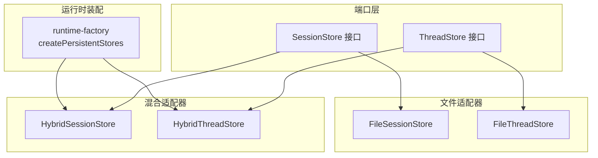
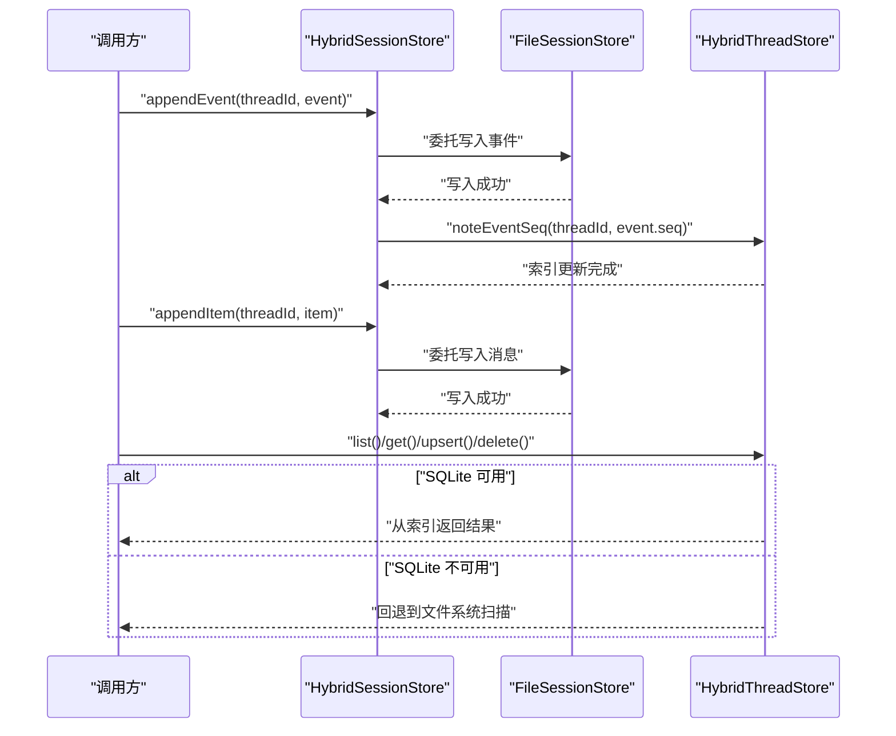
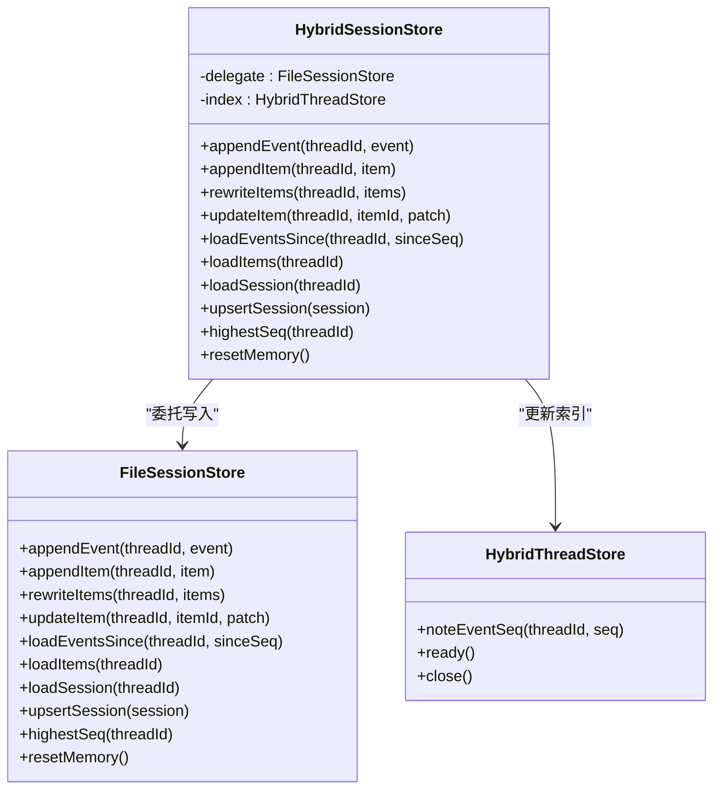
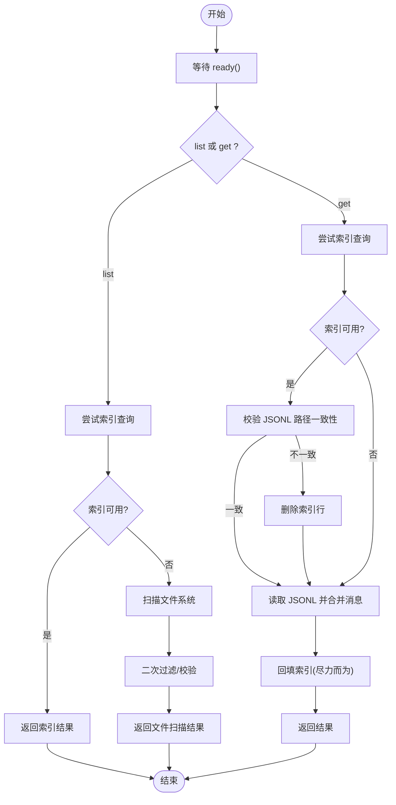
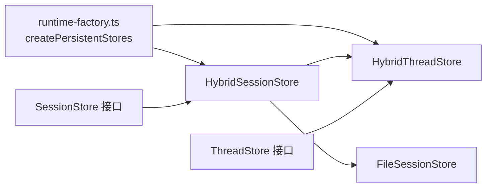

# 混合存储适配器

<cite>
**本文引用的文件**
- [hybrid-session-store.ts](file://kun/src/adapters/hybrid/hybrid-session-store.ts)
- [hybrid-thread-store.ts](file://kun/src/adapters/hybrid/hybrid-thread-store.ts)
- [index.ts](file://kun/src/adapters/hybrid/index.ts)
- [file-session-store.ts](file://kun/src/adapters/file/file-session-store.ts)
- [file-thread-store.ts](file://kun/src/adapters/file/file-thread-store.ts)
- [session-store.ts](file://kun/src/ports/session-store.ts)
- [thread-store.ts](file://kun/src/ports/thread-store.ts)
- [runtime-factory.ts](file://kun/src/server/runtime-factory.ts)
- [hybrid-store.test.ts](file://kun/tests/hybrid-store.test.ts)
- [in-memory-session-store.ts](file://kun/src/adapters/in-memory-session-store.ts)
- [in-memory-thread-store.ts](file://kun/src/adapters/in-memory-thread-store.ts)
</cite>

## 目录
1. [简介](#简介)
2. [项目结构](#项目结构)
3. [核心组件](#核心组件)
4. [架构总览](#架构总览)
5. [组件详解](#组件详解)
6. [依赖关系分析](#依赖关系分析)
7. [性能与调优](#性能与调优)
8. [故障排查指南](#故障排查指南)
9. [结论](#结论)
10. [附录：配置与最佳实践](#附录配置与最佳实践)

## 简介
本文件系统性阐述混合存储适配器的设计理念与实现原理，重点解释如何通过“内存优先 + 持久化后备”的策略，在保证数据一致性的同时提升读写性能。混合存储由两部分组成：
- 混合会话存储（hybrid-session-store）：基于 JSONL 的事件与消息流持久化，并在写入后更新索引，确保高吞吐下的可检索性。
- 混合线程存储（hybrid-thread-store）：以 JSONL 作为权威数据源，SQLite 作为可重建的元数据索引；当数据库不可用时自动回退到纯文件扫描。

该设计兼顾可靠性与性能，适用于需要快速列表查询、按需检索以及强一致性的生产环境。

## 项目结构
混合存储位于适配层，与端口层解耦，便于在运行时根据配置切换不同后端实现。

图表来源
- [runtime-factory.ts:376-405](file://kun/src/server/runtime-factory.ts#L376-L405)
- [session-store.ts:13-31](file://kun/src/ports/session-store.ts#L13-L31)
- [thread-store.ts:16-21](file://kun/src/ports/thread-store.ts#L16-L21)

章节来源
- [runtime-factory.ts:376-405](file://kun/src/server/runtime-factory.ts#L376-L405)
- [index.ts:1-3](file://kun/src/adapters/hybrid/index.ts#L1-L3)

## 核心组件
- 混合会话存储（HybridSessionStore）
  - 委托给 FileSessionStore 写入事件与消息，随后通知 HybridThreadStore 更新索引中的事件水位等信息。
  - 保持内存优先策略：事件与消息以 JSONL 追加为主，索引更新在成功写入之后进行，避免不一致。
- 混合线程存储（HybridThreadStore）
  - 使用 SQLite 作为可重建索引；当数据库可用时，list/get/upsert/delete 等操作优先走索引，失败则回退到文件系统扫描。
  - 元数据采用 JSONL 记录，消息与事件分别保存，支持增量回填与损坏修复。

章节来源
- [hybrid-session-store.ts:13-69](file://kun/src/adapters/hybrid/hybrid-session-store.ts#L13-L69)
- [hybrid-thread-store.ts:74-199](file://kun/src/adapters/hybrid/hybrid-thread-store.ts#L74-L199)

## 架构总览
混合存储的整体交互流程如下：

图表来源
- [hybrid-session-store.ts:29-44](file://kun/src/adapters/hybrid/hybrid-session-store.ts#L29-L44)
- [hybrid-thread-store.ts:101-120](file://kun/src/adapters/hybrid/hybrid-thread-store.ts#L101-L120)
- [file-session-store.ts:49-80](file://kun/src/adapters/file/file-session-store.ts#L49-L80)

## 组件详解

### 混合会话存储（HybridSessionStore）
- 设计要点
  - 将事件与消息写入 JSONL 文件，确保顺序与可恢复性。
  - 在事件写入成功后，立即通知线程索引更新事件序列水位，保证查询侧能正确截断历史。
  - 消息写入不触发索引更新，降低写放大。
- 关键行为
  - appendEvent：先写事件，再更新索引。
  - appendItem/rewriteItems/updateItem：仅写消息，不更新索引。
  - loadEventsSince/loadItems/loadSession/upsertSession/highestSeq/resetMemory：全部委托给 FileSessionStore。

图表来源
- [hybrid-session-store.ts:13-69](file://kun/src/adapters/hybrid/hybrid-session-store.ts#L13-L69)
- [file-session-store.ts:19-176](file://kun/src/adapters/file/file-session-store.ts#L19-L176)
- [hybrid-thread-store.ts:160-177](file://kun/src/adapters/hybrid/hybrid-thread-store.ts#L160-L177)

章节来源
- [hybrid-session-store.ts:13-69](file://kun/src/adapters/hybrid/hybrid-session-store.ts#L13-L69)
- [file-session-store.ts:19-176](file://kun/src/adapters/file/file-session-store.ts#L19-L176)

### 混合线程存储（HybridThreadStore）
- 设计要点
  - SQLite 作为可重建索引：表结构包含线程元信息、路径、统计字段与搜索文本，支持多维排序与过滤。
  - 初始化与迁移：启动时启用 WAL、外键约束，执行建表与索引创建；若失败则降级为文件扫描。
  - 回填与清理：首次启动扫描磁盘，将 JSONL 元数据与消息合并生成索引；定期清理无效索引项。
  - 列表与检索：优先走索引；失败或禁用时回退到文件系统扫描与二次过滤。
- 关键行为
  - list：优先索引查询，失败回退文件扫描并二次过滤。
  - get：先校验索引一致性，必要时回填索引；读取 JSONL 合并消息后返回。
  - upsert/delete：写入 JSONL 元数据，同时维护索引；删除目录后清理索引。
  - noteEventSeq：在事件追加后更新索引中的事件水位，供会话侧高效截断。

图表来源
- [hybrid-thread-store.ts:101-145](file://kun/src/adapters/hybrid/hybrid-thread-store.ts#L101-L145)
- [hybrid-thread-store.ts:248-269](file://kun/src/adapters/hybrid/hybrid-thread-store.ts#L248-L269)
- [hybrid-thread-store.ts:423-432](file://kun/src/adapters/hybrid/hybrid-thread-store.ts#L423-L432)

章节来源
- [hybrid-thread-store.ts:74-199](file://kun/src/adapters/hybrid/hybrid-thread-store.ts#L74-L199)
- [hybrid-thread-store.ts:248-269](file://kun/src/adapters/hybrid/hybrid-thread-store.ts#L248-L269)
- [hybrid-thread-store.ts:423-432](file://kun/src/adapters/hybrid/hybrid-thread-store.ts#L423-L432)

### 文件适配器对比（参考）
- FileSessionStore
  - 事件与消息分别写入 events.jsonl 与 messages.jsonl；支持使用事件压缩策略减少空间占用。
- FileThreadStore
  - 以原子写入方式维护 thread.json 与 index.json，保证列表查询成本可控。

章节来源
- [file-session-store.ts:19-176](file://kun/src/adapters/file/file-session-store.ts#L19-L176)
- [file-thread-store.ts:19-127](file://kun/src/adapters/file/file-thread-store.ts#L19-L127)

## 依赖关系分析
- 运行时装配
  - 当存储配置为 hybrid 时，runtime 工厂创建 HybridThreadStore 并等待 ready，随后创建 HybridSessionStore 并注入同一 HybridThreadStore 实例作为索引。
- 端口契约
  - SessionStore/ThreadStore 定义了统一的持久化接口，使混合适配器可无缝替换文件适配器。

图表来源
- [runtime-factory.ts:376-405](file://kun/src/server/runtime-factory.ts#L376-L405)
- [session-store.ts:13-31](file://kun/src/ports/session-store.ts#L13-L31)
- [thread-store.ts:16-21](file://kun/src/ports/thread-store.ts#L16-L21)

章节来源
- [runtime-factory.ts:376-405](file://kun/src/server/runtime-factory.ts#L376-L405)
- [session-store.ts:13-31](file://kun/src/ports/session-store.ts#L13-L31)
- [thread-store.ts:16-21](file://kun/src/ports/thread-store.ts#L16-L21)

## 性能与调优
- 写入路径优化
  - 事件写入后才更新索引，避免重复写入带来的写放大。
  - 消息写入不触发索引更新，降低频繁变更对索引的压力。
- 索引可用性
  - SQLite 可用时优先走索引；不可用时自动回退到文件扫描，保证功能可用性。
- 事件压缩
  - FileSessionStore 提供使用量事件压缩策略，控制事件日志大小与保留周期，减少 IO 压力。
- 列表查询
  - HybridThreadStore 支持多维过滤与排序，结合索引可显著降低 list 成本。

章节来源
- [hybrid-session-store.ts:29-44](file://kun/src/adapters/hybrid/hybrid-session-store.ts#L29-L44)
- [hybrid-thread-store.ts:101-120](file://kun/src/adapters/hybrid/hybrid-thread-store.ts#L101-L120)
- [file-session-store.ts:153-165](file://kun/src/adapters/file/file-session-store.ts#L153-L165)

## 故障排查指南
- SQLite 初始化失败
  - 现象：启动时报错或未生成索引文件。
  - 处理：检查依赖安装与权限；系统会自动降级为文件扫描模式。
- 索引与文件不一致
  - 现象：索引存在但无法读取完整线程。
  - 处理：系统会在 get 时检测路径一致性，不一致则删除索引行并回填。
- 数据损坏或缺失
  - 现象：列表为空或部分线程缺失。
  - 处理：回填逻辑会扫描磁盘并重建索引；必要时可删除索引文件后重启以强制回填。
- 测试验证
  - 单测覆盖了索引回填、元数据损坏修复、附件 ID 恢复等关键场景，可作为回归参考。

章节来源
- [hybrid-thread-store.ts:179-199](file://kun/src/adapters/hybrid/hybrid-thread-store.ts#L179-L199)
- [hybrid-thread-store.ts:497-503](file://kun/src/adapters/hybrid/hybrid-thread-store.ts#L497-L503)
- [hybrid-store.test.ts:64-82](file://kun/tests/hybrid-store.test.ts#L64-L82)
- [hybrid-store.test.ts:165-235](file://kun/tests/hybrid-store.test.ts#L165-L235)

## 结论
混合存储适配器通过“JSONL 权威 + SQLite 可重建索引”的双轨设计，在保证强一致与可恢复性的前提下，最大化发挥索引查询的优势。其内存优先策略与事件压缩机制进一步提升了写入吞吐与长期稳定性。对于需要高性能列表与检索的场景，混合存储是更优选择；当 SQLite 不可用时，系统仍能稳定运行。

## 附录：配置与最佳实践
- 配置入口
  - 在运行时装配中根据存储配置选择 hybrid 或 file 后端。
- 参数说明
  - HybridThreadStore
    - dataDir：数据根目录。
    - sqlitePath：SQLite 文件路径（可选）。
    - nowIso：时间函数（可选）。
  - HybridSessionStore
    - dataDir：数据根目录。
    - index：HybridThreadStore 实例。
    - usageEventCompaction：事件压缩配置（透传自 FileSessionStore）。
- 最佳实践
  - 优先使用 hybrid 后端以获得更好的列表与检索性能。
  - 定期监控索引状态与磁盘空间，确保回填与清理流程正常。
  - 对于高写入场景，合理设置事件压缩阈值与保留周期，平衡空间与查询效率。
  - 在容器或受限环境中，确保 SQLite 可用性；如不可用，系统将自动回退。

章节来源
- [runtime-factory.ts:389-404](file://kun/src/server/runtime-factory.ts#L389-L404)
- [hybrid-thread-store.ts:82-87](file://kun/src/adapters/hybrid/hybrid-thread-store.ts#L82-L87)
- [file-session-store.ts:27-47](file://kun/src/adapters/file/file-session-store.ts#L27-L47)