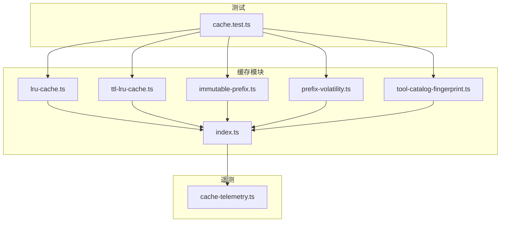
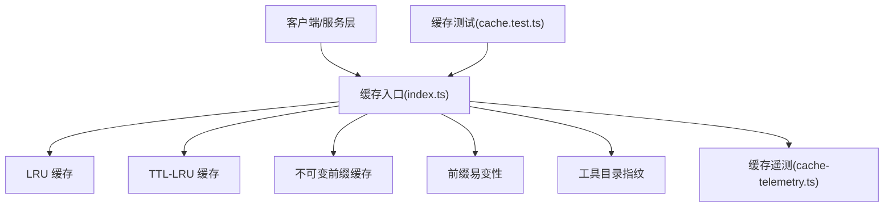
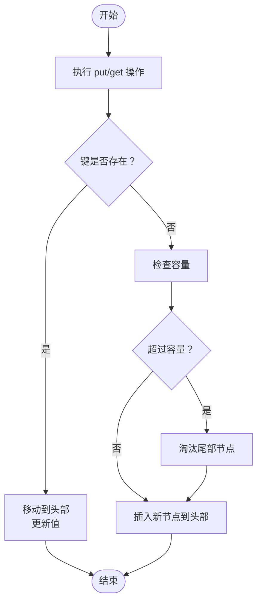
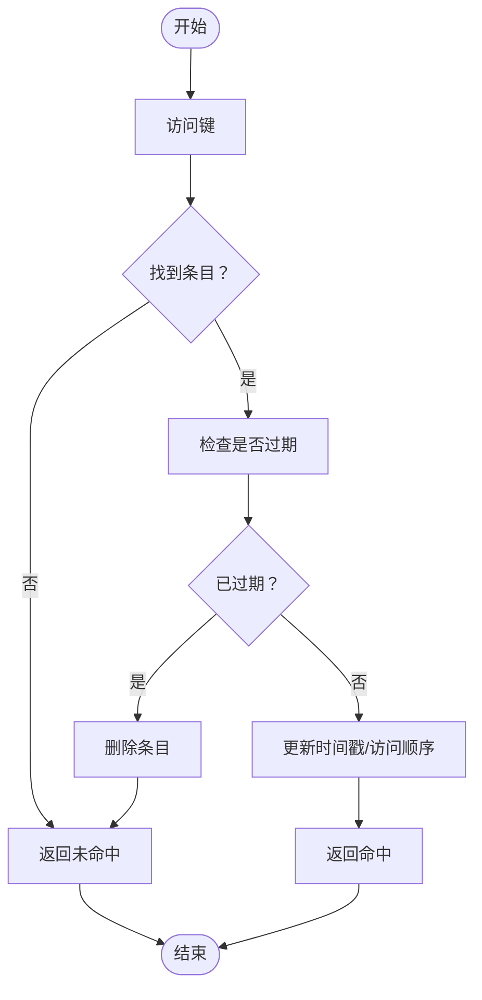
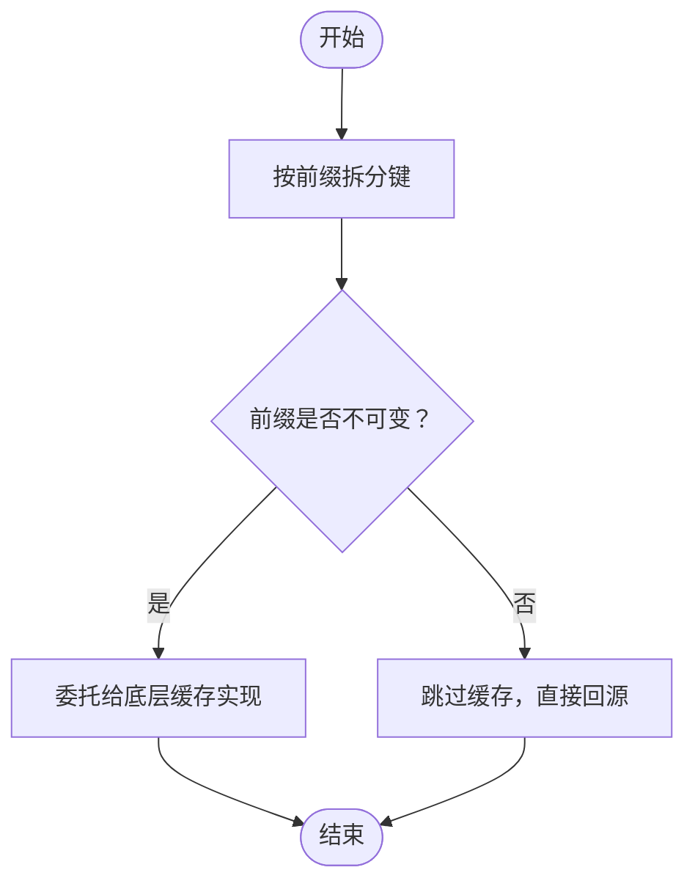
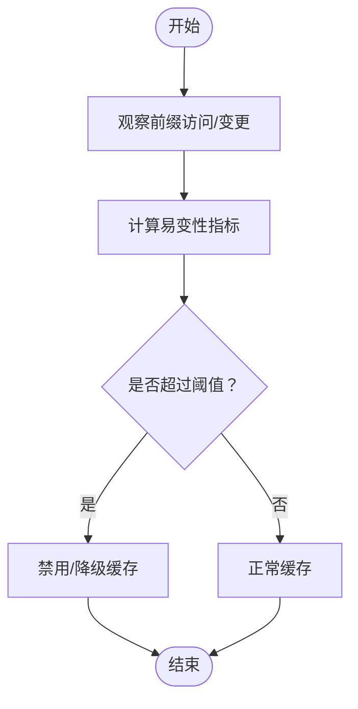
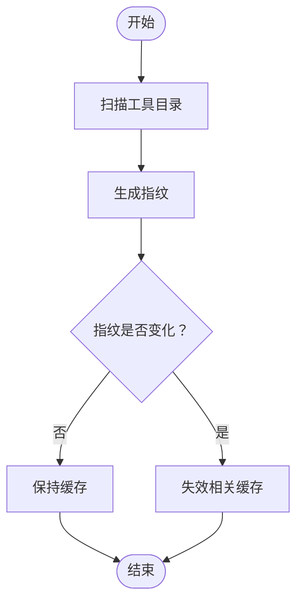
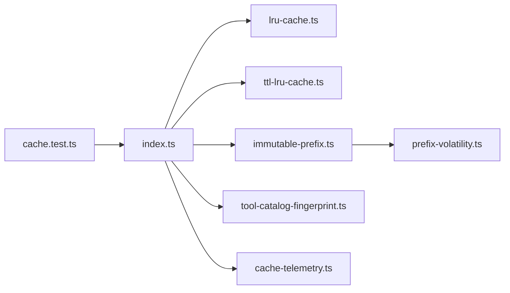

# 缓存系统

<cite>
**本文引用的文件**
- [lru-cache.ts](file://kun/src/cache/lru-cache.ts)
- [ttl-lru-cache.ts](file://kun/src/cache/ttl-lru-cache.ts)
- [immutable-prefix.ts](file://kun/src/cache/immutable-prefix.ts)
- [prefix-volatility.ts](file://kun/src/cache/prefix-volatility.ts)
- [tool-catalog-fingerprint.ts](file://kun/src/cache/tool-catalog-fingerprint.ts)
- [index.ts](file://kun/src/cache/index.ts)
- [cache-telemetry.ts](file://kun/src/telemetry/cache-telemetry.ts)
- [cache.test.ts](file://kun/tests/cache.test.ts)
- [kun-cache-optimization.md](file://docs/kun-cache-optimization.md)
</cite>

## 目录
1. [简介](#简介)
2. [项目结构](#项目结构)
3. [核心组件](#核心组件)
4. [架构总览](#架构总览)
5. [详细组件分析](#详细组件分析)
6. [依赖关系分析](#依赖关系分析)
7. [性能考量](#性能考量)
8. [故障排除指南](#故障排除指南)
9. [结论](#结论)
10. [附录](#附录)

## 简介
本技术文档围绕缓存系统展开，系统性介绍标准 LRU 缓存、带 TTL 的 LRU 缓存、不可变前缀缓存以及与之配套的前缀易变性机制与工具目录指纹。文档从架构设计、数据结构与算法、并发安全、内存管理、失效策略、性能优化、监控与排障等方面进行深入解析，并给出使用指南与最佳实践。

## 项目结构
缓存系统位于后端核心模块中，主要文件组织如下：
- 标准 LRU 缓存：用于键值对的最近最少使用淘汰
- 带 TTL 的 LRU 缓存：在 LRU 基础上增加过期时间控制
- 不可变前缀缓存：基于前缀的不可变缓存策略
- 前缀易变性：动态判定前缀是否可变，影响缓存策略选择
- 工具目录指纹：对工具目录变化进行快速检测，触发缓存失效
- 指标采集：缓存命中率、淘汰次数等关键指标
- 测试用例：覆盖缓存行为、并发与边界条件

**图表来源**
- [index.ts](file://kun/src/cache/index.ts)
- [lru-cache.ts](file://kun/src/cache/lru-cache.ts)
- [ttl-lru-cache.ts](file://kun/src/cache/ttl-lru-cache.ts)
- [immutable-prefix.ts](file://kun/src/cache/immutable-prefix.ts)
- [prefix-volatility.ts](file://kun/src/cache/prefix-volatility.ts)
- [tool-catalog-fingerprint.ts](file://kun/src/cache/tool-catalog-fingerprint.ts)
- [cache-telemetry.ts](file://kun/src/telemetry/cache-telemetry.ts)
- [cache.test.ts](file://kun/tests/cache.test.ts)

**章节来源**
- [index.ts](file://kun/src/cache/index.ts)
- [kun-cache-optimization.md](file://docs/kun-cache-optimization.md)

## 核心组件
- 标准 LRU 缓存：维护访问顺序，按最近最少使用淘汰，适合高命中率的键值缓存场景
- 带 TTL 的 LRU 缓存：在 LRU 基础上增加过期时间，自动清理过期条目，适合数据时效性要求较高的场景
- 不可变前缀缓存：针对具有固定前缀的数据进行缓存，避免频繁变更导致的缓存污染
- 前缀易变性：根据历史访问与变更模式判断前缀是否易变，动态调整缓存策略
- 工具目录指纹：对工具目录内容生成指纹，目录变化时触发缓存失效，确保工具能力缓存一致性

**章节来源**
- [lru-cache.ts](file://kun/src/cache/lru-cache.ts)
- [ttl-lru-cache.ts](file://kun/src/cache/ttl-lru-cache.ts)
- [immutable-prefix.ts](file://kun/src/cache/immutable-prefix.ts)
- [prefix-volatility.ts](file://kun/src/cache/prefix-volatility.ts)
- [tool-catalog-fingerprint.ts](file://kun/src/cache/tool-catalog-fingerprint.ts)

## 架构总览
缓存系统通过统一入口导出各类型缓存实例，并由遥测模块采集关键指标；测试用例覆盖典型行为与并发场景。

**图表来源**
- [index.ts](file://kun/src/cache/index.ts)
- [lru-cache.ts](file://kun/src/cache/lru-cache.ts)
- [ttl-lru-cache.ts](file://kun/src/cache/ttl-lru-cache.ts)
- [immutable-prefix.ts](file://kun/src/cache/immutable-prefix.ts)
- [prefix-volatility.ts](file://kun/src/cache/prefix-volatility.ts)
- [tool-catalog-fingerprint.ts](file://kun/src/cache/tool-catalog-fingerprint.ts)
- [cache-telemetry.ts](file://kun/src/telemetry/cache-telemetry.ts)
- [cache.test.ts](file://kun/tests/cache.test.ts)

## 详细组件分析

### 标准 LRU 缓存（lru-cache）
- 设计要点
  - 使用双向链表维护访问顺序，哈希表实现 O(1) 查找
  - 容量满时淘汰尾部节点（最久未使用）
  - 支持插入、更新、删除、查询操作
- 复杂度
  - 查询/插入/删除：平均 O(1)，最坏 O(n)（极端哈希冲突）
  - 空间：O(capacity)
- 并发与内存
  - 需要外部加锁保证线程安全
  - 内存占用与容量线性相关
- 适用场景
  - 高命中率、稳定键集合的缓存
  - 对时延敏感且需要快速命中
- 关键参数
  - capacity：最大容量
  - hashFn：自定义哈希函数（如需）
- 典型流程

**图表来源**
- [lru-cache.ts](file://kun/src/cache/lru-cache.ts)

**章节来源**
- [lru-cache.ts](file://kun/src/cache/lru-cache.ts)

### 带 TTL 的 LRU 缓存（ttl-lru-cache）
- 设计要点
  - 在 LRU 基础上为每个条目记录创建/最后访问时间
  - 提供定时扫描或惰性检查过期
  - 过期条目在访问时被清理，或定期批量清理
- 失效策略
  - 访问时检查：命中但过期则删除并返回未命中
  - 批处理清理：后台任务定期遍历清理过期项
- 并发与内存
  - 需要读写锁或分段锁提升并发度
  - 内存包含额外的时间戳字段
- 适用场景
  - 数据时效性要求高，如会话状态、短期策略
- 关键参数
  - capacity：最大容量
  - ttl：条目存活时间
  - cleanupInterval：清理周期
- 典型流程

**图表来源**
- [ttl-lru-cache.ts](file://kun/src/cache/ttl-lru-cache.ts)

**章节来源**
- [ttl-lru-cache.ts](file://kun/src/cache/ttl-lru-cache.ts)

### 不可变前缀缓存（immutable-prefix）
- 设计要点
  - 针对具有固定前缀的数据进行缓存，避免因前缀内数据频繁变化导致缓存污染
  - 将键按前缀分桶，仅对“不可变”前缀启用缓存
- 适用场景
  - 工具目录、版本化路径、只增不改的命名空间
- 关键参数
  - immutablePrefixes：不可变前缀集合
  - delegate：委托给具体缓存实现（如 LRU 或 TTL-LRU）
- 典型流程

**图表来源**
- [immutable-prefix.ts](file://kun/src/cache/immutable-prefix.ts)

**章节来源**
- [immutable-prefix.ts](file://kun/src/cache/immutable-prefix.ts)

### 前缀易变性（prefix-volatility）
- 设计要点
  - 统计前缀的历史变更频率与访问模式，动态判定是否应启用缓存
  - 易变前缀可能触发更激进的失效策略或禁用缓存
- 作用
  - 自适应缓存策略，平衡命中率与一致性
- 关键参数
  - volatilityThreshold：易变阈值
  - windowSize：统计窗口大小
- 典型流程

**图表来源**
- [prefix-volatility.ts](file://kun/src/cache/prefix-volatility.ts)

**章节来源**
- [prefix-volatility.ts](file://kun/src/cache/prefix-volatility.ts)

### 工具目录指纹（tool-catalog-fingerprint）
- 设计要点
  - 对工具目录内容生成稳定指纹，目录变化时触发缓存失效
  - 可结合不可变前缀与易变性策略，形成多层保护
- 作用
  - 确保工具能力缓存与实际目录一致
- 关键参数
  - digestAlgorithm：摘要算法
  - watch：是否启用目录监听
- 典型流程

**图表来源**
- [tool-catalog-fingerprint.ts](file://kun/src/cache/tool-catalog-fingerprint.ts)

**章节来源**
- [tool-catalog-fingerprint.ts](file://kun/src/cache/tool-catalog-fingerprint.ts)

## 依赖关系分析
- 组件耦合
  - immutable-prefix 与 prefix-volatility 可组合使用，前者决定“是否缓存”，后者决定“如何缓存”
  - tool-catalog-fingerprint 作为外部信号，驱动缓存失效
  - index.ts 聚合并导出各组件，便于上层统一使用
- 外部依赖
  - 遥测模块负责采集命中率、淘汰数等指标
  - 测试模块覆盖典型与边界场景

**图表来源**
- [index.ts](file://kun/src/cache/index.ts)
- [lru-cache.ts](file://kun/src/cache/lru-cache.ts)
- [ttl-lru-cache.ts](file://kun/src/cache/ttl-lru-cache.ts)
- [immutable-prefix.ts](file://kun/src/cache/immutable-prefix.ts)
- [prefix-volatility.ts](file://kun/src/cache/prefix-volatility.ts)
- [tool-catalog-fingerprint.ts](file://kun/src/cache/tool-catalog-fingerprint.ts)
- [cache-telemetry.ts](file://kun/src/telemetry/cache-telemetry.ts)
- [cache.test.ts](file://kun/tests/cache.test.ts)

**章节来源**
- [index.ts](file://kun/src/cache/index.ts)
- [cache-telemetry.ts](file://kun/src/telemetry/cache-telemetry.ts)
- [cache.test.ts](file://kun/tests/cache.test.ts)

## 性能考量
- 命中率优化
  - 合理设置容量与淘汰策略，避免频繁淘汰热数据
  - 对高频访问键采用不可变前缀策略
- 时延与吞吐
  - LRU 适合高并发读取；TTL-LRU 需权衡清理开销
  - 分段锁或无锁结构可提升并发性能
- 内存占用
  - LRU：O(capacity)
  - TTL-LRU：O(capacity) + 时间戳存储
  - 不可变前缀：按前缀分桶，避免无效缓存
- 监控与调优
  - 通过遥测模块关注命中率、淘汰率、清理耗时
  - 结合业务特征调整容量、TTL、清理周期

**章节来源**
- [cache-telemetry.ts](file://kun/src/telemetry/cache-telemetry.ts)
- [kun-cache-optimization.md](file://docs/kun-cache-optimization.md)

## 故障排除指南
- 常见问题
  - 命中率低：检查键分布、容量设置、是否误用易变前缀
  - 内存增长：确认 TTL 清理是否生效、是否出现大量过期堆积
  - 缓存不一致：检查工具目录指纹是否正确失效、前缀易变性阈值是否合理
- 排查步骤
  - 开启遥测日志，定位异常指标
  - 使用测试用例复现问题，覆盖并发与边界条件
  - 检查缓存初始化参数与生命周期管理
- 相关参考
  - 测试用例覆盖了缓存行为与并发场景，可作为问题复现与回归的依据

**章节来源**
- [cache.test.ts](file://kun/tests/cache.test.ts)
- [cache-telemetry.ts](file://kun/src/telemetry/cache-telemetry.ts)

## 结论
该缓存系统通过多种缓存类型与自适应策略，满足不同场景下的性能与一致性需求。标准 LRU 与 TTL-LRU 提供基础能力，不可变前缀与前缀易变性增强策略灵活性，工具目录指纹保障缓存一致性。配合遥测与测试体系，可实现可观测、可调优、可维护的缓存方案。

## 附录
- 使用建议
  - 优先使用不可变前缀策略，降低缓存污染
  - 对时效性高的数据采用 TTL-LRU，并合理设置清理周期
  - 动态监控命中率与淘汰率，持续调优容量与策略
- 最佳实践
  - 参数化配置，支持运行时热更新
  - 分层缓存：本地缓存 + 远程缓存，结合指纹与易变性策略
  - 异常隔离：过期清理失败不影响主流程，具备降级策略