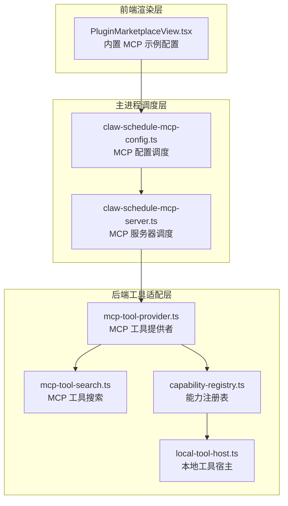
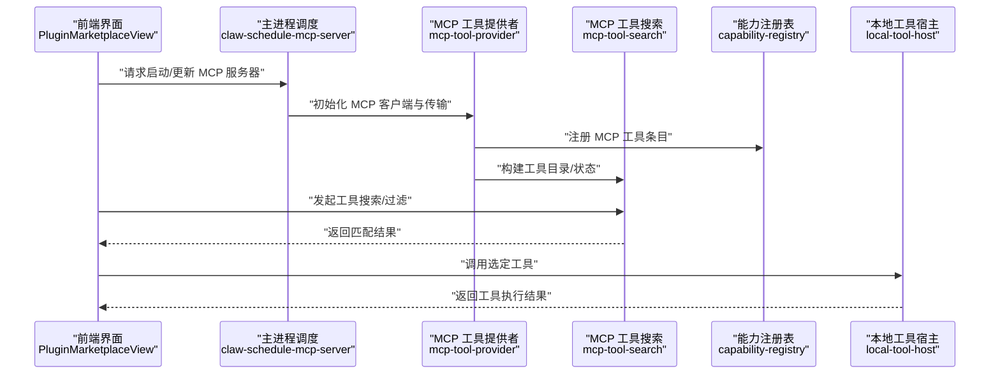
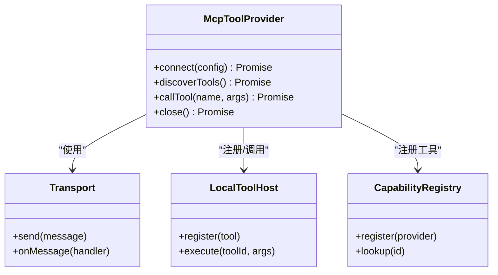
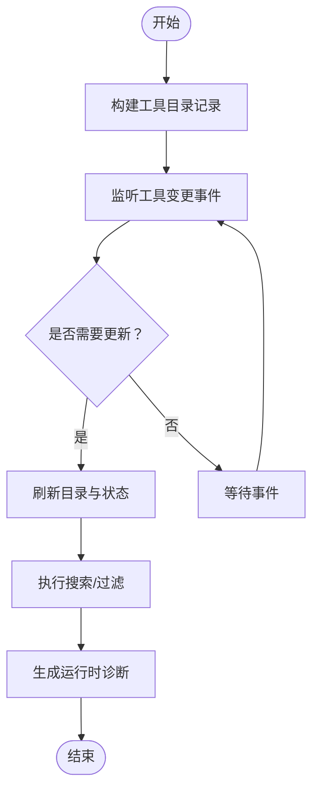
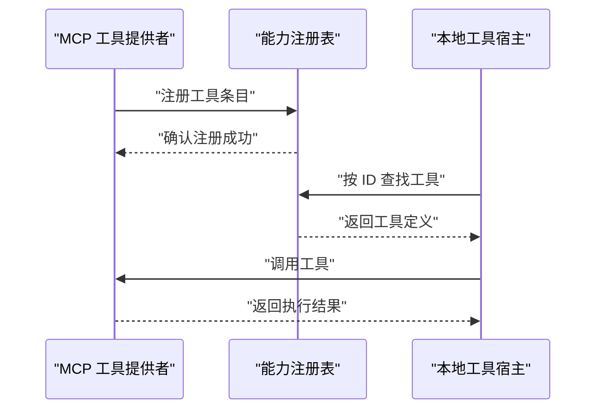
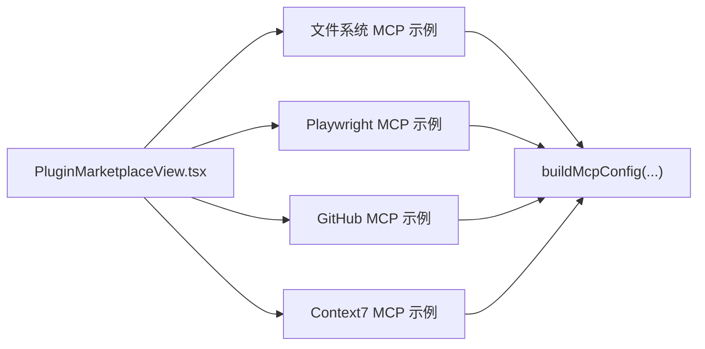
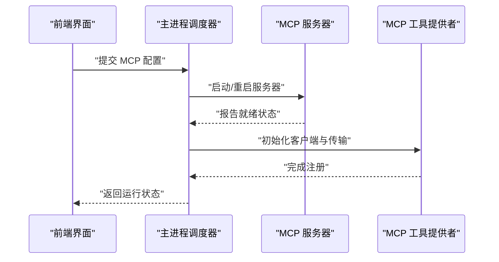
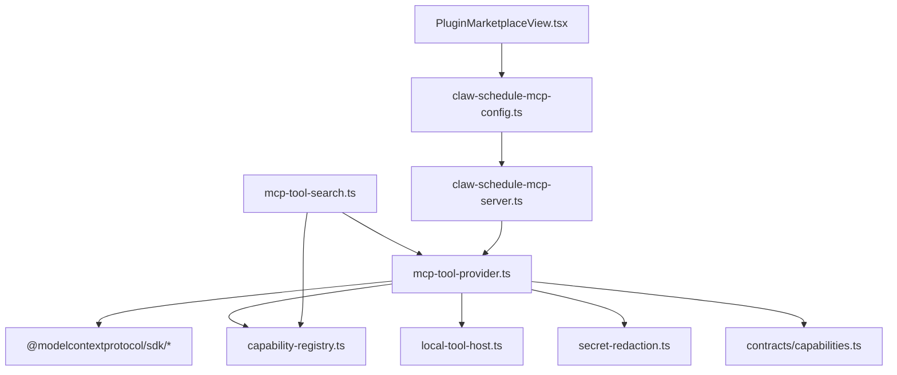

# MCP 工具提供者集成

<cite>
**本文引用的文件**
- [mcp-tool-provider.ts](file://kun/src/adapters/tool/mcp-tool-provider.ts)
- [mcp-tool-search.ts](file://kun/src/adapters/tool/mcp-tool-search.ts)
- [capability-registry.ts](file://kun/src/adapters/tool/capability-registry.ts)
- [local-tool-host.ts](file://kun/src/adapters/tool/local-tool-host.ts)
- [mcp-config.test.ts](file://kun/tests/mcp-config.test.ts)
- [mcp-tool-provider.test.ts](file://kun/tests/mcp-tool-provider.test.ts)
- [claw-schedule-mcp-config.ts](file://src/main/claw-schedule-mcp-config.ts)
- [claw-schedule-mcp-server.ts](file://src/main/claw-schedule-mcp-server.ts)
- [PluginMarketplaceView.tsx](file://src/renderer/src/components/PluginMarketplaceView.tsx)
- [capabilities.ts](file://kun/src/contracts/capabilities.ts)
- [secret-redaction.ts](file://kun/src/config/secret-redaction.ts)
</cite>

## 目录
1. [简介](#简介)
2. [项目结构](#项目结构)
3. [核心组件](#核心组件)
4. [架构总览](#架构总览)
5. [详细组件分析](#详细组件分析)
6. [依赖关系分析](#依赖关系分析)
7. [性能考虑](#性能考虑)
8. [故障排除指南](#故障排除指南)
9. [结论](#结论)
10. [附录](#附录)

## 简介
本文件面向 DeepSeek GUI 中的 MCP（Model Context Protocol）工具提供者集成，系统性阐述 MCP 协议在 GUI 中的工作原理、工具发现与调用流程、配置与连接建立、工具注册与搜索、生命周期管理、错误处理与性能优化，并提供可操作的故障排除与调试建议。读者无需深入源码即可理解如何在 DeepSeek GUI 中启用、配置与使用 MCP 工具提供者。

## 项目结构
MCP 集成横跨前端渲染层、主进程调度层与后端工具适配层，关键位置如下：
- 前端：插件市场视图中内置了多个 MCP 服务器示例配置，便于一键启用推荐的 MCP 能力。
- 主进程：负责调度 MCP 服务器的启动、停止与配置同步，确保运行时一致性。
- 后端工具适配：将 MCP 工具转换为本地工具宿主可用的统一接口，支持工具发现、调用与搜索。

**图表来源**
- [PluginMarketplaceView.tsx:361-415](file://src/renderer/src/components/PluginMarketplaceView.tsx#L361-L415)
- [claw-schedule-mcp-config.ts](file://src/main/claw-schedule-mcp-config.ts)
- [claw-schedule-mcp-server.ts](file://src/main/claw-schedule-mcp-server.ts)
- [mcp-tool-provider.ts:1-37](file://kun/src/adapters/tool/mcp-tool-provider.ts#L1-L37)
- [mcp-tool-search.ts](file://kun/src/adapters/tool/mcp-tool-search.ts)
- [capability-registry.ts](file://kun/src/adapters/tool/capability-registry.ts)
- [local-tool-host.ts](file://kun/src/adapters/tool/local-tool-host.ts)

**章节来源**
- [PluginMarketplaceView.tsx:361-415](file://src/renderer/src/components/PluginMarketplaceView.tsx#L361-L415)
- [claw-schedule-mcp-config.ts](file://src/main/claw-schedule-mcp-config.ts)
- [claw-schedule-mcp-server.ts](file://src/main/claw-schedule-mcp-server.ts)
- [mcp-tool-provider.ts:1-37](file://kun/src/adapters/tool/mcp-tool-provider.ts#L1-L37)

## 核心组件
- MCP 工具提供者：封装 MCP 客户端与传输层，负责工具发现、调用与元数据管理；支持多种传输方式（STDIO、SSE、Streamable HTTP）。
- MCP 工具搜索：提供工具目录构建、状态维护与诊断信息，支撑工具检索与过滤。
- 能力注册表：将 MCP 工具标准化为统一的工具条目，供本地工具宿主执行。
- 本地工具宿主：抽象出统一的工具执行环境，屏蔽 MCP 与本地工具差异。
- 主进程调度：负责 MCP 服务器的生命周期管理与配置同步，保障运行时安全与稳定性。
- 前端插件市场：内置常见 MCP 服务器示例，简化用户接入流程。

**章节来源**
- [mcp-tool-provider.ts:1-37](file://kun/src/adapters/tool/mcp-tool-provider.ts#L1-L37)
- [mcp-tool-search.ts](file://kun/src/adapters/tool/mcp-tool-search.ts)
- [capability-registry.ts](file://kun/src/adapters/tool/capability-registry.ts)
- [local-tool-host.ts](file://kun/src/adapters/tool/local-tool-host.ts)
- [claw-schedule-mcp-server.ts](file://src/main/claw-schedule-mcp-server.ts)
- [PluginMarketplaceView.tsx:361-415](file://src/renderer/src/components/PluginMarketplaceView.tsx#L361-L415)

## 架构总览
下图展示了从前端到主进程再到 MCP 工具提供者的完整调用链路与数据流。

**图表来源**
- [PluginMarketplaceView.tsx:361-415](file://src/renderer/src/components/PluginMarketplaceView.tsx#L361-L415)
- [claw-schedule-mcp-server.ts](file://src/main/claw-schedule-mcp-server.ts)
- [mcp-tool-provider.ts:1-37](file://kun/src/adapters/tool/mcp-tool-provider.ts#L1-L37)
- [mcp-tool-search.ts](file://kun/src/adapters/tool/mcp-tool-search.ts)
- [capability-registry.ts](file://kun/src/adapters/tool/capability-registry.ts)
- [local-tool-host.ts](file://kun/src/adapters/tool/local-tool-host.ts)

## 详细组件分析

### MCP 工具提供者（mcp-tool-provider）
职责与特性：
- 封装 MCP 客户端与传输层，支持 STDIO、SSE、Streamable HTTP 等传输方式。
- 统一工具元数据（名称、标题、描述、输入输出模式等），并提供注解（只读、破坏性、幂等等）。
- 将 MCP 工具注册为本地工具宿主可用的条目，屏蔽底层差异。
- 提供工具调用入口，返回结构化内容与文本内容。

关键点：
- 传输选择：根据配置选择合适的传输层以满足不同运行环境（桌面、Web、容器）。
- 元数据标准化：通过工具描述结构统一字段，便于后续搜索与展示。
- 安全与隐私：对敏感信息进行脱敏处理，避免泄露。

**图表来源**
- [mcp-tool-provider.ts:1-37](file://kun/src/adapters/tool/mcp-tool-provider.ts#L1-L37)
- [local-tool-host.ts](file://kun/src/adapters/tool/local-tool-host.ts)
- [capability-registry.ts](file://kun/src/adapters/tool/capability-registry.ts)

**章节来源**
- [mcp-tool-provider.ts:1-37](file://kun/src/adapters/tool/mcp-tool-provider.ts#L1-L37)

### MCP 工具搜索（mcp-tool-search）
职责与特性：
- 构建工具目录记录与状态，支持增量更新与诊断信息生成。
- 提供搜索与过滤能力，辅助前端快速定位所需工具。
- 维护搜索运行时诊断，便于问题定位与性能评估。

工作流程：
- 初始化：基于已发现的工具生成目录记录。
- 更新：监听工具变更事件，动态刷新目录与状态。
- 搜索：根据关键词、标签或能力维度进行筛选。
- 诊断：输出搜索状态与性能指标，辅助优化。

**图表来源**
- [mcp-tool-search.ts](file://kun/src/adapters/tool/mcp-tool-search.ts)

**章节来源**
- [mcp-tool-search.ts](file://kun/src/adapters/tool/mcp-tool-search.ts)

### 能力注册表与本地工具宿主
- 能力注册表：将 MCP 工具标准化为统一的工具条目，提供查找与分发能力。
- 本地工具宿主：抽象工具执行环境，统一调用协议，屏蔽 MCP 与本地工具差异。

**图表来源**
- [capability-registry.ts](file://kun/src/adapters/tool/capability-registry.ts)
- [local-tool-host.ts](file://kun/src/adapters/tool/local-tool-host.ts)
- [mcp-tool-provider.ts:1-37](file://kun/src/adapters/tool/mcp-tool-provider.ts#L1-L37)

**章节来源**
- [capability-registry.ts](file://kun/src/adapters/tool/capability-registry.ts)
- [local-tool-host.ts](file://kun/src/adapters/tool/local-tool-host.ts)
- [mcp-tool-provider.ts:1-37](file://kun/src/adapters/tool/mcp-tool-provider.ts#L1-L37)

### 前端插件市场与 MCP 示例配置
前端插件市场内置了多个推荐的 MCP 服务器示例，包括文件系统、Playwright、GitHub、Context7 等，便于用户快速体验 MCP 能力。这些示例展示了如何通过配置对象指定传输方式、命令与参数、信任范围等。

**图表来源**
- [PluginMarketplaceView.tsx:361-415](file://src/renderer/src/components/PluginMarketplaceView.tsx#L361-L415)

**章节来源**
- [PluginMarketplaceView.tsx:361-415](file://src/renderer/src/components/PluginMarketplaceView.tsx#L361-L415)

### 主进程调度与配置同步
主进程负责 MCP 服务器的生命周期管理与配置同步，确保运行时的一致性与安全性。它会根据前端请求或配置变化触发服务器的启动、停止与重载。

**图表来源**
- [claw-schedule-mcp-config.ts](file://src/main/claw-schedule-mcp-config.ts)
- [claw-schedule-mcp-server.ts](file://src/main/claw-schedule-mcp-server.ts)

**章节来源**
- [claw-schedule-mcp-config.ts](file://src/main/claw-schedule-mcp-config.ts)
- [claw-schedule-mcp-server.ts](file://src/main/claw-schedule-mcp-server.ts)

## 依赖关系分析
MCP 工具提供者与周边模块的耦合与协作如下：

**图表来源**
- [mcp-tool-provider.ts:1-37](file://kun/src/adapters/tool/mcp-tool-provider.ts#L1-L37)
- [capability-registry.ts](file://kun/src/adapters/tool/capability-registry.ts)
- [local-tool-host.ts](file://kun/src/adapters/tool/local-tool-host.ts)
- [secret-redaction.ts](file://kun/src/config/secret-redaction.ts)
- [capabilities.ts](file://kun/src/contracts/capabilities.ts)
- [mcp-tool-search.ts](file://kun/src/adapters/tool/mcp-tool-search.ts)
- [claw-schedule-mcp-config.ts](file://src/main/claw-schedule-mcp-config.ts)
- [claw-schedule-mcp-server.ts](file://src/main/claw-schedule-mcp-server.ts)
- [PluginMarketplaceView.tsx:361-415](file://src/renderer/src/components/PluginMarketplaceView.tsx#L361-L415)

**章节来源**
- [mcp-tool-provider.ts:1-37](file://kun/src/adapters/tool/mcp-tool-provider.ts#L1-L37)
- [mcp-tool-search.ts](file://kun/src/adapters/tool/mcp-tool-search.ts)
- [capability-registry.ts](file://kun/src/adapters/tool/capability-registry.ts)
- [local-tool-host.ts](file://kun/src/adapters/tool/local-tool-host.ts)
- [secret-redaction.ts](file://kun/src/config/secret-redaction.ts)
- [capabilities.ts](file://kun/src/contracts/capabilities.ts)
- [claw-schedule-mcp-config.ts](file://src/main/claw-schedule-mcp-config.ts)
- [claw-schedule-mcp-server.ts](file://src/main/claw-schedule-mcp-server.ts)
- [PluginMarketplaceView.tsx:361-415](file://src/renderer/src/components/PluginMarketplaceView.tsx#L361-L415)

## 性能考虑
- 传输层选择：在本地开发场景优先使用 STDIO 以降低网络开销；在远程或 Web 场景使用 SSE 或 Streamable HTTP 以提升兼容性。
- 工具目录缓存：利用搜索模块的状态缓存减少重复构建成本，仅在工具变更时刷新。
- 并发控制：限制同时并发的工具调用数量，避免资源争用与超时。
- 超时与重试：为 MCP 请求设置合理超时与指数退避重试策略，提升鲁棒性。
- 日志与诊断：开启运行时诊断输出，定期收集搜索与调用性能指标，持续优化。

[本节为通用指导，不直接分析具体文件]

## 故障排除指南
常见问题与排查步骤：
- 工具未发现
  - 检查 MCP 服务器是否正常启动与就绪。
  - 确认传输配置正确（命令、参数、工作目录）。
  - 查看能力注册表是否成功注册工具条目。
- 工具调用失败
  - 检查工具参数是否符合输入模式定义。
  - 关注工具注解（只读/破坏性/幂等）是否与预期一致。
  - 查看工具调用返回的错误信息与状态码。
- 搜索无结果
  - 确认工具目录已构建且未过期。
  - 检查搜索关键词与过滤条件是否合理。
  - 查看搜索运行时诊断，定位性能瓶颈。
- 安全与信任
  - 校验工作区信任范围与受信根路径。
  - 对敏感信息进行脱敏处理，避免日志泄露。

**章节来源**
- [mcp-tool-provider.test.ts:56-87](file://kun/tests/mcp-tool-provider.test.ts#L56-L87)
- [mcp-config.test.ts](file://kun/tests/mcp-config.test.ts)
- [secret-redaction.ts](file://kun/src/config/secret-redaction.ts)

## 结论
DeepSeek GUI 的 MCP 集成通过“前端示例配置 + 主进程调度 + 后端工具适配”的架构，实现了 MCP 工具的即插即用与高效管理。借助能力注册表与本地工具宿主，MCP 工具被无缝融入 GUI 的工具生态；配合搜索模块与运行时诊断，开发者可以快速定位问题并优化性能。建议在生产环境中结合传输层选择、并发控制与安全策略，确保稳定与安全。

[本节为总结性内容，不直接分析具体文件]

## 附录

### MCP 工具提供者配置要点
- 传输方式：STDIO、SSE、Streamable HTTP。
- 服务器命令与参数：通过配置对象指定。
- 信任范围：支持工作区信任与受信根路径。
- 超时设置：为请求设置合理的超时时间。
- 环境变量与头部：按需注入运行环境。

**章节来源**
- [mcp-tool-provider.ts:1-37](file://kun/src/adapters/tool/mcp-tool-provider.ts#L1-L37)
- [capabilities.ts](file://kun/src/contracts/capabilities.ts)

### 前端 MCP 示例配置参考
- 文件系统 MCP：示例命令与参数展示。
- Playwright MCP：示例命令与参数展示。
- GitHub MCP：示例命令与参数展示。
- Context7 MCP：示例命令与参数展示。

**章节来源**
- [PluginMarketplaceView.tsx:361-415](file://src/renderer/src/components/PluginMarketplaceView.tsx#L361-L415)