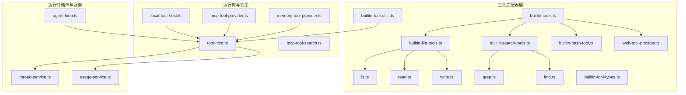
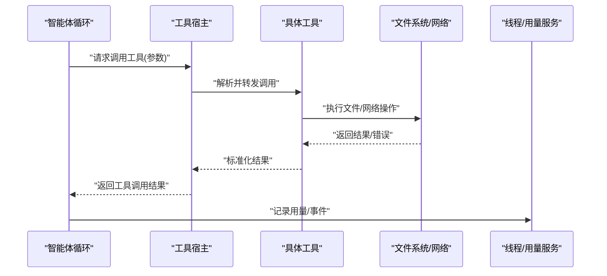
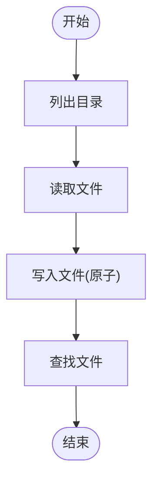
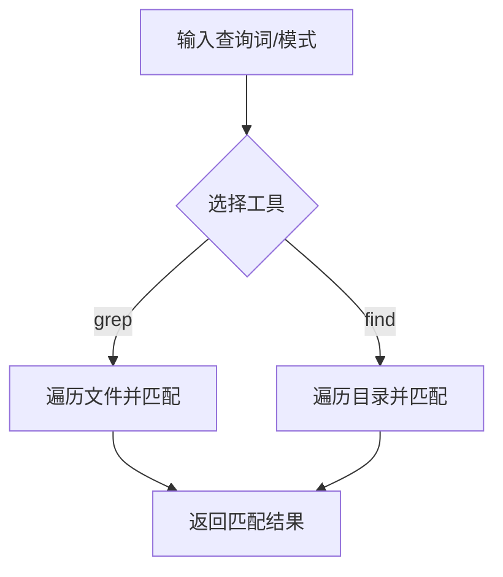
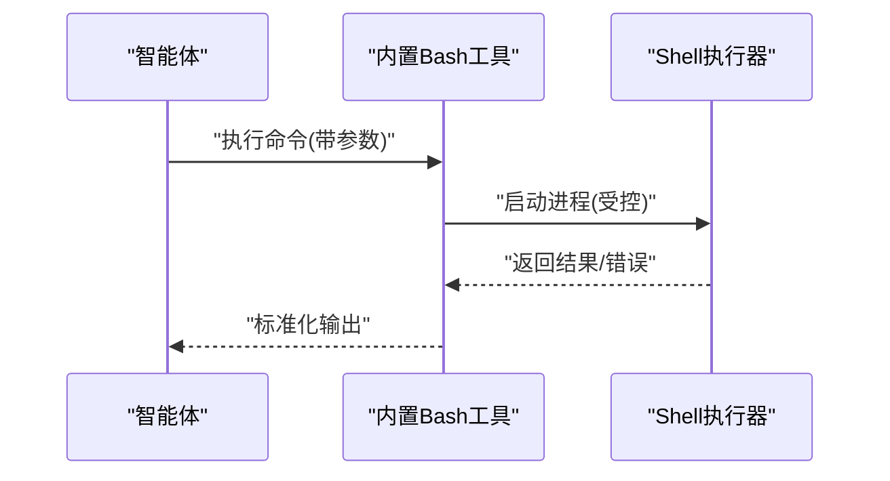
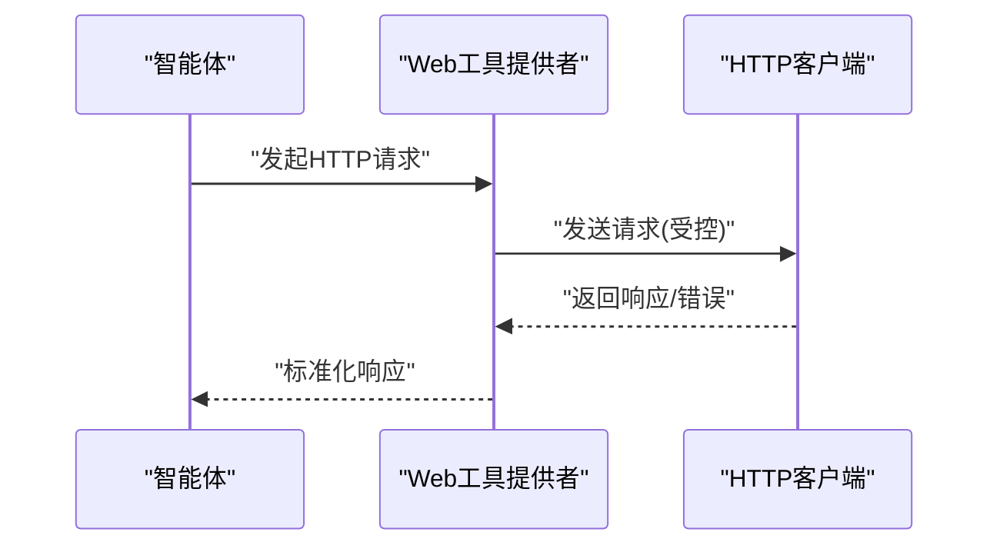
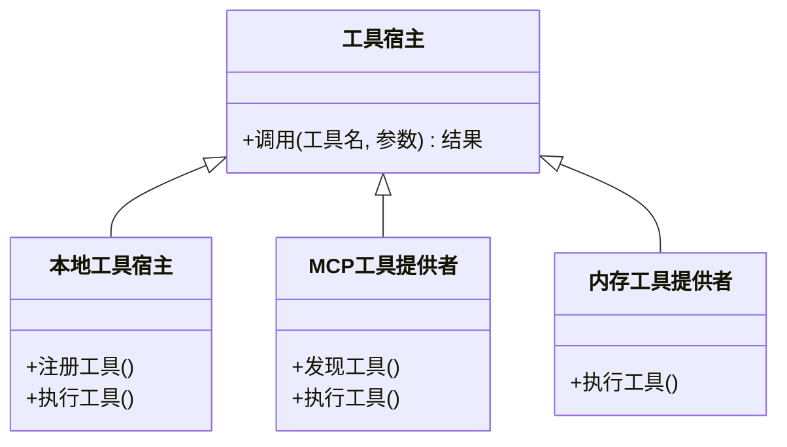
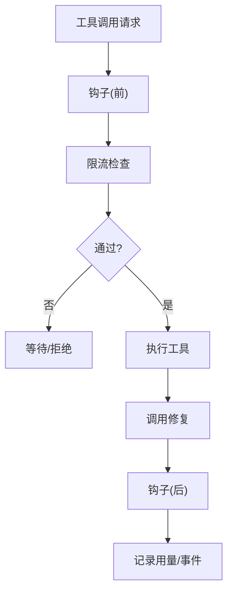
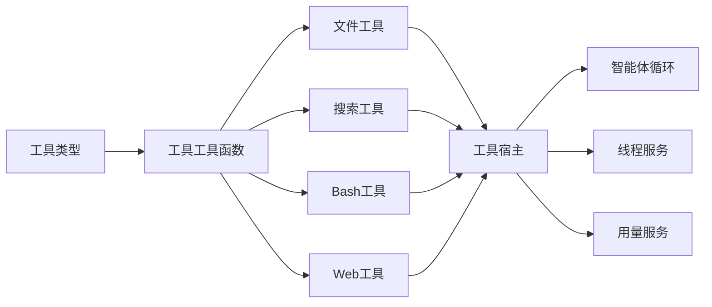

# 内置工具集合

<cite>
**本文引用的文件**
- [builtin-tools.ts](file://kun/src/adapters/tool/builtin-tools.ts)
- [builtin-file-tools.ts](file://kun/src/adapters/tool/builtin-file-tools.ts)
- [builtin-search-tools.ts](file://kun/src/adapters/tool/builtin-search-tools.ts)
- [builtin-bash-tool.ts](file://kun/src/adapters/tool/builtin-bash-tool.ts)
- [bash.ts](file://kun/src/adapters/tool/bash.ts)
- [web-tool-provider.ts](file://kun/src/adapters/tool/web-tool-provider.ts)
- [ls.ts](file://kun/src/adapters/tool/ls.ts)
- [read.ts](file://kun/src/adapters/tool/read.ts)
- [write.ts](file://kun/src/adapters/tool/write.ts)
- [grep.ts](file://kun/src/adapters/tool/grep.ts)
- [find.ts](file://kun/src/adapters/tool/find.ts)
- [builtin-tool-types.ts](file://kun/src/adapters/tool/builtin-tool-types.ts)
- [builtin-tool-utils.ts](file://kun/src/adapters/tool/builtin-tool-utils.ts)
- [tool-host.ts](file://kun/src/ports/tool-host.ts)
- [tool-hooks.ts](file://kun/src/adapters/tool/tool-hooks.ts)
- [tool-rate-limit.ts](file://kun/src/adapters/tool/tool-rate-limit.ts)
- [tool-call-repair.ts](file://kun/src/loop/tool-call-repair.ts)
- [tool-storm-breaker.ts](file://kun/src/loop/tool-storm-breaker.ts)
- [local-tool-host.ts](file://kun/src/adapters/tool/local-tool-host.ts)
- [mcp-tool-provider.ts](file://kun/src/adapters/tool/mcp-tool-provider.ts)
- [mcp-tool-search.ts](file://kun/src/adapters/tool/mcp-tool-search.ts)
- [memory-tool-provider.ts](file://kun/src/adapters/tool/memory-tool-provider.ts)
- [read-tracker.ts](file://kun/src/adapters/tool/read-tracker.ts)
- [file-mutation-queue.ts](file://kun/src/adapters/tool/file-mutation-queue.ts)
- [atomic-write.ts](file://kun/src/adapters/file/atomic-write.ts)
- [file-session-store.ts](file://kun/src/adapters/file/file-session-store.ts)
- [file-thread-store.ts](file://kun/src/adapters/file/file-thread-store.ts)
- [index.ts](file://kun/src/adapters/file/index.ts)
- [kun-config.ts](file://kun/src/config/kun-config.ts)
- [secret-redaction.ts](file://kun/src/config/secret-redaction.ts)
- [runtime-factory.ts](file://kun/src/server/runtime-factory.ts)
- [http-server.ts](file://kun/src/server/http-server.ts)
- [router.ts](file://kun/src/server/routes/index.ts)
- [workspace-inspector.ts](file://kun/src/ports/workspace-inspector.ts)
- [local-workspace-inspector.ts](file://kun/src/workspace/local-workspace-inspector.ts)
- [agent-loop.ts](file://kun/src/loop/agent-loop.ts)
- [thread-service.ts](file://kun/src/services/thread-service.ts)
- [usage-service.ts](file://kun/src/services/usage-service.ts)
- [in-memory-session-store.ts](file://kun/src/adapters/in-memory-session-store.ts)
- [in-memory-thread-store.ts](file://kun/src/adapters/in-memory-thread-store.ts)
- [in-memory-event-bus.ts](file://kun/src/adapters/in-memory-event-bus.ts)
- [in-memory-approval-gate.ts](file://kun/src/adapters/in-memory-approval-gate.ts)
- [in-memory-user-input-gate.ts](file://kun/src/adapters/in-memory-user-input-gate.ts)
- [kun-config.test.ts](file://kun/tests/kun-config.test.ts)
- [builtin-tools.test.ts](file://kun/tests/builtin-tools.test.ts)
- [web-tool-provider.test.ts](file://kun/tests/web-tool-provider.test.ts)
</cite>

## 目录
1. [简介](#简介)
2. [项目结构](#项目结构)
3. [核心组件](#核心组件)
4. [架构总览](#架构总览)
5. [详细组件分析](#详细组件分析)
6. [依赖关系分析](#依赖关系分析)
7. [性能考量](#性能考量)
8. [故障排查指南](#故障排查指南)
9. [结论](#结论)
10. [附录](#附录)

## 简介
本文件面向 DeepSeek GUI 的“内置工具集合”，系统性梳理并说明以下工具族的功能与使用方式：
- 文件工具：读取、写入、查找、列出文件
- 搜索工具：grep、find
- Bash 工具：命令执行
- Web 工具：HTTP 请求
重点覆盖：
- 参数配置与返回值格式
- 错误处理机制
- 在智能体循环中的典型调用示例（文件变更监控、代码搜索、远程数据获取）
- 安全限制、权限控制与性能考虑

## 项目结构
内置工具位于后端运行时子系统中，核心入口与类型定义集中在适配器层的工具模块，通过统一的工具宿主接口对外提供能力，并由运行时循环与服务层协同调度。

**图示来源**
- [builtin-tools.ts](file://kun/src/adapters/tool/builtin-tools.ts)
- [builtin-file-tools.ts](file://kun/src/adapters/tool/builtin-file-tools.ts)
- [builtin-search-tools.ts](file://kun/src/adapters/tool/builtin-search-tools.ts)
- [builtin-bash-tool.ts](file://kun/src/adapters/tool/builtin-bash-tool.ts)
- [web-tool-provider.ts](file://kun/src/adapters/tool/web-tool-provider.ts)
- [ls.ts](file://kun/src/adapters/tool/ls.ts)
- [read.ts](file://kun/src/adapters/tool/read.ts)
- [write.ts](file://kun/src/adapters/tool/write.ts)
- [grep.ts](file://kun/src/adapters/tool/grep.ts)
- [find.ts](file://kun/src/adapters/tool/find.ts)
- [builtin-tool-types.ts](file://kun/src/adapters/tool/builtin-tool-types.ts)
- [builtin-tool-utils.ts](file://kun/src/adapters/tool/builtin-tool-utils.ts)
- [tool-host.ts](file://kun/src/ports/tool-host.ts)
- [local-tool-host.ts](file://kun/src/adapters/tool/local-tool-host.ts)
- [mcp-tool-provider.ts](file://kun/src/adapters/tool/mcp-tool-provider.ts)
- [mcp-tool-search.ts](file://kun/src/adapters/tool/mcp-tool-search.ts)
- [memory-tool-provider.ts](file://kun/src/adapters/tool/memory-tool-provider.ts)
- [agent-loop.ts](file://kun/src/loop/agent-loop.ts)
- [thread-service.ts](file://kun/src/services/thread-service.ts)
- [usage-service.ts](file://kun/src/services/usage-service.ts)

**章节来源**
- [builtin-tools.ts](file://kun/src/adapters/tool/builtin-tools.ts)
- [builtin-tool-types.ts](file://kun/src/adapters/tool/builtin-tool-types.ts)
- [builtin-tool-utils.ts](file://kun/src/adapters/tool/builtin-tool-utils.ts)
- [tool-host.ts](file://kun/src/ports/tool-host.ts)
- [agent-loop.ts](file://kun/src/loop/agent-loop.ts)

## 核心组件
- 工具注册与聚合：集中于工具适配器层，负责将具体工具封装为统一的工具描述与调用协议。
- 工具宿主与分发：通过工具宿主接口统一调度本地与外部工具（含 Bash、Web、MCP 等）。
- 运行时循环与服务：在智能体循环中协调工具调用、限流、修复与防护，保障稳定性与安全性。

关键职责划分：
- 文件工具族：读取、写入、列出、查找
- 搜索工具族：grep、find
- Bash 工具：命令执行
- Web 工具：HTTP 请求
- 辅助设施：工具类型、工具工具函数、速率限制、调用修复与风暴防护

**章节来源**
- [builtin-file-tools.ts](file://kun/src/adapters/tool/builtin-file-tools.ts)
- [builtin-search-tools.ts](file://kun/src/adapters/tool/builtin-search-tools.ts)
- [builtin-bash-tool.ts](file://kun/src/adapters/tool/builtin-bash-tool.ts)
- [web-tool-provider.ts](file://kun/src/adapters/tool/web-tool-provider.ts)
- [builtin-tool-types.ts](file://kun/src/adapters/tool/builtin-tool-types.ts)
- [builtin-tool-utils.ts](file://kun/src/adapters/tool/builtin-tool-utils.ts)
- [tool-host.ts](file://kun/src/ports/tool-host.ts)
- [tool-rate-limit.ts](file://kun/src/adapters/tool/tool-rate-limit.ts)
- [tool-call-repair.ts](file://kun/src/loop/tool-call-repair.ts)
- [tool-storm-breaker.ts](file://kun/src/loop/tool-storm-breaker.ts)

## 架构总览
下图展示了工具从声明到执行的关键流转，以及与运行时循环、服务层的交互。

**图示来源**
- [agent-loop.ts](file://kun/src/loop/agent-loop.ts)
- [tool-host.ts](file://kun/src/ports/tool-host.ts)
- [builtin-tools.ts](file://kun/src/adapters/tool/builtin-tools.ts)
- [thread-service.ts](file://kun/src/services/thread-service.ts)
- [usage-service.ts](file://kun/src/services/usage-service.ts)

## 详细组件分析

### 文件工具族（读取、写入、列出、查找）
- 组件构成
  - 列表：列出目录内容
  - 读取：读取文件内容
  - 写入：写入/覆盖文件内容（原子写入保障一致性）
  - 查找：在工作区范围内查找文件名或路径匹配项
- 关键实现与接口
  - 列出：[ls.ts](file://kun/src/adapters/tool/ls.ts)
  - 读取：[read.ts](file://kun/src/adapters/tool/read.ts)
  - 写入：[write.ts](file://kun/src/adapters/tool/write.ts)，底层原子写入：[atomic-write.ts](file://kun/src/adapters/file/atomic-write.ts)
  - 查找：[find.ts](file://kun/src/adapters/tool/find.ts)
  - 工具类型与工具函数：[builtin-tool-types.ts](file://kun/src/adapters/tool/builtin-tool-types.ts)、[builtin-tool-utils.ts](file://kun/src/adapters/tool/builtin-tool-utils.ts)
  - 文件会话/线程存储：[file-session-store.ts](file://kun/src/adapters/file/file-session-store.ts)、[file-thread-store.ts](file://kun/src/adapters/file/file-thread-store.ts)
  - 工作区检查：[workspace-inspector.ts](file://kun/src/ports/workspace-inspector.ts)、[local-workspace-inspector.ts](file://kun/src/workspace/local-workspace-inspector.ts)
- 参数与返回
  - 列出：目录路径、是否递归、过滤规则等；返回文件/目录列表
  - 读取：文件路径、可选编码、大小限制；返回文本内容或二进制摘要
  - 写入：目标路径、内容、是否追加、原子写入开关；返回写入状态与元信息
  - 查找：模式、范围、排除规则；返回匹配项清单
- 错误处理
  - 路径越界、权限不足、文件不存在、磁盘空间不足、过大文件拒绝等
  - 读写失败重试策略与回滚（原子写入）
- 典型用法场景
  - 文件变更监控：结合读取与查找，周期性扫描变更并生成摘要
  - 配置读取：读取工作区内配置文件，注入到智能体上下文
  - 批量生成：写入多文件，确保一致性与幂等

**图示来源**
- [ls.ts](file://kun/src/adapters/tool/ls.ts)
- [read.ts](file://kun/src/adapters/tool/read.ts)
- [write.ts](file://kun/src/adapters/tool/write.ts)
- [find.ts](file://kun/src/adapters/tool/find.ts)
- [atomic-write.ts](file://kun/src/adapters/file/atomic-write.ts)

**章节来源**
- [builtin-file-tools.ts](file://kun/src/adapters/tool/builtin-file-tools.ts)
- [ls.ts](file://kun/src/adapters/tool/ls.ts)
- [read.ts](file://kun/src/adapters/tool/read.ts)
- [write.ts](file://kun/src/adapters/tool/write.ts)
- [find.ts](file://kun/src/adapters/tool/find.ts)
- [builtin-tool-types.ts](file://kun/src/adapters/tool/builtin-tool-types.ts)
- [builtin-tool-utils.ts](file://kun/src/adapters/tool/builtin-tool-utils.ts)
- [file-session-store.ts](file://kun/src/adapters/file/file-session-store.ts)
- [file-thread-store.ts](file://kun/src/adapters/file/file-thread-store.ts)
- [workspace-inspector.ts](file://kun/src/ports/workspace-inspector.ts)
- [local-workspace-inspector.ts](file://kun/src/workspace/local-workspace-inspector.ts)

### 搜索工具族（grep、find）
- 组件构成
  - grep：在文件内容中进行正则/关键词搜索
  - find：基于名称/路径规则在目录树中查找
- 实现与接口
  - grep：[grep.ts](file://kun/src/adapters/tool/grep.ts)
  - find：[find.ts](file://kun/src/adapters/tool/find.ts)
  - 工具类型与工具函数：[builtin-tool-types.ts](file://kun/src/adapters/tool/builtin-tool-types.ts)、[builtin-tool-utils.ts](file://kun/src/adapters/tool/builtin-tool-utils.ts)
- 参数与返回
  - grep：查询词、文件/目录、正则开关、大小写敏感、上下文行数、最大匹配数；返回匹配行与上下文
  - find：模式、范围、排除规则、大小限制；返回匹配项清单
- 错误处理
  - 大文件拒绝、超时、权限不足、编码异常
- 典型用法场景
  - 代码搜索：在工程内检索特定函数/变量/注释
  - 日志分析：按关键字筛选日志文件
  - 依赖发现：查找配置文件或依赖声明

**图示来源**
- [grep.ts](file://kun/src/adapters/tool/grep.ts)
- [find.ts](file://kun/src/adapters/tool/find.ts)
- [builtin-tool-types.ts](file://kun/src/adapters/tool/builtin-tool-types.ts)
- [builtin-tool-utils.ts](file://kun/src/adapters/tool/builtin-tool-utils.ts)

**章节来源**
- [builtin-search-tools.ts](file://kun/src/adapters/tool/builtin-search-tools.ts)
- [grep.ts](file://kun/src/adapters/tool/grep.ts)
- [find.ts](file://kun/src/adapters/tool/find.ts)
- [builtin-tool-types.ts](file://kun/src/adapters/tool/builtin-tool-types.ts)
- [builtin-tool-utils.ts](file://kun/src/adapters/tool/builtin-tool-utils.ts)

### Bash 工具（命令执行）
- 组件构成
  - 命令执行：在受限环境中执行 shell 命令
  - 工具封装：内置 Bash 工具与通用 Bash 适配器
- 实现与接口
  - 内置 Bash 工具：[builtin-bash-tool.ts](file://kun/src/adapters/tool/builtin-bash-tool.ts)
  - Bash 适配器：[bash.ts](file://kun/src/adapters/tool/bash.ts)
  - 工具类型与工具函数：[builtin-tool-types.ts](file://kun/src/adapters/tool/builtin-tool-types.ts)、[builtin-tool-utils.ts](file://kun/src/adapters/tool/builtin-tool-utils.ts)
- 参数与返回
  - 命令字符串、工作目录、环境变量、超时、输出大小限制；返回退出码、标准输出、标准错误与耗时
- 错误处理
  - 超时、非零退出码、权限不足、命令不存在、资源限制
- 安全与权限
  - 受限执行环境、白名单命令、工作目录沙箱、超时与资源上限
- 典型用法场景
  - 构建脚本执行、版本检测、系统信息采集

**图示来源**
- [builtin-bash-tool.ts](file://kun/src/adapters/tool/builtin-bash-tool.ts)
- [bash.ts](file://kun/src/adapters/tool/bash.ts)
- [builtin-tool-types.ts](file://kun/src/adapters/tool/builtin-tool-types.ts)
- [builtin-tool-utils.ts](file://kun/src/adapters/tool/builtin-tool-utils.ts)

**章节来源**
- [builtin-bash-tool.ts](file://kun/src/adapters/tool/builtin-bash-tool.ts)
- [bash.ts](file://kun/src/adapters/tool/bash.ts)
- [builtin-tool-types.ts](file://kun/src/adapters/tool/builtin-tool-types.ts)
- [builtin-tool-utils.ts](file://kun/src/adapters/tool/builtin-tool-utils.ts)

### Web 工具（HTTP 请求）
- 组件构成
  - HTTP 请求工具：支持 GET/POST/PUT/DELETE 等方法，可设置头、体、超时、重试
- 实现与接口
  - Web 工具提供者：[web-tool-provider.ts](file://kun/src/adapters/tool/web-tool-provider.ts)
  - 工具类型与工具函数：[builtin-tool-types.ts](file://kun/src/adapters/tool/builtin-tool-types.ts)、[builtin-tool-utils.ts](file://kun/src/adapters/tool/builtin-tool-utils.ts)
- 参数与返回
  - URL、方法、头部、请求体、超时、重试次数；返回状态码、响应头、响应体、耗时
- 错误处理
  - 网络异常、超时、非 2xx 状态码、响应体过大、证书问题
- 安全与权限
  - 仅允许安全协议（HTTPS），可配置代理与证书校验策略
- 典型用法场景
  - 获取远程配置、调用第三方 API、拉取模板/资源

**图示来源**
- [web-tool-provider.ts](file://kun/src/adapters/tool/web-tool-provider.ts)
- [builtin-tool-types.ts](file://kun/src/adapters/tool/builtin-tool-types.ts)
- [builtin-tool-utils.ts](file://kun/src/adapters/tool/builtin-tool-utils.ts)

**章节来源**
- [web-tool-provider.ts](file://kun/src/adapters/tool/web-tool-provider.ts)
- [builtin-tool-types.ts](file://kun/src/adapters/tool/builtin-tool-types.ts)
- [builtin-tool-utils.ts](file://kun/src/adapters/tool/builtin-tool-utils.ts)

### 工具宿主与分发
- 工具宿主接口：统一暴露工具调用能力，屏蔽本地/外部差异
- 本地工具宿主：承载内置工具（文件、搜索、Bash、Web）
- 外部工具提供者：MCP 工具提供者、内存工具提供者等
- 运行时集成：在智能体循环中被调用，配合限流、修复与防护

**图示来源**
- [tool-host.ts](file://kun/src/ports/tool-host.ts)
- [local-tool-host.ts](file://kun/src/adapters/tool/local-tool-host.ts)
- [mcp-tool-provider.ts](file://kun/src/adapters/tool/mcp-tool-provider.ts)
- [memory-tool-provider.ts](file://kun/src/adapters/tool/memory-tool-provider.ts)

**章节来源**
- [tool-host.ts](file://kun/src/ports/tool-host.ts)
- [local-tool-host.ts](file://kun/src/adapters/tool/local-tool-host.ts)
- [mcp-tool-provider.ts](file://kun/src/adapters/tool/mcp-tool-provider.ts)
- [memory-tool-provider.ts](file://kun/src/adapters/tool/memory-tool-provider.ts)

### 工具钩子、限流与防护
- 工具钩子：在调用前后注入横切逻辑（如审计、追踪）
- 速率限制：对工具调用频率与并发进行限制
- 调用修复：对参数/调用进行自动修复，提升鲁棒性
- 风暴防护：防止工具风暴导致系统过载

**图示来源**
- [tool-hooks.ts](file://kun/src/adapters/tool/tool-hooks.ts)
- [tool-rate-limit.ts](file://kun/src/adapters/tool/tool-rate-limit.ts)
- [tool-call-repair.ts](file://kun/src/loop/tool-call-repair.ts)
- [tool-storm-breaker.ts](file://kun/src/loop/tool-storm-breaker.ts)

**章节来源**
- [tool-hooks.ts](file://kun/src/adapters/tool/tool-hooks.ts)
- [tool-rate-limit.ts](file://kun/src/adapters/tool/tool-rate-limit.ts)
- [tool-call-repair.ts](file://kun/src/loop/tool-call-repair.ts)
- [tool-storm-breaker.ts](file://kun/src/loop/tool-storm-breaker.ts)

## 依赖关系分析
- 工具类型与工具函数为各工具提供统一的参数/返回规范与辅助能力
- 工具宿主作为门面，聚合本地与外部工具提供者
- 运行时循环与服务层负责调度、计费与可观测性

**图示来源**
- [builtin-tool-types.ts](file://kun/src/adapters/tool/builtin-tool-types.ts)
- [builtin-tool-utils.ts](file://kun/src/adapters/tool/builtin-tool-utils.ts)
- [builtin-file-tools.ts](file://kun/src/adapters/tool/builtin-file-tools.ts)
- [builtin-search-tools.ts](file://kun/src/adapters/tool/builtin-search-tools.ts)
- [builtin-bash-tool.ts](file://kun/src/adapters/tool/builtin-bash-tool.ts)
- [web-tool-provider.ts](file://kun/src/adapters/tool/web-tool-provider.ts)
- [tool-host.ts](file://kun/src/ports/tool-host.ts)
- [agent-loop.ts](file://kun/src/loop/agent-loop.ts)
- [thread-service.ts](file://kun/src/services/thread-service.ts)
- [usage-service.ts](file://kun/src/services/usage-service.ts)

**章节来源**
- [builtin-tool-types.ts](file://kun/src/adapters/tool/builtin-tool-types.ts)
- [builtin-tool-utils.ts](file://kun/src/adapters/tool/builtin-tool-utils.ts)
- [builtin-file-tools.ts](file://kun/src/adapters/tool/builtin-file-tools.ts)
- [builtin-search-tools.ts](file://kun/src/adapters/tool/builtin-search-tools.ts)
- [builtin-bash-tool.ts](file://kun/src/adapters/tool/builtin-bash-tool.ts)
- [web-tool-provider.ts](file://kun/src/adapters/tool/web-tool-provider.ts)
- [tool-host.ts](file://kun/src/ports/tool-host.ts)
- [agent-loop.ts](file://kun/src/loop/agent-loop.ts)
- [thread-service.ts](file://kun/src/services/thread-service.ts)
- [usage-service.ts](file://kun/src/services/usage-service.ts)

## 性能考量
- I/O 限制：文件读写与搜索应设置大小与数量上限，避免大文件与海量小文件造成阻塞
- 并发控制：通过速率限制与并发队列控制工具调用节奏
- 缓存与增量：对重复读取与搜索结果进行缓存与增量更新
- 超时与重试：为网络与外部命令设置合理超时与退避重试
- 资源隔离：Bash 与 Web 工具应在受控环境中执行，避免资源泄漏

## 故障排查指南
- 常见错误与定位
  - 权限不足：检查工作区边界与文件权限
  - 路径越界：确认相对路径与工作区根目录约束
  - 超时/超大：调整超时与大小限制参数
  - Bash 失败：检查命令可用性、环境变量与工作目录
  - 网络异常：检查代理、证书与目标可达性
- 诊断与观测
  - 使用工具钩子记录调用轨迹
  - 通过用量服务与线程服务查看历史调用统计
- 回滚与恢复
  - 写入失败时依赖原子写入回滚
  - 搜索/列举失败时采用增量重试与缓存兜底

**章节来源**
- [builtin-tool-utils.ts](file://kun/src/adapters/tool/builtin-tool-utils.ts)
- [tool-hooks.ts](file://kun/src/adapters/tool/tool-hooks.ts)
- [usage-service.ts](file://kun/src/services/usage-service.ts)
- [thread-service.ts](file://kun/src/services/thread-service.ts)
- [atomic-write.ts](file://kun/src/adapters/file/atomic-write.ts)

## 结论
内置工具集合以统一的工具类型与工具函数为基础，通过工具宿主实现本地与外部工具的一致化调用。文件、搜索、Bash 与 Web 工具覆盖了开发场景中的高频需求，并辅以限流、修复与防护机制，确保在智能体循环中的稳定与安全。建议在实际使用中结合工作区边界、超时与大小限制策略，充分利用缓存与增量更新，以获得最佳性能与可靠性。

## 附录
- 配置与安全
  - 配置加载与密钥脱敏：[kun-config.ts](file://kun/src/config/kun-config.ts)、[secret-redaction.ts](file://kun/src/config/secret-redaction.ts)
  - 运行时工厂与 HTTP 服务器：[runtime-factory.ts](file://kun/src/server/runtime-factory.ts)、[http-server.ts](file://kun/src/server/http-server.ts)、[router.ts](file://kun/src/server/routes/index.ts)
- 测试参考
  - 工具配置与行为测试：[kun-config.test.ts](file://kun/tests/kun-config.test.ts)、[builtin-tools.test.ts](file://kun/tests/builtin-tools.test.ts)、[web-tool-provider.test.ts](file://kun/tests/web-tool-provider.test.ts)

**章节来源**
- [kun-config.ts](file://kun/src/config/kun-config.ts)
- [secret-redaction.ts](file://kun/src/config/secret-redaction.ts)
- [runtime-factory.ts](file://kun/src/server/runtime-factory.ts)
- [http-server.ts](file://kun/src/server/http-server.ts)
- [router.ts](file://kun/src/server/routes/index.ts)
- [kun-config.test.ts](file://kun/tests/kun-config.test.ts)
- [builtin-tools.test.ts](file://kun/tests/builtin-tools.test.ts)
- [web-tool-provider.test.ts](file://kun/tests/web-tool-provider.test.ts)