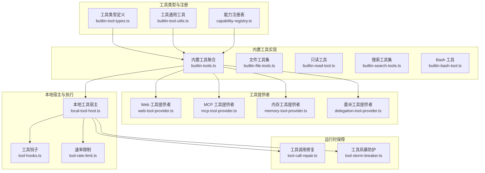
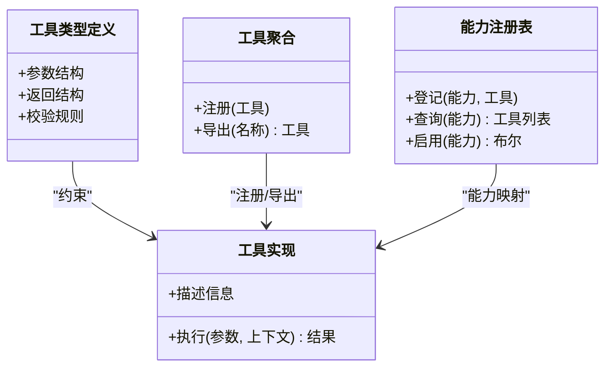
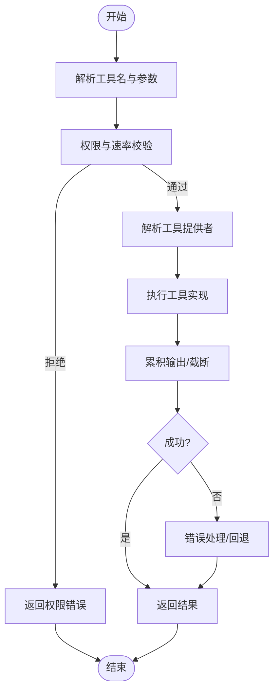
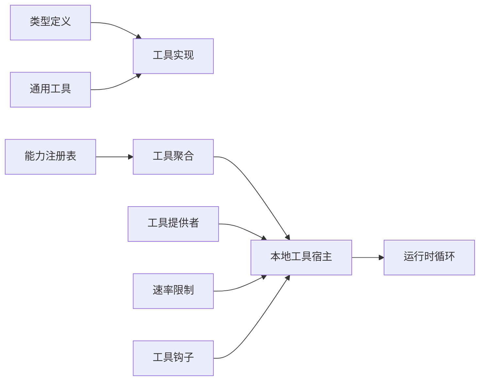

# 工具系统

<cite>
**本文引用的文件**
- [builtin-tools.ts](file://kun/src/adapters/tool/builtin-tools.ts)
- [builtin-tool-types.ts](file://kun/src/adapters/tool/builtin-tool-types.ts)
- [builtin-tool-utils.ts](file://kun/src/adapters/tool/builtin-tool-utils.ts)
- [builtin-tool-utils.test.ts](file://kun/src/adapters/tool/builtin-tool-utils.test.ts)
- [builtin-tool-operations.ts](file://kun/src/adapters/tool/builtin-tool-operations.ts)
- [builtin-file-tools.ts](file://kun/src/adapters/tool/builtin-file-tools.ts)
- [builtin-read-tool.ts](file://kun/src/adapters/tool/builtin-read-tool.ts)
- [builtin-search-tools.ts](file://kun/src/adapters/tool/builtin-search-tools.ts)
- [builtin-bash-tool.ts](file://kun/src/adapters/tool/builtin-bash-tool.ts)
- [bash.ts](file://kun/src/adapters/model/builtin-bash-tool.ts)
- [web-tool-provider.ts](file://kun/src/adapters/tool/web-tool-provider.ts)
- [mcp-tool-provider.ts](file://kun/src/adapters/tool/mcp-tool-provider.ts)
- [mcp-tool-search.ts](file://kun/src/adapters/tool/mcp-tool-search.ts)
- [local-tool-host.ts](file://kun/src/adapters/tool/local-tool-host.ts)
- [capability-registry.ts](file://kun/src/adapters/tool/capability-registry.ts)
- [tool-hooks.ts](file://kun/src/adapters/tool/tool-hooks.ts)
- [tool-rate-limit.ts](file://kun/src/adapters/tool/tool-rate-limit.ts)
- [read.ts](file://kun/src/adapters/tool/read.ts)
- [write.ts](file://kun/src/adapters/tool/write.ts)
- [ls.ts](file://kun/src/adapters/tool/ls.ts)
- [find.ts](file://kun/src/adapters/tool/find.ts)
- [grep.ts](file://kun/src/adapters/tool/grep.ts)
- [edit.ts](file://kun/src/adapters/tool/edit.ts)
- [edit-diff.ts](file://kun/src/adapters/tool/edit-diff.ts)
- [file-mutation-queue.ts](file://kun/src/adapters/tool/file-mutation-queue.ts)
- [memory-tool-provider.ts](file://kun/src/adapters/tool/memory-tool-provider.ts)
- [delegation-tool-provider.ts](file://kun/src/adapters/tool/delegation-tool-provider.ts)
- [create-plan-tool.ts](file://kun/src/adapters/tool/create-plan-tool.ts)
- [goal-tools.ts](file://kun/src/adapters/tool/goal-tools.ts)
- [todo-tools.ts](file://kun/src/adapters/tool/todo-tools.ts)
- [output-accumulator.ts](file://kun/src/adapters/tool/output-accumulator.ts)
- [read-tracker.ts](file://kun/src/adapters/tool/read-tracker.ts)
- [truncate.ts](file://kun/src/adapters/tool/truncate.ts)
- [tool-call-repair.ts](file://kun/src/loop/tool-call-repair.ts)
- [tool-storm-breaker.ts](file://kun/src/loop/tool-storm-breaker.ts)
- [in-memory-approval-gate.ts](file://kun/src/adapters/in-memory-approval-gate.ts)
- [in-memory-user-input-gate.ts](file://kun/src/adapters/in-memory-user-input-gate.ts)
- [ports/tool-host.ts](file://kun/src/ports/tool-host.ts)
- [contracts/capabilities.ts](file://kun/src/contracts/capabilities.ts)
- [contracts/policy.ts](file://kun/src/contracts/policy.ts)
- [contracts/errors.ts](file://kun/src/contracts/errors.ts)
- [cache/tool-catalog-fingerprint.ts](file://kun/src/cache/tool-catalog-fingerprint.ts)
- [config/kun-config.ts](file://kun/src/config/kun-config.ts)
- [tests/builtin-tools.test.ts](file://kun/src/tests/builtin-tools.test.ts)
- [tests/capability-registry.test.ts](file://kun/src/tests/capability-registry.test.ts)
- [tests/mcp-tool-provider.test.ts](file://kun/src/tests/mcp-tool-provider.test.ts)
- [tests/web-tool-provider.test.ts](file://kun/src/tests/web-tool-provider.test.ts)
</cite>

## 目录
1. [简介](#简介)
2. [项目结构](#项目结构)
3. [核心组件](#核心组件)
4. [架构总览](#架构总览)
5. [详细组件分析](#详细组件分析)
6. [依赖关系分析](#依赖关系分析)
7. [性能考量](#性能考量)
8. [故障排查指南](#故障排查指南)
9. [结论](#结论)
10. [附录](#附录)

## 简介
本文件面向 DeepSeek GUI 的工具系统，系统性梳理内置工具集合（文件工具、搜索工具、Bash 工具、Web 工具）、工具注册与执行流程、参数校验与错误处理、MCP 工具提供者集成、本地工具宿主管理、能力注册表、工具调用生命周期与权限控制、性能优化策略，并提供工具开发与扩展指南。目标是帮助开发者快速理解并安全高效地扩展工具生态。

## 项目结构
工具系统主要位于后端适配层的工具目录，围绕“工具类型定义、工具实现、工具提供者、本地宿主、能力注册表”等模块组织，同时在运行时循环层提供工具风暴防护、调用修复等保障机制。



图表来源
- [builtin-tools.ts](file://kun/src/adapters/tool/builtin-tools.ts)
- [builtin-tool-types.ts](file://kun/src/adapters/tool/builtin-tool-types.ts)
- [builtin-tool-utils.ts](file://kun/src/adapters/tool/builtin-tool-utils.ts)
- [capability-registry.ts](file://kun/src/adapters/tool/capability-registry.ts)
- [web-tool-provider.ts](file://kun/src/adapters/tool/web-tool-provider.ts)
- [mcp-tool-provider.ts](file://kun/src/adapters/tool/mcp-tool-provider.ts)
- [memory-tool-provider.ts](file://kun/src/adapters/tool/memory-tool-provider.ts)
- [delegation-tool-provider.ts](file://kun/src/adapters/tool/delegation-tool-provider.ts)
- [local-tool-host.ts](file://kun/src/adapters/tool/local-tool-host.ts)
- [tool-hooks.ts](file://kun/src/adapters/tool/tool-hooks.ts)
- [tool-rate-limit.ts](file://kun/src/adapters/tool/tool-rate-limit.ts)
- [tool-call-repair.ts](file://kun/src/loop/tool-call-repair.ts)
- [tool-storm-breaker.ts](file://kun/src/loop/tool-storm-breaker.ts)

章节来源
- [builtin-tools.ts](file://kun/src/adapters/tool/builtin-tools.ts)
- [builtin-tool-types.ts](file://kun/src/adapters/tool/builtin-tool-types.ts)
- [builtin-tool-utils.ts](file://kun/src/adapters/tool/builtin-tool-utils.ts)
- [capability-registry.ts](file://kun/src/adapters/tool/capability-registry.ts)

## 核心组件
- 工具类型与通用工具：定义工具契约、参数结构、返回格式与通用校验/转换逻辑，确保工具实现的一致性与可测试性。
- 内置工具聚合：集中注册与导出所有内置工具，统一暴露给宿主与提供者。
- 能力注册表：维护工具能力清单与能力声明，支持按需启用与权限控制。
- 工具提供者：抽象外部工具源（Web/MCP/内存/委派），屏蔽不同来源的差异。
- 本地工具宿主：负责工具实例化、参数解析、执行调度、结果归档与错误处理。
- 运行时保障：在循环层对工具调用进行修复与风暴防护，避免异常放大。

章节来源
- [builtin-tool-types.ts](file://kun/src/adapters/tool/builtin-tool-types.ts)
- [builtin-tool-utils.ts](file://kun/src/adapters/tool/builtin-tool-utils.ts)
- [builtin-tools.ts](file://kun/src/adapters/tool/builtin-tools.ts)
- [capability-registry.ts](file://kun/src/adapters/tool/capability-registry.ts)
- [local-tool-host.ts](file://kun/src/adapters/tool/local-tool-host.ts)
- [tool-call-repair.ts](file://kun/src/loop/tool-call-repair.ts)
- [tool-storm-breaker.ts](file://kun/src/loop/tool-storm-breaker.ts)

## 架构总览
工具系统采用“类型定义—工具实现—提供者—宿主执行—运行时保障”的分层架构。工具通过能力注册表声明能力，由宿主统一调度；提供者负责从不同来源获取工具描述与执行器；运行时循环层提供安全与稳定性保障。

```mermaid
sequenceDiagram
participant Agent as "代理/调用方"
participant Host as "本地工具宿主"
participant Prov as "工具提供者"
participant Tool as "具体工具实现"
participant Sec as "权限/速率限制"
participant Loop as "运行时循环"
Agent->>Host : "请求执行工具(名称, 参数)"
Host->>Sec : "校验权限/速率限制"
Sec-->>Host : "允许/拒绝"
Host->>Prov : "解析工具描述/定位实现"
Prov-->>Host : "返回工具执行器"
Host->>Tool : "调用执行(参数, 上下文)"
Tool-->>Host : "返回结果/错误"
Host->>Loop : "记录调用/统计/修复"
Host-->>Agent : "最终结果"
```

图表来源
- [local-tool-host.ts](file://kun/src/adapters/tool/local-tool-host.ts)
- [web-tool-provider.ts](file://kun/src/adapters/tool/web-tool-provider.ts)
- [mcp-tool-provider.ts](file://kun/src/adapters/tool/mcp-tool-provider.ts)
- [tool-rate-limit.ts](file://kun/src/adapters/tool/tool-rate-limit.ts)
- [tool-call-repair.ts](file://kun/src/loop/tool-call-repair.ts)

## 详细组件分析

### 内置工具集合
- 文件工具：提供读写、列出、查找、匹配、编辑、差异等能力，覆盖工作空间内文件操作的常见场景。
- 搜索工具：提供全文检索、模式匹配等能力，支持在工作空间范围内进行内容发现。
- Bash 工具：封装安全的命令执行能力，支持受限环境下的脚本与系统级任务。
- Web 工具：提供基于 HTTP 的工具调用能力，便于访问外部服务或 API。

章节来源
- [builtin-file-tools.ts](file://kun/src/adapters/tool/builtin-file-tools.ts)
- [builtin-read-tool.ts](file://kun/src/adapters/tool/builtin-read-tool.ts)
- [builtin-search-tools.ts](file://kun/src/adapters/tool/builtin-search-tools.ts)
- [builtin-bash-tool.ts](file://kun/src/adapters/tool/builtin-bash-tool.ts)
- [web-tool-provider.ts](file://kun/src/adapters/tool/web-tool-provider.ts)

### 工具注册机制
- 工具类型与契约：通过类型定义约束工具的输入输出、参数结构与行为规范。
- 工具聚合导出：在聚合文件中集中注册并导出工具，便于宿主统一加载。
- 能力注册表：以能力为维度登记工具，支持按能力查询、启用与权限控制。



图表来源
- [builtin-tool-types.ts](file://kun/src/adapters/tool/builtin-tool-types.ts)
- [builtin-tools.ts](file://kun/src/adapters/tool/builtin-tools.ts)
- [capability-registry.ts](file://kun/src/adapters/tool/capability-registry.ts)

章节来源
- [builtin-tool-types.ts](file://kun/src/adapters/tool/builtin-tool-types.ts)
- [builtin-tools.ts](file://kun/src/adapters/tool/builtin-tools.ts)
- [capability-registry.ts](file://kun/src/adapters/tool/capability-registry.ts)

### 工具执行流程
- 请求接收：宿主接收调用请求，解析工具名与参数。
- 权限与速率校验：检查是否具备能力、是否超过速率限制。
- 提供者解析：根据工具名选择合适的提供者（内置/内存/Web/MCP）。
- 执行与归档：调用工具实现，收集输出并进行累积与截断。
- 错误处理与回退：捕获异常并按策略回退或重试。



图表来源
- [local-tool-host.ts](file://kun/src/adapters/tool/local-tool-host.ts)
- [tool-rate-limit.ts](file://kun/src/adapters/tool/tool-rate-limit.ts)
- [output-accumulator.ts](file://kun/src/adapters/tool/output-accumulator.ts)
- [truncate.ts](file://kun/src/adapters/tool/truncate.ts)

章节来源
- [local-tool-host.ts](file://kun/src/adapters/tool/local-tool-host.ts)
- [tool-rate-limit.ts](file://kun/src/adapters/tool/tool-rate-limit.ts)
- [output-accumulator.ts](file://kun/src/adapters/tool/output-accumulator.ts)
- [truncate.ts](file://kun/src/adapters/tool/truncate.ts)

### 工具参数验证与错误处理
- 参数验证：基于类型定义进行强类型校验，必要时进行默认值修复与范围约束。
- 错误分类：区分工具内部错误、权限错误、网络错误、超时错误等。
- 错误恢复：在循环层进行调用修复与风暴防护，避免工具异常导致系统不稳定。

章节来源
- [builtin-tool-utils.ts](file://kun/src/adapters/tool/builtin-tool-utils.ts)
- [tool-call-repair.ts](file://kun/src/loop/tool-call-repair.ts)
- [tool-storm-breaker.ts](file://kun/src/loop/tool-storm-breaker.ts)

### MCP 工具提供者集成
- 描述解析：从 MCP 服务器获取工具描述与能力声明。
- 动态注册：将 MCP 工具动态注册到能力注册表，与内置工具统一管理。
- 安全与隔离：通过宿主侧的权限与速率限制，确保 MCP 工具的安全调用。

章节来源
- [mcp-tool-provider.ts](file://kun/src/adapters/tool/mcp-tool-provider.ts)
- [mcp-tool-search.ts](file://kun/src/adapters/tool/mcp-tool-search.ts)
- [capability-registry.ts](file://kun/src/adapters/tool/capability-registry.ts)

### 本地工具宿主管理
- 实例化与生命周期：负责工具实例的创建、执行与销毁。
- 钩子与拦截：在执行前后注入钩子，支持审计、监控与扩展。
- 输出累积与截断：对工具输出进行累积与截断，避免过大输出影响性能。

章节来源
- [local-tool-host.ts](file://kun/src/adapters/tool/local-tool-host.ts)
- [tool-hooks.ts](file://kun/src/adapters/tool/tool-hooks.ts)
- [output-accumulator.ts](file://kun/src/adapters/tool/output-accumulator.ts)
- [truncate.ts](file://kun/src/adapters/tool/truncate.ts)

### 工具能力注册表
- 能力声明：每个工具声明其能力标签，注册表据此进行能力索引。
- 启用与禁用：支持按能力开关工具，便于灰度与安全控制。
- 查询接口：提供能力查询接口，便于 UI 或策略层展示与决策。

章节来源
- [capability-registry.ts](file://kun/src/adapters/tool/capability-registry.ts)
- [contracts/capabilities.ts](file://kun/src/contracts/capabilities.ts)

### 工具调用生命周期管理
- 生命周期阶段：请求解析→权限校验→提供者解析→执行→结果归档→错误处理→记录统计。
- 循环层保障：在循环层进行调用修复与风暴防护，防止异常传播。
- 审计与追踪：通过读取追踪与输出累积，形成可审计的调用轨迹。

章节来源
- [read-tracker.ts](file://kun/src/adapters/tool/read-tracker.ts)
- [output-accumulator.ts](file://kun/src/adapters/tool/output-accumulator.ts)
- [tool-call-repair.ts](file://kun/src/loop/tool-call-repair.ts)
- [tool-storm-breaker.ts](file://kun/src/loop/tool-storm-breaker.ts)

### 权限控制机制
- 能力授权：通过能力注册表与策略合约，控制工具的启用与调用范围。
- 用户审批门：在需要时引入用户审批门，确保高风险工具的二次确认。
- 输入门控：对用户输入进行门控，避免恶意参数进入工具执行。

章节来源
- [contracts/policy.ts](file://kun/src/contracts/policy.ts)
- [in-memory-approval-gate.ts](file://kun/src/adapters/in-memory-approval-gate.ts)
- [in-memory-user-input-gate.ts](file://kun/src/adapters/in-memory-user-input-gate.ts)

### 性能优化策略
- 输出截断：对工具输出进行截断，降低内存与传输压力。
- 速率限制：对工具调用频率进行限制，避免资源争用。
- 缓存指纹：通过工具目录指纹缓存，减少重复解析成本。
- 并发与队列：对文件变更等操作使用队列，保证顺序与一致性。

章节来源
- [truncate.ts](file://kun/src/adapters/tool/truncate.ts)
- [tool-rate-limit.ts](file://kun/src/adapters/tool/tool-rate-limit.ts)
- [cache/tool-catalog-fingerprint.ts](file://kun/src/cache/tool-catalog-fingerprint.ts)
- [file-mutation-queue.ts](file://kun/src/adapters/tool/file-mutation-queue.ts)

### 工具开发指南与扩展方法
- 新建工具步骤
  - 定义工具类型与参数结构，确保与类型定义一致。
  - 实现工具执行逻辑，遵循参数校验与错误处理约定。
  - 在工具聚合文件中注册工具，并在能力注册表中声明能力。
  - 如需外部集成，实现对应提供者（Web/MCP/内存/委派）。
- 测试建议
  - 使用工具通用工具进行参数校验与边界测试。
  - 编写单元测试覆盖正常路径与异常路径。
  - 对提供者与宿主交互进行集成测试，确保端到端可用。
- 安全与合规
  - 严格遵守权限与速率限制策略。
  - 对外部调用进行最小权限设计与输入门控。
  - 在循环层开启调用修复与风暴防护，提升鲁棒性。

章节来源
- [builtin-tool-types.ts](file://kun/src/adapters/tool/builtin-tool-types.ts)
- [builtin-tool-utils.ts](file://kun/src/adapters/tool/builtin-tool-utils.ts)
- [builtin-tools.ts](file://kun/src/adapters/tool/builtin-tools.ts)
- [capability-registry.ts](file://kun/src/adapters/tool/capability-registry.ts)
- [web-tool-provider.ts](file://kun/src/adapters/tool/web-tool-provider.ts)
- [mcp-tool-provider.ts](file://kun/src/adapters/tool/mcp-tool-provider.ts)
- [memory-tool-provider.ts](file://kun/src/adapters/tool/memory-tool-provider.ts)
- [delegation-tool-provider.ts](file://kun/src/adapters/tool/delegation-tool-provider.ts)

## 依赖关系分析
工具系统各模块之间存在清晰的依赖关系：类型定义与通用工具为实现层提供契约与支撑；聚合与注册表负责编排；提供者与宿主负责执行；循环层提供安全与稳定性保障。



图表来源
- [builtin-tool-types.ts](file://kun/src/adapters/tool/builtin-tool-types.ts)
- [builtin-tool-utils.ts](file://kun/src/adapters/tool/builtin-tool-utils.ts)
- [capability-registry.ts](file://kun/src/adapters/tool/capability-registry.ts)
- [builtin-tools.ts](file://kun/src/adapters/tool/builtin-tools.ts)
- [local-tool-host.ts](file://kun/src/adapters/tool/local-tool-host.ts)
- [tool-rate-limit.ts](file://kun/src/adapters/tool/tool-rate-limit.ts)
- [tool-hooks.ts](file://kun/src/adapters/tool/tool-hooks.ts)
- [tool-call-repair.ts](file://kun/src/loop/tool-call-repair.ts)
- [tool-storm-breaker.ts](file://kun/src/loop/tool-storm-breaker.ts)

章节来源
- [builtin-tool-types.ts](file://kun/src/adapters/tool/builtin-tool-types.ts)
- [builtin-tool-utils.ts](file://kun/src/adapters/tool/builtin-tool-utils.ts)
- [capability-registry.ts](file://kun/src/adapters/tool/capability-registry.ts)
- [builtin-tools.ts](file://kun/src/adapters/tool/builtin-tools.ts)
- [local-tool-host.ts](file://kun/src/adapters/tool/local-tool-host.ts)
- [tool-rate-limit.ts](file://kun/src/adapters/tool/tool-rate-limit.ts)
- [tool-hooks.ts](file://kun/src/adapters/tool/tool-hooks.ts)
- [tool-call-repair.ts](file://kun/src/loop/tool-call-repair.ts)
- [tool-storm-breaker.ts](file://kun/src/loop/tool-storm-breaker.ts)

## 性能考量
- 输出截断与累积：对工具输出进行截断与累积，避免大输出拖慢系统。
- 速率限制：对工具调用频率进行限制，防止资源争用与过载。
- 缓存与指纹：通过工具目录指纹缓存，减少重复解析与构建成本。
- 队列化与顺序化：对文件变更等操作使用队列，保证顺序与一致性，降低并发冲突。

章节来源
- [truncate.ts](file://kun/src/adapters/tool/truncate.ts)
- [output-accumulator.ts](file://kun/src/adapters/tool/output-accumulator.ts)
- [tool-rate-limit.ts](file://kun/src/adapters/tool/tool-rate-limit.ts)
- [cache/tool-catalog-fingerprint.ts](file://kun/src/cache/tool-catalog-fingerprint.ts)
- [file-mutation-queue.ts](file://kun/src/adapters/tool/file-mutation-queue.ts)

## 故障排查指南
- 常见问题
  - 工具不可用：检查能力注册表是否启用该能力，确认工具是否正确注册。
  - 权限不足：核对策略与审批门设置，确认调用方具备相应权限。
  - 超时或失败：查看速率限制与风暴防护策略，确认是否存在异常风暴。
  - 输出过大：检查截断与累积策略，确认是否需要调整阈值。
- 排查步骤
  - 查看宿主日志与错误记录，定位失败点。
  - 核对工具参数与类型定义，确认参数合法性。
  - 检查提供者连接状态与认证信息（如 Web/MCP）。
  - 在循环层启用更严格的修复与防护策略，观察系统稳定性。

章节来源
- [contracts/errors.ts](file://kun/src/contracts/errors.ts)
- [tool-call-repair.ts](file://kun/src/loop/tool-call-repair.ts)
- [tool-storm-breaker.ts](file://kun/src/loop/tool-storm-breaker.ts)
- [in-memory-approval-gate.ts](file://kun/src/adapters/in-memory-approval-gate.ts)
- [in-memory-user-input-gate.ts](file://kun/src/adapters/in-memory-user-input-gate.ts)

## 结论
DeepSeek GUI 的工具系统通过类型定义、能力注册表、提供者与本地宿主的协同，实现了统一、安全、可扩展的工具生态。结合运行时循环层的修复与防护机制，系统在功能丰富的同时保持了稳定性与安全性。开发者可依据本文档提供的指南，快速扩展自定义工具并安全集成到系统中。

## 附录
- 配置参考
  - 工具能力开关与策略：通过能力注册表与策略合约进行配置。
  - MCP 工具提供者：在提供者层配置 MCP 服务器地址与认证。
  - 速率限制与风暴防护：在宿主与循环层进行参数化配置。
- 测试参考
  - 单元测试：覆盖工具类型校验、参数修复与错误处理。
  - 集成测试：覆盖提供者解析、宿主执行与循环层修复。

章节来源
- [config/kun-config.ts](file://kun/src/config/kun-config.ts)
- [tests/builtin-tools.test.ts](file://kun/src/tests/builtin-tools.test.ts)
- [tests/capability-registry.test.ts](file://kun/src/tests/capability-registry.test.ts)
- [tests/mcp-tool-provider.test.ts](file://kun/src/tests/mcp-tool-provider.test.ts)
- [tests/web-tool-provider.test.ts](file://kun/src/tests/web-tool-provider.test.ts)