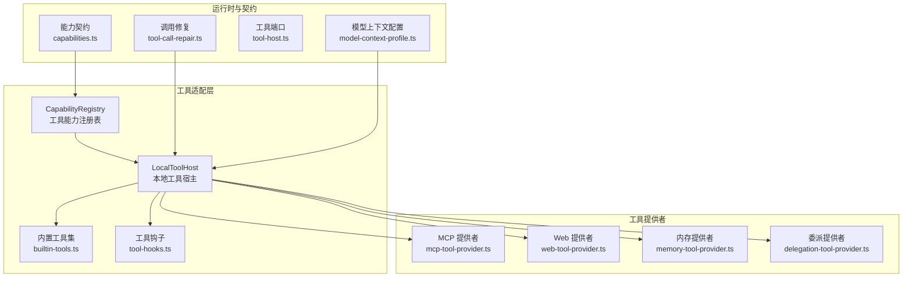
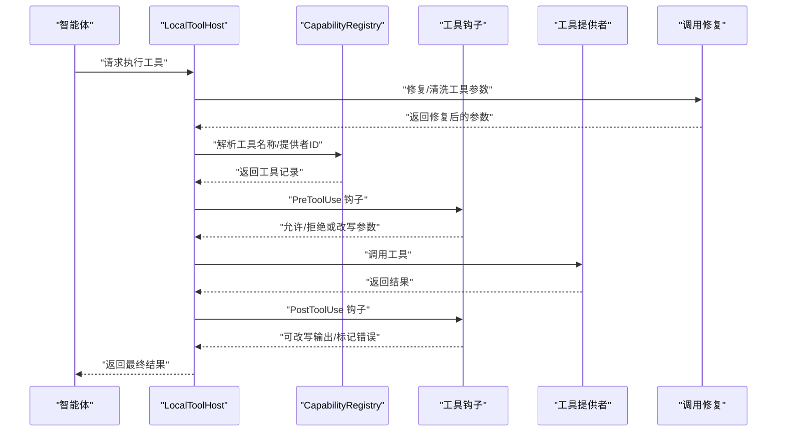
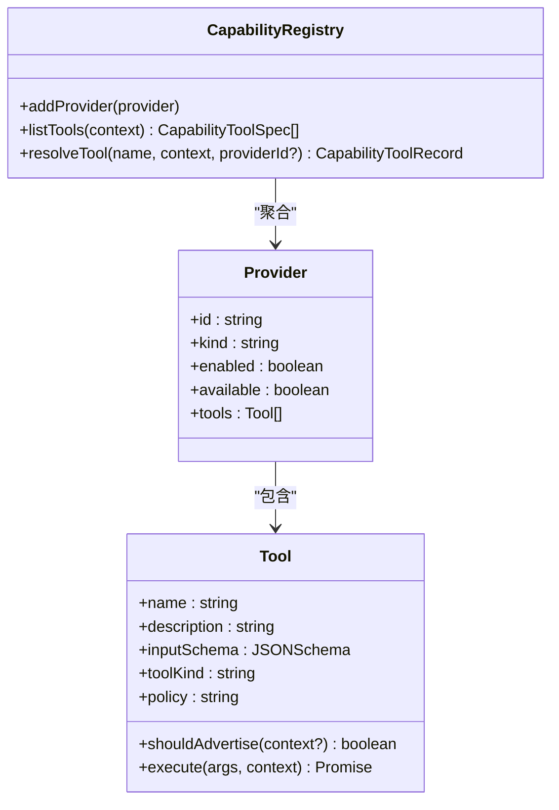
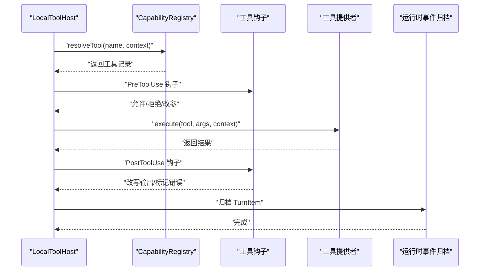
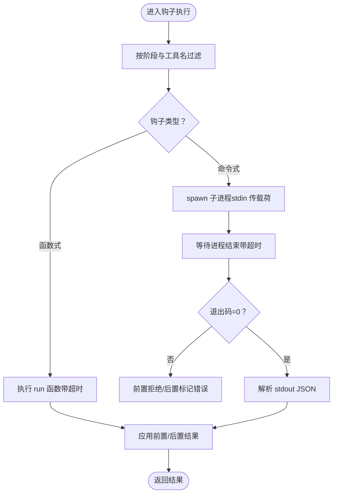
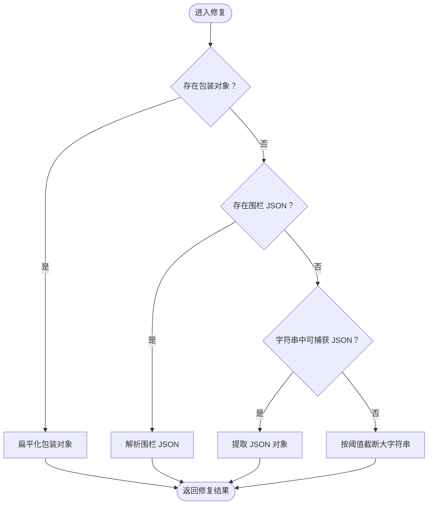
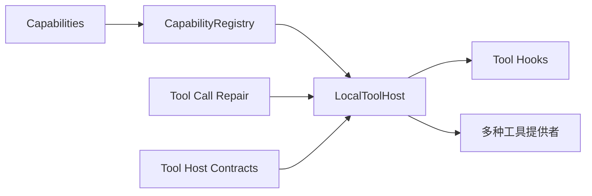

# 工具能力注册表

<cite>
**本文引用的文件**
- [capability-registry.ts](file://kun/src/adapters/tool/capability-registry.ts)
- [capability-registry.test.ts](file://kun/tests/capability-registry.test.ts)
- [tool-hooks.ts](file://kun/src/adapters/tool/tool-hooks.ts)
- [local-tool-host.ts](file://kun/src/adapters/tool/local-tool-host.ts)
- [tool-call-repair.ts](file://kun/src/loop/tool-call-repair.ts)
- [tool-call-repair.test.ts](file://kun/tests/tool-call-repair.test.ts)
- [capabilities.ts](file://kun/src/contracts/capabilities.ts)
- [builtin-tools.ts](file://kun/src/adapters/tool/builtin-tools.ts)
- [builtin-tool-operations.ts](file://kun/src/adapters/tool/builtin-tool-operations.ts)
- [builtin-tool-utils.ts](file://kun/src/adapters/tool/builtin-tool-utils.ts)
- [mcp-tool-provider.ts](file://kun/src/adapters/tool/mcp-tool-provider.ts)
- [memory-tool-provider.ts](file://kun/src/adapters/tool/memory-tool-provider.ts)
- [web-tool-provider.ts](file://kun/src/adapters/tool/web-tool-provider.ts)
- [delegation-tool-provider.ts](file://kun/src/adapters/tool/delegation-tool-provider.ts)
- [index.ts](file://kun/src/adapters/tool/index.ts)
- [tool-host.ts](file://kun/src/ports/tool-host.ts)
- [runtime-event-reducer.ts](file://kun/src/domain/runtime-event-reducer.ts)
- [in-memory-event-bus.ts](file://kun/src/in-memory-event-bus.ts)
- [model-context-profile.ts](file://kun/src/loop/model-context-profile.ts)
</cite>

## 目录
1. [简介](#简介)
2. [项目结构](#项目结构)
3. [核心组件](#核心组件)
4. [架构总览](#架构总览)
5. [详细组件分析](#详细组件分析)
6. [依赖关系分析](#依赖关系分析)
7. [性能考虑](#性能考虑)
8. [故障排查指南](#故障排查指南)
9. [结论](#结论)
10. [附录](#附录)

## 简介
本技术文档围绕 DeepSeek GUI 的工具能力注册表系统展开，系统性阐述工具能力注册表的设计架构、注册机制、查询算法；深入说明工具能力的分类体系、元数据管理、版本控制；解释工具钩子（Hooks）的实现原理、生命周期管理、事件触发机制；介绍工具调用修复（Tool Call Repair）的策略、错误检测、自动纠正机制；并提供工具能力注册的 API 接口、配置格式、扩展方法，涵盖动态更新、热插拔支持与兼容性保证，以及注册表与智能体决策系统的集成方式与性能优化策略。

## 项目结构
工具能力注册表相关代码主要位于以下模块：
- 注册表与工具宿主：capability-registry.ts、local-tool-host.ts、builtin-tools.ts、builtin-tool-operations.ts、builtin-tool-utils.ts
- 钩子系统：tool-hooks.ts
- 调用修复：tool-call-repair.ts
- 能力契约与状态：capabilities.ts
- 多种工具提供者：mcp-tool-provider.ts、memory-tool-provider.ts、web-tool-provider.ts、delegation-tool-provider.ts
- 工具端口定义：tool-host.ts
- 运行时事件与上下文：runtime-event-reducer.ts、in-memory-event-bus.ts、model-context-profile.ts

图表来源
- [capability-registry.ts:1-120](file://kun/src/adapters/tool/capability-registry.ts#L1-L120)
- [local-tool-host.ts:100-160](file://kun/src/adapters/tool/local-tool-host.ts#L100-L160)
- [tool-hooks.ts:1-162](file://kun/src/adapters/tool/tool-hooks.ts#L1-L162)
- [mcp-tool-provider.ts:1-200](file://kun/src/adapters/tool/mcp-tool-provider.ts#L1-L200)
- [web-tool-provider.ts:1-200](file://kun/src/adapters/tool/web-tool-provider.ts#L1-L200)
- [memory-tool-provider.ts:1-200](file://kun/src/adapters/tool/memory-tool-provider.ts#L1-L200)
- [delegation-tool-provider.ts:1-200](file://kun/src/adapters/tool/delegation-tool-provider.ts#L1-L200)
- [tool-call-repair.ts:1-200](file://kun/src/loop/tool-call-repair.ts#L1-L200)
- [capabilities.ts:350-450](file://kun/src/contracts/capabilities.ts#L350-L450)
- [tool-host.ts:1-200](file://kun/src/ports/tool-host.ts#L1-L200)
- [model-context-profile.ts:1-200](file://kun/src/loop/model-context-profile.ts#L1-L200)

章节来源
- [capability-registry.ts:1-120](file://kun/src/adapters/tool/capability-registry.ts#L1-L120)
- [local-tool-host.ts:100-160](file://kun/src/adapters/tool/local-tool-host.ts#L100-L160)
- [tool-hooks.ts:1-162](file://kun/src/adapters/tool/tool-hooks.ts#L1-L162)
- [tool-call-repair.ts:1-200](file://kun/src/loop/tool-call-repair.ts#L1-L200)
- [capabilities.ts:350-450](file://kun/src/contracts/capabilities.ts#L350-L450)
- [tool-host.ts:1-200](file://kun/src/ports/tool-host.ts#L1-L200)
- [model-context-profile.ts:1-200](file://kun/src/loop/model-context-profile.ts#L1-L200)

## 核心组件
- 工具能力注册表（CapabilityRegistry）
  - 负责聚合多来源工具提供者，统一管理工具名称去重、可用性检查、工具规格导出与解析
  - 支持从本地内置工具构建初始注册表，并可追加外部提供者（如 MCP、Web、内存、委派）
- 本地工具宿主（LocalToolHost）
  - 实现工具调用的执行流程：解析工具、执行前置钩子、读写追踪、执行工具、后置钩子、结果归档
  - 对外暴露 listTools 与 execute 接口，作为智能体与工具系统的唯一入口
- 工具钩子（Tool Hooks）
  - 定义 PreToolUse 与 PostToolUse 两个阶段，支持函数式与命令式两种钩子实现
  - 提供超时控制、拒绝/允许决策、参数与输出改写、错误标记等能力
- 工具调用修复（Tool Call Repair）
  - 针对模型输出的工具调用参数进行清洗、扁平化、JSON 捕获、字符串截断等策略
  - 降低因格式不规范导致的调用失败率
- 能力契约与状态（Capabilities）
  - 定义工具能力的状态机（可用/不可用/禁用），以及不同提供者（本地、Web、技能等）的能力组合逻辑
- 工具提供者（Providers）
  - 内置工具（Builtin）、MCP、Web、内存（Memory）、委派（Delegation）等，分别通过各自提供者实现能力发现与调用

章节来源
- [capability-registry.ts:49-86](file://kun/src/adapters/tool/capability-registry.ts#L49-L86)
- [local-tool-host.ts:106-143](file://kun/src/adapters/tool/local-tool-host.ts#L106-L143)
- [tool-hooks.ts:40-87](file://kun/src/adapters/tool/tool-hooks.ts#L40-L87)
- [tool-call-repair.ts:1-200](file://kun/src/loop/tool-call-repair.ts#L1-L200)
- [capabilities.ts:399-436](file://kun/src/contracts/capabilities.ts#L399-L436)
- [builtin-tools.ts:1-200](file://kun/src/adapters/tool/builtin-tools.ts#L1-L200)

## 架构总览
注册表系统采用“提供者聚合 + 宿主执行”的分层架构。注册表负责工具元数据的统一管理与导出；宿主负责在具体上下文中解析工具、执行钩子、调用提供者并处理结果；修复器在调用前对参数进行健壮性处理；钩子提供安全与可观测性的扩展点。

图表来源
- [local-tool-host.ts:106-143](file://kun/src/adapters/tool/local-tool-host.ts#L106-L143)
- [capability-registry.ts:81-120](file://kun/src/adapters/tool/capability-registry.ts#L81-L120)
- [tool-hooks.ts:40-87](file://kun/src/adapters/tool/tool-hooks.ts#L40-L87)
- [tool-call-repair.ts:1-200](file://kun/src/loop/tool-call-repair.ts#L1-L200)

## 详细组件分析

### 组件一：工具能力注册表（CapabilityRegistry）
- 设计要点
  - 提供者去重与工具名称去重：注册表在添加提供者与工具时进行冲突校验，避免重复名称与重复提供者 ID
  - 可用性与策略：根据上下文（线程/回合/工作区/模型能力）判断提供者与工具是否可用
  - 规格导出：listTools 返回标准化的 CapabilityToolSpec，包含工具名、描述、输入模式、工具类型、提供者信息
  - 解析定位：resolveTool 支持按名称与可选提供者 ID 精确解析，用于后续宿主执行
- 数据结构与复杂度
  - 提供者映射：O(1) 插入/查找
  - 工具映射：O(1) 插入/查找
  - 列表导出：O(N) 遍历工具集合
- 错误处理
  - 重复提供者/工具名抛出异常
  - 未知工具名抛出异常
- 性能与优化
  - 使用 Map 结构存储提供者与工具，保证常数级访问
  - 列表导出时按需过滤，避免不必要的对象构造

图表来源
- [capability-registry.ts:49-86](file://kun/src/adapters/tool/capability-registry.ts#L49-L86)
- [capability-registry.ts:81-120](file://kun/src/adapters/tool/capability-registry.ts#L81-L120)

章节来源
- [capability-registry.ts:49-86](file://kun/src/adapters/tool/capability-registry.ts#L49-L86)
- [capability-registry.ts:61-79](file://kun/src/adapters/tool/capability-registry.ts#L61-L79)
- [capability-registry.ts:81-120](file://kun/src/adapters/tool/capability-registry.ts#L81-L120)
- [capability-registry.test.ts:23-69](file://kun/tests/capability-registry.test.ts#L23-L69)

### 组件二：本地工具宿主（LocalToolHost）
- 设计要点
  - 执行流程：解析工具 -> 前置钩子 -> 读写追踪验证 -> 执行工具 -> 后置钩子 -> 结果归档
  - 审批与中止：支持上下文中的审批策略与中断信号
  - 错误归档：将钩子失败、拒绝、工具执行错误等统一转化为 TurnItem 并归档
- 关键接口
  - listTools(context)：基于注册表导出可用工具清单
  - execute(call, context)：执行单次工具调用并返回结果
- 生命周期与事件
  - 通过钩子系统在调用前后注入横切逻辑
  - 通过事件归档与运行时事件减少器记录工具使用轨迹

图表来源
- [local-tool-host.ts:106-143](file://kun/src/adapters/tool/local-tool-host.ts#L106-L143)
- [tool-hooks.ts:40-87](file://kun/src/adapters/tool/tool-hooks.ts#L40-L87)
- [runtime-event-reducer.ts:1-200](file://kun/src/domain/runtime-event-reducer.ts#L1-L200)

章节来源
- [local-tool-host.ts:106-143](file://kun/src/adapters/tool/local-tool-host.ts#L106-L143)
- [local-tool-host.ts:144-200](file://kun/src/adapters/tool/local-tool-host.ts#L144-L200)
- [runtime-event-reducer.ts:1-200](file://kun/src/domain/runtime-event-reducer.ts#L1-L200)

### 组件三：工具钩子（Tool Hooks）
- 类型与阶段
  - 阶段：PreToolUse（调用前）、PostToolUse（调用后）
  - 形式：函数式钩子（run）与命令式钩子（command）
- 执行与匹配
  - 过滤匹配：按阶段与工具名白名单匹配
  - 超时控制：默认 5 秒，防止阻塞
  - 结果应用：前置钩子可拒绝或改写参数；后置钩子可改写输出并标记错误
- 命令式钩子
  - 通过子进程执行外部命令，标准输入传递调用载荷，标准输出接收 JSON 结果
  - 异常处理：非零退出码视为错误，stderr 作为错误消息

图表来源
- [tool-hooks.ts:40-87](file://kun/src/adapters/tool/tool-hooks.ts#L40-L87)
- [tool-hooks.ts:105-148](file://kun/src/adapters/tool/tool-hooks.ts#L105-L148)

章节来源
- [tool-hooks.ts:1-162](file://kun/src/adapters/tool/tool-hooks.ts#L1-L162)

### 组件四：工具调用修复（Tool Call Repair）
- 目标与策略
  - 将模型输出的工具调用参数进行健壮性修复，提升成功率
  - 包括：扁平化包装对象、解析围栏 JSON、从字符串中抓取 JSON、大字符串截断等
- 参数与行为
  - 支持传入最大字符串字节限制，避免过长输入影响性能
  - 返回修复后的参数与修复说明（notes）

图表来源
- [tool-call-repair.ts:1-200](file://kun/src/loop/tool-call-repair.ts#L1-L200)
- [tool-call-repair.test.ts:1-38](file://kun/tests/tool-call-repair.test.ts#L1-L38)

章节来源
- [tool-call-repair.ts:1-200](file://kun/src/loop/tool-call-repair.ts#L1-L200)
- [tool-call-repair.test.ts:1-38](file://kun/tests/tool-call-repair.test.ts#L1-L38)

### 组件五：能力分类与状态（Capabilities）
- 分类体系
  - 提供者类别：built-in（内置）、web（网络）、memory（内存）、delegation（委派）、mcp（MCP）
  - 工具类别：由工具定义决定（如 read、write、search 等）
- 状态机
  - disabled：显式禁用
  - unavailable：启用但不可用（原因可选）
  - available：完全可用
- 组合逻辑
  - Web 能力：当 fetch 或 search 提供者可用时为 available，否则 unavailable
  - 技能能力：根据发现的技能数量与配置决定可用性

章节来源
- [capabilities.ts:399-436](file://kun/src/contracts/capabilities.ts#L399-L436)
- [capabilities.ts:433-436](file://kun/src/contracts/capabilities.ts#L433-L436)

### 组件六：工具提供者（Providers）
- 内置工具（Builtin）
  - 提供基础文件读写、搜索、计划生成等常用能力
  - 通过 builtin-tools.ts 定义，配合 builtin-tool-operations.ts 与 utils.ts 实现
- MCP 工具提供者
  - 通过 MCP 协议动态发现与调用第三方工具
  - 支持连接复用、刷新目录、异常恢复
- Web 工具提供者
  - 提供网络访问能力（fetch/search），受能力状态与策略控制
- 内存工具提供者
  - 提供基于内存的临时工具集合
- 委派工具提供者
  - 将工具调用委派给其他代理或服务

章节来源
- [builtin-tools.ts:1-200](file://kun/src/adapters/tool/builtin-tools.ts#L1-L200)
- [builtin-tool-operations.ts:1-200](file://kun/src/adapters/tool/builtin-tool-operations.ts#L1-L200)
- [builtin-tool-utils.ts:1-200](file://kun/src/adapters/tool/builtin-tool-utils.ts#L1-L200)
- [mcp-tool-provider.ts:1-200](file://kun/src/adapters/tool/mcp-tool-provider.ts#L1-L200)
- [web-tool-provider.ts:1-200](file://kun/src/adapters/tool/web-tool-provider.ts#L1-L200)
- [memory-tool-provider.ts:1-200](file://kun/src/adapters/tool/memory-tool-provider.ts#L1-L200)
- [delegation-tool-provider.ts:1-200](file://kun/src/adapters/tool/delegation-tool-provider.ts#L1-L200)

## 依赖关系分析
- 注册表依赖于各工具提供者提供的工具集合
- 宿主依赖于注册表解析工具，并通过钩子系统与提供者交互
- 修复器在宿主执行前介入，降低调用失败概率
- 能力契约为注册表与宿主提供统一的状态与可用性判定依据

图表来源
- [capability-registry.ts:49-86](file://kun/src/adapters/tool/capability-registry.ts#L49-L86)
- [local-tool-host.ts:106-143](file://kun/src/adapters/tool/local-tool-host.ts#L106-L143)
- [tool-hooks.ts:40-87](file://kun/src/adapters/tool/tool-hooks.ts#L40-L87)
- [tool-call-repair.ts:1-200](file://kun/src/loop/tool-call-repair.ts#L1-L200)
- [capabilities.ts:399-436](file://kun/src/contracts/capabilities.ts#L399-L436)
- [tool-host.ts:1-200](file://kun/src/ports/tool-host.ts#L1-L200)

章节来源
- [capability-registry.ts:49-86](file://kun/src/adapters/tool/capability-registry.ts#L49-L86)
- [local-tool-host.ts:106-143](file://kun/src/adapters/tool/local-tool-host.ts#L106-L143)
- [tool-hooks.ts:40-87](file://kun/src/adapters/tool/tool-hooks.ts#L40-L87)
- [tool-call-repair.ts:1-200](file://kun/src/loop/tool-call-repair.ts#L1-L200)
- [capabilities.ts:399-436](file://kun/src/contracts/capabilities.ts#L399-L436)
- [tool-host.ts:1-200](file://kun/src/ports/tool-host.ts#L1-L200)

## 性能考虑
- 常数级访问：注册表内部使用 Map，工具与提供者的查找为 O(1)
- 列表导出：仅遍历已注册工具，过滤条件简单，整体 O(N)
- 钩子超时：默认 5 秒，避免长时间阻塞；命令式钩子退出码非零即快速失败
- 修复策略：在宿主执行前进行轻量修复，减少无效调用次数
- 上下文感知：结合模型上下文配置与能力状态，提前过滤不可用工具，减少无效尝试

## 故障排查指南
- 工具未找到
  - 检查工具名称是否正确，确认注册表中是否存在该工具
  - 若指定提供者 ID，请确认该工具确实存在于对应提供者中
- 重复工具名/提供者 ID
  - 注册表会拒绝重复名称与重复提供者 ID，需调整提供者或工具命名
- 钩子失败
  - 前置钩子可直接拒绝调用；后置钩子可标记错误但不阻止返回
  - 命令式钩子若退出码非零，查看 stderr 获取错误信息
- 调用修复无效
  - 确认输入是否符合预期格式；必要时手动提供更明确的参数
- 能力状态异常
  - 检查能力契约配置，确认提供者是否被启用且可用

章节来源
- [capability-registry.test.ts:38-51](file://kun/tests/capability-registry.test.ts#L38-L51)
- [tool-hooks.ts:134-148](file://kun/src/adapters/tool/tool-hooks.ts#L134-L148)
- [tool-call-repair.test.ts:1-38](file://kun/tests/tool-call-repair.test.ts#L1-L38)
- [capabilities.ts:417-431](file://kun/src/contracts/capabilities.ts#L417-L431)

## 结论
工具能力注册表系统通过“提供者聚合 + 宿主执行 + 钩子扩展 + 修复增强”的设计，在保证安全性与可观测性的同时，提供了高可用、可扩展、可维护的工具能力管理方案。其模块化结构便于动态更新与热插拔，结合能力契约与上下文感知，能够有效支撑智能体的工具决策与执行。

## 附录

### API 与配置要点
- 注册表 API
  - addProvider(provider)：添加提供者（含工具集合）
  - listTools(context)：导出可用工具规格
  - resolveTool(name, context, providerId?)：解析工具记录
- 宿主 API
  - listTools(context)：列出可用工具
  - execute(call, context)：执行工具调用
- 钩子配置
  - 阶段：PreToolUse / PostToolUse
  - 形式：run 函数式或 command 命令式
  - 超时：默认 5000ms
- 调用修复
  - 支持扁平化、解析围栏 JSON、字符串抓取、大字符串截断
  - 可设置最大字符串字节限制

章节来源
- [capability-registry.ts:49-86](file://kun/src/adapters/tool/capability-registry.ts#L49-L86)
- [capability-registry.ts:61-79](file://kun/src/adapters/tool/capability-registry.ts#L61-L79)
- [capability-registry.ts:81-120](file://kun/src/adapters/tool/capability-registry.ts#L81-L120)
- [local-tool-host.ts:106-143](file://kun/src/adapters/tool/local-tool-host.ts#L106-L143)
- [tool-hooks.ts:40-87](file://kun/src/adapters/tool/tool-hooks.ts#L40-L87)
- [tool-call-repair.ts:1-200](file://kun/src/loop/tool-call-repair.ts#L1-L200)