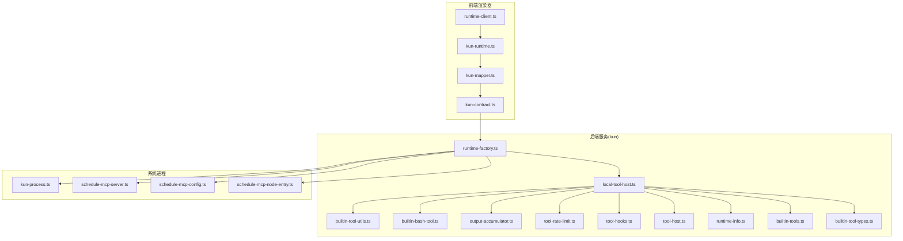
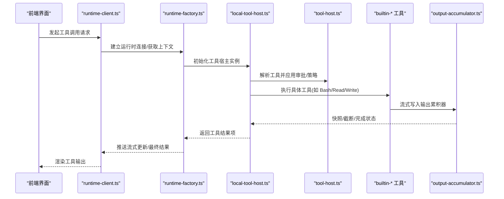
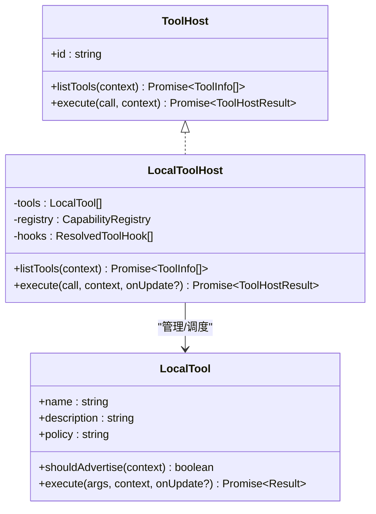
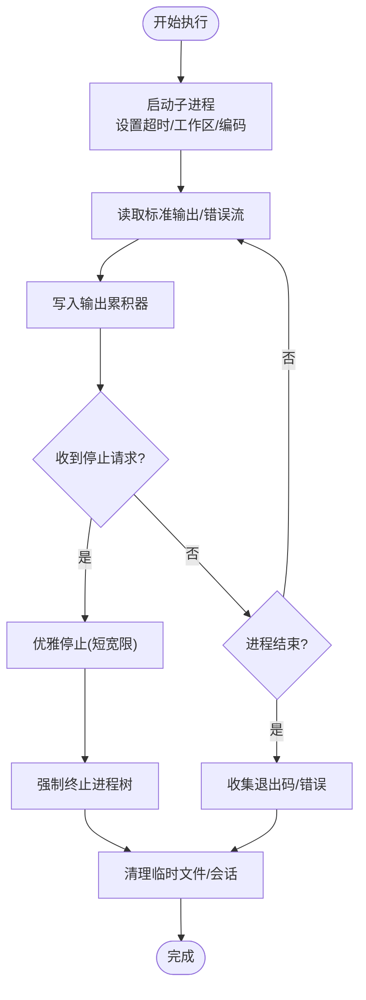
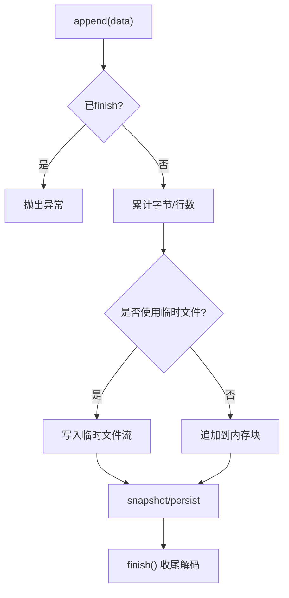
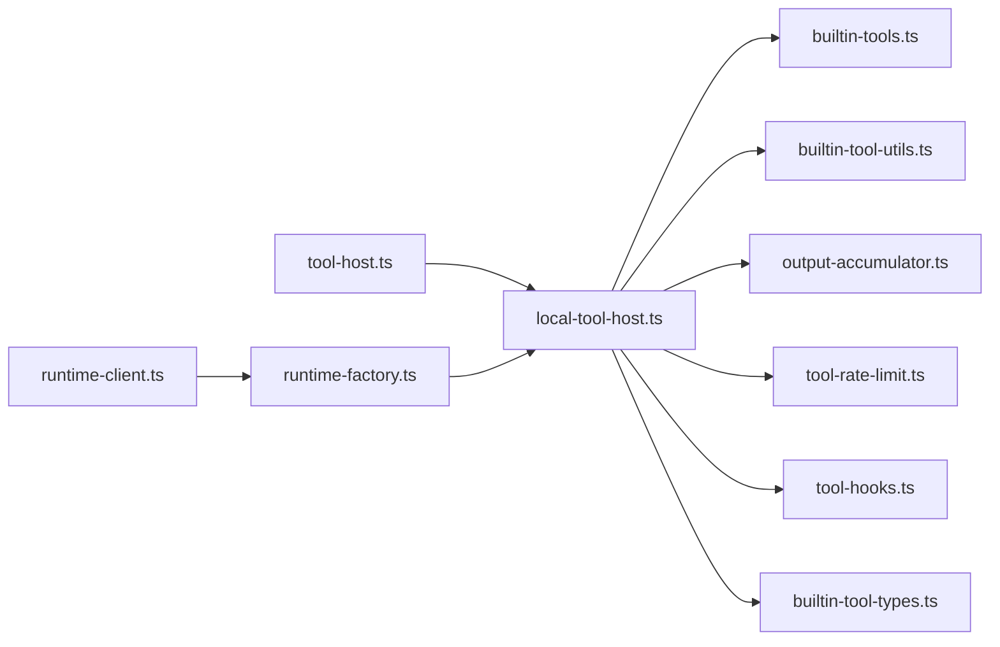

# 本地工具宿主管理

<cite>
**本文引用的文件**
- [local-tool-host.ts](file://kun/src/adapters/tool/local-tool-host.ts)
- [builtin-tool-utils.ts](file://kun/src/adapters/tool/builtin-tool-utils.ts)
- [builtin-bash-tool.ts](file://kun/src/adapters/tool/builtin-bash-tool.ts)
- [output-accumulator.ts](file://kun/src/adapters/tool/output-accumulator.ts)
- [tool-rate-limit.ts](file://kun/src/adapters/tool/tool-rate-limit.ts)
- [tool-hooks.ts](file://kun/src/adapters/tool/tool-hooks.ts)
- [tool-argument-repair.ts](file://kun/src/adapters/model/tool-argument-repair.ts)
- [tool-host.ts](file://kun/src/ports/tool-host.ts)
- [runtime-info.ts](file://kun/src/contracts/runtime-info.ts)
- [builtin-tools.ts](file://kun/src/adapters/tool/builtin-tools.ts)
- [builtin-tool-types.ts](file://kun/src/adapters/tool/builtin-tool-types.ts)
- [builtin-read-tool.ts](file://kun/src/adapters/tool/builtin-read-tool.ts)
- [builtin-file-tools.ts](file://kun/src/adapters/tool/builtin-file-tools.ts)
- [builtin-search-tools.ts](file://kun/src/adapters/tool/builtin-search-tools.ts)
- [builtin-tool-operations.ts](file://kun/src/adapters/tool/builtin-tool-operations.ts)
- [builtin-tool-utils.test.ts](file://kun/tests/builtin-tools.test.ts)
- [output-accumulator.test.ts](file://kun/tests/output-accumulator.test.ts)
- [builtin-tools.test.ts](file://kun/tests/builtin-tools.test.ts)
- [delegation-runtime.test.ts](file://kun/tests/delegation-runtime.test.ts)
- [kun-config.ts](file://kun/src/config/kun-config.ts)
- [runtime-factory.ts](file://kun/src/server/runtime-factory.ts)
- [agent-loop.ts](file://kun/src/loop/agent-loop.ts)
- [kun-runtime.ts](file://src/renderer/src/agent/kun-runtime.ts)
- [kun-mapper.ts](file://src/renderer/src/agent/kun-mapper.ts)
- [kun-contract.ts](file://src/renderer/src/agent/kun-contract.ts)
- [runtime-client.ts](file://src/renderer/src/agent/runtime-client.ts)
- [kun-process.ts](file://src/main/kun-process.ts)
- [schedule-runtime.ts](file://src/main/schedule-runtime.ts)
- [schedule-mcp-server.ts](file://src/main/claw-schedule-mcp-server.ts)
- [schedule-mcp-config.ts](file://src/main/claw-schedule-mcp-config.ts)
- [schedule-mcp-node-entry.ts](file://src/main/claw-schedule-mcp-node-entry.ts)
</cite>

## 目录
1. [简介](#简介)
2. [项目结构](#项目结构)
3. [核心组件](#核心组件)
4. [架构总览](#架构总览)
5. [详细组件分析](#详细组件分析)
6. [依赖关系分析](#依赖关系分析)
7. [性能考量](#性能考量)
8. [故障排查指南](#故障排查指南)
9. [结论](#结论)
10. [附录](#附录)

## 简介
本文件面向 DeepSeek GUI 的“本地工具宿主”子系统，系统性阐述其启动流程、进程管理、资源分配与隔离策略、安全沙箱与权限控制、速率限制与并发控制、资源配额管理、输出累积器与流式输出处理、结果聚合策略、配置参数与性能调优、监控指标采集、失败处理与重试/降级策略，以及与智能体循环的集成与通信协议。

## 项目结构
本地工具宿主位于后端运行时（kun）适配层，围绕“工具注册与发现—执行边界—进程与输出—速率限制—钩子与审批—结果聚合”的闭环组织代码；前端通过渲染器侧的运行时客户端与后端 SSE/HTTP 交互，驱动工具调用与流式结果展示。



图表来源
- [runtime-client.ts](file://src/renderer/src/agent/runtime-client.ts)
- [kun-runtime.ts](file://src/renderer/src/agent/kun-runtime.ts)
- [kun-mapper.ts](file://src/renderer/src/agent/kun-mapper.ts)
- [kun-contract.ts](file://src/renderer/src/agent/kun-contract.ts)
- [runtime-factory.ts](file://kun/src/server/runtime-factory.ts)
- [local-tool-host.ts](file://kun/src/adapters/tool/local-tool-host.ts)
- [builtin-tool-utils.ts](file://kun/src/adapters/tool/builtin-tool-utils.ts)
- [builtin-bash-tool.ts](file://kun/src/adapters/tool/builtin-bash-tool.ts)
- [output-accumulator.ts](file://kun/src/adapters/tool/output-accumulator.ts)
- [tool-rate-limit.ts](file://kun/src/adapters/tool/tool-rate-limit.ts)
- [tool-hooks.ts](file://kun/src/adapters/tool/tool-hooks.ts)
- [tool-host.ts](file://kun/src/ports/tool-host.ts)
- [runtime-info.ts](file://kun/src/contracts/runtime-info.ts)
- [builtin-tools.ts](file://kun/src/adapters/tool/builtin-tools.ts)
- [builtin-tool-types.ts](file://kun/src/adapters/tool/builtin-tool-types.ts)
- [kun-process.ts](file://src/main/kun-process.ts)
- [schedule-mcp-server.ts](file://src/main/claw-schedule-mcp-server.ts)
- [schedule-mcp-config.ts](file://src/main/claw-schedule-mcp-config.ts)
- [schedule-mcp-node-entry.ts](file://src/main/claw-schedule-mcp-node-entry.ts)

章节来源
- [runtime-factory.ts](file://kun/src/server/runtime-factory.ts)
- [local-tool-host.ts](file://kun/src/adapters/tool/local-tool-host.ts)
- [tool-host.ts](file://kun/src/ports/tool-host.ts)

## 核心组件
- 工具宿主与端口契约：定义工具可用性、执行上下文、批准策略与取消信号等抽象，确保前后端一致的调用边界。
- 内置工具族：提供读取、搜索、文件操作、Bash 执行等常用能力，并内置超时、截断、工作区边界等安全约束。
- 进程与输出：以子进程执行工具命令，结合输出累积器进行流式拼接、临时文件落盘与尾部截断，保障大输出稳定性。
- 速率限制与并发：基于时间窗口与令牌桶模型实现限流，支持全局与工具粒度的配额控制。
- 钩子与审批：在工具使用前后注入预处理/后处理逻辑，支持外部命令或回调决策，配合审批策略实现安全门控。
- 配置与运行信息：暴露运行时主机、端口、数据目录、沙箱模式、审批策略、能力清单等元信息，便于前端与运维观测。

章节来源
- [tool-host.ts](file://kun/src/ports/tool-host.ts)
- [local-tool-host.ts](file://kun/src/adapters/tool/local-tool-host.ts)
- [builtin-tools.ts](file://kun/src/adapters/tool/builtin-tools.ts)
- [builtin-tool-types.ts](file://kun/src/adapters/tool/builtin-tool-types.ts)
- [builtin-bash-tool.ts](file://kun/src/adapters/tool/builtin-bash-tool.ts)
- [output-accumulator.ts](file://kun/src/adapters/tool/output-accumulator.ts)
- [tool-rate-limit.ts](file://kun/src/adapters/tool/tool-rate-limit.ts)
- [tool-hooks.ts](file://kun/src/adapters/tool/tool-hooks.ts)
- [runtime-info.ts](file://kun/src/contracts/runtime-info.ts)

## 架构总览
本地工具宿主采用“端口-适配器”分层设计，前端通过运行时客户端与后端建立连接，后端在运行时工厂中装配工具宿主与相关组件，形成从请求到执行、从输出到结果聚合的完整链路。



图表来源
- [runtime-client.ts](file://src/renderer/src/agent/runtime-client.ts)
- [runtime-factory.ts](file://kun/src/server/runtime-factory.ts)
- [local-tool-host.ts](file://kun/src/adapters/tool/local-tool-host.ts)
- [tool-host.ts](file://kun/src/ports/tool-host.ts)
- [builtin-bash-tool.ts](file://kun/src/adapters/tool/builtin-bash-tool.ts)
- [output-accumulator.ts](file://kun/src/adapters/tool/output-accumulator.ts)

## 详细组件分析

### 工具宿主与端口契约
- 工具宿主负责工具列表、执行、审批与取消；支持策略包括自动、按需、建议、禁止、不受信任（白名单）等。
- 上下文包含线程/回合标识、工作区根路径、审批策略、取消信号、用户输入等待等。
- 结果统一包装为回合计项，包含是否经审批、错误标记等。



图表来源
- [tool-host.ts](file://kun/src/ports/tool-host.ts)
- [local-tool-host.ts](file://kun/src/adapters/tool/local-tool-host.ts)

章节来源
- [tool-host.ts](file://kun/src/ports/tool-host.ts)
- [local-tool-host.ts](file://kun/src/adapters/tool/local-tool-host.ts)

### 进程管理与资源分配
- 子进程生命周期：启动、标准流读取、退出码收集、树形终止（避免孤儿进程）、优雅关闭与强制停止。
- 工作区边界：所有工具默认受限于工作区根路径，防止越界访问。
- 资源限制：超时、最大行数、最大字节数、内存/文件句柄上限（通过平台限制与临时文件策略实现）。
- Bash 会话状态机：running/completed/stopped/failed，支持停止请求、完成等待、会话保留与清理。



图表来源
- [builtin-tool-utils.ts](file://kun/src/adapters/tool/builtin-tool-utils.ts)
- [builtin-bash-tool.ts](file://kun/src/adapters/tool/builtin-bash-tool.ts)
- [output-accumulator.ts](file://kun/src/adapters/tool/output-accumulator.ts)

章节来源
- [builtin-tool-utils.ts](file://kun/src/adapters/tool/builtin-tool-utils.ts)
- [builtin-bash-tool.ts](file://kun/src/adapters/tool/builtin-bash-tool.ts)

### 隔离策略、安全沙箱与权限控制
- 沙箱模式：通过运行时信息中的沙箱模式字段控制是否启用更严格的隔离（例如只读、网络禁用、最小权限）。
- 权限控制：工具策略与白名单组合，不受信任策略仅允许白名单内工具；审批策略决定是否需要人工确认。
- 工作区隔离：所有文件操作限定在工作区根目录内，路径规范化与相对化避免逃逸。
- 输出截断：按行/字节尾部截断，防止超大数据污染 UI 与内存。

章节来源
- [runtime-info.ts](file://kun/src/contracts/runtime-info.ts)
- [builtin-tool-utils.ts](file://kun/src/adapters/tool/builtin-tool-utils.ts)
- [builtin-tool-types.ts](file://kun/src/adapters/tool/builtin-tool-types.ts)
- [output-accumulator.ts](file://kun/src/adapters/tool/output-accumulator.ts)

### 速率限制、并发控制与资源配额
- 时间窗口/令牌桶：对工具调用频率与并发数进行限制，支持全局与单工具粒度。
- 队列与排队：当达到配额时，采用队列等待或拒绝策略，避免过载。
- 配额管理：可配置每分钟/每小时调用量、并发上限、超时阈值；与输出累积器协同，避免阻塞 UI。

章节来源
- [tool-rate-limit.ts](file://kun/src/adapters/tool/tool-rate-limit.ts)

### 输出累积器与流式输出处理
- 流式写入：将子进程输出以缓冲区追加至累积器，实时统计原始字节、解码字节、行数。
- 临时文件策略：超过阈值时切换到临时文件，避免内存暴涨。
- 截断与快照：支持尾部截断与快照导出，用于增量展示与持久化。
- 完成态：finish 阶段进行最终解码与收尾，保证完整性。



图表来源
- [output-accumulator.ts](file://kun/src/adapters/tool/output-accumulator.ts)

章节来源
- [output-accumulator.ts](file://kun/src/adapters/tool/output-accumulator.ts)
- [output-accumulator.test.ts](file://kun/tests/output-accumulator.test.ts)

### 工具执行失败处理、重试与降级
- 失败分类：超时、非零退出码、异常、被中断（AbortSignal）。
- 重试策略：指数退避、最大次数、仅对可幂等/可恢复场景启用。
- 降级策略：超限时返回部分结果（尾部截断快照），或回退到更保守的工具参数。
- 失败上报：统一记录到运行时事件与回合计项，便于前端展示与审计。

章节来源
- [builtin-tool-utils.ts](file://kun/src/adapters/tool/builtin-tool-utils.ts)
- [builtin-bash-tool.ts](file://kun/src/adapters/tool/builtin-bash-tool.ts)

### 工具宿主与智能体循环的集成与通信协议
- 循环侧：在智能体循环中根据预算与策略触发工具调用，接收结果并推进对话。
- 运行时客户端：封装 SSE/HTTP 请求，订阅工具执行事件与流式输出。
- 协议映射：前端合约与后端工具宿主结果一一对应，确保 UI 可视化与交互一致。

```mermaid
sequenceDiagram
participant Loop as "agent-loop.ts"
participant Host as "local-tool-host.ts"
participant Client as "runtime-client.ts"
participant Mapper as "kun-mapper.ts"
participant Contract as "kun-contract.ts"
Loop->>Host : 列出可用工具/执行调用
Host-->>Loop : 返回回合计项/流式更新
Loop->>Client : 推送/订阅运行时事件
Client->>Mapper : 映射后端事件到前端模型
Mapper->>Contract : 应用合约规范
Contract-->>Loop : 更新 UI 状态
```

图表来源
- [agent-loop.ts](file://kun/src/loop/agent-loop.ts)
- [local-tool-host.ts](file://kun/src/adapters/tool/local-tool-host.ts)
- [runtime-client.ts](file://src/renderer/src/agent/runtime-client.ts)
- [kun-mapper.ts](file://src/renderer/src/agent/kun-mapper.ts)
- [kun-contract.ts](file://src/renderer/src/agent/kun-contract.ts)

章节来源
- [agent-loop.ts](file://kun/src/loop/agent-loop.ts)
- [kun-runtime.ts](file://src/renderer/src/agent/kun-runtime.ts)
- [kun-mapper.ts](file://src/renderer/src/agent/kun-mapper.ts)
- [kun-contract.ts](file://src/renderer/src/agent/kun-contract.ts)

## 依赖关系分析
- 组件耦合：工具宿主依赖工具类型、内置工具族、输出累积器、速率限制与钩子；对外通过端口契约解耦。
- 外部依赖：Node 子进程、文件系统、临时目录、SSE/HTTP 通道。
- 循环依赖：通过端口与适配器分离，避免直接循环引用。



图表来源
- [tool-host.ts](file://kun/src/ports/tool-host.ts)
- [local-tool-host.ts](file://kun/src/adapters/tool/local-tool-host.ts)
- [builtin-tools.ts](file://kun/src/adapters/tool/builtin-tools.ts)
- [builtin-tool-utils.ts](file://kun/src/adapters/tool/builtin-tool-utils.ts)
- [output-accumulator.ts](file://kun/src/adapters/tool/output-accumulator.ts)
- [tool-rate-limit.ts](file://kun/src/adapters/tool/tool-rate-limit.ts)
- [tool-hooks.ts](file://kun/src/adapters/tool/tool-hooks.ts)
- [builtin-tool-types.ts](file://kun/src/adapters/tool/builtin-tool-types.ts)
- [runtime-factory.ts](file://kun/src/server/runtime-factory.ts)
- [runtime-client.ts](file://src/renderer/src/agent/runtime-client.ts)

章节来源
- [local-tool-host.ts](file://kun/src/adapters/tool/local-tool-host.ts)
- [runtime-factory.ts](file://kun/src/server/runtime-factory.ts)

## 性能考量
- I/O 优化：优先使用临时文件落盘，避免大对象驻留内存；批量快照减少序列化开销。
- 并发与限流：合理设置并发上限与配额，避免磁盘/网络成为瓶颈；对高耗时工具单独限流。
- 超时与截断：为 Bash/搜索等潜在长尾工具设置超时与截断，保障 UI 响应。
- 缓存与复用：工具会话与临时文件在合理时间内复用，降低频繁创建成本。

## 故障排查指南
- 工具无响应：检查超时配置、工作区路径、权限与白名单；查看输出累积器快照与临时文件是否存在。
- 进程未退出：确认优雅停止宽限与强制终止逻辑是否生效；核对终止树策略。
- 审批阻塞：确认审批策略与用户输入门控是否正确配置；检查前端是否提交了输入。
- 速率限制：核对全局/工具粒度配额与当前窗口计数；观察队列积压情况。
- 结果不完整：检查截断策略与快照持久化；确认 finish 阶段是否执行。

章节来源
- [builtin-tool-utils.ts](file://kun/src/adapters/tool/builtin-tool-utils.ts)
- [output-accumulator.ts](file://kun/src/adapters/tool/output-accumulator.ts)
- [tool-rate-limit.ts](file://kun/src/adapters/tool/tool-rate-limit.ts)
- [builtin-tools.test.ts](file://kun/tests/builtin-tools.test.ts)
- [output-accumulator.test.ts](file://kun/tests/output-accumulator.test.ts)

## 结论
本地工具宿主通过清晰的端口契约、严格的进程与输出管理、完善的速率限制与安全策略，实现了稳定、可观测、可扩展的工具执行环境。与智能体循环及前端运行时客户端的紧密协作，使得工具调用具备良好的交互体验与可维护性。

## 附录

### 工具宿主配置参数与调优要点
- 审批策略与白名单：根据业务风险选择 auto/on-request/suggest/never/untrusted，并维护受信任工具清单。
- 沙箱模式：启用更严格隔离时，注意只读、网络与文件系统权限的兼容性。
- 超时与配额：为不同工具设定差异化超时与并发上限；对高风险工具收紧配额。
- 输出截断：平衡可读性与完整性，合理设置最大行数与字节数。
- 临时文件：确保临时目录可写且有足够空间；定期清理陈旧会话。

章节来源
- [runtime-info.ts](file://kun/src/contracts/runtime-info.ts)
- [builtin-tool-types.ts](file://kun/src/adapters/tool/builtin-tool-types.ts)
- [tool-rate-limit.ts](file://kun/src/adapters/tool/tool-rate-limit.ts)

### 监控指标建议
- 工具调用次数与成功率、平均/95 分位耗时、超时率。
- 并发度与队列长度、配额使用率。
- 输出字节数、截断次数、临时文件大小与数量。
- 进程启动/退出次数、优雅停止与强制终止比例。
- 审批通过/拒绝率、用户输入等待时延。

章节来源
- [runtime-info.ts](file://kun/src/contracts/runtime-info.ts)
- [output-accumulator.ts](file://kun/src/adapters/tool/output-accumulator.ts)
- [tool-rate-limit.ts](file://kun/src/adapters/tool/tool-rate-limit.ts)

### 与智能体循环的集成要点
- 在循环中根据预算与策略触发工具调用，接收流式更新并推进对话。
- 使用运行时客户端订阅事件，映射到前端合约，驱动 UI 响应。
- 对失败与异常进行统一记录与展示，便于用户理解与重试。

章节来源
- [agent-loop.ts](file://kun/src/loop/agent-loop.ts)
- [kun-runtime.ts](file://src/renderer/src/agent/kun-runtime.ts)
- [kun-mapper.ts](file://src/renderer/src/agent/kun-mapper.ts)
- [kun-contract.ts](file://src/renderer/src/agent/kun-contract.ts)