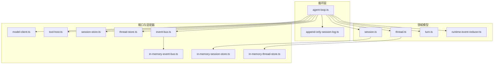
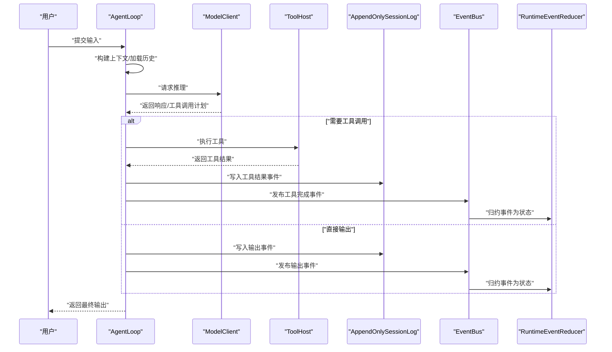
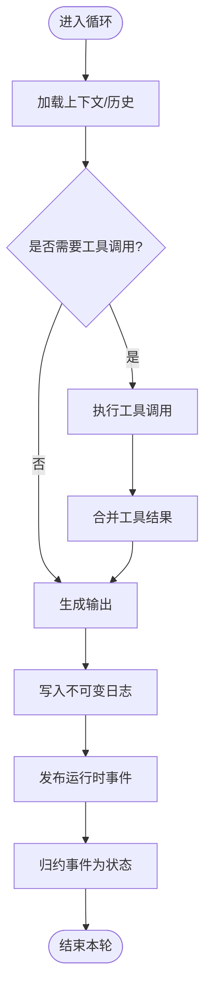
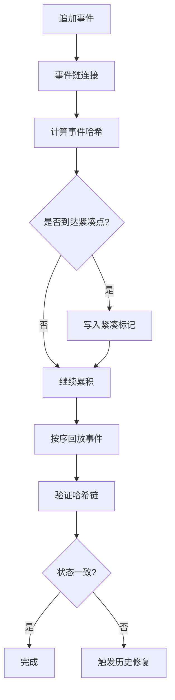
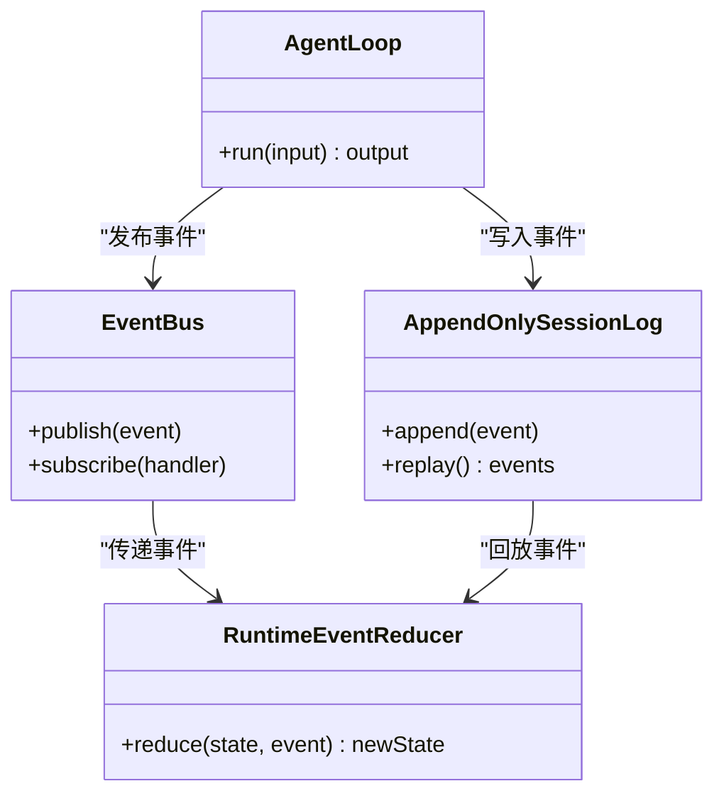
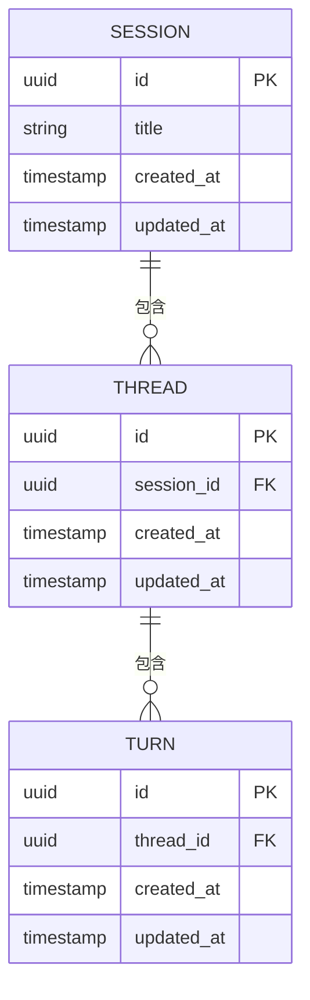
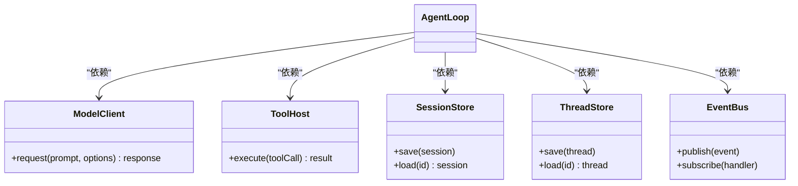
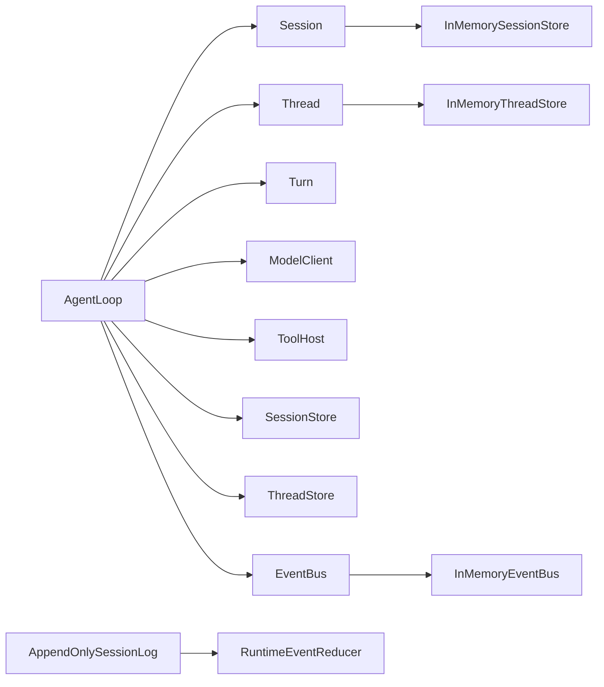

# Agent Loop 核心循环

<cite>
**本文引用的文件**
- [agent-loop.ts](file://kun/src/loop/agent-loop.ts)
- [append-only-session-log.ts](file://kun/src/loop/append-only-session-log.ts)
- [index.ts](file://kun/src/loop/index.ts)
- [in-memory-event-bus.ts](file://kun/src/adapters/in-memory-event-bus.ts)
- [in-memory-session-store.ts](file://kun/src/adapters/in-memory-session-store.ts)
- [in-memory-thread-store.ts](file://kun/src/adapters/in-memory-thread-store.ts)
- [model-client.ts](file://kun/src/ports/model-client.ts)
- [tool-host.ts](file://kun/src/ports/tool-host.ts)
- [session-store.ts](file://kun/src/ports/session-store.ts)
- [thread-store.ts](file://kun/src/ports/thread-store.ts)
- [event-bus.ts](file://kun/src/ports/event-bus.ts)
- [runtime-event-reducer.ts](file://kun/src/domain/runtime-event-reducer.ts)
- [session.ts](file://kun/src/domain/session.ts)
- [thread.ts](file://kun/src/domain/thread.ts)
- [turn.ts](file://kun/src/domain/turn.ts)
- [events.ts](file://kun/src/contracts/events.ts)
- [loop.test.ts](file://kun/tests/loop.test.ts)
- [loop-test-harness.ts](file://kun/tests/loop-test-harness.ts)
- [DESIGN.zh-CN.md](file://DESIGN.zh-CN.md)
</cite>

## 目录
1. [引言](#引言)
2. [项目结构](#项目结构)
3. [核心组件](#核心组件)
4. [架构总览](#架构总览)
5. [详细组件分析](#详细组件分析)
6. [依赖关系分析](#依赖关系分析)
7. [性能考量](#性能考量)
8. [故障排查指南](#故障排查指南)
9. [结论](#结论)
10. [附录](#附录)

## 引言
本文件围绕 Agent Loop 核心循环进行系统化技术文档整理，重点阐述以下方面：
- 循环调度机制与状态管理
- 事件驱动模型与运行时事件记录
- 不可变会话日志（append-only session log）的设计理念与实现原理
- 循环关键阶段：输入处理、推理执行、工具调用、输出生成、状态更新
- 并发控制、错误处理与优雅降级策略
- 执行流程与关键配置项的定位与参考

该文档旨在帮助开发者与产品人员理解 Agent Loop 的内部工作机理，并在扩展与维护时遵循统一的设计约束与最佳实践。

## 项目结构
Agent Loop 相关代码位于 kun/src/loop 目录，核心文件包括：
- agent-loop.ts：智能体核心循环实现
- append-only-session-log.ts：会话日志的不可变写入与回放
- 其他辅助模块：上下文压缩、历史修复、模型路由、令牌经济等

图表来源
- [agent-loop.ts](file://kun/src/loop/agent-loop.ts)
- [append-only-session-log.ts](file://kun/src/loop/append-only-session-log.ts)
- [session.ts](file://kun/src/domain/session.ts)
- [thread.ts](file://kun/src/domain/thread.ts)
- [turn.ts](file://kun/src/domain/turn.ts)
- [runtime-event-reducer.ts](file://kun/src/domain/runtime-event-reducer.ts)
- [model-client.ts](file://kun/src/ports/model-client.ts)
- [tool-host.ts](file://kun/src/ports/tool-host.ts)
- [session-store.ts](file://kun/src/ports/session-store.ts)
- [thread-store.ts](file://kun/src/ports/thread-store.ts)
- [event-bus.ts](file://kun/src/ports/event-bus.ts)
- [in-memory-event-bus.ts](file://kun/src/adapters/in-memory-event-bus.ts)
- [in-memory-session-store.ts](file://kun/src/adapters/in-memory-session-store.ts)
- [in-memory-thread-store.ts](file://kun/src/adapters/in-memory-thread-store.ts)

章节来源
- [agent-loop.ts](file://kun/src/loop/agent-loop.ts)
- [append-only-session-log.ts](file://kun/src/loop/append-only-session-log.ts)
- [index.ts](file://kun/src/loop/index.ts)

## 核心组件
- AgentLoop：负责单次对话轮次的完整生命周期，包含输入解析、推理、工具调用、输出生成与状态持久化。
- AppendOnlySessionLog：以不可变方式记录会话事件，支持回放与一致性校验，保障数据可追溯性。
- 领域模型：Session、Thread、Turn 提供会话、线程与轮次的数据结构与行为。
- 端口与适配器：ModelClient、ToolHost、SessionStore、ThreadStore、EventBus 抽象外部能力，便于替换与测试。
- 运行时事件归约器：将事件转换为领域状态变更，保证状态演进的一致性。

章节来源
- [agent-loop.ts](file://kun/src/loop/agent-loop.ts)
- [append-only-session-log.ts](file://kun/src/loop/append-only-session-log.ts)
- [session.ts](file://kun/src/domain/session.ts)
- [thread.ts](file://kun/src/domain/thread.ts)
- [turn.ts](file://kun/src/domain/turn.ts)
- [runtime-event-reducer.ts](file://kun/src/domain/runtime-event-reducer.ts)
- [model-client.ts](file://kun/src/ports/model-client.ts)
- [tool-host.ts](file://kun/src/ports/tool-host.ts)
- [session-store.ts](file://kun/src/ports/session-store.ts)
- [thread-store.ts](file://kun/src/ports/thread-store.ts)
- [event-bus.ts](file://kun/src/ports/event-bus.ts)

## 架构总览
Agent Loop 采用“事件驱动 + 不可变日志”的架构模式：
- 输入阶段：从用户输入与会话历史中提取本轮上下文
- 推理阶段：调用模型客户端生成响应或工具调用计划
- 工具阶段：执行工具调用，收集结果并回写到日志
- 输出阶段：生成最终回复，更新会话状态
- 记录阶段：通过事件总线与运行时事件归约器，将状态变更写入不可变日志

图表来源
- [agent-loop.ts](file://kun/src/loop/agent-loop.ts)
- [append-only-session-log.ts](file://kun/src/loop/append-only-session-log.ts)
- [model-client.ts](file://kun/src/ports/model-client.ts)
- [tool-host.ts](file://kun/src/ports/tool-host.ts)
- [event-bus.ts](file://kun/src/ports/event-bus.ts)
- [runtime-event-reducer.ts](file://kun/src/domain/runtime-event-reducer.ts)

## 详细组件分析

### AgentLoop 核心循环
- 职责边界：封装一次完整的对话轮次，协调输入、推理、工具、输出与状态更新。
- 关键流程：
  - 输入处理：解析用户输入与上下文，准备模型请求参数
  - 推理执行：调用模型客户端，获得响应或工具调用计划
  - 工具调用：按顺序执行工具，聚合结果
  - 输出生成：构造最终回复文本
  - 状态更新：通过事件总线与运行时事件归约器更新领域状态
- 并发控制：循环内串行推进，避免竞态；工具调用可并发但需受速率限制与队列控制
- 错误处理：捕获模型/工具异常，记录运行时事件，触发降级策略（如回退到简单回复）
- 优雅降级：当工具风暴或资源受限时，启用断路器与节流，保证系统稳定

图表来源
- [agent-loop.ts](file://kun/src/loop/agent-loop.ts)
- [append-only-session-log.ts](file://kun/src/loop/append-only-session-log.ts)
- [runtime-event-reducer.ts](file://kun/src/domain/runtime-event-reducer.ts)

章节来源
- [agent-loop.ts](file://kun/src/loop/agent-loop.ts)

### AppendOnlySessionLog 不可变日志
- 设计理念：
  - 仅追加写入，禁止修改与删除，确保历史不可篡改
  - 通过事件序列实现可追溯性与可重放性
  - 支持紧凑化标记与历史清洗，平衡存储与性能
- 实现要点：
  - 事件写入：原子化追加，保证事务一致性
  - 回放机制：按时间序重放事件，重建会话状态
  - 压缩策略：定期清理冗余事件，保留关键紧凑点
- 数据一致性：
  - 通过事件哈希链与紧凑标记，防止历史被篡改
  - 结合运行时事件归约器，确保状态与日志一致

图表来源
- [append-only-session-log.ts](file://kun/src/loop/append-only-session-log.ts)
- [history-healing.ts](file://kun/src/loop/history-healing.ts)
- [compaction-marker.ts](file://kun/src/loop/compaction-marker.ts)

章节来源
- [append-only-session-log.ts](file://kun/src/loop/append-only-session-log.ts)

### 事件驱动与运行时事件归约
- 事件总线：集中发布/订阅运行时事件，解耦循环与状态更新逻辑
- 运行时事件归约器：将事件转换为领域状态变更，保证状态演进的确定性
- 事件契约：定义事件类型与负载结构，确保跨模块一致性

图表来源
- [event-bus.ts](file://kun/src/ports/event-bus.ts)
- [in-memory-event-bus.ts](file://kun/src/adapters/in-memory-event-bus.ts)
- [runtime-event-reducer.ts](file://kun/src/domain/runtime-event-reducer.ts)
- [agent-loop.ts](file://kun/src/loop/agent-loop.ts)
- [append-only-session-log.ts](file://kun/src/loop/append-only-session-log.ts)

章节来源
- [event-bus.ts](file://kun/src/ports/event-bus.ts)
- [in-memory-event-bus.ts](file://kun/src/adapters/in-memory-event-bus.ts)
- [runtime-event-reducer.ts](file://kun/src/domain/runtime-event-reducer.ts)

### 领域模型与状态管理
- Session：代表一次会话的上下文与元信息
- Thread：会话内的线程组织，承载多轮对话
- Turn：单轮对话的输入、中间产物与输出
- 状态更新：通过事件归约器将事件映射为领域对象的状态变更

图表来源
- [session.ts](file://kun/src/domain/session.ts)
- [thread.ts](file://kun/src/domain/thread.ts)
- [turn.ts](file://kun/src/domain/turn.ts)

章节来源
- [session.ts](file://kun/src/domain/session.ts)
- [thread.ts](file://kun/src/domain/thread.ts)
- [turn.ts](file://kun/src/domain/turn.ts)

### 端口与适配器
- ModelClient：抽象模型服务调用接口，支持不同模型供应商
- ToolHost：抽象工具执行接口，屏蔽工具实现差异
- SessionStore/ThreadStore：抽象会话与线程的持久化接口
- EventBus：抽象事件发布订阅接口，便于替换实现

图表来源
- [model-client.ts](file://kun/src/ports/model-client.ts)
- [tool-host.ts](file://kun/src/ports/tool-host.ts)
- [session-store.ts](file://kun/src/ports/session-store.ts)
- [thread-store.ts](file://kun/src/ports/thread-store.ts)
- [event-bus.ts](file://kun/src/ports/event-bus.ts)
- [agent-loop.ts](file://kun/src/loop/agent-loop.ts)

章节来源
- [model-client.ts](file://kun/src/ports/model-client.ts)
- [tool-host.ts](file://kun/src/ports/tool-host.ts)
- [session-store.ts](file://kun/src/ports/session-store.ts)
- [thread-store.ts](file://kun/src/ports/thread-store.ts)
- [event-bus.ts](file://kun/src/ports/event-bus.ts)

## 依赖关系分析
- 组件耦合：
  - AgentLoop 对领域模型与端口有强依赖，但通过接口隔离，便于替换实现
  - AppendOnlySessionLog 与运行时事件归约器紧密协作，共同保证状态一致性
- 外部依赖：
  - 事件总线与存储适配器可替换，支持内存/文件/混合存储
  - 模型客户端与工具宿主可替换，支持多供应商与多工具生态
- 循环依赖规避：
  - 通过端口与事件机制解耦，避免直接相互引用

图表来源
- [agent-loop.ts](file://kun/src/loop/agent-loop.ts)
- [append-only-session-log.ts](file://kun/src/loop/append-only-session-log.ts)
- [session.ts](file://kun/src/domain/session.ts)
- [thread.ts](file://kun/src/domain/thread.ts)
- [turn.ts](file://kun/src/domain/turn.ts)
- [model-client.ts](file://kun/src/ports/model-client.ts)
- [tool-host.ts](file://kun/src/ports/tool-host.ts)
- [session-store.ts](file://kun/src/ports/session-store.ts)
- [thread-store.ts](file://kun/src/ports/thread-store.ts)
- [event-bus.ts](file://kun/src/ports/event-bus.ts)
- [in-memory-event-bus.ts](file://kun/src/adapters/in-memory-event-bus.ts)
- [in-memory-session-store.ts](file://kun/src/adapters/in-memory-session-store.ts)
- [in-memory-thread-store.ts](file://kun/src/adapters/in-memory-thread-store.ts)
- [runtime-event-reducer.ts](file://kun/src/domain/runtime-event-reducer.ts)

章节来源
- [agent-loop.ts](file://kun/src/loop/agent-loop.ts)
- [append-only-session-log.ts](file://kun/src/loop/append-only-session-log.ts)

## 性能考量
- 上下文压缩与估计：通过上下文压缩器与上下文估计器减少无效信息，提升推理效率
- 令牌经济：基于模型上下文与成本模型进行预算控制，避免超支
- 工具风暴防护：工具风暴断路器与速率限制，防止资源耗尽
- 缓存优化：结合不可变前缀与LRU缓存，加速重复查询
- 历史清洗：请求历史卫生策略与紧凑标记，降低存储与回放开销

章节来源
- [context-compactor.ts](file://kun/src/loop/context-compactor.ts)
- [context-estimator.ts](file://kun/src/loop/context-estimator.ts)
- [token-economy.ts](file://kun/src/loop/token-economy.ts)
- [tool-storm-breaker.ts](file://kun/src/loop/tool-storm-breaker.ts)
- [immutable-prefix.ts](file://kun/src/cache/immutable-prefix.ts)
- [lru-cache.ts](file://kun/src/cache/lru-cache.ts)
- [request-history-hygiene.ts](file://kun/src/loop/request-history-hygiene.ts)

## 故障排查指南
- 常见问题
  - 工具调用失败：检查工具宿主配置与权限，确认断路器状态
  - 模型调用异常：核对模型客户端参数与配额，查看令牌经济预算
  - 日志不一致：检查紧凑标记与哈希链，必要时触发历史修复
  - 事件丢失：核查事件总线实现与订阅者注册
- 定位方法
  - 使用运行时事件记录与事件回放，复现问题场景
  - 查看循环测试夹具与单元测试，验证关键分支
- 降级策略
  - 禁用高成本工具，切换到轻量模型
  - 启用断路器，暂停工具调用，等待恢复
  - 清理过期历史，释放存储空间

章节来源
- [loop.test.ts](file://kun/tests/loop.test.ts)
- [loop-test-harness.ts](file://kun/tests/loop-test-harness.ts)
- [history-healing.ts](file://kun/src/loop/history-healing.ts)
- [events.ts](file://kun/src/contracts/events.ts)

## 结论
Agent Loop 通过“事件驱动 + 不可变日志”的设计，在保证数据一致性与可追溯性的前提下，实现了高扩展与高鲁棒性的智能体核心循环。配合上下文压缩、令牌经济、工具风暴防护与历史清洗等机制，能够在复杂场景中稳定运行。建议在扩展新工具或模型时，严格遵循端口与事件契约，确保系统整体一致性。

## 附录
- 关键配置与入口
  - AgentLoop 初始化与运行：参考循环实现文件
  - 事件契约与运行时事件：参考事件定义与归约器
  - 存储与事件总线适配器：参考内存实现与端口定义
- 参考文档
  - 设计文档中关于 Agent Loop 的定位与约束

章节来源
- [DESIGN.zh-CN.md](file://DESIGN.zh-CN.md)