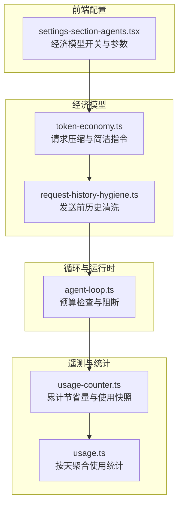
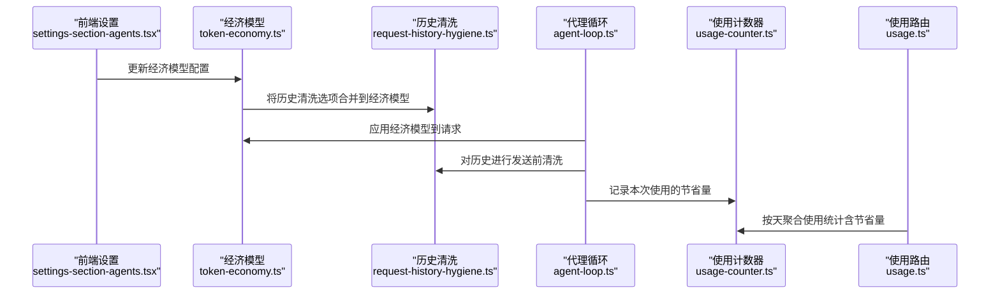
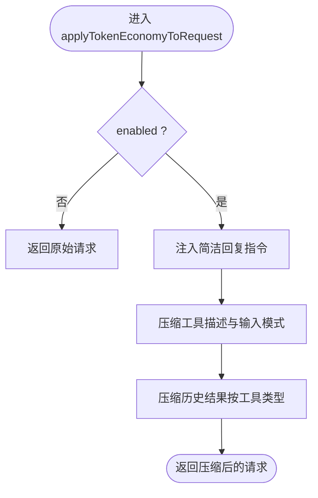
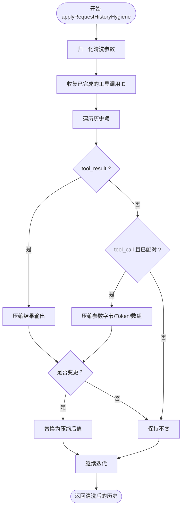
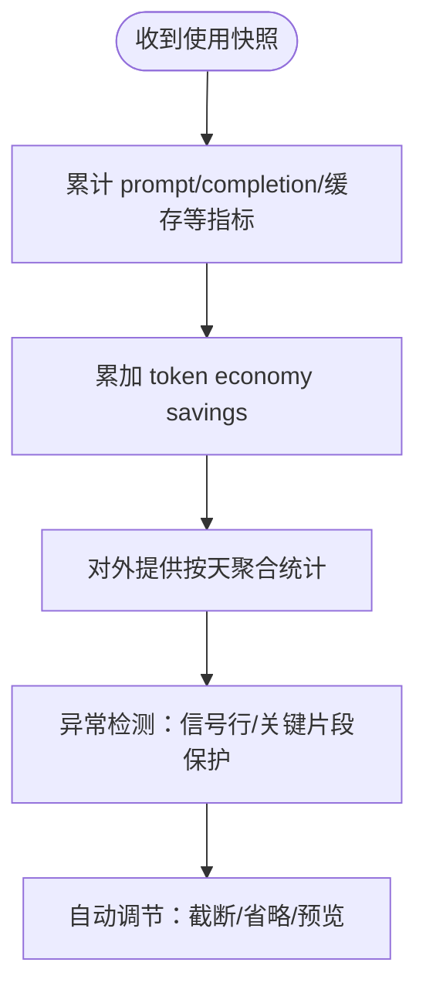
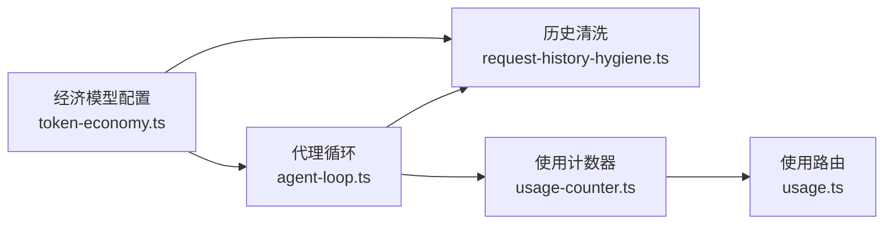

# Token 经济模型

<cite>
**本文引用的文件**
- [token-economy.ts](file://kun/src/loop/token-economy.ts)
- [request-history-hygiene.ts](file://kun/src/loop/request-history-hygiene.ts)
- [token-economy.test.ts](file://kun/tests/token-economy.test.ts)
- [request-history-hygiene.test.ts](file://kun/tests/request-history-hygiene.test.ts)
- [usage-counter.ts](file://kun/src/telemetry/usage-counter.ts)
- [usage.ts](file://kun/src/server/routes/usage.ts)
- [agent-loop.ts](file://kun/src/loop/agent-loop.ts)
- [settings-section-agents.tsx](file://src/renderer/src/components/settings-section-agents.tsx)
</cite>

## 目录
1. [简介](#简介)
2. [项目结构](#项目结构)
3. [核心组件](#核心组件)
4. [架构总览](#架构总览)
5. [详细组件分析](#详细组件分析)
6. [依赖关系分析](#依赖关系分析)
7. [性能考量](#性能考量)
8. [故障排查指南](#故障排查指南)
9. [结论](#结论)
10. [附录：配置与监控](#附录配置与监控)

## 简介
本技术文档围绕 Token 经济模型展开，系统阐述智能体在运行过程中如何通过经济模型优化 Token 使用效率，包括：
- 成本控制与预算管理：基于线程级成本预算的限制与预警机制
- 预算管理与优先级排序：在预算接近上限时阻断高开销操作并发出警告
- 请求历史清理机制（request-history-hygiene）：在不修改持久化会话的前提下，对动态工具历史进行发送前清洗，保持热缓存前缀占比最大化
- 实时监控与异常检测：通过使用计数器统计 Token 节省量，并在路由层提供按天聚合的使用统计
- 自动调节机制：通过可调参数对工具结果、参数、数组项等进行压缩与截断，确保上下文在预算内
- 激励与惩罚：通过“简洁回复”指令降低冗余输出；通过历史清洗避免无意义膨胀；通过预算阈值形成自然的“惩罚”以抑制过度消耗

## 项目结构
与 Token 经济模型直接相关的代码主要位于以下模块：
- 经济模型核心：kun/src/loop/token-economy.ts
- 历史清洗机制：kun/src/loop/request-history-hygiene.ts
- 使用统计与节省量汇总：kun/src/telemetry/usage-counter.ts、kun/src/server/routes/usage.ts
- 运行时预算控制：kun/src/loop/agent-loop.ts
- 用户界面配置入口：src/renderer/src/components/settings-section-agents.tsx
- 单元测试：kun/tests/token-economy.test.ts、kun/tests/request-history-hygiene.test.ts



图表来源
- [agent-loop.ts:1562-1601](file://kun/src/loop/agent-loop.ts#L1562-L1601)
- [token-economy.ts:87-105](file://kun/src/loop/token-economy.ts#L87-L105)
- [request-history-hygiene.ts:41-73](file://kun/src/loop/request-history-hygiene.ts#L41-L73)
- [usage-counter.ts:96-119](file://kun/src/telemetry/usage-counter.ts#L96-L119)
- [usage.ts:177-208](file://kun/src/server/routes/usage.ts#L177-L208)
- [settings-section-agents.tsx:674-823](file://src/renderer/src/components/settings-section-agents.tsx#L674-L823)

章节来源
- [token-economy.ts:1-416](file://kun/src/loop/token-economy.ts#L1-L416)
- [request-history-hygiene.ts:1-398](file://kun/src/loop/request-history-hygiene.ts#L1-L398)
- [usage-counter.ts:36-210](file://kun/src/telemetry/usage-counter.ts#L36-L210)
- [usage.ts:177-208](file://kun/src/server/routes/usage.ts#L177-L208)
- [agent-loop.ts:1562-1601](file://kun/src/loop/agent-loop.ts#L1562-L1601)
- [settings-section-agents.tsx:674-823](file://src/renderer/src/components/settings-section-agents.tsx#L674-L823)

## 核心组件
- Token 经济模型配置与应用
  - 默认配置与归一化：默认启用简洁回复、压缩工具描述与结果，支持历史清洗子配置
  - 请求应用：在启用状态下，向上下文注入简洁回复指令，压缩工具描述与历史结果
- 请求历史清洗
  - 发送前清洗：仅对动态会话历史进行清洗，不修改持久化日志
  - 多维度限制：按行数、字节、近似 Token 数、数组项数量等限制清洗
  - 关键字段保护：对 base64 数据与长参数进行有选择地省略或预览
- 使用统计与节省量
  - 节省量累计：按线程维度累计 Token 经济节省的 tokens/usd/cny
  - 路由聚合：提供按天分组的使用统计，包含 token economy savings 字段
- 预算控制与优先级
  - 预算检查：当线程成本达到预算上限时阻断当前回合
  - 预警机制：达到 80% 预算时发出一次警告并记录事件

章节来源
- [token-economy.ts:5-25](file://kun/src/loop/token-economy.ts#L5-L25)
- [token-economy.ts:74-105](file://kun/src/loop/token-economy.ts#L74-L105)
- [request-history-hygiene.ts:3-17](file://kun/src/loop/request-history-hygiene.ts#L3-L17)
- [request-history-hygiene.ts:41-73](file://kun/src/loop/request-history-hygiene.ts#L41-L73)
- [usage-counter.ts:96-119](file://kun/src/telemetry/usage-counter.ts#L96-L119)
- [usage.ts:177-208](file://kun/src/server/routes/usage.ts#L177-L208)
- [agent-loop.ts:1562-1601](file://kun/src/loop/agent-loop.ts#L1562-L1601)

## 架构总览
下图展示从用户配置到运行时执行、再到统计上报的端到端流程。



图表来源
- [settings-section-agents.tsx:674-823](file://src/renderer/src/components/settings-section-agents.tsx#L674-L823)
- [token-economy.ts:74-105](file://kun/src/loop/token-economy.ts#L74-L105)
- [request-history-hygiene.ts:41-73](file://kun/src/loop/request-history-hygiene.ts#L41-L73)
- [agent-loop.ts:1562-1601](file://kun/src/loop/agent-loop.ts#L1562-L1601)
- [usage-counter.ts:96-119](file://kun/src/telemetry/usage-counter.ts#L96-L119)
- [usage.ts:177-208](file://kun/src/server/routes/usage.ts#L177-L208)

## 详细组件分析

### 组件A：Token 经济模型（请求压缩与简洁指令）
- 功能要点
  - 启用/禁用：通过配置开关控制是否应用经济模型
  - 简洁回复：向上下文注入指令，要求模型直接回答、保留精确代码/路径/URL/标识符/错误信息
  - 工具描述压缩：对工具描述与输入模式描述进行“去冗余”处理，保留受保护片段
  - 历史结果压缩：针对不同工具输出类型（命令、文件读取、搜索、查找、列表等）进行行数、字节数、Token 数限制与截断
- 关键算法
  - 文本压缩：去除填充词、敬语、模糊表达、多余空格与换行，保留受保护片段（代码、URL、路径、函数名、标识符、版本号等）
  - 输出裁剪：按最大行数、字节数、Token 数三重预算进行拟合，优先保留首尾与信号行（如错误、失败、异常等）
- 性能影响
  - 显著减少上下文长度，提升响应速度与稳定性
  - 通过受保护片段机制保证关键信息不被误删



图表来源
- [token-economy.ts:87-105](file://kun/src/loop/token-economy.ts#L87-L105)
- [token-economy.ts:107-141](file://kun/src/loop/token-economy.ts#L107-L141)
- [token-economy.ts:143-158](file://kun/src/loop/token-economy.ts#L143-L158)

章节来源
- [token-economy.ts:5-25](file://kun/src/loop/token-economy.ts#L5-L25)
- [token-economy.ts:74-105](file://kun/src/loop/token-economy.ts#L74-L105)
- [token-economy.ts:107-158](file://kun/src/loop/token-economy.ts#L107-L158)
- [token-economy.test.ts:24-97](file://kun/tests/token-economy.test.ts#L24-L97)

### 组件B：请求历史清洗（发送前清洗）
- 设计原则
  - 不修改持久化会话日志，仅在每次请求发送前进行清洗
  - 保留“有用信号行”（错误、失败、异常等），同时保留首尾与关键上下文
  - 对 base64 数据与超长参数进行省略或预览，避免无意义膨胀
- 清洗策略
  - 工具结果文本：按行、字节、Token 三重预算拟合，保留首尾与信号行
  - 工具参数：对字符串参数进行字节与 Token 预算检查，超限则仅保留预览
  - 数组项：采用“头+省略标记+尾”的策略，确保上下文连续性
- 关键参数
  - 最大行数、最大字节、最大 Token 数、最大数组项数
  - 参数字符串的字节与 Token 上限



图表来源
- [request-history-hygiene.ts:41-73](file://kun/src/loop/request-history-hygiene.ts#L41-L73)
- [request-history-hygiene.ts:88-182](file://kun/src/loop/request-history-hygiene.ts#L88-L182)
- [request-history-hygiene.ts:208-267](file://kun/src/loop/request-history-hygiene.ts#L208-L267)

章节来源
- [request-history-hygiene.ts:3-17](file://kun/src/loop/request-history-hygiene.ts#L3-L17)
- [request-history-hygiene.ts:41-73](file://kun/src/loop/request-history-hygiene.ts#L41-L73)
- [request-history-hygiene.ts:88-182](file://kun/src/loop/request-history-hygiene.ts#L88-L182)
- [request-history-hygiene.test.ts:5-37](file://kun/tests/request-history-hygiene.test.ts#L5-L37)

### 组件C：预算管理与优先级排序
- 预算检查
  - 当线程存在有限成本预算且已花费接近或超过预算时，阻断当前回合并记录错误
- 预警机制
  - 当花费达到预算的 80% 时，发送一次预算预警并记录事件
- 优先级排序
  - 在预算受限时，优先保障关键任务完成，避免高开销工具调用导致超支

```mermaid
sequenceDiagram
participant Loop as "agent-loop.ts"
participant Budget as "线程预算"
participant Events as "事件记录"
Loop->>Budget : 读取预算与已花费
alt 超过预算
Loop->>Events : 记录 budget_limited 错误
Loop-->>Loop : 阻断当前回合
else 接近预算(>=80%)
Loop->>Events : 记录 budget_warning 错误
end
```

图表来源
- [agent-loop.ts:1562-1601](file://kun/src/loop/agent-loop.ts#L1562-L1601)

章节来源
- [agent-loop.ts:1562-1601](file://kun/src/loop/agent-loop.ts#L1562-L1601)

### 组件D：实时监控、异常检测与自动调节
- 实时监控
  - 使用计数器按线程维度累计 prompt/completion/缓存等指标，并记录 token economy savings
- 异常检测
  - 历史清洗中识别“信号行”（错误、失败、异常等），优先保留这些行
  - 经济模型压缩中保留受保护片段，避免关键信息丢失
- 自动调节
  - 通过可配置的行数、字节、Token、数组项上限，自动对输出与参数进行截断与省略
  - 当仅超出 Token 预算而未超字节预算时，优先进行文本压缩以满足 Token 限额



图表来源
- [usage-counter.ts:36-94](file://kun/src/telemetry/usage-counter.ts#L36-L94)
- [usage.ts:177-208](file://kun/src/server/routes/usage.ts#L177-L208)
- [request-history-hygiene.ts:184-206](file://kun/src/loop/request-history-hygiene.ts#L184-L206)
- [token-economy.ts:143-158](file://kun/src/loop/token-economy.ts#L143-L158)

章节来源
- [usage-counter.ts:36-119](file://kun/src/telemetry/usage-counter.ts#L36-L119)
- [usage.ts:177-208](file://kun/src/server/routes/usage.ts#L177-L208)
- [request-history-hygiene.ts:184-206](file://kun/src/loop/request-history-hygiene.ts#L184-L206)
- [token-economy.ts:143-158](file://kun/src/loop/token-economy.ts#L143-L158)

### 组件E：激励机制、惩罚规则与奖励策略
- 激励机制
  - 简洁回复指令鼓励模型直接回答，减少冗余内容，提高单位 Token 的信息密度
  - 历史清洗与参数预览减少上下文膨胀，提升缓存命中率
- 惩罚规则
  - 预算超支时阻断回合，避免进一步消耗
  - 对超长参数与 base64 数据进行省略，防止无意义占用
- 奖励策略
  - 通过节省量统计（tokens/usd/cny）反馈经济模型效果，便于持续优化参数

章节来源
- [token-economy.ts:27-32](file://kun/src/loop/token-economy.ts#L27-L32)
- [agent-loop.ts:1562-1601](file://kun/src/loop/agent-loop.ts#L1562-L1601)
- [request-history-hygiene.ts:269-271](file://kun/src/loop/request-history-hygiene.ts#L269-L271)
- [usage-counter.ts:96-119](file://kun/src/telemetry/usage-counter.ts#L96-L119)

## 依赖关系分析
- 经济模型依赖历史清洗：经济模型配置中嵌套了历史清洗选项，二者协同工作
- 运行时依赖预算控制：代理循环在发送请求前应用经济模型与历史清洗
- 统计依赖使用计数器：使用计数器汇总节省量，路由层按天聚合



图表来源
- [token-economy.ts:74-84](file://kun/src/loop/token-economy.ts#L74-L84)
- [request-history-hygiene.ts:41-73](file://kun/src/loop/request-history-hygiene.ts#L41-L73)
- [agent-loop.ts:1562-1601](file://kun/src/loop/agent-loop.ts#L1562-L1601)
- [usage-counter.ts:96-119](file://kun/src/telemetry/usage-counter.ts#L96-L119)
- [usage.ts:177-208](file://kun/src/server/routes/usage.ts#L177-L208)

章节来源
- [token-economy.ts:74-84](file://kun/src/loop/token-economy.ts#L74-L84)
- [request-history-hygiene.ts:41-73](file://kun/src/loop/request-history-hygiene.ts#L41-L73)
- [agent-loop.ts:1562-1601](file://kun/src/loop/agent-loop.ts#L1562-L1601)
- [usage-counter.ts:96-119](file://kun/src/telemetry/usage-counter.ts#L96-L119)
- [usage.ts:177-208](file://kun/src/server/routes/usage.ts#L177-L208)

## 性能考量
- 文本压缩与历史清洗显著降低上下文长度，提升模型响应速度与稳定性
- 三重预算（行数/字节/Token）确保在不同场景下均能收敛上下文
- 受保护片段机制避免关键信息丢失，提升实用性
- 预算控制与预警机制防止突发高开销操作导致系统过载

## 故障排查指南
- 现象：历史未被清洗
  - 检查经济模型是否启用，以及历史清洗参数是否合理
  - 确认工具结果与参数是否确实超限
- 现象：预算频繁触发阻断
  - 提升线程预算或调整工具调用策略
  - 检查是否存在大量 base64 或超长参数
- 现象：节省量统计缺失
  - 确认使用计数器是否正确记录 token economy savings
  - 检查路由聚合逻辑是否包含节省量字段

章节来源
- [request-history-hygiene.test.ts:5-37](file://kun/tests/request-history-hygiene.test.ts#L5-L37)
- [token-economy.test.ts:24-97](file://kun/tests/token-economy.test.ts#L24-L97)
- [usage-counter.ts:96-119](file://kun/src/telemetry/usage-counter.ts#L96-L119)
- [usage.ts:177-208](file://kun/src/server/routes/usage.ts#L177-L208)

## 结论
Token 经济模型通过“简洁指令 + 历史清洗 + 多维预算控制 + 统计反馈”形成闭环，有效提升 Token 使用效率与系统稳定性。经济模型与历史清洗在发送前协同工作，预算控制在运行时提供优先级保障，统计接口提供可观测性支撑。建议结合实际使用场景调优参数，持续监控节省量与成本趋势。

## 附录：配置与监控
- 前端配置入口
  - 经济模型开关与子项：工具描述压缩、工具结果压缩、简洁回复
  - 历史清洗参数：最大工具结果行数/字节/Token、最大工具参数字节/Token、最大数组项数
- 关键配置项与默认值
  - enabled: false
  - compressToolDescriptions: true
  - compressToolResults: true
  - conciseResponses: true
  - historyHygiene: 包含上述历史清洗参数的默认值
- 性能指标与监控方法
  - 使用计数器：累计 promptTokens、completionTokens、cachedTokens、cacheHitTokens、cacheMissTokens、turns、costUsd、costCny、cacheSavingsUsd、cacheSavingsCny、tokenEconomySavingsTokens、tokenEconomySavingsUsd、tokenEconomySavingsCny
  - 路由统计：按天分组的 total_tokens、turns、active_days、token_economy_savings_tokens、token_economy_savings_usd、token_economy_savings_cny

章节来源
- [settings-section-agents.tsx:674-823](file://src/renderer/src/components/settings-section-agents.tsx#L674-L823)
- [token-economy.ts:19-25](file://kun/src/loop/token-economy.ts#L19-L25)
- [usage-counter.ts:36-119](file://kun/src/telemetry/usage-counter.ts#L36-L119)
- [usage.ts:177-208](file://kun/src/server/routes/usage.ts#L177-L208)