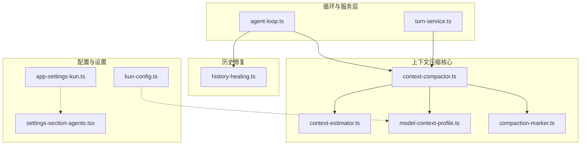
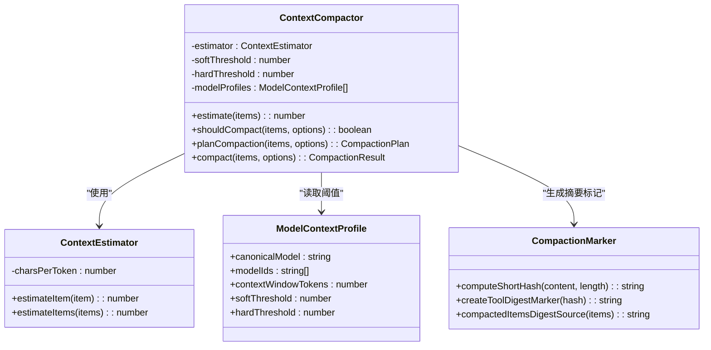
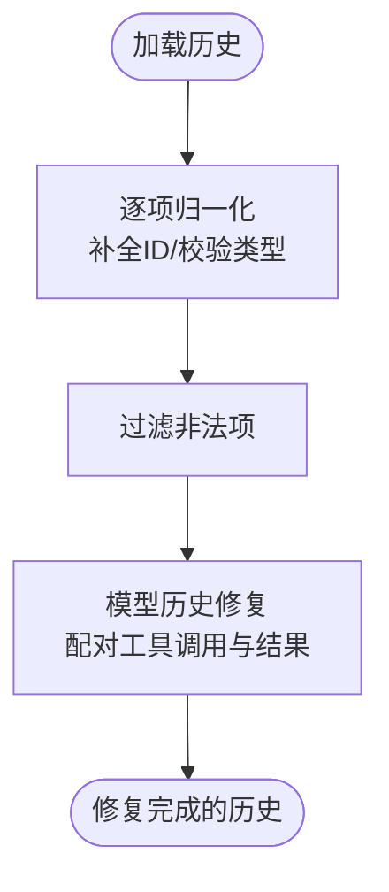
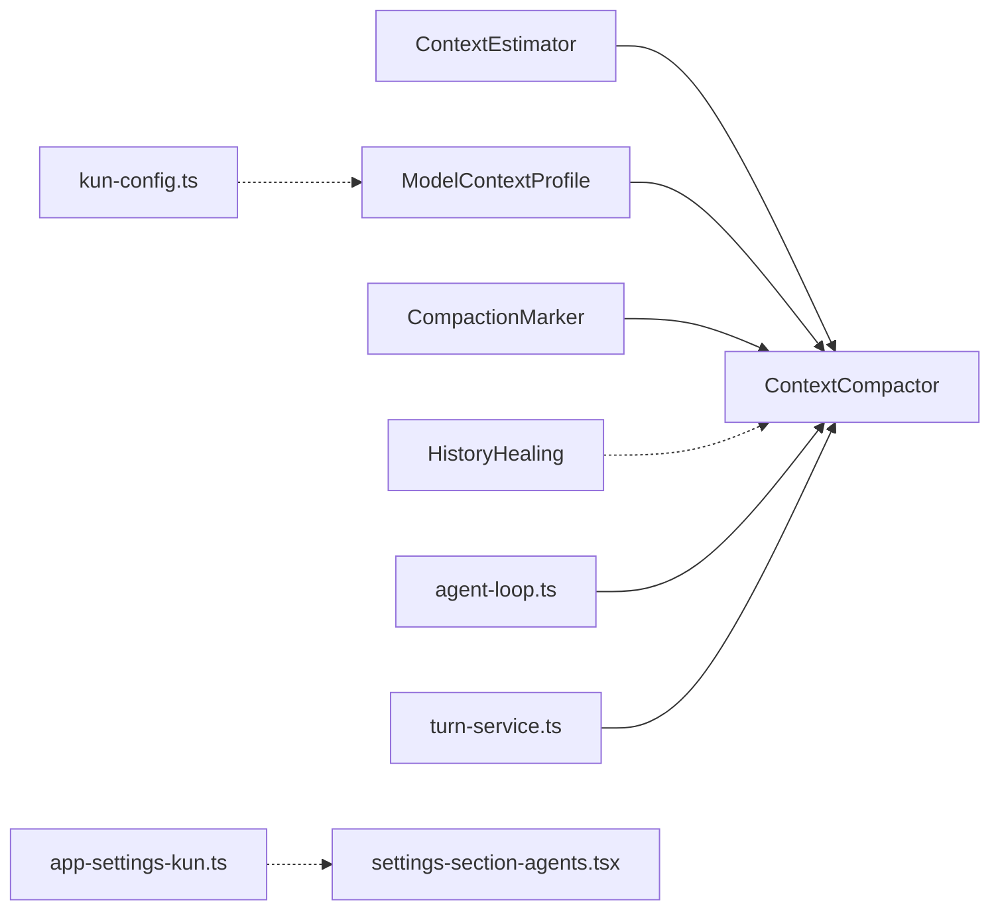

# 上下文压缩

<cite>
**本文引用的文件**
- [context-compactor.ts](file://kun/src/loop/context-compactor.ts)
- [context-estimator.ts](file://kun/src/loop/context-estimator.ts)
- [compaction-marker.ts](file://kun/src/loop/compaction-marker.ts)
- [history-healing.ts](file://kun/src/loop/history-healing.ts)
- [model-context-profile.ts](file://kun/src/loop/model-context-profile.ts)
- [agent-loop.ts](file://kun/src/loop/agent-loop.ts)
- [turn-service.ts](file://kun/src/services/turn-service.ts)
- [kun-config.ts](file://kun/src/config/kun-config.ts)
- [app-settings-kun.ts](file://src/shared/app-settings-kun.ts)
- [settings-section-agents.tsx](file://src/renderer/src/components/settings-section-agents.tsx)
- [loop.test.ts](file://kun/tests/loop.test.ts)
- [model-history-repair.test.ts](file://kun/tests/model-history-repair.test.ts)
</cite>

## 目录
1. [引言](#引言)
2. [项目结构](#项目结构)
3. [核心组件](#核心组件)
4. [架构总览](#架构总览)
5. [详细组件分析](#详细组件分析)
6. [依赖关系分析](#依赖关系分析)
7. [性能考量](#性能考量)
8. [故障排查指南](#故障排查指南)
9. [结论](#结论)
10. [附录](#附录)

## 引言
本技术文档聚焦于上下文压缩系统，解释智能体如何通过上下文压缩在长对话与工具调用历史中维持高效的推理性能。系统围绕三个关键模块展开：上下文压缩器（ContextCompactor）、历史修复（HistoryHealing）与压缩标记器（CompactionMarker）。我们将深入剖析压缩算法与阈值策略、质量保障机制、压缩率与信息保留的平衡、历史修复的设计思路、压缩标记器的作用与使用场景，并提供评估方法、性能基准与调优建议。

## 项目结构
上下文压缩相关代码主要位于 kun/src/loop 目录，涉及以下文件：
- 上下文压缩器：context-compactor.ts
- 上下文估算器：context-estimator.ts
- 模型上下文配置：model-context-profile.ts
- 压缩标记器：compaction-marker.ts
- 历史修复：history-healing.ts
- 运行时集成：agent-loop.ts、turn-service.ts
- 配置与设置：kun-config.ts、app-settings-kun.ts、settings-section-agents.tsx
- 测试用例：loop.test.ts、model-history-repair.test.ts



图表来源
- [agent-loop.ts](file://kun/src/loop/agent-loop.ts)
- [turn-service.ts](file://kun/src/services/turn-service.ts)
- [context-compactor.ts](file://kun/src/loop/context-compactor.ts)
- [context-estimator.ts](file://kun/src/loop/context-estimator.ts)
- [model-context-profile.ts](file://kun/src/loop/model-context-profile.ts)
- [compaction-marker.ts](file://kun/src/loop/compaction-marker.ts)
- [history-healing.ts](file://kun/src/loop/history-healing.ts)
- [kun-config.ts](file://kun/src/config/kun-config.ts)
- [app-settings-kun.ts](file://src/shared/app-settings-kun.ts)
- [settings-section-agents.tsx](file://src/renderer/src/components/settings-section-agents.tsx)

章节来源
- [context-compactor.ts](file://kun/src/loop/context-compactor.ts)
- [context-estimator.ts](file://kun/src/loop/context-estimator.ts)
- [model-context-profile.ts](file://kun/src/loop/model-context-profile.ts)
- [compaction-marker.ts](file://kun/src/loop/compaction-marker.ts)
- [history-healing.ts](file://kun/src/loop/history-healing.ts)
- [agent-loop.ts](file://kun/src/loop/agent-loop.ts)
- [turn-service.ts](file://kun/src/services/turn-service.ts)
- [kun-config.ts](file://kun/src/config/kun-config.ts)
- [app-settings-kun.ts](file://src/shared/app-settings-kun.ts)
- [settings-section-agents.tsx](file://src/renderer/src/components/settings-section-agents.tsx)

## 核心组件
- 上下文压缩器（ContextCompactor）
  - 负责根据软/硬阈值与模型上下文配置决定是否折叠历史，生成压缩项并写回会话存储。
  - 支持三种压缩模式：normal、aggressive、force；可基于提示词令牌估算触发压缩。
- 上下文估算器（ContextEstimator）
  - 提供极简令牌估算：优先使用已报告用量，否则按字符长度近似估算，目标是可靠触发压缩而非精确建模。
- 模型上下文配置（ModelContextProfile）
  - 定义模型的上下文窗口、软/硬阈值、别名与能力元数据，支持从配置与模型定义中解析。
- 压缩标记器（CompactionMarker）
  - 生成短哈希与压缩摘要标记，用于在摘要文本中标注被折叠的历史片段来源，便于溯源与审计。
- 历史修复（HistoryHealing）
  - 对加载的历史进行规范化与修复，确保工具调用/结果配对完整、消息结构合法，提升后续压缩与推理稳定性。

章节来源
- [context-compactor.ts](file://kun/src/loop/context-compactor.ts)
- [context-estimator.ts](file://kun/src/loop/context-estimator.ts)
- [model-context-profile.ts](file://kun/src/loop/model-context-profile.ts)
- [compaction-marker.ts](file://kun/src/loop/compaction-marker.ts)
- [history-healing.ts](file://kun/src/loop/history-healing.ts)

## 架构总览
上下文压缩贯穿“估算—决策—压缩—记录—修复”的闭环流程。运行时在每轮对话前评估历史长度，若超过阈值则触发压缩；压缩完成后写入压缩项并记录事件；随后对历史进行修复以保证结构完整性。

```mermaid
sequenceDiagram
participant Loop as "agent-loop.ts"
participant Est as "ContextEstimator"
participant Prof as "ModelContextProfile"
participant Comp as "ContextCompactor"
participant Mark as "CompactionMarker"
participant Store as "会话存储"
participant Heal as "HistoryHealing"
Loop->>Est : "估算历史令牌"
Loop->>Prof : "获取模型阈值"
Loop->>Comp : "planCompaction()/shouldCompact()"
alt 需要压缩
Comp->>Mark : "计算摘要短哈希/标记"
Comp->>Store : "appendItem(压缩项)"
Loop->>Heal : "healLoadedHistoryItems()"
Heal-->>Loop : "修复后的历史"
else 不压缩
Loop-->>Loop : "继续推理"
end
```

图表来源
- [agent-loop.ts](file://kun/src/loop/agent-loop.ts)
- [context-estimator.ts](file://kun/src/loop/context-estimator.ts)
- [model-context-profile.ts](file://kun/src/loop/model-context-profile.ts)
- [context-compactor.ts](file://kun/src/loop/context-compactor.ts)
- [compaction-marker.ts](file://kun/src/loop/compaction-marker.ts)
- [history-healing.ts](file://kun/src/loop/history-healing.ts)

## 详细组件分析

### 上下文压缩器（ContextCompactor）
- 角色与职责
  - 基于软/硬阈值与模型上下文配置，判断是否需要折叠历史。
  - 生成压缩项（包含摘要、来源摘要哈希、来源项ID列表），并写回会话存储。
  - 支持三种模式：normal（常规）、aggressive（激进）、force（强制），用于不同压力与安全需求。
- 关键接口
  - estimate(items): 使用估算器估算历史总令牌数。
  - shouldCompact(items, options): 判断是否应压缩。
  - planCompaction(items, options): 计算压缩计划（模式、保留最近条目数、原因）。
  - compact(items, options): 执行压缩，返回新历史与统计信息。
- 阈值与模型配置
  - 默认阈值与模型别名由配置与模型定义共同决定；支持按模型覆盖软/硬阈值。
- 与运行时集成
  - 在 agent-loop.ts 中，每轮开始前评估历史长度，必要时调用压缩器并记录事件；压缩项写入后触发历史修复。



图表来源
- [context-compactor.ts](file://kun/src/loop/context-compactor.ts)
- [context-estimator.ts](file://kun/src/loop/context-estimator.ts)
- [model-context-profile.ts](file://kun/src/loop/model-context-profile.ts)
- [compaction-marker.ts](file://kun/src/loop/compaction-marker.ts)

章节来源
- [context-compactor.ts](file://kun/src/loop/context-compactor.ts)
- [context-estimator.ts](file://kun/src/loop/context-estimator.ts)
- [model-context-profile.ts](file://kun/src/loop/model-context-profile.ts)
- [compaction-marker.ts](file://kun/src/loop/compaction-marker.ts)
- [agent-loop.ts](file://kun/src/loop/agent-loop.ts)

### 压缩算法与选择策略
- 估算与阈值
  - 估算器采用字符长度近似估算令牌数，避免复杂分词开销；阈值来自模型上下文配置或默认值。
  - 软阈值用于触发压缩的预警线，硬阈值用于强制压缩的上限线。
- 压缩模式
  - normal：在接近软阈值时折叠，兼顾压缩率与信息保留。
  - aggressive：在更早阶段折叠，追求更高的压缩率。
  - force：无论阈值如何均折叠，确保不会溢出上下文窗口。
- 冻结消息与最近保留
  - 通过冻结消息计数与最近保留策略，确保关键用户消息不被折叠，同时尽量保留上下文连贯性。

章节来源
- [context-compactor.ts](file://kun/src/loop/context-compactor.ts)
- [context-estimator.ts](file://kun/src/loop/context-estimator.ts)
- [model-context-profile.ts](file://kun/src/loop/model-context-profile.ts)

### 历史修复机制（HistoryHealing）
- 设计思路
  - 对加载的历史进行规范化：补全缺失字段、统一ID、过滤非法项。
  - 修复模型历史中的配对问题：确保工具调用与结果成对出现，避免推理中断。
- 实现要点
  - healLoadedHistoryItems：对历史逐项归一化与过滤，再进行模型历史修复。
  - repairModelHistoryItems：修复多工具块之间的桥接问题，保持推理连贯性。
- 与压缩的关系
  - 压缩前先修复历史，确保压缩器面对的是结构正确的历史，提高压缩质量与稳定性。



图表来源
- [history-healing.ts](file://kun/src/loop/history-healing.ts)
- [model-history-repair.test.ts](file://kun/tests/model-history-repair.test.ts)

章节来源
- [history-healing.ts](file://kun/src/loop/history-healing.ts)
- [model-history-repair.test.ts](file://kun/tests/model-history-repair.test.ts)

### 压缩标记器（CompactionMarker）
- 作用
  - 为压缩摘要生成稳定且短小的哈希，作为“来源摘要”标识。
  - 生成可嵌入摘要文本的XML风格标记，标注被折叠的历史片段来源，便于溯源与审计。
- 使用场景
  - 在压缩项的摘要中内嵌标记，使下游系统可识别哪些内容来自被折叠的历史。
  - 与摘要项一同持久化，便于未来检索与复原。
- 关键函数
  - computeShortHash：对输入内容计算SHA-256短哈希。
  - createToolDigestMarker：生成标记字符串。
  - compactedItemsDigestSource：对被折叠的历史抽取稳定形状，作为摘要源。

章节来源
- [compaction-marker.ts](file://kun/src/loop/compaction-marker.ts)
- [loop.test.ts](file://kun/tests/loop.test.ts)

### 运行时集成与事件记录
- agent-loop.ts
  - 在每轮开始前评估历史长度，必要时执行压缩并追加压缩项。
  - 记录压缩完成事件，携带摘要、来源摘要哈希、来源项ID列表等信息。
- turn-service.ts
  - 将压缩结果（摘要、来源摘要哈希、来源项ID列表）写入响应，便于前端展示与调试。

章节来源
- [agent-loop.ts](file://kun/src/loop/agent-loop.ts)
- [turn-service.ts](file://kun/src/services/turn-service.ts)

## 依赖关系分析
- 组件耦合
  - ContextCompactor 依赖 ContextEstimator 与 ModelContextProfile；通过 CompactionMarker 生成摘要与标记。
  - agent-loop.ts 与 turn-service.ts 依赖 ContextCompactor 并记录压缩事件。
  - history-healing.ts 独立于压缩器，但前置执行以保证历史结构正确。
- 外部依赖
  - 配置层（kun-config.ts、app-settings-kun.ts、settings-section-agents.tsx）提供阈值与摘要模式等参数，影响压缩行为。



图表来源
- [context-compactor.ts](file://kun/src/loop/context-compactor.ts)
- [context-estimator.ts](file://kun/src/loop/context-estimator.ts)
- [model-context-profile.ts](file://kun/src/loop/model-context-profile.ts)
- [compaction-marker.ts](file://kun/src/loop/compaction-marker.ts)
- [history-healing.ts](file://kun/src/loop/history-healing.ts)
- [agent-loop.ts](file://kun/src/loop/agent-loop.ts)
- [turn-service.ts](file://kun/src/services/turn-service.ts)
- [kun-config.ts](file://kun/src/config/kun-config.ts)
- [app-settings-kun.ts](file://src/shared/app-settings-kun.ts)
- [settings-section-agents.tsx](file://src/renderer/src/components/settings-section-agents.tsx)

章节来源
- [context-compactor.ts](file://kun/src/loop/context-compactor.ts)
- [context-estimator.ts](file://kun/src/loop/context-estimator.ts)
- [model-context-profile.ts](file://kun/src/loop/model-context-profile.ts)
- [compaction-marker.ts](file://kun/src/loop/compaction-marker.ts)
- [history-healing.ts](file://kun/src/loop/history-healing.ts)
- [agent-loop.ts](file://kun/src/loop/agent-loop.ts)
- [turn-service.ts](file://kun/src/services/turn-service.ts)
- [kun-config.ts](file://kun/src/config/kun-config.ts)
- [app-settings-kun.ts](file://src/shared/app-settings-kun.ts)
- [settings-section-agents.tsx](file://src/renderer/src/components/settings-section-agents.tsx)

## 性能考量
- 估算成本
  - ContextEstimator 使用字符长度近似估算，时间复杂度 O(n)，空间复杂度 O(1)，适合高频调用。
- 压缩频率控制
  - 通过软/硬阈值与模式切换，避免过度压缩导致信息丢失，或压缩不足导致上下文溢出。
- 压缩项写入与事件记录
  - 压缩完成后写入会话存储并记录事件，注意批量写入与事件聚合以降低IO与日志开销。
- 历史修复的代价
  - 归一化与修复过程对历史进行一次遍历，通常可接受；若历史极大，建议分批处理或延迟修复。

## 故障排查指南
- 压缩未触发
  - 检查模型阈值配置与当前历史长度估算；确认软/硬阈值设置合理。
  - 参考：[context-compactor.ts](file://kun/src/loop/context-compactor.ts)、[model-context-profile.ts](file://kun/src/loop/model-context-profile.ts)
- 压缩项摘要异常
  - 核对摘要标记生成逻辑与来源摘要哈希；确保压缩项写入成功。
  - 参考：[compaction-marker.ts](file://kun/src/loop/compaction-marker.ts)、[loop.test.ts](file://kun/tests/loop.test.ts)
- 历史结构错误导致推理失败
  - 启用并检查历史修复流程，确保工具调用与结果配对完整。
  - 参考：[history-healing.ts](file://kun/src/loop/history-healing.ts)、[model-history-repair.test.ts](file://kun/tests/model-history-repair.test.ts)
- 配置参数无效
  - 校验阈值范围与摘要模式设置；确保默认值与模型别名正确。
  - 参考：[kun-config.ts](file://kun/src/config/kun-config.ts)、[app-settings-kun.ts](file://src/shared/app-settings-kun.ts)、[settings-section-agents.tsx](file://src/renderer/src/components/settings-section-agents.tsx)

章节来源
- [context-compactor.ts](file://kun/src/loop/context-compactor.ts)
- [model-context-profile.ts](file://kun/src/loop/model-context-profile.ts)
- [compaction-marker.ts](file://kun/src/loop/compaction-marker.ts)
- [history-healing.ts](file://kun/src/loop/history-healing.ts)
- [loop.test.ts](file://kun/tests/loop.test.ts)
- [model-history-repair.test.ts](file://kun/tests/model-history-repair.test.ts)
- [kun-config.ts](file://kun/src/config/kun-config.ts)
- [app-settings-kun.ts](file://src/shared/app-settings-kun.ts)
- [settings-section-agents.tsx](file://src/renderer/src/components/settings-section-agents.tsx)

## 结论
上下文压缩系统通过“估算—决策—压缩—修复—记录”的闭环设计，在压缩率与信息保留之间取得平衡。ContextCompactor 以简单可靠的估算与阈值策略驱动压缩，CompactionMarker 提供可溯源的摘要标记，HistoryHealing 确保历史结构正确性。结合模型上下文配置与运行时事件记录，系统既满足高效推理，又具备可观测性与可维护性。

## 附录

### 压缩效果评估与基准测试
- 评估指标
  - 压缩率：压缩前后历史长度比值；替换令牌数：压缩减少的估算令牌数。
  - 信息保留：通过摘要可读性与下游任务准确率衡量；工具调用配对完整性。
- 基准测试建议
  - 使用不同模型与阈值组合，构造长对话与多工具调用场景，记录压缩触发频率、平均压缩率与替换令牌数。
  - 对比摘要模式（启发式 vs 模型摘要）对推理质量的影响。
- 调优建议
  - 根据模型上下文窗口调整软/硬阈值；在高工具调用场景下适度提高软阈值，降低压缩频率。
  - 启用 aggressive 模式以提升压缩率，但需监控摘要质量与任务准确率。
  - 通过历史修复与摘要标记增强可追溯性，便于问题定位与回溯。

章节来源
- [context-compactor.ts](file://kun/src/loop/context-compactor.ts)
- [context-estimator.ts](file://kun/src/loop/context-estimator.ts)
- [compaction-marker.ts](file://kun/src/loop/compaction-marker.ts)
- [history-healing.ts](file://kun/src/loop/history-healing.ts)
- [agent-loop.ts](file://kun/src/loop/agent-loop.ts)
- [turn-service.ts](file://kun/src/services/turn-service.ts)
- [loop.test.ts](file://kun/tests/loop.test.ts)