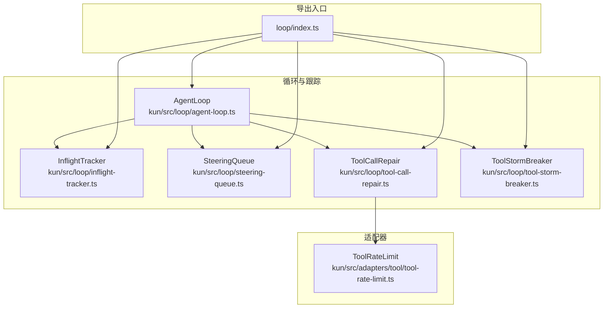
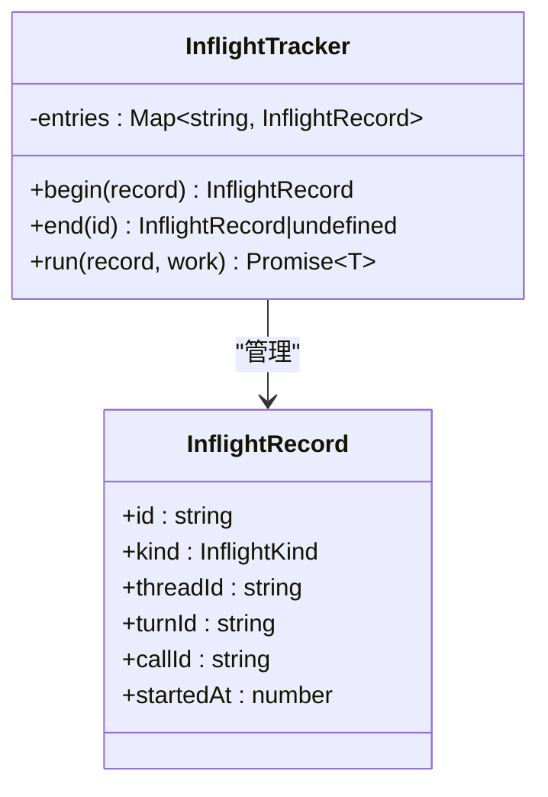
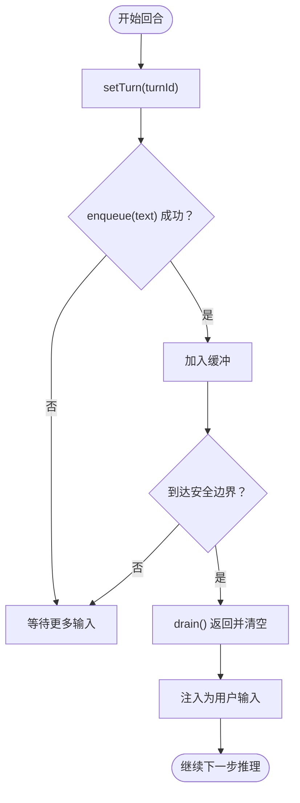
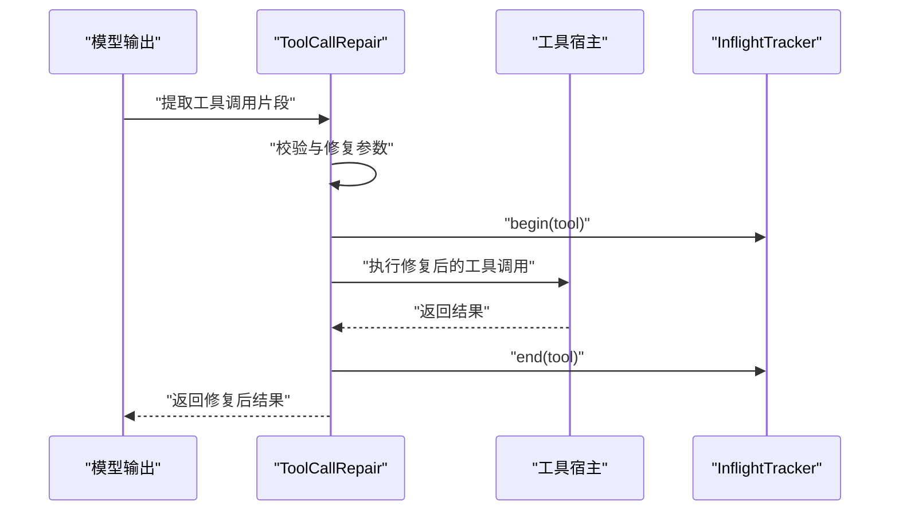
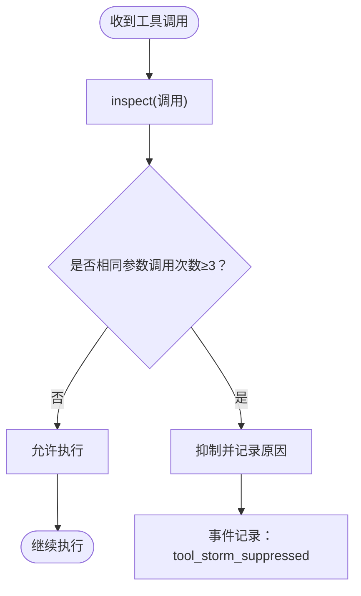
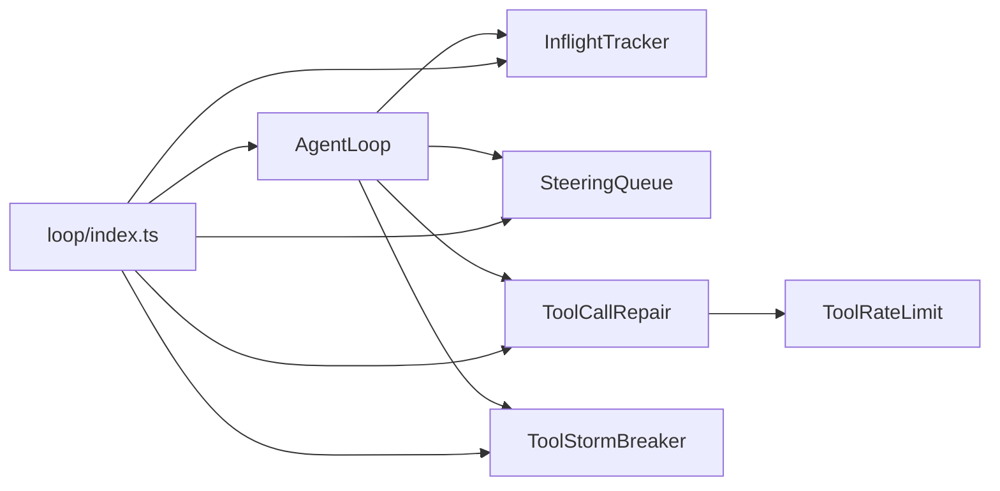

# 在途跟踪

<cite>
**本文引用的文件**
- [inflight-tracker.ts](file://kun/src/loop/inflight-tracker.ts)
- [steering-queue.ts](file://kun/src/loop/steering-queue.ts)
- [tool-call-repair.ts](file://kun/src/loop/tool-call-repair.ts)
- [tool-storm-breaker.ts](file://kun/src/loop/tool-storm-breaker.ts)
- [agent-loop.ts](file://kun/src/loop/agent-loop.ts)
- [index.ts](file://kun/src/loop/index.ts)
- [tool-rate-limit.ts](file://kun/src/adapters/tool/tool-rate-limit.ts)
- [kun-contributing.en.md](file://docs/kun-contributing.en.md)
- [loop.test.ts](file://kun/tests/loop.test.ts)
- [tool-storm-breaker.test.ts](file://kun/tests/tool-storm-breaker.test.ts)
</cite>

## 目录
1. [引言](#引言)
2. [项目结构](#项目结构)
3. [核心组件](#核心组件)
4. [架构总览](#架构总览)
5. [详细组件分析](#详细组件分析)
6. [依赖关系分析](#依赖关系分析)
7. [性能考量](#性能考量)
8. [故障排查指南](#故障排查指南)
9. [结论](#结论)
10. [附录](#附录)

## 引言
本技术文档聚焦于“在途跟踪系统”，围绕智能体在运行过程中对任务与工具调用的实时跟踪能力展开，涵盖以下关键主题：
- 在途跟踪器（InflightTracker）：如何稳定地记录并清理模型与工具的在途工作，保证事件流一致性与资源回收。
- 转向队列（SteeringQueue）：如何在回合中收集并注入用户动态输入，以安全边界为条件进行注入，从而动态调整任务优先级与执行顺序。
- 工具调用修复（Tool Call Repair）：如何识别并修复模型输出中的工具参数错误，提升工具调用成功率与鲁棒性。
- 工具风暴抑制（Tool Storm Breaker）：如何检测并抑制重复、高风险的工具调用，避免系统过载或误用。
- 配置选项、监控指标与故障诊断：帮助运维与开发者理解系统行为、优化性能并快速定位问题。

## 项目结构
在途跟踪系统位于领域层的 loop 子模块，采用端口与适配器（Ports & Adapters）架构，确保核心行为与外部依赖解耦。其主要文件分布如下：
- loop 核心：agent-loop.ts、inflight-tracker.ts、steering-queue.ts、tool-call-repair.ts、tool-storm-breaker.ts
- 导出入口：loop/index.ts
- 相关适配器：tool-rate-limit.ts（工具限流结果解析）
- 文档与测试：docs/kun-contributing.en.md、tests/loop.test.ts、tests/tool-storm-breaker.test.ts



图表来源
- [agent-loop.ts](file://kun/src/loop/agent-loop.ts)
- [inflight-tracker.ts](file://kun/src/loop/inflight-tracker.ts)
- [steering-queue.ts](file://kun/src/loop/steering-queue.ts)
- [tool-call-repair.ts](file://kun/src/loop/tool-call-repair.ts)
- [tool-storm-breaker.ts](file://kun/src/loop/tool-storm-breaker.ts)
- [index.ts](file://kun/src/loop/index.ts)
- [tool-rate-limit.ts](file://kun/src/adapters/tool/tool-rate-limit.ts)

章节来源
- [kun-contributing.en.md](file://docs/kun-contributing.en.md)
- [index.ts](file://kun/src/loop/index.ts)

## 核心组件
- 在途跟踪器（InflightTracker）：以稳定 ID 记录模型与工具的开始与结束，确保成功、失败与中断时均能清理，是 SSE 事件流权威来源。
- 转向队列（SteeringQueue）：在回合内收集用户动态输入，按安全边界注入，清空回合完成或中断。
- 工具调用修复（ToolCallRepair）：解析并修复模型输出中的工具参数，支持重试与降级。
- 工具风暴抑制（ToolStormBreaker）：检测重复、高风险工具调用，抑制以保护系统稳定性。

章节来源
- [inflight-tracker.ts](file://kun/src/loop/inflight-tracker.ts)
- [steering-queue.ts](file://kun/src/loop/steering-queue.ts)
- [tool-call-repair.ts](file://kun/src/loop/tool-call-repair.ts)
- [tool-storm-breaker.ts](file://kun/src/loop/tool-storm-breaker.ts)

## 架构总览
下图展示在途跟踪系统在 AgentLoop 中的协作关系：模型请求触发工具调用，工具执行通过 InflightTracker 追踪，同时 SteeringQueue 注入用户输入，ToolCallRepair 与 ToolStormBreaker 提升可靠性与安全性。

```mermaid
sequenceDiagram
participant UI as "用户界面"
participant Loop as "AgentLoop"
participant IT as "InflightTracker"
participant SQ as "SteeringQueue"
participant TR as "ToolCallRepair"
participant SB as "ToolStormBreaker"
UI->>Loop : "发起回合/提交动态输入"
Loop->>IT : "begin(model)"
Loop->>Loop : "模型推理"
Loop->>SQ : "enqueue(动态输入)"
Loop->>TR : "解析并修复工具调用"
Loop->>IT : "begin(tool)"
Loop->>Loop : "执行工具"
Loop->>IT : "end(tool)"
Loop->>IT : "end(model)"
Loop->>SQ : "drain() 安全边界注入"
Loop-->>UI : "SSE 事件流开始/完成"
```

图表来源
- [agent-loop.ts](file://kun/src/loop/agent-loop.ts)
- [inflight-tracker.ts](file://kun/src/loop/inflight-tracker.ts)
- [steering-queue.ts](file://kun/src/loop/steering-queue.ts)
- [tool-call-repair.ts](file://kun/src/loop/tool-call-repair.ts)
- [tool-storm-breaker.ts](file://kun/src/loop/tool-storm-breaker.ts)

## 详细组件分析

### 在途跟踪器（InflightTracker）
- 设计目标：以稳定 ID 跟踪模型与工具的运行状态，保证无论成功、失败或中断都能清理，确保事件流一一对应且不泄漏。
- 关键数据结构：
  - InflightKind：区分模型与工具两类在途工作。
  - InflightRecord：包含唯一 ID、类型、线程 ID、回合 ID、调用 ID、开始时间等字段。
- 核心方法：
  - begin(record)：注册在途记录并返回完整记录。
  - end(id)：移除并返回对应记录。
  - run(record, work)：自动 begin 并在工作抛错或中断时保证 end 清理，返回工作结果。
- 事件一致性：每个 begin 对应一个工具调用的“开始/完成”配对，是 SSE 事件流的权威来源。



图表来源
- [inflight-tracker.ts](file://kun/src/loop/inflight-tracker.ts)

章节来源
- [inflight-tracker.ts](file://kun/src/loop/inflight-tracker.ts)

### 转向队列（SteeringQueue）
- 设计目标：在回合运行期间接收并缓冲用户动态输入，在安全边界注入为用户输入，从而动态调整任务优先级与执行顺序。
- 关键行为：
  - setTurn(turnId)：切换回合时清空缓冲并更新当前回合标识。
  - enqueue(turnId, text)：仅当回合一致时追加非空文本。
  - drain()：返回并清空缓冲内容，用于在安全边界注入。
  - peek()：查看待注入文本但不移除，供 UI 展示“待注入”状态。
  - clear()：显式清空并复位。
- 安全边界：在模型响应之后、下一次模型请求之前注入，避免破坏推理一致性。



图表来源
- [steering-queue.ts](file://kun/src/loop/steering-queue.ts)

章节来源
- [steering-queue.ts](file://kun/src/loop/steering-queue.ts)

### 工具调用修复（ToolCallRepair）
- 功能概述：解析模型输出中的工具调用片段，修复参数格式与类型错误，必要时进行重试或降级，提高工具调用成功率。
- 典型流程：
  - 捕获模型输出中的工具调用片段。
  - 校验参数合法性与类型匹配。
  - 修复后重新生成调用参数，或回退到安全默认值。
  - 与 InflightTracker 协作，确保修复过程可追踪与可清理。
- 测试验证：单元测试覆盖了参数包裹修复与风暴抑制场景，确保修复逻辑与安全策略协同工作。



图表来源
- [tool-call-repair.ts](file://kun/src/loop/tool-call-repair.ts)
- [inflight-tracker.ts](file://kun/src/loop/inflight-tracker.ts)

章节来源
- [tool-call-repair.ts](file://kun/src/loop/tool-call-repair.ts)
- [loop.test.ts](file://kun/tests/loop.test.ts)

### 工具风暴抑制（ToolStormBreaker）
- 功能概述：检测同一回合内重复、高风险的工具调用，抑制第三次及以后的相同调用，防止资源滥用与误用。
- 关键策略：
  - 参数规范化：统一键顺序等，避免因键顺序不同导致的误判。
  - 历史重置：在文件变更类调用后允许后续只读调用恢复。
  - 抑制原因：明确提示“相同参数重复 N 次”等信息，便于诊断。
- 可配置性：可通过循环配置禁用风暴抑制，满足特定场景需求。



图表来源
- [tool-storm-breaker.ts](file://kun/src/loop/tool-storm-breaker.ts)
- [tool-storm-breaker.test.ts](file://kun/tests/tool-storm-breaker.test.ts)

章节来源
- [tool-storm-breaker.ts](file://kun/src/loop/tool-storm-breaker.ts)
- [tool-storm-breaker.test.ts](file://kun/tests/tool-storm-breaker.test.ts)
- [loop.test.ts](file://kun/tests/loop.test.ts)

### AgentLoop 协调与事件流
- AgentLoop 作为状态化协调器，负责：
  - 管理回合生命周期与失败处理。
  - 维护工具风暴抑制器与自动模型路由等组件。
  - 与 InflightTracker、SteeringQueue、ToolCallRepair、ToolStormBreaker 协同，确保事件一致性与系统稳定性。
- 事件与监控：
  - InflightTracker 是 SSE 事件流权威来源，每个 begin 对应工具调用的“开始/完成”配对。
  - SteeringQueue 的 drain() 在安全边界注入用户输入，影响后续推理路径。
  - ToolStormBreaker 的抑制事件被记录，便于审计与诊断。

章节来源
- [agent-loop.ts](file://kun/src/loop/agent-loop.ts)
- [inflight-tracker.ts](file://kun/src/loop/inflight-tracker.ts)
- [steering-queue.ts](file://kun/src/loop/steering-queue.ts)
- [tool-storm-breaker.ts](file://kun/src/loop/tool-storm-breaker.ts)

## 依赖关系分析
- 组件内聚与耦合：
  - InflightTracker 与 AgentLoop 强耦合，是事件流与资源清理的核心。
  - SteeringQueue 与 AgentLoop 松耦合，仅在安全边界交互。
  - ToolCallRepair 与 ToolStormBreaker 与 AgentLoop 通过工具调用链路耦合。
- 外部依赖：
  - ToolRateLimit 适配器用于解析工具调用的限流结果，为修复与重试策略提供依据。
- 导出入口：
  - loop/index.ts 统一导出核心组件，便于上层使用。



图表来源
- [index.ts](file://kun/src/loop/index.ts)
- [agent-loop.ts](file://kun/src/loop/agent-loop.ts)
- [inflight-tracker.ts](file://kun/src/loop/inflight-tracker.ts)
- [steering-queue.ts](file://kun/src/loop/steering-queue.ts)
- [tool-call-repair.ts](file://kun/src/loop/tool-call-repair.ts)
- [tool-storm-breaker.ts](file://kun/src/loop/tool-storm-breaker.ts)
- [tool-rate-limit.ts](file://kun/src/adapters/tool/tool-rate-limit.ts)

章节来源
- [index.ts](file://kun/src/loop/index.ts)

## 性能考量
- 资源清理与内存占用：
  - InflightTracker 使用 Map 存储在途记录，建议控制并发规模与及时 end，避免长期驻留。
- 事件流开销：
  - SSE 事件由 InflightTracker 驱动，频繁的工具调用会增加事件数量，需结合业务场景评估频率。
- 限流与重试：
  - ToolRateLimit 解析限流信息，合理设置重试间隔与退避策略，避免雪崩效应。
- 风暴抑制：
  - ToolStormBreaker 通过抑制重复调用降低系统负载，但可能影响用户体验，需根据场景权衡。

## 故障排查指南
- 常见问题与定位方法：
  - 工具调用失败：检查 ToolCallRepair 的修复日志与 ToolRateLimit 的限流输出，确认参数合法性与重试策略。
  - 工具风暴抑制：关注事件记录中的 tool_storm_suppressed，核对参数规范化与历史重置逻辑。
  - 事件流不一致：核查 InflightTracker 的 begin/end 是否成对出现，是否存在未清理的在途记录。
  - 动态输入未注入：确认 SteeringQueue 的 setTurn 与 drain 调用时机，确保在安全边界注入。
- 诊断建议：
  - 启用详细日志：记录 InflightTracker 的 begin/end、ToolCallRepair 的修复步骤、ToolStormBreaker 的抑制原因。
  - 回放测试：参考 tests/loop.test.ts 与 tests/tool-storm-breaker.test.ts 的用例，构造最小复现场景。
  - 监控指标：基于 InflightTracker 的记录统计吞吐、延迟与失败率；结合 SSE 事件流观察实时状态。

章节来源
- [loop.test.ts](file://kun/tests/loop.test.ts)
- [tool-storm-breaker.test.ts](file://kun/tests/tool-storm-breaker.test.ts)
- [tool-rate-limit.ts](file://kun/src/adapters/tool/tool-rate-limit.ts)

## 结论
在途跟踪系统通过 InflightTracker、SteeringQueue、ToolCallRepair 与 ToolStormBreaker 的协同，实现了对智能体任务与工具调用的实时监控、动态调整与安全防护。该体系以事件流为纽带，既保证了可观测性与一致性，又提供了灵活的修复与抑制机制，适合在复杂多变的运行环境中保持稳定与高效。

## 附录
- 配置与扩展建议：
  - 在 AgentLoop 构造阶段注入自定义的 ToolStormBreaker 策略或禁用开关。
  - 结合 ToolRateLimit 的解析结果，定制工具调用的重试与退避策略。
  - 通过 SteeringQueue 的 UI 层展示“待注入”状态，提升用户感知与控制力。
- 监控指标建议：
  - 在途任务数、平均在途时长、工具调用成功率、风暴抑制次数、限流事件数、SSE 事件速率。