# 智能体循环系统

<cite>
**本文引用的文件**
- [agent-loop.ts](file://kun/src/loop/agent-loop.ts)
- [append-only-session-log.ts](file://kun/src/loop/append-only-session-log.ts)
- [auto-model-router.ts](file://kun/src/loop/auto-model-router.ts)
- [token-economy.ts](file://kun/src/loop/token-economy.ts)
- [context-compactor.ts](file://kun/src/loop/context-compactor.ts)
- [inflight-tracker.ts](file://kun/src/loop/inflight-tracker.ts)
- [steering-queue.ts](file://kun/src/loop/steering-queue.ts)
- [immutable-prefix.ts](file://kun/src/cache/immutable-prefix.ts)
- [prefix-volatility.ts](file://kun/src/cache/prefix-volatility.ts)
- [tool-catalog-fingerprint.ts](file://kun/src/cache/tool-catalog-fingerprint.ts)
- [kun-system-prompt.ts](file://kun/src/prompt/kun-system-prompt.ts)
- [cache-telemetry.ts](file://kun/src/telemetry/cache-telemetry.ts)
- [kun-cache-optimization.md](file://docs/kun-cache-optimization.md)
- [runtime-factory.ts](file://kun/src/server/runtime-factory.ts)
- [delegation-runtime.ts](file://kun/src/delegation/delegation-runtime.ts)
- [child-agent-executor.ts](file://kun/src/delegation/child-agent-executor.ts)
- [loop.test.ts](file://kun/tests/loop.test.ts)
- [loop-test-harness.ts](file://kun/tests/loop-test-harness.ts)
</cite>

## 目录
1. [引言](#引言)
2. [项目结构](#项目结构)
3. [核心组件](#核心组件)
4. [架构总览](#架构总览)
5. [详细组件分析](#详细组件分析)
6. [依赖关系分析](#依赖关系分析)
7. [性能考量](#性能考量)
8. [故障排查指南](#故障排查指南)
9. [结论](#结论)
10. [附录](#附录)

## 引言
本文件面向 DeepSeek GUI 的智能体循环系统，系统性阐述 Agent Loop 的核心架构与关键机制：cache-first 设计理念、不可变前缀（immutable prompt prefix）、追加式会话日志（append-only session log）、自动模型路由、Token 经济模型、上下文压缩、工具上下文优化、在途跟踪（in-flight tracking）、中段转向队列（mid-turn steering queue）、上下文压缩（context compaction），以及缓存优化策略与性能监控。文档同时提供扩展指导与最佳实践，帮助开发者理解并安全地演进该系统。

## 项目结构
智能体循环系统位于 kun/src/loop 目录，围绕 Agent Loop 核心流程组织多个子模块，并通过缓存与提示词管理模块提供稳定前缀与指纹校验能力；服务层与委托执行器通过运行时工厂集成循环系统，形成端到端的推理与工具调用闭环。

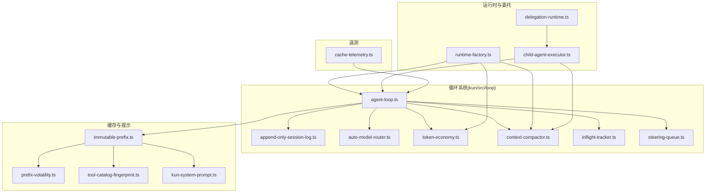

图示来源
- [agent-loop.ts:1-200](file://kun/src/loop/agent-loop.ts#L1-L200)
- [append-only-session-log.ts:1-200](file://kun/src/loop/append-only-session-log.ts#L1-L200)
- [auto-model-router.ts:1-200](file://kun/src/loop/auto-model-router.ts#L1-L200)
- [token-economy.ts:1-200](file://kun/src/loop/token-economy.ts#L1-L200)
- [context-compactor.ts:1-200](file://kun/src/loop/context-compactor.ts#L1-L200)
- [inflight-tracker.ts:1-200](file://kun/src/loop/inflight-tracker.ts#L1-L200)
- [steering-queue.ts:1-200](file://kun/src/loop/steering-queue.ts#L1-L200)
- [immutable-prefix.ts:1-200](file://kun/src/cache/immutable-prefix.ts#L1-L200)
- [prefix-volatility.ts:1-200](file://kun/src/cache/prefix-volatility.ts#L1-L200)
- [tool-catalog-fingerprint.ts:1-200](file://kun/src/cache/tool-catalog-fingerprint.ts#L1-L200)
- [kun-system-prompt.ts:1-200](file://kun/src/prompt/kun-system-prompt.ts#L1-L200)
- [runtime-factory.ts:1-200](file://kun/src/server/runtime-factory.ts#L1-L200)
- [delegation-runtime.ts:1-200](file://kun/src/delegation/delegation-runtime.ts#L1-L200)
- [child-agent-executor.ts:1-200](file://kun/src/delegation/child-agent-executor.ts#L1-L200)
- [cache-telemetry.ts:1-200](file://kun/src/telemetry/cache-telemetry.ts#L1-L200)

章节来源
- [agent-loop.ts:1-200](file://kun/src/loop/agent-loop.ts#L1-L200)
- [runtime-factory.ts:1-200](file://kun/src/server/runtime-factory.ts#L1-L200)

## 核心组件
- Agent Loop：循环主控制器，协调模型请求、工具调用、上下文压缩与会话日志更新。
- 追加式会话日志：保证历史不可篡改，支持回溯与一致性验证。
- 自动模型路由：根据上下文与成本估算选择最优模型，平衡性能与质量。
- Token 经济模型：在工具上下文压缩前进行安全裁剪，控制成本与上下文长度。
- 上下文压缩器：对历史与工具上下文进行压缩，维持可接受的上下文窗口。
- 在途跟踪：记录当前在处理的工具调用，避免重复执行与竞态。
- 中段转向队列：在一次对话轮次内动态插入或调整后续动作，提升交互灵活性。
- 不可变前缀与指纹：确保系统提示、工具清单等稳定不变，保障缓存命中与一致性。
- 缓存遥测：统计缓存命中与失效，辅助性能优化与问题定位。

章节来源
- [agent-loop.ts:1-200](file://kun/src/loop/agent-loop.ts#L1-L200)
- [append-only-session-log.ts:1-200](file://kun/src/loop/append-only-session-log.ts#L1-L200)
- [auto-model-router.ts:1-200](file://kun/src/loop/auto-model-router.ts#L1-L200)
- [token-economy.ts:1-200](file://kun/src/loop/token-economy.ts#L1-L200)
- [context-compactor.ts:1-200](file://kun/src/loop/context-compactor.ts#L1-L200)
- [inflight-tracker.ts:1-200](file://kun/src/loop/inflight-tracker.ts#L1-L200)
- [steering-queue.ts:1-200](file://kun/src/loop/steering-queue.ts#L1-L200)
- [immutable-prefix.ts:1-200](file://kun/src/cache/immutable-prefix.ts#L1-L200)
- [tool-catalog-fingerprint.ts:1-200](file://kun/src/cache/tool-catalog-fingerprint.ts#L1-L200)
- [kun-system-prompt.ts:1-200](file://kun/src/prompt/kun-system-prompt.ts#L1-L200)
- [cache-telemetry.ts:1-200](file://kun/src/telemetry/cache-telemetry.ts#L1-L200)

## 架构总览
Agent Loop 将“提示词构建—模型推理—工具调用—上下文压缩—日志更新”串联为一个稳定的循环。自动模型路由与 Token 经济模型在每次推理前评估成本与上下文长度，确保在预算内完成任务。上下文压缩器在必要时对历史与工具上下文进行压缩，保持模型输入可控。在途跟踪与中段转向队列保证并发与动态行为的正确性与一致性。

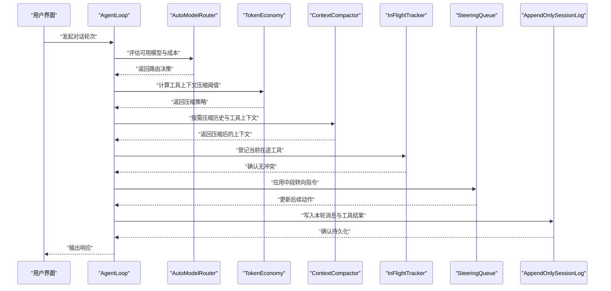

图示来源
- [agent-loop.ts:1-200](file://kun/src/loop/agent-loop.ts#L1-L200)
- [auto-model-router.ts:1-200](file://kun/src/loop/auto-model-router.ts#L1-L200)
- [token-economy.ts:1-200](file://kun/src/loop/token-economy.ts#L1-L200)
- [context-compactor.ts:1-200](file://kun/src/loop/context-compactor.ts#L1-L200)
- [inflight-tracker.ts:1-200](file://kun/src/loop/inflight-tracker.ts#L1-L200)
- [steering-queue.ts:1-200](file://kun/src/loop/steering-queue.ts#L1-L200)
- [append-only-session-log.ts:1-200](file://kun/src/loop/append-only-session-log.ts#L1-L200)

## 详细组件分析

### Agent Loop 核心流程
- 责任边界：负责单轮对话的编排，协调模型路由、上下文压缩、工具执行与日志更新。
- 关键点：
  - 在每次模型调用前，先进行上下文压缩与工具上下文优化。
  - 使用在途跟踪避免重复执行同一工具。
  - 支持中段转向队列以动态调整后续动作。
  - 通过不可变前缀与指纹校验，确保缓存稳定性与一致性。

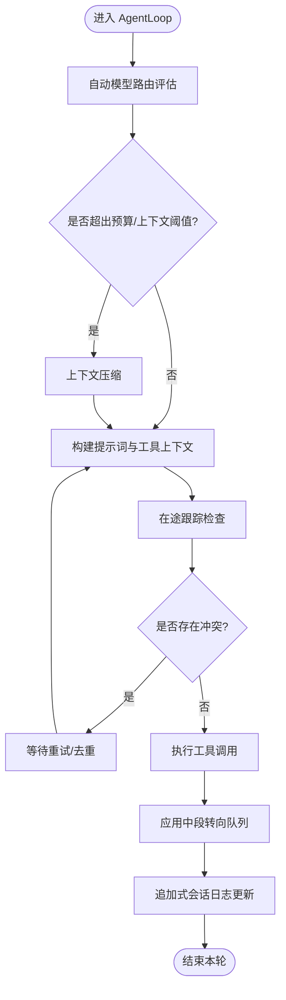

图示来源
- [agent-loop.ts:1-200](file://kun/src/loop/agent-loop.ts#L1-L200)
- [context-compactor.ts:1-200](file://kun/src/loop/context-compactor.ts#L1-L200)
- [inflight-tracker.ts:1-200](file://kun/src/loop/inflight-tracker.ts#L1-L200)
- [steering-queue.ts:1-200](file://kun/src/loop/steering-queue.ts#L1-L200)
- [append-only-session-log.ts:1-200](file://kun/src/loop/append-only-session-log.ts#L1-L200)

章节来源
- [agent-loop.ts:1-200](file://kun/src/loop/agent-loop.ts#L1-L200)

### 追加式会话日志（Append-Only Session Log）
- 设计目标：保证历史消息不可篡改，便于审计、回放与一致性校验。
- 实现要点：
  - 消息追加只允许在尾部进行，不支持随机修改。
  - 日志项包含时间戳、角色、内容与工具调用结果等元数据。
  - 提供快照与增量读取接口，支撑上下文压缩与回溯。

图示来源
- [append-only-session-log.ts:1-200](file://kun/src/loop/append-only-session-log.ts#L1-L200)

章节来源
- [append-only-session-log.ts:1-200](file://kun/src/loop/append-only-session-log.ts#L1-L200)

### 自动模型路由（Auto Model Router）
- 功能：根据当前上下文大小、历史长度、工具调用成本与预算，选择最合适的模型。
- 关键指标：上下文占用估计、吞吐量、单价、可用性。
- 输出：模型选择与参数配置（如温度、最大生成长度）。

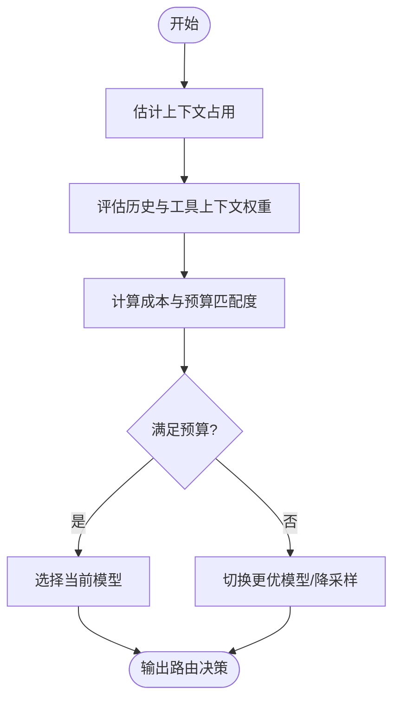

图示来源
- [auto-model-router.ts:1-200](file://kun/src/loop/auto-model-router.ts#L1-L200)

章节来源
- [auto-model-router.ts:1-200](file://kun/src/loop/auto-model-router.ts#L1-L200)

### Token 经济模型（Token Economy）
- 目标：在模型调用前对工具上下文进行安全压缩，控制总 Token 成本。
- 策略：
  - 优先保留高价值工具与近期结果。
  - 对低相关性或冗余上下文进行截断或摘要。
  - 结合预算阈值与模型窗口上限动态调整。
- 与上下文压缩器协同工作，确保输入长度与成本可控。

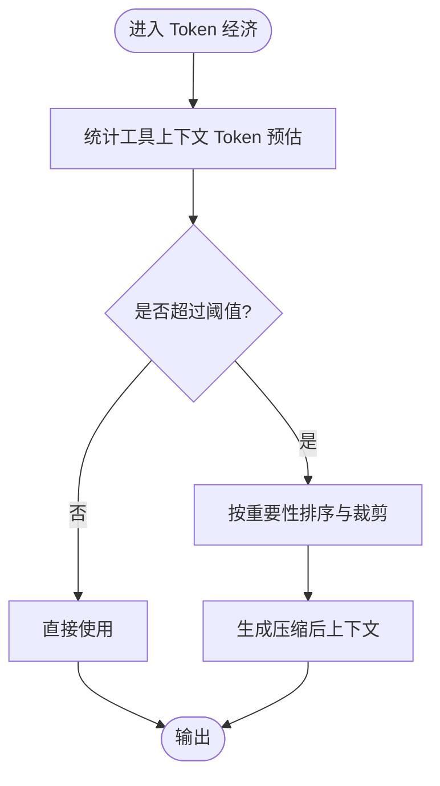

图示来源
- [token-economy.ts:1-200](file://kun/src/loop/token-economy.ts#L1-L200)

章节来源
- [token-economy.ts:1-200](file://kun/src/loop/token-economy.ts#L1-L200)

### 上下文压缩器（Context Compactor）
- 职责：在不丢失关键信息的前提下，将历史与工具上下文压缩至模型窗口以内。
- 技术手段：
  - 历史消息分层压缩（摘要/截断）。
  - 工具上下文去重与合并。
  - 基于稳定性与相关性的优先级策略。
- 与不可变前缀配合，确保压缩过程不影响缓存稳定性。

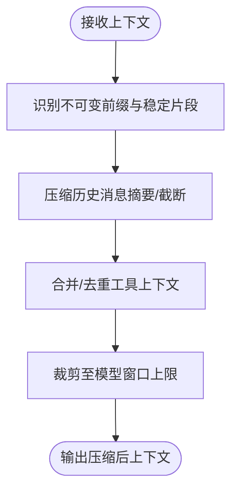

图示来源
- [context-compactor.ts:1-200](file://kun/src/loop/context-compactor.ts#L1-L200)

章节来源
- [context-compactor.ts:1-200](file://kun/src/loop/context-compactor.ts#L1-L200)

### 在途跟踪（InFlight Tracker）
- 目的：避免重复执行相同工具或产生竞态条件。
- 行为：登记当前活跃工具调用，查询冲突，必要时阻塞或去重。
- 与工具宿主协作，确保幂等与一致性。

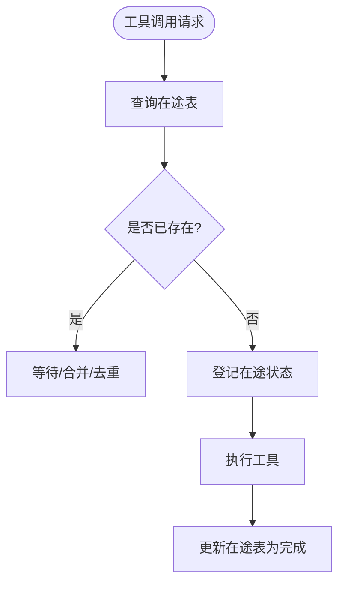

图示来源
- [inflight-tracker.ts:1-200](file://kun/src/loop/inflight-tracker.ts#L1-L200)

章节来源
- [inflight-tracker.ts:1-200](file://kun/src/loop/inflight-tracker.ts#L1-L200)

### 中段转向队列（Mid-Turn Steering Queue）
- 作用：在一轮对话中动态插入或调整后续动作，提升交互灵活性与响应性。
- 场景：用户干预、工具失败重试、动态计划调整等。
- 与 Agent Loop 协同，在下一次模型调用前应用队列中的指令。

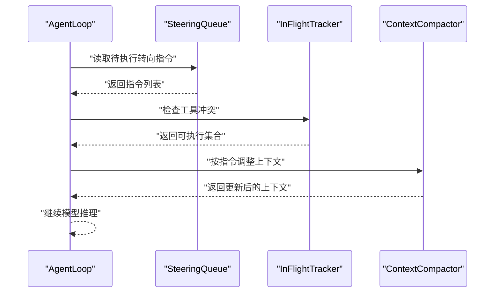

图示来源
- [steering-queue.ts:1-200](file://kun/src/loop/steering-queue.ts#L1-L200)
- [inflight-tracker.ts:1-200](file://kun/src/loop/inflight-tracker.ts#L1-L200)
- [context-compactor.ts:1-200](file://kun/src/loop/context-compactor.ts#L1-L200)

章节来源
- [steering-queue.ts:1-200](file://kun/src/loop/steering-queue.ts#L1-L200)

### 不可变前缀与指纹校验
- 不可变前缀（Immutable Prefix）：将长期稳定的系统提示、工具约束与缓存约定固化为不可变片段，生成稳定指纹。
- 工具目录指纹（Tool Catalog Fingerprint）：对工具定义进行规范化排序与键序标准化，确保指纹稳定。
- 前缀波动检测（Prefix Volatility）：在每次模型步骤前验证前缀是否被静默漂移，一旦发现立即抛错，防止缓存劣化。

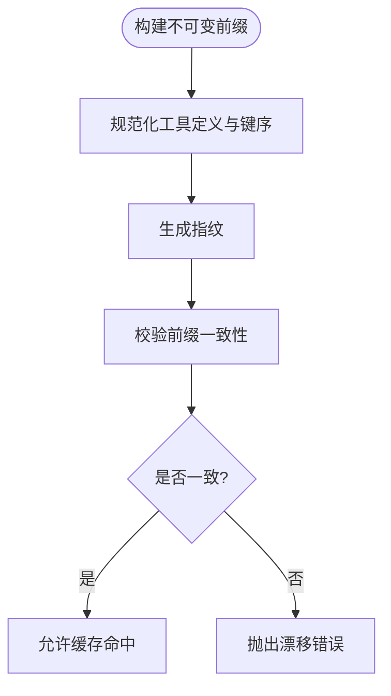

图示来源
- [immutable-prefix.ts:1-200](file://kun/src/cache/immutable-prefix.ts#L1-L200)
- [tool-catalog-fingerprint.ts:1-200](file://kun/src/cache/tool-catalog-fingerprint.ts#L1-L200)
- [prefix-volatility.ts:1-200](file://kun/src/cache/prefix-volatility.ts#L1-L200)
- [kun-system-prompt.ts:1-200](file://kun/src/prompt/kun-system-prompt.ts#L1-L200)

章节来源
- [immutable-prefix.ts:1-200](file://kun/src/cache/immutable-prefix.ts#L1-L200)
- [tool-catalog-fingerprint.ts:1-200](file://kun/src/cache/tool-catalog-fingerprint.ts#L1-L200)
- [prefix-volatility.ts:1-200](file://kun/src/cache/prefix-volatility.ts#L1-L200)
- [kun-system-prompt.ts:1-200](file://kun/src/prompt/kun-system-prompt.ts#L1-L200)
- [kun-cache-optimization.md:52-99](file://docs/kun-cache-optimization.md#L52-L99)

### 缓存优化策略与性能监控
- 稳定前缀：将 GUI 调用边界、工具行为约束、缓存约定等放入稳定前缀，避免因临时内容导致缓存失效。
- 工具 Schema 规范化：对 JSON Schema 键序进行标准化，减少指纹波动。
- 原生缓存命中统计：结合遥测模块记录缓存命中率与失效原因，辅助优化。
- 性能监控：通过遥测与日志记录关键指标（上下文长度、Token 消耗、模型选择、压缩比例、在途冲突率）。

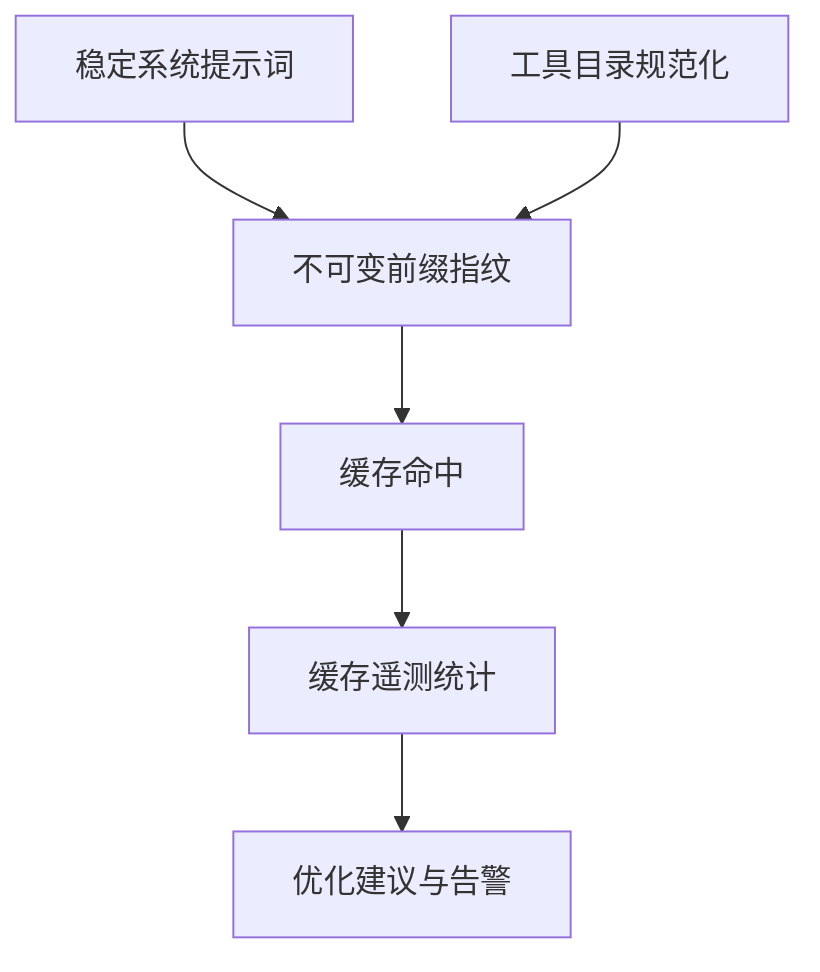

图示来源
- [kun-system-prompt.ts:1-200](file://kun/src/prompt/kun-system-prompt.ts#L1-L200)
- [immutable-prefix.ts:1-200](file://kun/src/cache/immutable-prefix.ts#L1-L200)
- [tool-catalog-fingerprint.ts:1-200](file://kun/src/cache/tool-catalog-fingerprint.ts#L1-L200)
- [cache-telemetry.ts:1-200](file://kun/src/telemetry/cache-telemetry.ts#L1-L200)

章节来源
- [kun-cache-optimization.md:52-99](file://docs/kun-cache-optimization.md#L52-L99)
- [cache-telemetry.ts:1-200](file://kun/src/telemetry/cache-telemetry.ts#L1-L200)

### 运行时集成与委托执行
- 运行时工厂：在服务启动时注入 Agent Loop、上下文压缩器与 Token 经济配置，统一管理生命周期。
- 委托运行时与子代理执行器：在复杂任务中，通过委托运行时创建子代理，复用 Agent Loop 的上下文压缩与工具执行能力。

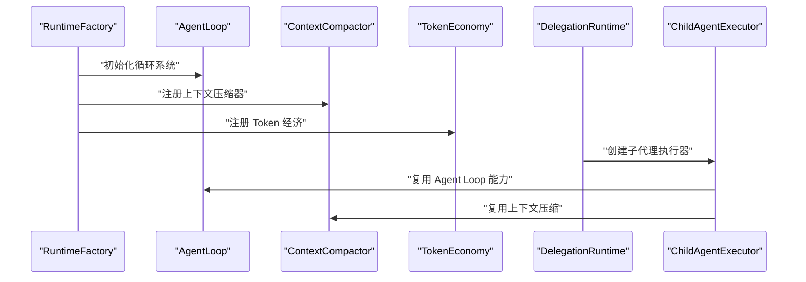

图示来源
- [runtime-factory.ts:1-200](file://kun/src/server/runtime-factory.ts#L1-L200)
- [delegation-runtime.ts:1-200](file://kun/src/delegation/delegation-runtime.ts#L1-L200)
- [child-agent-executor.ts:1-200](file://kun/src/delegation/child-agent-executor.ts#L1-L200)

章节来源
- [runtime-factory.ts:1-200](file://kun/src/server/runtime-factory.ts#L1-L200)
- [delegation-runtime.ts:1-200](file://kun/src/delegation/delegation-runtime.ts#L1-L200)
- [child-agent-executor.ts:1-200](file://kun/src/delegation/child-agent-executor.ts#L1-L200)

## 依赖关系分析
- 模块内聚：Agent Loop 与上下文压缩、在途跟踪、中段转向队列紧密耦合，共同保证推理与工具执行的正确性。
- 外部依赖：自动模型路由与 Token 经济依赖模型客户端与定价模型；缓存稳定性依赖不可变前缀与指纹校验。
- 循环依赖规避：通过接口抽象与运行时注入，避免直接 import 导致的循环。

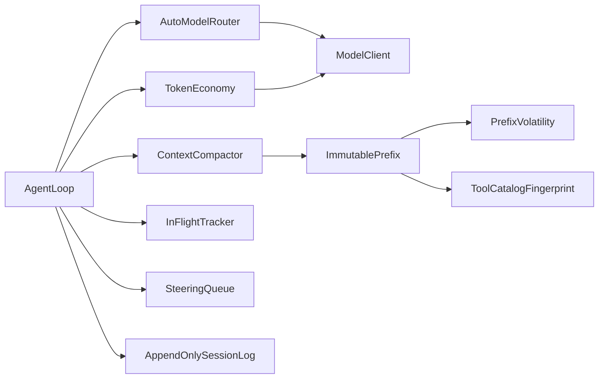

图示来源
- [agent-loop.ts:1-200](file://kun/src/loop/agent-loop.ts#L1-L200)
- [auto-model-router.ts:1-200](file://kun/src/loop/auto-model-router.ts#L1-L200)
- [token-economy.ts:1-200](file://kun/src/loop/token-economy.ts#L1-L200)
- [context-compactor.ts:1-200](file://kun/src/loop/context-compactor.ts#L1-L200)
- [inflight-tracker.ts:1-200](file://kun/src/loop/inflight-tracker.ts#L1-L200)
- [steering-queue.ts:1-200](file://kun/src/loop/steering-queue.ts#L1-L200)
- [append-only-session-log.ts:1-200](file://kun/src/loop/append-only-session-log.ts#L1-L200)
- [immutable-prefix.ts:1-200](file://kun/src/cache/immutable-prefix.ts#L1-L200)
- [prefix-volatility.ts:1-200](file://kun/src/cache/prefix-volatility.ts#L1-L200)
- [tool-catalog-fingerprint.ts:1-200](file://kun/src/cache/tool-catalog-fingerprint.ts#L1-L200)

章节来源
- [agent-loop.ts:1-200](file://kun/src/loop/agent-loop.ts#L1-L200)

## 性能考量
- 上下文窗口与成本控制：通过 Token 经济与上下文压缩器在预算内维持高效推理。
- 缓存命中率：稳定前缀与工具 Schema 规范化显著降低指纹波动，提升缓存命中。
- 并发与去重：在途跟踪减少重复执行，降低资源浪费。
- 监控与告警：缓存遥测与关键指标上报，辅助持续优化。

## 故障排查指南
- 缓存漂移错误：若出现不可变前缀漂移异常，检查系统提示词与工具定义是否被静默修改，核对指纹生成逻辑。
- 工具冲突与竞态：查看在途跟踪日志，确认是否存在重复执行或未清理的状态。
- 上下文过长：启用 Token 经济与上下文压缩器，检查压缩策略是否合理。
- 模型路由异常：核对自动模型路由的成本估算与上下文占用估计，确保预算与窗口限制设置正确。
- 测试与回归：参考测试套件与测试夹具，定位问题范围并编写最小化复现。

章节来源
- [loop.test.ts:1-200](file://kun/tests/loop.test.ts#L1-L200)
- [loop-test-harness.ts:1-200](file://kun/tests/loop-test-harness.ts#L1-L200)

## 结论
智能体循环系统通过 cache-first 设计、不可变前缀、追加式日志与多模块协同，实现了稳定、高效且可扩展的推理与工具执行闭环。自动模型路由与 Token 经济模型在成本与质量间取得平衡，上下文压缩与工具上下文优化保障了长上下文场景下的性能。在途跟踪与中段转向队列提升了并发安全性与交互灵活性。结合缓存优化策略与性能监控，系统具备良好的可维护性与演进空间。

## 附录
- 扩展建议：
  - 新增工具时，严格遵循工具 Schema 规范化流程，确保指纹稳定。
  - 在引入新的上下文压缩策略时，先在测试环境中验证压缩效果与一致性。
  - 对关键路径增加遥测埋点，持续观察缓存命中率与延迟分布。
- 最佳实践：
  - 将 GUI 调用边界、工具约束与缓存约定放入稳定前缀，避免临时内容影响缓存。
  - 在 Agent Loop 中仅做编排，具体模型调用与工具执行通过端口解耦，便于替换与测试。
  - 使用中段转向队列处理动态需求，但需限制指令数量与频率，避免过度打断。