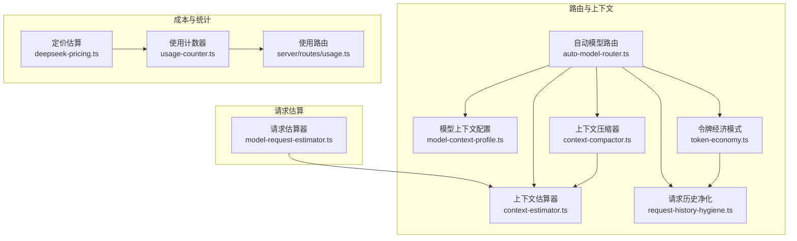
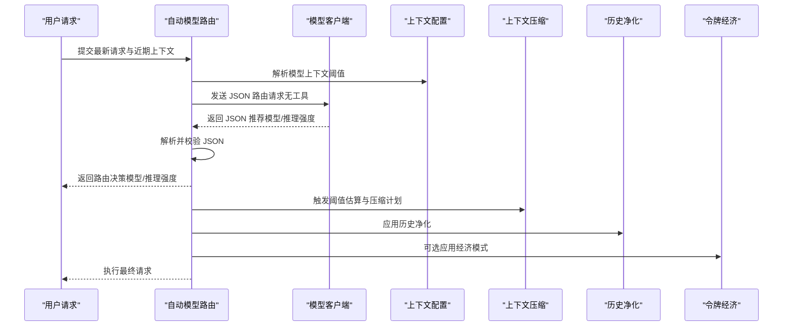
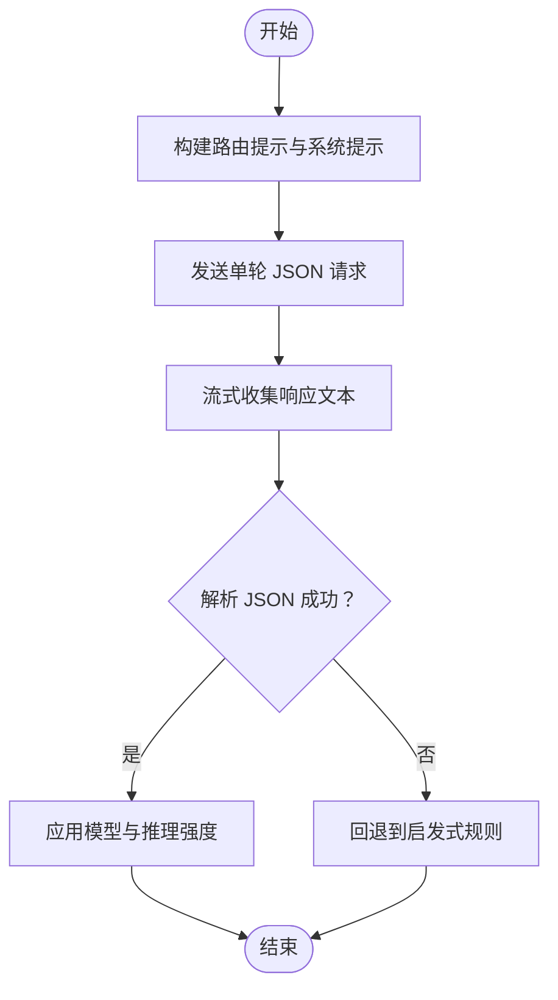
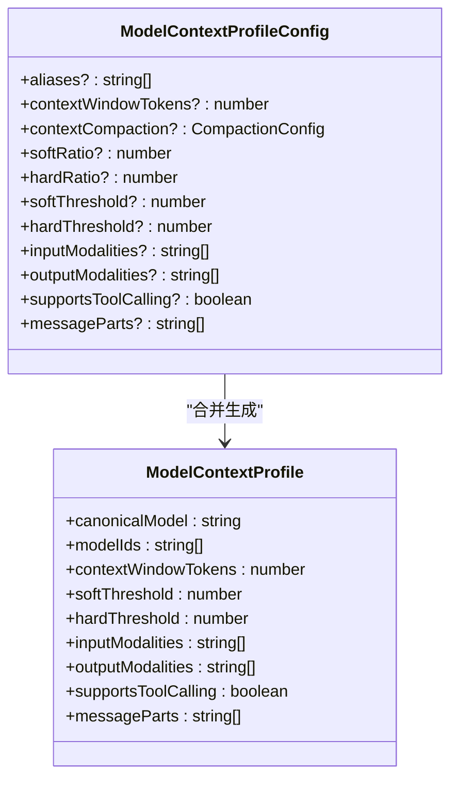
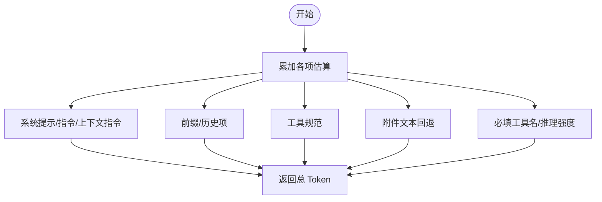
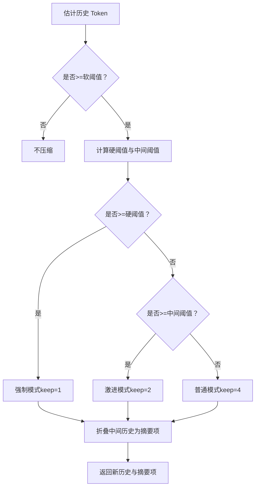
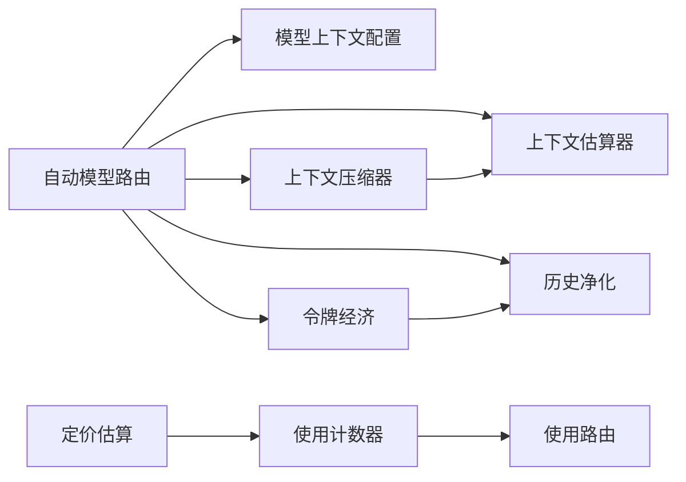

# 自动模型路由

<cite>
**本文引用的文件**
- [auto-model-router.ts](file://kun/src/loop/auto-model-router.ts)
- [model-context-profile.ts](file://kun/src/loop/model-context-profile.ts)
- [model-request-estimator.ts](file://kun/src/loop/model-request-estimator.ts)
- [context-estimator.ts](file://kun/src/loop/context-estimator.ts)
- [context-compactor.ts](file://kun/src/loop/context-compactor.ts)
- [request-history-hygiene.ts](file://kun/src/loop/request-history-hygiene.ts)
- [token-economy.ts](file://kun/src/loop/token-economy.ts)
- [auto-model-router.test.ts](file://kun/tests/auto-model-router.test.ts)
- [deepseek-pricing.ts](file://kun/src/adapters/model/deepseek-pricing.ts)
- [usage-counter.ts](file://kun/src/telemetry/usage-counter.ts)
- [usage.ts](file://kun/src/server/routes/usage.ts)
- [loop.test.ts](file://kun/tests/loop.test.ts)
</cite>

## 目录
1. [简介](#简介)
2. [项目结构](#项目结构)
3. [核心组件](#核心组件)
4. [架构总览](#架构总览)
5. [组件详解](#组件详解)
6. [依赖关系分析](#依赖关系分析)
7. [性能与成本考量](#性能与成本考量)
8. [故障排除指南](#故障排除指南)
9. [结论](#结论)
10. [附录：配置与最佳实践](#附录配置与最佳实践)

## 简介
本技术文档围绕“自动模型路由”体系，系统阐述智能体如何依据任务复杂度、上下文长度、性能要求等多维因素，自动选择最优模型（如 deepseek-v4-flash 与 deepseek-v4-pro），并结合模型上下文配置文件、请求估算器、上下文压缩与历史净化、以及可选的“令牌经济模式”，在保证质量的同时控制成本与延迟。文档同时给出路由决策流程、负载均衡与模型切换机制的实现要点，并提供配置示例与故障排除建议。

## 项目结构
自动模型路由相关代码主要位于 kun/src/loop 目录，围绕以下关键模块协同工作：
- 自动路由决策：auto-model-router.ts
- 模型上下文配置与能力边界：model-context-profile.ts
- 请求输入估算（Token 预估）：model-request-estimator.ts + context-estimator.ts
- 上下文压缩与阈值触发：context-compactor.ts
- 历史净化与限流：request-history-hygiene.ts
- 令牌经济模式（压缩工具描述/结果、简洁回复、历史净化）：token-economy.ts
- 成本估算与计费：deepseek-pricing.ts
- 使用统计与汇总：usage-counter.ts、server/routes/usage.ts

图表来源
- [auto-model-router.ts:1-282](file://kun/src/loop/auto-model-router.ts#L1-L282)
- [model-context-profile.ts:1-274](file://kun/src/loop/model-context-profile.ts#L1-L274)
- [context-estimator.ts:1-49](file://kun/src/loop/context-estimator.ts#L1-L49)
- [context-compactor.ts:1-352](file://kun/src/loop/context-compactor.ts#L1-L352)
- [request-history-hygiene.ts:1-398](file://kun/src/loop/request-history-hygiene.ts#L1-L398)
- [token-economy.ts:1-416](file://kun/src/loop/token-economy.ts#L1-L416)
- [model-request-estimator.ts:1-53](file://kun/src/loop/model-request-estimator.ts#L1-L53)
- [deepseek-pricing.ts:95-118](file://kun/src/adapters/model/deepseek-pricing.ts#L95-L118)
- [usage-counter.ts:182-229](file://kun/src/telemetry/usage-counter.ts#L182-L229)
- [usage.ts:177-208](file://kun/src/server/routes/usage.ts#L177-L208)

章节来源
- [auto-model-router.ts:1-282](file://kun/src/loop/auto-model-router.ts#L1-L282)
- [model-context-profile.ts:1-274](file://kun/src/loop/model-context-profile.ts#L1-L274)
- [context-estimator.ts:1-49](file://kun/src/loop/context-estimator.ts#L1-L49)
- [context-compactor.ts:1-352](file://kun/src/loop/context-compactor.ts#L1-L352)
- [request-history-hygiene.ts:1-398](file://kun/src/loop/request-history-hygiene.ts#L1-L398)
- [token-economy.ts:1-416](file://kun/src/loop/token-economy.ts#L1-L416)
- [model-request-estimator.ts:1-53](file://kun/src/loop/model-request-estimator.ts#L1-L53)
- [deepseek-pricing.ts:95-118](file://kun/src/adapters/model/deepseek-pricing.ts#L95-L118)
- [usage-counter.ts:182-229](file://kun/src/telemetry/usage-counter.ts#L182-L229)
- [usage.ts:177-208](file://kun/src/server/routes/usage.ts#L177-L208)

## 核心组件
- 自动模型路由（resolveAutoModelRoute）：基于 LLM 的 JSON 输出进行模型与推理强度推荐，并回退到启发式规则。
- 模型上下文配置（ModelContextProfile）：定义模型上下文窗口、软硬阈值、模态支持、工具调用能力等，用于触发压缩与能力判断。
- 请求估算器（estimateModelRequestInputTokens）：对系统提示、历史、工具、附件等进行字符级 Token 估算。
- 上下文压缩器（ContextCompactor）：根据阈值与模式（normal/aggressive/force）折叠历史，保留冻结消息与固定约束。
- 历史净化（RequestHistoryHygiene）：按行数、字节、Token 限额裁剪工具结果与参数，保留关键信号行。
- 令牌经济模式（TokenEconomy）：压缩工具描述/结果、简洁回复、净化历史，降低 Token 消耗。
- 定价与统计：基于输入/缓存命中估算成本，汇总到使用计数器与服务端路由。

章节来源
- [auto-model-router.ts:27-81](file://kun/src/loop/auto-model-router.ts#L27-L81)
- [model-context-profile.ts:92-129](file://kun/src/loop/model-context-profile.ts#L92-L129)
- [model-request-estimator.ts:9-21](file://kun/src/loop/model-request-estimator.ts#L9-L21)
- [context-compactor.ts:67-93](file://kun/src/loop/context-compactor.ts#L67-L93)
- [request-history-hygiene.ts:41-73](file://kun/src/loop/request-history-hygiene.ts#L41-L73)
- [token-economy.ts:87-105](file://kun/src/loop/token-economy.ts#L87-L105)
- [deepseek-pricing.ts:95-118](file://kun/src/adapters/model/deepseek-pricing.ts#L95-L118)
- [usage-counter.ts:182-229](file://kun/src/telemetry/usage-counter.ts#L182-L229)

## 架构总览
自动模型路由以“启发式 + LLM 判别”的双轨策略工作：优先尝试可信路由器返回 JSON 结构的模型与推理强度建议；若失败或超时，则回退到基于文本长度、关键词与启发式规则的快速判定。该过程与上下文估算、压缩、净化、经济模式协同，确保在有限上下文内稳定输出。

图表来源
- [auto-model-router.ts:27-81](file://kun/src/loop/auto-model-router.ts#L27-L81)
- [model-context-profile.ts:92-129](file://kun/src/loop/model-context-profile.ts#L92-L129)
- [context-compactor.ts:67-93](file://kun/src/loop/context-compactor.ts#L67-L93)
- [request-history-hygiene.ts:41-73](file://kun/src/loop/request-history-hygiene.ts#L41-L73)
- [token-economy.ts:87-105](file://kun/src/loop/token-economy.ts#L87-L105)

## 组件详解

### 自动模型路由（resolveAutoModelRoute）
- 输入：线程 ID、轮次 ID、最新请求、近期上下文、当前模型模式、超时与中断信号。
- 流程：
  - 生成系统提示与路由提示，构造单轮无工具的 JSON 请求。
  - 流式收集响应文本，提取首个 JSON 对象，解析模型与推理强度。
  - 若解析失败或超时，回退到启发式：autoModelHeuristic 与 autoReasoningHeuristic。
- 关键点：
  - 超时默认 4 秒，支持 AbortSignal 中断。
  - JSON 字段兼容多种拼写（如 thinking/reasoning_effort/effort）。
  - 近期上下文来自最近若干条对话项，排除当前轮次。

图表来源
- [auto-model-router.ts:27-81](file://kun/src/loop/auto-model-router.ts#L27-L81)
- [auto-model-router.ts:108-128](file://kun/src/loop/auto-model-router.ts#L108-L128)
- [auto-model-router.ts:144-153](file://kun/src/loop/auto-model-router.ts#L144-L153)

章节来源
- [auto-model-router.ts:27-81](file://kun/src/loop/auto-model-router.ts#L27-L81)
- [auto-model-router.ts:83-106](file://kun/src/loop/auto-model-router.ts#L83-L106)
- [auto-model-router.ts:130-142](file://kun/src/loop/auto-model-router.ts#L130-L142)
- [auto-model-router.ts:108-128](file://kun/src/loop/auto-model-router.ts#L108-L128)
- [auto-model-router.test.ts:12-29](file://kun/tests/auto-model-router.test.ts#L12-L29)

### 模型上下文配置（ModelContextProfile）
- 定义：
  - 上下文窗口、软阈值、硬阈值、输入/输出模态、工具调用支持、消息部件支持。
  - 支持通过配置合并覆盖默认 Profile，兼容旧版字段（如 softRatio/hardRatio/softThreshold/hardThreshold）。
- 能力查询：
  - 通过 resolveModelContextProfile 获取模型对应 Profile。
  - 通过 contextThresholdsForModel 获取软/硬阈值。
  - 通过 modelCapabilitiesForModel 返回能力元数据（含上下文窗口）。

图表来源
- [model-context-profile.ts:7-45](file://kun/src/loop/model-context-profile.ts#L7-L45)
- [model-context-profile.ts:82-90](file://kun/src/loop/model-context-profile.ts#L82-L90)
- [model-context-profile.ts:92-129](file://kun/src/loop/model-context-profile.ts#L92-L129)

章节来源
- [model-context-profile.ts:7-45](file://kun/src/loop/model-context-profile.ts#L7-L45)
- [model-context-profile.ts:92-129](file://kun/src/loop/model-context-profile.ts#L92-L129)
- [model-context-profile.ts:131-150](file://kun/src/loop/model-context-profile.ts#L131-L150)
- [model-context-profile.ts:169-216](file://kun/src/loop/model-context-profile.ts#L169-L216)

### 请求估算器（estimateModelRequestInputTokens）
- 目标：对请求中各部分进行粗略 Token 估算，作为压缩触发与预算规划的基础。
- 方法：
  - 文本估算：按约 4 字符/Token 的比例向上取整。
  - 历史与工具：遍历 TurnItem 与工具规范，拼接后估算。
  - 附件文本回退：对附件文本进行拼接估算。
- 复杂度：O(N) 遍历历史与工具列表。

图表来源
- [model-request-estimator.ts:9-21](file://kun/src/loop/model-request-estimator.ts#L9-L21)
- [context-estimator.ts:17-24](file://kun/src/loop/context-estimator.ts#L17-L24)

章节来源
- [model-request-estimator.ts:9-21](file://kun/src/loop/model-request-estimator.ts#L9-L21)
- [context-estimator.ts:17-24](file://kun/src/loop/context-estimator.ts#L17-L24)

### 上下文压缩器（ContextCompactor）
- 触发条件：估计 Token 数达到软阈值；根据硬阈值与中间区间决定压缩模式（normal/aggressive/force）。
- 压缩策略：
  - 保留最近若干条消息（默认 4，force 为 1）。
  - 将中间历史折叠为一条“压缩摘要项”，保留固定约束与摘要标记。
- 阈值来源：优先从模型 Profile 获取，否则使用默认阈值；支持显式传入模型 ID。

图表来源
- [context-compactor.ts:67-93](file://kun/src/loop/context-compactor.ts#L67-L93)
- [context-compactor.ts:101-167](file://kun/src/loop/context-compactor.ts#L101-L167)
- [model-context-profile.ts:103-114](file://kun/src/loop/model-context-profile.ts#L103-L114)

章节来源
- [context-compactor.ts:67-93](file://kun/src/loop/context-compactor.ts#L67-L93)
- [context-compactor.ts:101-167](file://kun/src/loop/context-compactor.ts#L101-L167)
- [model-context-profile.ts:103-114](file://kun/src/loop/model-context-profile.ts#L103-L114)

### 历史净化（RequestHistoryHygiene）
- 目标：在不修改持久化日志的前提下，对动态工具历史进行净化，限制工具结果与参数规模。
- 策略：
  - 限制工具结果的行数、字节数、Token 数。
  - 限制工具参数字符串的字节数与 Token 数，数组截断并添加省略标记。
  - 保留关键信号行（错误/异常/警告等），便于后续分析。
- 适用场景：长命令输出、大文件读取、大规模匹配结果等。

章节来源
- [request-history-hygiene.ts:41-73](file://kun/src/loop/request-history-hygiene.ts#L41-L73)
- [request-history-hygiene.ts:88-182](file://kun/src/loop/request-history-hygiene.ts#L88-L182)
- [request-history-hygiene.ts:208-267](file://kun/src/loop/request-history-hygiene.ts#L208-L267)

### 令牌经济模式（TokenEconomy）
- 开关与默认：可通过配置启用，包含压缩工具描述/结果、简洁回复、历史净化选项。
- 行为：
  - 在上下文中注入“简洁回复”指令。
  - 压缩工具描述与输入 Schema 的自然语言描述。
  - 压缩工具结果（按工具类型定制裁剪策略）。
- 与历史净化配合：进一步降低 Token 消耗，提升吞吐。

章节来源
- [token-economy.ts:74-85](file://kun/src/loop/token-economy.ts#L74-L85)
- [token-economy.ts:87-105](file://kun/src/loop/token-economy.ts#L87-L105)
- [token-economy.ts:107-141](file://kun/src/loop/token-economy.ts#L107-L141)
- [token-economy.ts:143-174](file://kun/src/loop/token-economy.ts#L143-L174)

### 路由决策与模型切换机制
- 决策来源：
  - LLM 路由器：返回模型与推理强度（off/high/max）。
  - 启发式回退：基于请求长度、关键词、任务性质。
- 切换机制：
  - 当路由器成功返回推荐且模型不同，执行一次“先用 Flash 再切 Pro”的两阶段请求，以验证上下文与能力。
  - 若路由器未指定推理强度，可按任务性质（如 debug/error）自动选择 high 或 max。

章节来源
- [auto-model-router.ts:27-81](file://kun/src/loop/auto-model-router.ts#L27-L81)
- [auto-model-router.ts:237-240](file://kun/src/loop/auto-model-router.ts#L237-L240)
- [loop.test.ts:1966-1996](file://kun/tests/loop.test.ts#L1966-L1996)

## 依赖关系分析
- 路由器依赖上下文配置与估算器，以决定是否需要压缩与何时压缩。
- 上下文压缩器依赖估算器与阈值配置，形成闭环。
- 令牌经济模式与历史净化在请求发送前对内容进行预处理，降低 Token 消耗。
- 定价与统计模块在运行时累积成本与节省量，支撑成本优化与监控。

图表来源
- [auto-model-router.ts:27-81](file://kun/src/loop/auto-model-router.ts#L27-L81)
- [context-compactor.ts:67-93](file://kun/src/loop/context-compactor.ts#L67-L93)
- [token-economy.ts:87-105](file://kun/src/loop/token-economy.ts#L87-L105)
- [request-history-hygiene.ts:41-73](file://kun/src/loop/request-history-hygiene.ts#L41-L73)
- [deepseek-pricing.ts:95-118](file://kun/src/adapters/model/deepseek-pricing.ts#L95-L118)
- [usage-counter.ts:182-229](file://kun/src/telemetry/usage-counter.ts#L182-L229)
- [usage.ts:177-208](file://kun/src/server/routes/usage.ts#L177-L208)

章节来源
- [auto-model-router.ts:27-81](file://kun/src/loop/auto-model-router.ts#L27-L81)
- [context-compactor.ts:67-93](file://kun/src/loop/context-compactor.ts#L67-L93)
- [token-economy.ts:87-105](file://kun/src/loop/token-economy.ts#L87-L105)
- [request-history-hygiene.ts:41-73](file://kun/src/loop/request-history-hygiene.ts#L41-L73)
- [deepseek-pricing.ts:95-118](file://kun/src/adapters/model/deepseek-pricing.ts#L95-L118)
- [usage-counter.ts:182-229](file://kun/src/telemetry/usage-counter.ts#L182-L229)
- [usage.ts:177-208](file://kun/src/server/routes/usage.ts#L177-L208)

## 性能与成本考量
- Token 估算与压缩：
  - 使用字符级估算（约 4 字符/Token）作为快速阈值触发，避免昂贵的分词器调用。
  - 在高 Token 场景下，优先启用“令牌经济模式”与“历史净化”，显著降低输入规模。
- 成本估算：
  - 基于输入/缓存命中估算成本，支持 USD/CNY 两种货币维度。
  - 通过缓存节省与经济模式节省，可在长会话中显著降低费用。
- 延迟与吞吐：
  - 路由器请求禁用流式与限制最大输出，缩短首包时间。
  - 启发式回退在 LLM 路由器不可用时保障低延迟。

章节来源
- [model-request-estimator.ts:5-7](file://kun/src/loop/model-request-estimator.ts#L5-L7)
- [deepseek-pricing.ts:95-118](file://kun/src/adapters/model/deepseek-pricing.ts#L95-L118)
- [usage-counter.ts:182-229](file://kun/src/telemetry/usage-counter.ts#L182-L229)
- [usage.ts:177-208](file://kun/src/server/routes/usage.ts#L177-L208)

## 故障排除指南
- 路由器 JSON 解析失败：
  - 检查 LLM 输出是否包含 JSON 对象；若仅含噪声，将回退到启发式。
  - 确认 responseFormat 为 json_object，tools 为空。
- 超时或中断：
  - 默认超时 4 秒；可通过 timeoutMs 调整；AbortSignal 会触发中止。
- 上下文过长导致压缩不足：
  - 检查模型 Profile 的软/硬阈值是否合理；必要时调整 contextCompaction 配置。
- 令牌经济模式效果不明显：
  - 确认已启用 compressToolDescriptions/compressToolResults/conciseResponses。
  - 检查历史净化选项是否开启，避免过大工具结果未被裁剪。
- 成本异常：
  - 核对缓存命中/未命中 Token 数统计；检查是否正确应用了经济模式节省。

章节来源
- [auto-model-router.ts:40-80](file://kun/src/loop/auto-model-router.ts#L40-L80)
- [auto-model-router.test.ts:52-78](file://kun/tests/auto-model-router.test.ts#L52-L78)
- [model-context-profile.ts:131-150](file://kun/src/loop/model-context-profile.ts#L131-L150)
- [token-economy.ts:74-85](file://kun/src/loop/token-economy.ts#L74-L85)
- [request-history-hygiene.ts:75-86](file://kun/src/loop/request-history-hygiene.ts#L75-L86)

## 结论
自动模型路由通过“可信路由器 + 启发式回退”的双轨策略，在保证稳定性的同时最大化智能化程度。结合上下文估算、压缩、净化与经济模式，系统能在有限上下文与预算内持续高效运行。模型上下文配置文件为能力边界与阈值设定提供了统一入口，使路由决策具备可配置性与可扩展性。

## 附录：配置与最佳实践
- 模型上下文配置
  - 通过 models.profiles 或 contextCompaction.modelProfiles 定义模型别名、上下文窗口与压缩阈值。
  - 建议为深潜模型设置合理的软/硬阈值，避免频繁强制压缩。
- 令牌经济模式
  - 在长会话与工具密集场景启用 compressToolResults 与 conciseResponses。
  - 合理设置历史净化上限（行数/字节/Token），保留关键信号行。
- 路由器与回退
  - 保持路由器 JSON 输出简洁稳定；若不稳定，适当放宽超时或提高回退权重。
  - 对调试/安全/架构类任务，倾向选择更高推理强度（max）。
- 成本优化
  - 优先启用缓存与经济模式节省；定期检查使用统计，识别高消耗环节。

章节来源
- [model-context-profile.ts:131-150](file://kun/src/loop/model-context-profile.ts#L131-L150)
- [token-economy.ts:74-85](file://kun/src/loop/token-economy.ts#L74-L85)
- [request-history-hygiene.ts:75-86](file://kun/src/loop/request-history-hygiene.ts#L75-L86)
- [auto-model-router.ts:27-81](file://kun/src/loop/auto-model-router.ts#L27-L81)