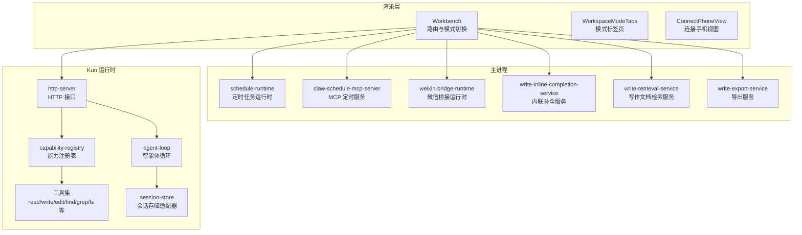
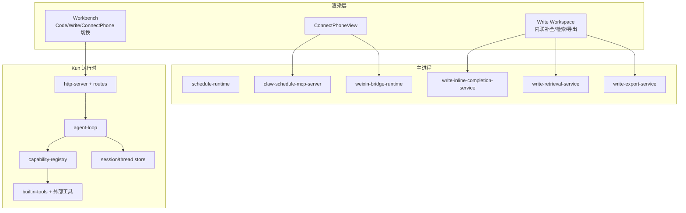
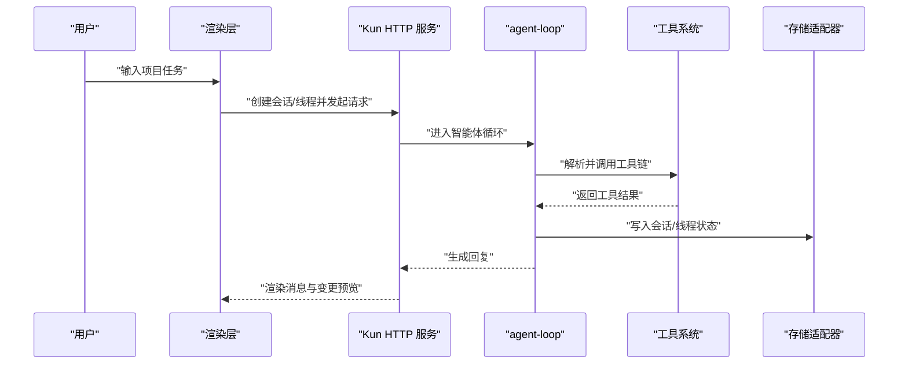
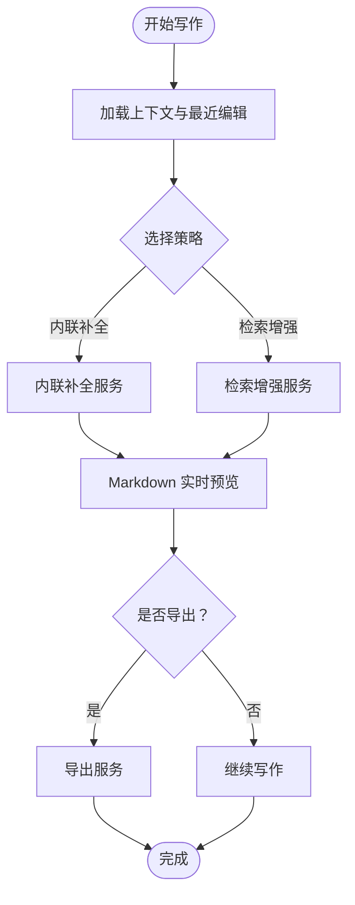
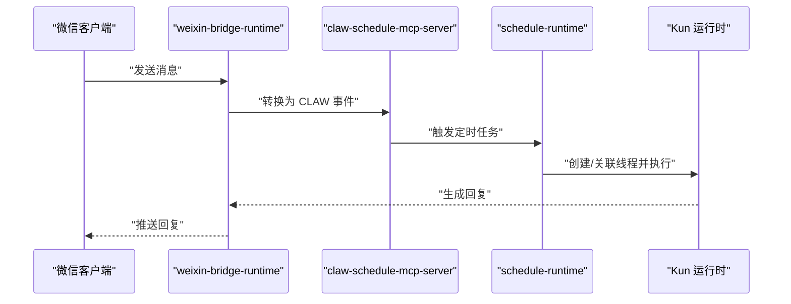
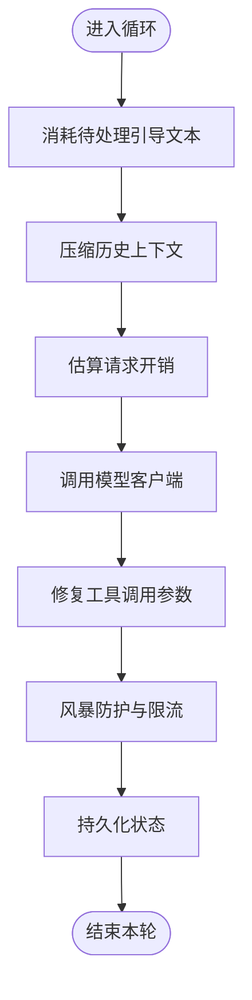
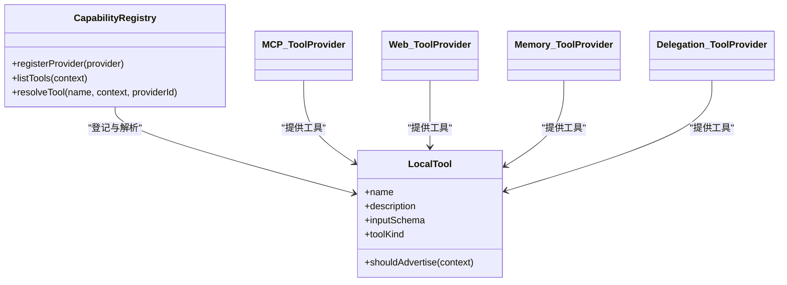
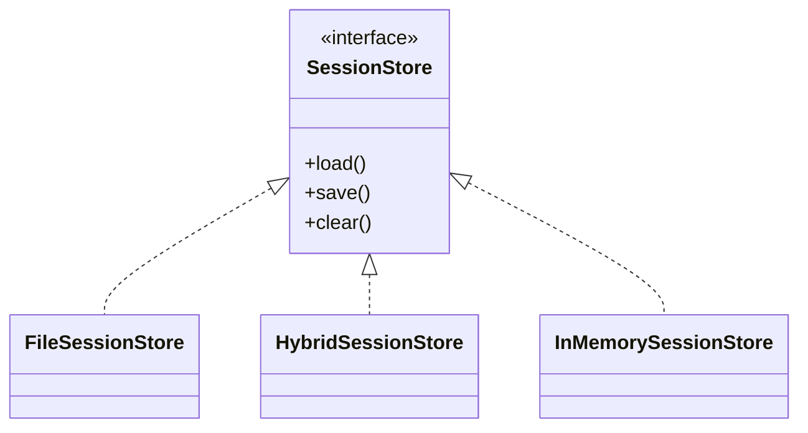
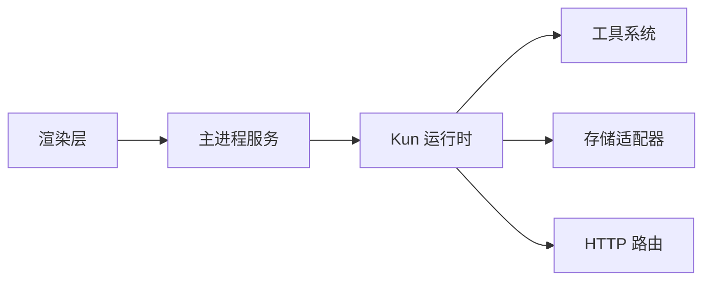

# 核心功能特性

<cite>
**本文引用的文件**
- [DESIGN.md](file://DESIGN.md)
- [DESIGN.zh-CN.md](file://DESIGN.zh-CN.md)
- [agent-loop.ts](file://kun/src/loop/agent-loop.ts)
- [capability-registry.ts](file://kun/src/adapters/tool/capability-registry.ts)
- [builtin-tools.ts](file://kun/src/adapters/tool/builtin-tools.ts)
- [file-session-store.ts](file://kun/src/adapters/file/file-session-store.ts)
- [hybrid-session-store.ts](file://kun/src/adapters/hybrid/hybrid-session-store.ts)
- [in-memory-session-store.ts](file://kun/src/adapters/in-memory/in-memory-session-store.ts)
- [index.ts](file://kun/src/adapters/index.ts)
- [Workbench.tsx](file://src/renderer/src/components/Workbench.tsx)
- [WorkspaceModeTabs.tsx](file://src/renderer/src/components/chat/WorkspaceModeTabs.tsx)
- [ConnectPhoneView.tsx](file://src/renderer/src/components/chat/ConnectPhoneView.tsx)
- [write-thread-registry.ts](file://src/renderer/src/write/write-thread-registry.ts)
- [write-inline-completion-service.ts](file://src/main/services/write-inline-completion-service.ts)
- [write-retrieval-service.ts](file://src/main/services/write-retrieval-service.ts)
- [write-export-service.ts](file://src/main/services/write-export-service.ts)
- [schedule-runtime.ts](file://src/main/schedule-runtime.ts)
- [claw-schedule-mcp-server.ts](file://src/main/claw-schedule-mcp-server.ts)
- [weixin-bridge-runtime.ts](file://src/main/weixin-bridge-runtime.ts)
- [kun-system-prompt.ts](file://kun/src/prompt/kun-system-prompt.ts)
- [review-service.ts](file://kun/src/services/review-service.ts)
- [git-review-target.ts](file://kun/src/review/git-review-target.ts)
- [edit-diff.ts](file://kun/src/adapters/tool/edit-diff.ts)
- [edit.ts](file://kun/src/adapters/tool/edit.ts)
- [find.ts](file://kun/src/adapters/tool/find.ts)
- [grep.ts](file://kun/src/adapters/tool/grep.ts)
- [ls.ts](file://kun/src/adapters/tool/ls.ts)
- [read.ts](file://kun/src/adapters/tool/read.ts)
- [write.ts](file://kun/src/adapters/tool/write.ts)
- [mcp-tool-provider.ts](file://kun/src/adapters/tool/mcp-tool-provider.ts)
- [web-tool-provider.ts](file://kun/src/adapters/tool/web-tool-provider.ts)
- [memory-tool-provider.ts](file://kun/src/adapters/tool/memory-tool-provider.ts)
- [delegation-tool-provider.ts](file://kun/src/adapters/tool/delegation-tool-provider.ts)
- [tool-hooks.ts](file://kun/src/adapters/tool/tool-hooks.ts)
- [tool-rate-limit.ts](file://kun/src/adapters/tool/tool-rate-limit.ts)
- [tool-storm-breaker.ts](file://kun/src/loop/tool-storm-breaker.ts)
- [tool-call-repair.ts](file://kun/src/loop/tool-call-repair.ts)
- [context-compactor.ts](file://kun/src/loop/context-compactor.ts)
- [model-context-profile.ts](file://kun/src/loop/model-context-profile.ts)
- [token-economy.ts](file://kun/src/loop/token-economy.ts)
- [history-healing.ts](file://kun/src/loop/history-healing.ts)
- [request-history-hygiene.ts](file://kun/src/loop/request-history-hygiene.ts)
- [append-only-session-log.ts](file://kun/src/loop/append-only-session-log.ts)
- [runtime-factory.ts](file://kun/src/server/runtime-factory.ts)
- [http-server.ts](file://kun/src/server/http-server.ts)
- [router.ts](file://kun/src/server/router.ts)
- [routes/index.ts](file://kun/src/server/routes/index.ts)
- [routes/sessions.ts](file://kun/src/server/routes/sessions.ts)
- [routes/threads.ts](file://kun/src/server/routes/threads.ts)
- [routes/turns.ts](file://kun/src/server/routes/turns.ts)
- [routes/review.ts](file://kun/src/server/routes/review.ts)
- [routes/skills.ts](file://kun/src/server/routes/skills.ts)
- [routes/memory.ts](file://kun/src/server/routes/memory.ts)
- [routes/attachments.ts](file://kun/src/server/routes/attachments.ts)
- [routes/events.ts](file://kun/src/server/routes/events.ts)
- [routes/user-inputs.ts](file://kun/src/server/routes/user-inputs.ts)
- [routes/usage.ts](file://kun/src/server/routes/usage.ts)
- [routes/workspace.ts](file://kun/src/server/routes/workspace.ts)
- [routes/approvals.ts](file://kun/src/server/routes/approvals.ts)
- [routes/server-runtime.ts](file://kun/src/server/routes/server-runtime.ts)
- [routes/runtime-info.ts](file://kun/src/server/routes/runtime-info.ts)
- [routes/runtime-error.ts](file://kun/src/server/routes/runtime-error.ts)
- [routes/health.ts](file://kun/src/server/routes/health.ts)
- [kun-config.ts](file://kun/src/config/kun-config.ts)
- [secret-redaction.ts](file://kun/src/config/secret-redaction.ts)
- [kun-config.test.ts](file://kun/src/config/kun-config.test.ts)
- [kun-architecture.md](file://docs/kun-architecture.md)
- [kun-architecture.zh-CN.md](file://docs/kun-architecture.zh-CN.md)
- [WRITE_INLINE_COMPLETION_MODES.zh-CN.md](file://docs/WRITE_INLINE_COMPLETION_MODES.zh-CN.md)
- [WRITE_INLINE_EDIT_RAG.en.md](file://docs/WRITE_INLINE_EDIT_RAG.en.md)
- [WRITE_INLINE_EDIT_RECENT_EDITS.en.md](file://docs/WRITE_INLINE_EDIT_RECENT_EDITS.en.md)
- [WRITE_RETRIEVAL_RAG.en.md](file://docs/WRITE_RETRIEVAL_RAG.en.md)
- [kun-cache-optimization.md](file://docs/kun-cache-optimization.md)
- [kun-cache-optimization.en.md](file://docs/kun-cache-optimization.en.md)
</cite>

## 目录
1. [简介](#简介)
2. [项目结构](#项目结构)
3. [核心组件](#核心组件)
4. [架构总览](#架构总览)
5. [详细组件分析](#详细组件分析)
6. [依赖关系分析](#依赖关系分析)
7. [性能考量](#性能考量)
8. [故障排查指南](#故障排查指南)
9. [结论](#结论)
10. [附录](#附录)

## 简介
本文件面向 DeepSeek GUI 的使用者与开发者，系统性梳理三大核心工作模式：Code 模式（项目工作、工具调用、文件变更、代码审查）、Write 模式（长文档写作、Markdown 编辑、FIM 补全）、Connect Phone 模式（IM 自动化、Webhook 代理、定时任务）。同时介绍智能体循环系统、工具系统、存储适配器等核心技术组件，帮助用户建立功能全景图并提供使用场景指引。

## 项目结构
DeepSeek GUI 采用“主进程 + 渲染进程 + Kun 后端运行时”的分层架构。渲染侧通过 Workbench 路由区分 Code/Write/Connect Phone 等模式；主进程承载定时任务、微信桥接、内核服务；Kun 运行时负责对话循环、工具执行、上下文压缩与资源管理。

图表来源
- [Workbench.tsx:305-326](file://src/renderer/src/components/Workbench.tsx#L305-L326)
- [WorkspaceModeTabs.tsx](file://src/renderer/src/components/chat/WorkspaceModeTabs.tsx)
- [ConnectPhoneView.tsx](file://src/renderer/src/components/chat/ConnectPhoneView.tsx)
- [schedule-runtime.ts](file://src/main/schedule-runtime.ts)
- [claw-schedule-mcp-server.ts](file://src/main/claw-schedule-mcp-server.ts)
- [weixin-bridge-runtime.ts](file://src/main/weixin-bridge-runtime.ts)
- [write-inline-completion-service.ts](file://src/main/services/write-inline-completion-service.ts)
- [write-retrieval-service.ts](file://src/main/services/write-retrieval-service.ts)
- [write-export-service.ts](file://src/main/services/write-export-service.ts)
- [agent-loop.ts:237-276](file://kun/src/loop/agent-loop.ts#L237-L276)
- [capability-registry.ts:26-86](file://kun/src/adapters/tool/capability-registry.ts#L26-L86)
- [builtin-tools.ts](file://kun/src/adapters/tool/builtin-tools.ts)
- [http-server.ts](file://kun/src/server/http-server.ts)
- [routes/index.ts](file://kun/src/server/routes/index.ts)

章节来源
- [DESIGN.md:1085-1106](file://DESIGN.md#L1085-L1106)
- [DESIGN.zh-CN.md:1085-1106](file://DESIGN.zh-CN.md#L1085-L1106)

## 核心组件
- 智能体循环系统：负责消息注入、模型请求、上下文压缩、工具调用修复与风暴防护，确保在有限上下文下稳定高效地推进任务。
- 工具系统：内置文件读写、编辑、搜索、列出、网络访问、内存检索、委托等工具，并通过能力注册表统一暴露与策略控制。
- 存储适配器：支持文件系统、混合持久化与内存三种会话/线程存储后端，满足不同场景的数据持久化需求。
- 写作工作流：包含内联补全、检索增强、导出与预览，以及 Write Thread 注册表隔离 Write 会话。
- 连接手机工作流：通过 CLAW 通道与微信桥接运行时实现 IM 自动化与定时任务编排。

章节来源
- [agent-loop.ts:237-276](file://kun/src/loop/agent-loop.ts#L237-L276)
- [capability-registry.ts:26-86](file://kun/src/adapters/tool/capability-registry.ts#L26-L86)
- [builtin-tools.ts](file://kun/src/adapters/tool/builtin-tools.ts)
- [file-session-store.ts](file://kun/src/adapters/file/file-session-store.ts)
- [hybrid-session-store.ts](file://kun/src/adapters/hybrid/hybrid-session-store.ts)
- [in-memory-session-store.ts](file://kun/src/adapters/in-memory/in-memory-session-store.ts)
- [write-thread-registry.ts:1-39](file://src/renderer/src/write/write-thread-registry.ts#L1-L39)

## 架构总览
下图展示从渲染层到主进程再到 Kun 运行时的整体交互路径，以及三条核心模式的职责边界与集成点。

图表来源
- [Workbench.tsx:305-326](file://src/renderer/src/components/Workbench.tsx#L305-L326)
- [ConnectPhoneView.tsx](file://src/renderer/src/components/chat/ConnectPhoneView.tsx)
- [schedule-runtime.ts](file://src/main/schedule-runtime.ts)
- [claw-schedule-mcp-server.ts](file://src/main/claw-schedule-mcp-server.ts)
- [weixin-bridge-runtime.ts](file://src/main/weixin-bridge-runtime.ts)
- [write-inline-completion-service.ts](file://src/main/services/write-inline-completion-service.ts)
- [write-retrieval-service.ts](file://src/main/services/write-retrieval-service.ts)
- [write-export-service.ts](file://src/main/services/write-export-service.ts)
- [agent-loop.ts:237-276](file://kun/src/loop/agent-loop.ts#L237-L276)
- [capability-registry.ts:26-86](file://kun/src/adapters/tool/capability-registry.ts#L26-L86)
- [builtin-tools.ts](file://kun/src/adapters/tool/builtin-tools.ts)
- [http-server.ts](file://kun/src/server/http-server.ts)
- [routes/index.ts](file://kun/src/server/routes/index.ts)

## 详细组件分析

### Code 模式：项目工作、工具调用、文件变更、代码审查
- 场景定位：默认工作模式，面向项目级任务，支持计划、待办、变更检查、文件预览与开发浏览器。
- 关键能力
  - 智能体循环：按固定策略注入引导文本，结合上下文压缩与历史净化，维持长对话稳定性。
  - 工具系统：文件读写、编辑、搜索、列出、网络访问、内存检索、委托等工具统一注册与调度。
  - 存储适配器：会话/线程持久化可选文件或混合存储，兼顾可靠性与性能。
  - 代码审查：基于 Git 变更的目标识别与审查提示生成，辅助 Pull Request 质量把关。
- 使用价值
  - 提升工程效率：从问题定位、方案设计到代码落地的一站式智能体流程。
  - 降低心智负担：自动化的上下文管理与工具编排，减少手动操作。

图表来源
- [agent-loop.ts:237-276](file://kun/src/loop/agent-loop.ts#L237-L276)
- [capability-registry.ts:26-86](file://kun/src/adapters/tool/capability-registry.ts#L26-L86)
- [builtin-tools.ts](file://kun/src/adapters/tool/builtin-tools.ts)
- [file-session-store.ts](file://kun/src/adapters/file/file-session-store.ts)
- [hybrid-session-store.ts](file://kun/src/adapters/hybrid/hybrid-session-store.ts)
- [in-memory-session-store.ts](file://kun/src/adapters/in-memory/in-memory-session-store.ts)
- [routes/sessions.ts](file://kun/src/server/routes/sessions.ts)
- [routes/threads.ts](file://kun/src/server/routes/threads.ts)
- [routes/turns.ts](file://kun/src/server/routes/turns.ts)

章节来源
- [DESIGN.md:1085-1106](file://DESIGN.md#L1085-L1106)
- [DESIGN.zh-CN.md:1085-1106](file://DESIGN.zh-CN.md#L1085-L1106)
- [review-service.ts](file://kun/src/services/review-service.ts)
- [git-review-target.ts](file://kun/src/review/git-review-target.ts)
- [edit-diff.ts](file://kun/src/adapters/tool/edit-diff.ts)
- [edit.ts](file://kun/src/adapters/tool/edit.ts)
- [find.ts](file://kun/src/adapters/tool/find.ts)
- [grep.ts](file://kun/src/adapters/tool/grep.ts)
- [ls.ts](file://kun/src/adapters/tool/ls.ts)
- [read.ts](file://kun/src/adapters/tool/read.ts)
- [write.ts](file://kun/src/adapters/tool/write.ts)

### Write 模式：长文档写作、Markdown 编辑、FIM 补全
- 场景定位：专注长文档创作与编辑，提供内联补全、检索增强、实时预览与导出。
- 关键能力
  - 内联补全：基于上下文与最近编辑的策略，提供连续写作体验。
  - 检索增强：结合知识库与近期编辑，提升内容质量与一致性。
  - 写作线程隔离：通过 Write Thread Registry 将 Write 会话与 Code/Connect Phone 分离，避免状态干扰。
  - 导出与预览：支持 Markdown 预览与多种导出格式，便于分享与归档。
- 使用价值
  - 提高写作效率：内联补全与检索增强减少停顿与重复劳动。
  - 保障一致性：利用最近编辑与检索上下文，保持术语与风格统一。

图表来源
- [write-inline-completion-service.ts](file://src/main/services/write-inline-completion-service.ts)
- [write-retrieval-service.ts](file://src/main/services/write-retrieval-service.ts)
- [write-export-service.ts](file://src/main/services/write-export-service.ts)
- [write-thread-registry.ts:1-39](file://src/renderer/src/write/write-thread-registry.ts#L1-L39)

章节来源
- [write-thread-registry.ts:1-39](file://src/renderer/src/write/write-thread-registry.ts#L1-L39)
- [WRITE_INLINE_COMPLETION_MODES.zh-CN.md](file://docs/WRITE_INLINE_COMPLETION_MODES.zh-CN.md)
- [WRITE_INLINE_EDIT_RAG.en.md](file://docs/WRITE_INLINE_EDIT_RAG.en.md)
- [WRITE_INLINE_EDIT_RECENT_EDITS.en.md](file://docs/WRITE_INLINE_EDIT_RECENT_EDITS.en.md)
- [WRITE_RETRIEVAL_RAG.en.md](file://docs/WRITE_RETRIEVAL_RAG.en.md)

### Connect Phone 模式：IM 自动化、Webhook 代理、定时任务
- 场景定位：通过 CLAW 通道与微信桥接运行时实现 IM 自动化，配合定时任务与 Webhook 代理，完成跨渠道协作与自动化编排。
- 关键能力
  - 微信桥接：将微信消息转化为内部线程，驱动 Kun 智能体进行回复与处理。
  - 定时任务：基于 MCP 的定时任务服务器，支持周期性触发与任务编排。
  - Webhook 代理：作为外部系统与内部智能体之间的桥梁，转发事件并触发相应动作。
- 使用价值
  - 降低沟通成本：自动应答与任务编排减少人工干预。
  - 扩展协作边界：通过 Webhook 与定时任务接入更多业务系统。

图表来源
- [weixin-bridge-runtime.ts](file://src/main/weixin-bridge-runtime.ts)
- [claw-schedule-mcp-server.ts](file://src/main/claw-schedule-mcp-server.ts)
- [schedule-runtime.ts](file://src/main/schedule-runtime.ts)
- [routes/skills.ts](file://kun/src/server/routes/skills.ts)

章节来源
- [DESIGN.md:1085-1106](file://DESIGN.md#L1085-L1106)
- [DESIGN.zh-CN.md:1085-1106](file://DESIGN.zh-CN.md#L1085-L1106)

### 智能体循环系统
- 设计要点
  - 缓存优先：先从缓存/紧凑历史中获取上下文，再按需扩展。
  - 上下文压缩：通过前缀不变与压缩器，控制上下文长度与质量。
  - 工具风暴防护：限制工具调用频率与并发，避免资源过载。
  - 请求历史净化：定期清理冗余记录，保持历史整洁。
- 性能影响
  - 压缩与净化显著降低模型输入规模，提高响应速度。
  - 工具风暴防护与速率限制保障系统稳定性。

图表来源
- [agent-loop.ts:237-276](file://kun/src/loop/agent-loop.ts#L237-L276)
- [tool-storm-breaker.ts](file://kun/src/loop/tool-storm-breaker.ts)
- [tool-call-repair.ts](file://kun/src/loop/tool-call-repair.ts)
- [context-compactor.ts](file://kun/src/loop/context-compactor.ts)
- [request-history-hygiene.ts](file://kun/src/loop/request-history-hygiene.ts)
- [append-only-session-log.ts](file://kun/src/loop/append-only-session-log.ts)

章节来源
- [agent-loop.ts:237-276](file://kun/src/loop/agent-loop.ts#L237-L276)
- [tool-storm-breaker.ts](file://kun/src/loop/tool-storm-breaker.ts)
- [tool-call-repair.ts](file://kun/src/loop/tool-call-repair.ts)
- [context-compactor.ts](file://kun/src/loop/context-compactor.ts)
- [request-history-hygiene.ts](file://kun/src/loop/request-history-hygiene.ts)
- [append-only-session-log.ts](file://kun/src/loop/append-only-session-log.ts)

### 工具系统
- 组件构成
  - 能力注册表：统一登记工具提供方与工具清单，支持按上下文过滤与广告策略。
  - 内置工具：文件读写、编辑、搜索、列出、网络访问、内存检索、委托等。
  - 外部工具：MCP、Web、内存检索、委托等提供方，扩展工具生态。
  - 工具钩子与限流：对工具调用进行前置/后置处理与速率控制。
- 使用价值
  - 以工具为原子能力，组合出复杂任务流水线。
  - 通过注册表与策略控制，实现安全可控的工具开放。

图表来源
- [capability-registry.ts:26-86](file://kun/src/adapters/tool/capability-registry.ts#L26-L86)
- [builtin-tools.ts](file://kun/src/adapters/tool/builtin-tools.ts)
- [mcp-tool-provider.ts](file://kun/src/adapters/tool/mcp-tool-provider.ts)
- [web-tool-provider.ts](file://kun/src/adapters/tool/web-tool-provider.ts)
- [memory-tool-provider.ts](file://kun/src/adapters/tool/memory-tool-provider.ts)
- [delegation-tool-provider.ts](file://kun/src/adapters/tool/delegation-tool-provider.ts)
- [tool-hooks.ts](file://kun/src/adapters/tool/tool-hooks.ts)
- [tool-rate-limit.ts](file://kun/src/adapters/tool/tool-rate-limit.ts)

章节来源
- [capability-registry.ts:26-86](file://kun/src/adapters/tool/capability-registry.ts#L26-L86)
- [builtin-tools.ts](file://kun/src/adapters/tool/builtin-tools.ts)
- [mcp-tool-provider.ts](file://kun/src/adapters/tool/mcp-tool-provider.ts)
- [web-tool-provider.ts](file://kun/src/adapters/tool/web-tool-provider.ts)
- [memory-tool-provider.ts](file://kun/src/adapters/tool/memory-tool-provider.ts)
- [delegation-tool-provider.ts](file://kun/src/adapters/tool/delegation-tool-provider.ts)
- [tool-hooks.ts](file://kun/src/adapters/tool/tool-hooks.ts)
- [tool-rate-limit.ts](file://kun/src/adapters/tool/tool-rate-limit.ts)

### 存储适配器
- 类型与职责
  - 文件存储：基于文件系统的持久化，适合长期保存与跨设备同步。
  - 混合存储：结合内存与文件，兼顾性能与持久性。
  - 内存存储：临时会话与快速迭代场景下的高性能选择。
- 选择建议
  - 生产环境优先文件或混合存储；开发调试可用内存存储。

图表来源
- [file-session-store.ts](file://kun/src/adapters/file/file-session-store.ts)
- [hybrid-session-store.ts](file://kun/src/adapters/hybrid/hybrid-session-store.ts)
- [in-memory-session-store.ts](file://kun/src/adapters/in-memory/in-memory-session-store.ts)
- [index.ts](file://kun/src/adapters/index.ts)

章节来源
- [file-session-store.ts](file://kun/src/adapters/file/file-session-store.ts)
- [hybrid-session-store.ts](file://kun/src/adapters/hybrid/hybrid-session-store.ts)
- [in-memory-session-store.ts](file://kun/src/adapters/in-memory/in-memory-session-store.ts)
- [index.ts](file://kun/src/adapters/index.ts)

## 依赖关系分析
- 渲染层依赖主进程服务与 Kun HTTP 接口；主进程依赖 CLAW/MCP 与微信桥接；Kun 运行时依赖工具系统与存储适配器。
- 路由层集中暴露会话、线程、回合、审查、技能、内存、附件、事件、用户输入、用量、工作区、审批、运行时信息、健康与错误等接口。

图表来源
- [http-server.ts](file://kun/src/server/http-server.ts)
- [router.ts](file://kun/src/server/router.ts)
- [routes/index.ts](file://kun/src/server/routes/index.ts)
- [routes/sessions.ts](file://kun/src/server/routes/sessions.ts)
- [routes/threads.ts](file://kun/src/server/routes/threads.ts)
- [routes/turns.ts](file://kun/src/server/routes/turns.ts)
- [routes/review.ts](file://kun/src/server/routes/review.ts)
- [routes/skills.ts](file://kun/src/server/routes/skills.ts)
- [routes/memory.ts](file://kun/src/server/routes/memory.ts)
- [routes/attachments.ts](file://kun/src/server/routes/attachments.ts)
- [routes/events.ts](file://kun/src/server/routes/events.ts)
- [routes/user-inputs.ts](file://kun/src/server/routes/user-inputs.ts)
- [routes/usage.ts](file://kun/src/server/routes/usage.ts)
- [routes/workspace.ts](file://kun/src/server/routes/workspace.ts)
- [routes/approvals.ts](file://kun/src/server/routes/approvals.ts)
- [routes/server-runtime.ts](file://kun/src/server/routes/server-runtime.ts)
- [routes/runtime-info.ts](file://kun/src/server/routes/runtime-info.ts)
- [routes/runtime-error.ts](file://kun/src/server/routes/runtime-error.ts)
- [routes/health.ts](file://kun/src/server/routes/health.ts)

章节来源
- [http-server.ts](file://kun/src/server/http-server.ts)
- [router.ts](file://kun/src/server/router.ts)
- [routes/index.ts](file://kun/src/server/routes/index.ts)

## 性能考量
- 上下文压缩与历史净化：显著降低模型输入规模，提升吞吐与延迟表现。
- 工具风暴防护与速率限制：避免突发流量导致的资源争用与失败。
- 缓存与紧凑历史：在保证效果的前提下减少重复计算与传输。
- 存储策略：根据场景选择文件/混合/内存存储，平衡持久性与性能。

## 故障排查指南
- 健康检查与运行时信息：通过健康与运行时接口确认服务状态与配置。
- 错误路由：统一捕获与上报运行时错误，便于定位问题根因。
- 日志与诊断：结合运行时诊断与错误详情，快速定位异常。

章节来源
- [routes/health.ts](file://kun/src/server/routes/health.ts)
- [routes/runtime-error.ts](file://kun/src/server/routes/runtime-error.ts)
- [routes/runtime-info.ts](file://kun/src/server/routes/runtime-info.ts)

## 结论
DeepSeek GUI 以“模式即路由”的设计理念，将 Code/Write/Connect Phone 三类场景解耦于同一工作台；依托智能体循环、工具系统与存储适配器，形成从对话到执行的闭环。通过内联补全、检索增强与定时任务编排，覆盖从日常编码到长文档写作再到跨渠道自动化的广泛需求。建议用户根据任务类型选择对应模式，并结合工具与存储策略优化使用体验。

## 附录
- 架构文档与缓存优化：进一步理解系统设计与性能优化方向。
- 写作模式文档：深入掌握内联补全与检索增强的策略与实践。

章节来源
- [kun-architecture.md](file://docs/kun-architecture.md)
- [kun-architecture.zh-CN.md](file://docs/kun-architecture.zh-CN.md)
- [kun-cache-optimization.md](file://docs/kun-cache-optimization.md)
- [kun-cache-optimization.en.md](file://docs/kun-cache-optimization.en.md)