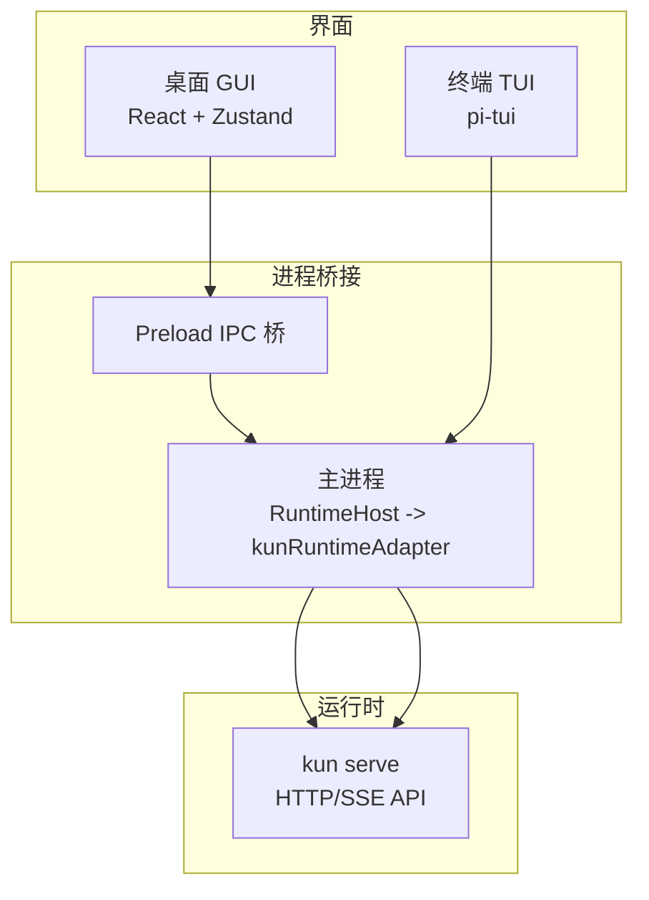
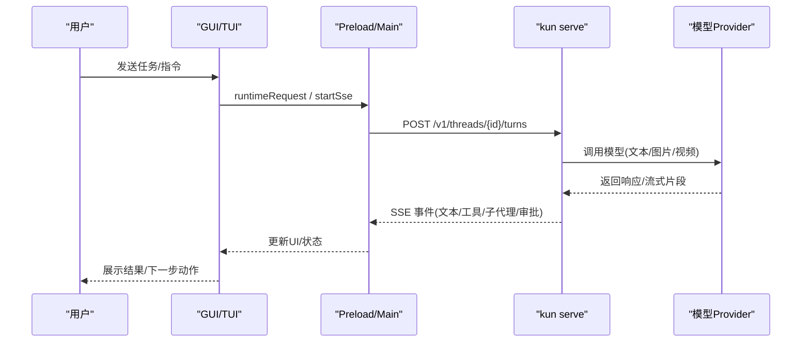
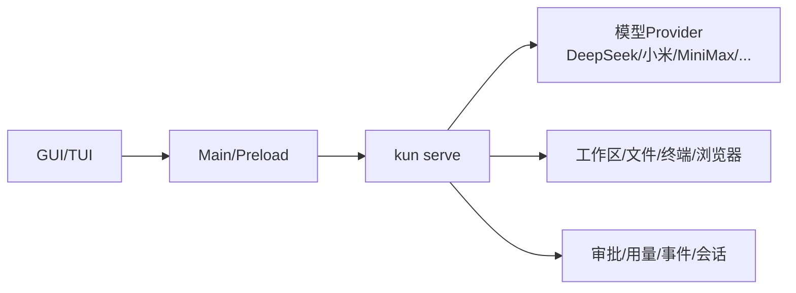

# 核心功能特性

<cite>
**本文引用的文件**
- [README.md](file://README.md)
- [DESIGN_MODE.md](file://docs/DESIGN_MODE.md)
- [kun-architecture.en.md](file://docs/kun-architecture.en.md)
- [graph-mode.en.md](file://docs/graph-mode.en.md)
- [workbench.en.md](file://docs/extensions/workbench.en.md)
- [kun-tui.en.md](file://docs/kun-tui.en.md)
- [model-provider-presets.md](file://docs/model-provider-presets.md)
- [app-settings-kun.ts](file://src/shared/app-settings-kun.ts)
</cite>

## 目录
1. [简介](#简介)
2. [项目结构](#项目结构)
3. [核心组件](#核心组件)
4. [架构总览](#架构总览)
5. [详细组件分析](#详细组件分析)
6. [依赖关系分析](#依赖关系分析)
7. [性能考量](#性能考量)
8. [故障排查指南](#故障排查指南)
9. [结论](#结论)
10. [附录：使用示例与演示](#附录使用示例与演示)

## 简介
Kun 是一款本地优先的 AI Agent 工作台，将 Code、Write、Design、Research 和 Automate 整合在同一运行时中，并通过桌面 GUI 与终端 TUI 共享同一后台服务。它强调“从需求到验收”的连续工作流：澄清需求、探索方案、制定计划、执行任务、审查测试、交付结果，所有过程可观察、可控制、可回溯。

- 适合人群：开发者、写作者、设计师、研究人员以及需要自动化重复工作的个人与团队。
- 工作方式：GUI 用于可视化观察与交互；TUI 保持手不离键盘；两者通过同一个 `kun serve` 共享线程、计划、审批、模型连接与任务记录。
- 模式选择：简单任务用 Direct 模式；跨文件、跨阶段、可明确验收的复杂任务使用实验性的 Agent Graph。

**章节来源**
- [README.md:33-50](file://README.md#L33-L50)
- [README.md:77-86](file://README.md#L77-L86)
- [README.md:125-147](file://README.md#L125-L147)

## 项目结构
Kun 采用“单运行时 + 多客户端”的结构：渲染层（GUI/TUI）通过 HTTP/SSE 边界调用后端 `kun serve`，后者提供线程、事件、审批、用量、工作区等能力。Graph 编排、Agent 治理、恢复机制均在该边界内实现。

```mermaid
graph TB
subgraph "界面"
GUI["桌面 GUI<br/>React + Zustand"]
TUI["终端 TUI<br/>pi-tui"]
end
subgraph "进程桥接"
PRELOAD["Preload IPC 桥"]
MAIN["主进程<br/>RuntimeHost -> kunRuntimeAdapter"]
end
subgraph "运行时"
SERVE["kun serve<br/>HTTP/SSE API"]
end
GUI --> PRELOAD --> MAIN --> SERVE
TUI --> MAIN --> SERVE
```

**图表来源**
- [kun-architecture.en.md:16-48](file://docs/kun-architecture.en.md#L16-L48)

**章节来源**
- [kun-architecture.en.md:16-48](file://docs/kun-architecture.en.md#L16-L48)

## 核心组件
- 真实项目工作台：本地工作区、文件搜索与编辑、Terminal、Browser、Git/Worktree、内联 Diff 与 Changes 面板。
- 长任务与上下文管理：Plan、Todo、持久目标、会话压缩、分叉、归档、旁支问题、后台 Shell 与子代理。
- 模型与额度管理：统一入口管理订阅、套餐与 API；按默认 Agent、线程、Design、Write、Schedule 或子代理选择模型。
- Agent 与知识管理：Agent Profile、长期记忆、项目级 AGENTS.md、Skills、MCP 与 Extensions。
- 自动化与开放扩展：一次性或周期性 Schedule、可视化 Loop、Hook、本地运行 API，以及可安装或侧载的 `.kunx` 扩展。
- 多模态与安全：图片和 PDF 输入、视觉理解、媒体生成、Sandbox、工具审批、Computer Use 权限与敏感操作确认。

**章节来源**
- [README.md:138-147](file://README.md#L138-L147)

## 架构总览
Kun 的工作流由“界面 → 桥接 → 运行时”构成，所有工作区（Code、Write、Design、Research、Automate）都通过统一的 HTTP/SSE 边界访问线程、事件、审批、用量与工作区能力。Graph 模式作为每轮任务的编排策略，不引入第二套运行时。

```mermaid
sequenceDiagram
participant U as "用户"
participant G as "GUI/TUI"
participant P as "Preload/Main"
participant S as "kun serve"
participant M as "模型Provider"
U->>G : 发送任务/指令
G->>P : runtimeRequest / startSse
P->>S : POST /v1/threads/{id}/turns
S->>M : 调用模型(文本/图片/视频)
M-->>S : 返回响应/流式片段
S-->>P : SSE 事件(文本/工具/子代理/审批)
P-->>G : 更新UI/状态
G-->>U : 展示结果/下一步动作
```

**图表来源**
- [kun-architecture.en.md:16-48](file://docs/kun-architecture.en.md#L16-L48)
- [kun-architecture.en.md:205-227](file://docs/kun-architecture.en.md#L205-L227)

**章节来源**
- [kun-architecture.en.md:16-48](file://docs/kun-architecture.en.md#L16-L48)
- [kun-architecture.en.md:205-227](file://docs/kun-architecture.en.md#L205-L227)

## 详细组件分析

### 工作区一：Code（AI 编程与审查）
- 能力：在真实代码库上搜索、编辑文件、执行命令、管理 Plan/Todo、查看 Diff 与测试结果、发起 Review。
- 场景：Bug 修复、功能开发、重构、代码审查、发布前验证。
- 交付：代码改动、测试结果、实施计划、Review findings。
- 集成：与 Design 工作区的“实现为代码”双向打通；与 Write 共享模型与审批；与 Automate 共享 Schedule/Loop/MCP。

**章节来源**
- [README.md:77-86](file://README.md#L77-L86)
- [DESIGN_MODE.md:29-38](file://docs/DESIGN_MODE.md#L29-L38)

### 工作区二：Write（AI 写作与文档交付）
- 能力：写作、润色、资料整理、内联补全与编辑；导出 Markdown、HTML、PDF、DOCX、可编辑 PPTX。
- 场景：技术文档、产品说明、报告、演示文稿、知识库维护。
- 交付：结构化文档、可打印/可编辑的成品、版本化草稿。
- 集成：与设计模式共享设计系统；与 Code 共享工作区与工具；与 Research 共享多模态素材。

**章节来源**
- [README.md:77-86](file://README.md#L77-L86)
- [DESIGN_MODE.md:29-38](file://docs/DESIGN_MODE.md#L29-L38)

### 工作区三：Design（AI 设计与原型）
- 能力：描述 UI/品牌/风格，生成自包含 HTML 原型，实时画布预览，迭代版本管理；支持节点画布（prompt/design/image），一键“实现为代码”，沉淀共享设计系统。
- 场景：需求→视觉方向→交互原型→设计系统→交付给 Code 实现。
- 交付：HTML 原型、设计画布、设计流程、`DESIGN_SYSTEM.md`。
- 集成：与 Code 的双向桥（实现/逆向设计）；与 Write 共享导出管线；与 Automate 共享 Skill/MCP。

**章节来源**
- [DESIGN_MODE.md:13-38](file://docs/DESIGN_MODE.md#L13-L38)
- [DESIGN_MODE.md:92-153](file://docs/DESIGN_MODE.md#L92-L153)
- [DESIGN_MODE.md:156-173](file://docs/DESIGN_MODE.md#L156-L173)

### 工作区四：Research（多模态研究）
- 能力：阅读 PDF/图片/网页线索，提取证据，组织结论，形成可继续的工作上下文。
- 场景：文献综述、竞品调研、技术方案评估、数据解读。
- 交付：研究笔记、结构化结论、方案与后续任务。
- 集成：与 Write 协作产出报告；与 Design 提供视觉参考；与 Code 驱动实现验证。

**章节来源**
- [README.md:77-86](file://README.md#L77-L86)

### 工作区五：Automate（任务与 Agent Graph）
- 能力：Schedule、Loop、Hook、MCP、Skills、受限子代理持续执行；可视化工作流；可恢复的执行历史。
- 场景：定时巡检、批量处理、跨系统对接、复杂目标分解与监督。
- 交付：自动化记录、任务状态、证据与可恢复执行历史。
- 集成：与 Graph 模式协同，Lead Agent 负责分工、监督、验收与最终交付。

**章节来源**
- [README.md:77-86](file://README.md#L77-L86)
- [graph-mode.en.md:1-13](file://docs/graph-mode.en.md#L1-L13)

### Direct 模式 vs Agent Graph 模式
- Direct 模式：单点修改、简单问答、短任务更快更直接。
- Agent Graph 模式：跨文件、跨阶段、可明确验收的复杂任务；Lead Agent 建立依赖图，派发受限子代理，持续监督与验收，最终交付。
- 适用建议：轻量任务选 Direct；需要并行分工、依赖关系、持续监督和明确验收的任务选 Graph。

**章节来源**
- [README.md:125-137](file://README.md#L125-L137)
- [graph-mode.en.md:1-13](file://docs/graph-mode.en.md#L1-L13)

### GUI 与 TUI 共享运行时
- 共享内容：线程、回合、审批、结构化输入、事件序列号、用量、模型连接。
- 启动方式：GUI 与 TUI 各自独立，但连接到同一 `kun serve`；关闭一个不影响其他客户端或后台任务。
- 安全与重连：发现仅接受回环地址，校验实例 ID/PID/版本；断线重连后基于游标回放事件。

**章节来源**
- [kun-tui.en.md:41-44](file://docs/kun-tui.en.md#L41-L44)
- [kun-tui.en.md:46-84](file://docs/kun-tui.en.md#L46-L84)
- [kun-tui.en.md:357-375](file://docs/kun-tui.en.md#L357-L375)

## 依赖关系分析
- 运行时边界：GUI/TUI 通过 Preload/Main 转发至 `kun serve` 的 HTTP/SSE 接口，避免在渲染层实现 Agent 业务逻辑。
- 配置与能力：Kun 运行时设置集中管理模型、审批、沙箱、工具输出限制、上下文压缩、存储、调试、图像/语音/视频生成、质量、Graph、Lab 等。
- Provider 预设：内置 DeepSeek、小米、MiniMax、智谱 Coding Plan、Z.ai Coding Plan、Kimi、Moonshot CN/Global 等，支持自定义兼容端点。

```mermaid
graph LR
A["GUI/TUI"] --> B["Main/Preload"]
B --> C["kun serve"]
C --> D["模型Provider<br/>DeepSeek/小米/MiniMax/..."]
C --> E["工作区/文件/终端/浏览器"]
C --> F["审批/用量/事件/会话"]
```

**图表来源**
- [kun-architecture.en.md:16-48](file://docs/kun-architecture.en.md#L16-L48)
- [model-provider-presets.md:36-136](file://docs/model-provider-presets.md#L36-L136)
- [app-settings-kun.ts:156-200](file://src/shared/app-settings-kun.ts#L156-L200)

**章节来源**
- [model-provider-presets.md:36-136](file://docs/model-provider-presets.md#L36-L136)
- [app-settings-kun.ts:156-200](file://src/shared/app-settings-kun.ts#L156-L200)

## 性能考量
- 缓存命中优化：稳定系统提示前缀、工具 schema 规范化、历史消息修复、只读工具并发批处理、累计计数器恢复。
- 冷启动命中率较低，热启动后可稳定超过 90%。
- 动态上下文必须追加在稳定前缀之后，避免破坏缓存指纹。
- 大工具结果需做 token 有界或标记化处理，防止日志膨胀。

**章节来源**
- [kun-architecture.en.md:53-117](file://docs/kun-architecture.en.md#L53-L117)

## 故障排查指南
- Graph 诊断：使用 `/v1/graphs/diagnostics` 获取脱敏聚合信息，定位创建失败、阻塞节点、写入冲突、日志损坏等问题。
- 运行时状态：通过 `kun runtime status/restart/stop` 检查服务健康；确保 GUI 与 TUI 指向同一数据目录。
- 权限与审批：工具调用与敏感操作需经审批；若卡住，检查审批队列与沙箱策略。
- 重连与会话：断线重连后基于最新序列号回放事件；若出现悬挂审批/输入，检查是否已被其他客户端处理。

**章节来源**
- [graph-mode.en.md:341-365](file://docs/graph-mode.en.md#L341-L365)
- [graph-mode.en.md:422-445](file://docs/graph-mode.en.md#L422-L445)
- [kun-tui.en.md:357-375](file://docs/kun-tui.en.md#L357-L375)

## 结论
Kun 以“单运行时 + 多客户端”的架构，将 Code、Write、Design、Research、Automate 统一到一条可追溯的工作流中。Direct 模式满足轻量任务，Agent Graph 模式支撑复杂分工与验收。GUI 与 TUI 共享运行时，既保证一致性又兼顾不同使用习惯。配合 Provider 预设、模型与额度管理、知识与扩展生态，Kun 能够覆盖从想法到交付的全链路需求。

## 附录：使用示例与演示
- 快速开始：下载桌面版，选择语言、登录模型或配置 API Key、打开本地项目并发送清晰且可验证的任务。
- 工作区演示：
  - Code：在工作区中搜索代码、编辑文件、执行命令、查看 Diff 与测试结果。
  - Write：在写作空间撰写与润色，导出为 Markdown/HTML/PDF/DOCX/PPTX。
  - Design：在画布中描述 UI，生成 HTML 原型并实时预览，迭代后“实现为代码”。
  - Research：上传 PDF/图片，提取证据并整理结论，形成后续任务。
  - Automate：配置 Schedule/Loop/Hook，运行可视化工作流，查看执行历史与证据。
- 模式切换：简单任务使用 Direct；复杂任务切换到 Graph，建立依赖图、委派子代理、监督与验收。
- 共享运行时：同时打开 GUI 与 TUI，它们共享线程、计划、审批与用量；可在任一界面继续同一任务。

**章节来源**
- [README.md:51-76](file://README.md#L51-L76)
- [README.md:87-105](file://README.md#L87-L105)
- [kun-tui.en.md:85-101](file://docs/kun-tui.en.md#L85-L101)