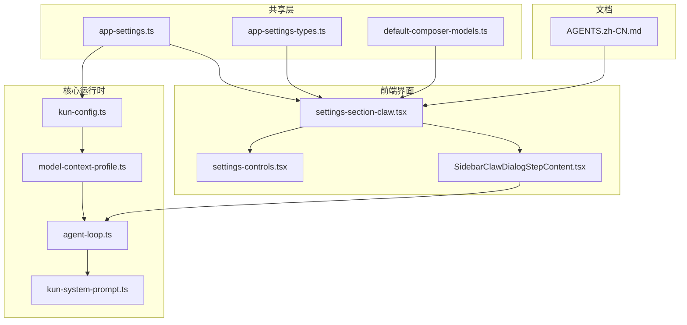
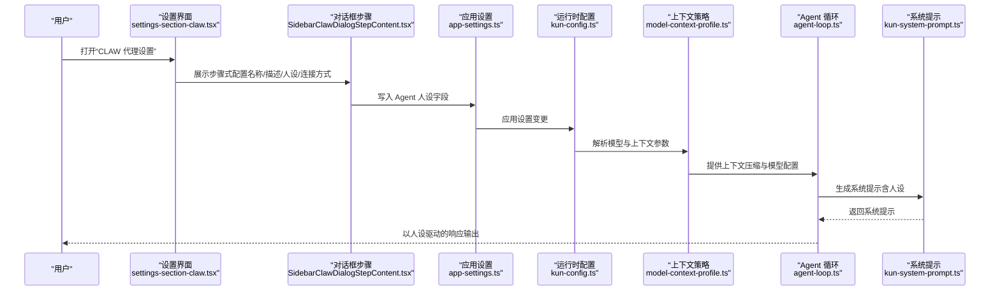
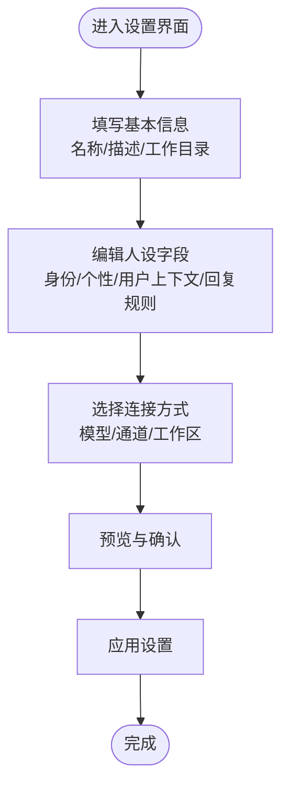
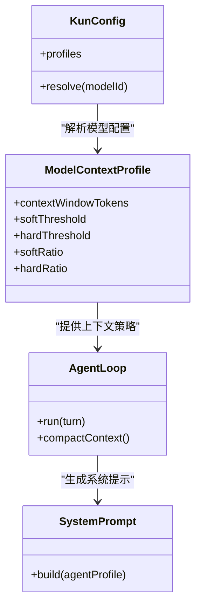
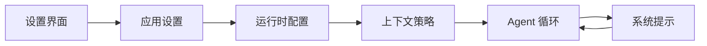

# Agent 人设配置

<cite>
**本文引用的文件**
- [docs/AGENTS.zh-CN.md](file://docs/AGENTS.zh-CN.md)
- [src/shared/app-settings.ts](file://src/shared/app-settings.ts)
- [src/shared/app-settings-types.ts](file://src/shared/app-settings-types.ts)
- [src/renderer/src/components/settings-section-claw.tsx](file://src/renderer/src/components/settings-section-claw.tsx)
- [src/renderer/src/components/chat/SidebarClawDialogStepContent.tsx](file://src/renderer/src/components/chat/SidebarClawDialogStepContent.tsx)
- [src/renderer/src/components/settings-controls.tsx](file://src/renderer/src/components/settings-controls.tsx)
- [src/shared/default-composer-models.ts](file://src/shared/default-composer-models.ts)
- [kun/src/config/kun-config.ts](file://kun/src/config/kun-config.ts)
- [kun/src/loop/model-context-profile.ts](file://kun/src/loop/model-context-profile.ts)
- [kun/src/loop/agent-loop.ts](file://kun/src/loop/agent-loop.ts)
- [kun/src/prompt/kun-system-prompt.ts](file://kun/src/prompt/kun-system-prompt.ts)
</cite>

## 目录
1. [简介](#简介)
2. [项目结构](#项目结构)
3. [核心组件](#核心组件)
4. [架构总览](#架构总览)
5. [详细组件分析](#详细组件分析)
6. [依赖关系分析](#依赖关系分析)
7. [性能考量](#性能考量)
8. [故障排查指南](#故障排查指南)
9. [结论](#结论)
10. [附录](#附录)

## 简介
本指南聚焦于“Agent 人设配置”模块，面向希望为独立 Agent 定制个性与行为的用户。内容涵盖：
- 独立 Agent 的人设设置（角色定义、个性、回复规则、用户上下文）
- 默认模型选择与工作目录配置
- 个性化配置选项、行为模式与响应风格定制
- 不同类型 Agent 的配置模板与使用场景示例

本指南以仓库中的文档与前端/共享层实现为依据，帮助您在 GUI 中完成 Agent 人设配置，并理解其背后的数据结构与运行机制。

## 项目结构
围绕 Agent 人设配置的关键位置包括：
- 文档：位于 docs 目录，提供高层说明与使用建议
- 共享设置：位于 src/shared，包含应用设置类型与默认值
- 前端界面：位于 src/renderer，提供设置卡片、对话框与控件
- 核心运行时：位于 kun/src，包含模型配置、上下文压缩与系统提示生成

图表来源
- [docs/AGENTS.zh-CN.md](file://docs/AGENTS.zh-CN.md)
- [src/shared/app-settings.ts](file://src/shared/app-settings.ts)
- [src/shared/app-settings-types.ts](file://src/shared/app-settings-types.ts)
- [src/shared/default-composer-models.ts](file://src/shared/default-composer-models.ts)
- [src/renderer/src/components/settings-section-claw.tsx](file://src/renderer/src/components/settings-section-claw.tsx)
- [src/renderer/src/components/chat/SidebarClawDialogStepContent.tsx](file://src/renderer/src/components/chat/SidebarClawDialogStepContent.tsx)
- [src/renderer/src/components/settings-controls.tsx](file://src/renderer/src/components/settings-controls.tsx)
- [kun/src/config/kun-config.ts](file://kun/src/config/kun-config.ts)
- [kun/src/loop/model-context-profile.ts](file://kun/src/loop/model-context-profile.ts)
- [kun/src/loop/agent-loop.ts](file://kun/src/loop/agent-loop.ts)
- [kun/src/prompt/kun-system-prompt.ts](file://kun/src/prompt/kun-system-prompt.ts)

章节来源
- [docs/AGENTS.zh-CN.md](file://docs/AGENTS.zh-CN.md)
- [src/shared/app-settings.ts](file://src/shared/app-settings.ts)
- [src/shared/app-settings-types.ts](file://src/shared/app-settings-types.ts)
- [src/shared/default-composer-models.ts](file://src/shared/default-composer-models.ts)
- [src/renderer/src/components/settings-section-claw.tsx](file://src/renderer/src/components/settings-section-claw.tsx)
- [src/renderer/src/components/chat/SidebarClawDialogStepContent.tsx](file://src/renderer/src/components/chat/SidebarClawDialogStepContent.tsx)
- [src/renderer/src/components/settings-controls.tsx](file://src/renderer/src/components/settings-controls.tsx)
- [kun/src/config/kun-config.ts](file://kun/src/config/kun-config.ts)
- [kun/src/loop/model-context-profile.ts](file://kun/src/loop/model-context-profile.ts)
- [kun/src/loop/agent-loop.ts](file://kun/src/loop/agent-loop.ts)
- [kun/src/prompt/kun-system-prompt.ts](file://kun/src/prompt/kun-system-prompt.ts)

## 核心组件
- 应用设置与类型定义：定义了 Agent 人设字段、模型选择、工作空间等结构化数据
- 前端设置卡片与对话框：提供可视化的人设编辑界面与步骤式引导
- 默认模型与 Composer 模型：提供默认可用模型列表，便于快速选择
- 运行时配置与上下文压缩：将人设映射到系统提示与上下文策略，驱动 Agent 行为

章节来源
- [src/shared/app-settings.ts](file://src/shared/app-settings.ts)
- [src/shared/app-settings-types.ts](file://src/shared/app-settings-types.ts)
- [src/shared/default-composer-models.ts](file://src/shared/default-composer-models.ts)
- [src/renderer/src/components/settings-section-claw.tsx](file://src/renderer/src/components/settings-section-claw.tsx)
- [src/renderer/src/components/chat/SidebarClawDialogStepContent.tsx](file://src/renderer/src/components/chat/SidebarClawDialogStepContent.tsx)

## 架构总览
Agent 人设配置从“设置界面”开始，经由“应用设置类型与默认值”，最终影响“运行时模型配置与上下文策略”，并在“系统提示生成器”中体现为实际的提示词。

图表来源
- [src/renderer/src/components/settings-section-claw.tsx](file://src/renderer/src/components/settings-section-claw.tsx)
- [src/renderer/src/components/chat/SidebarClawDialogStepContent.tsx](file://src/renderer/src/components/chat/SidebarClawDialogStepContent.tsx)
- [src/shared/app-settings.ts](file://src/shared/app-settings.ts)
- [kun/src/config/kun-config.ts](file://kun/src/config/kun-config.ts)
- [kun/src/loop/model-context-profile.ts](file://kun/src/loop/model-context-profile.ts)
- [kun/src/loop/agent-loop.ts](file://kun/src/loop/agent-loop.ts)
- [kun/src/prompt/kun-system-prompt.ts](file://kun/src/prompt/kun-system-prompt.ts)

## 详细组件分析

### 1) 设置界面与步骤式配置
- 设置卡片：提供开关、输入框、文本域等控件，用于编辑 Agent 名称、描述、身份、个性、用户上下文、回复规则等
- 步骤内容：分步骤展示“基本信息”“人设编辑”“连接方式”等，支持预览与下一步操作
- 控件复用：通过统一的控件组件保证一致的交互体验

图表来源
- [src/renderer/src/components/settings-section-claw.tsx](file://src/renderer/src/components/settings-section-claw.tsx)
- [src/renderer/src/components/chat/SidebarClawDialogStepContent.tsx](file://src/renderer/src/components/chat/SidebarClawDialogStepContent.tsx)
- [src/renderer/src/components/settings-controls.tsx](file://src/renderer/src/components/settings-controls.tsx)

章节来源
- [src/renderer/src/components/settings-section-claw.tsx](file://src/renderer/src/components/settings-section-claw.tsx)
- [src/renderer/src/components/chat/SidebarClawDialogStepContent.tsx](file://src/renderer/src/components/chat/SidebarClawDialogStepContent.tsx)
- [src/renderer/src/components/settings-controls.tsx](file://src/renderer/src/components/settings-controls.tsx)

### 2) 应用设置与类型定义
- 类型定义：明确 Agent 人设字段（如名称、描述、身份、个性、用户上下文、回复规则）与模型/通道/工作区等结构
- 默认值：提供默认模型列表，便于快速选择；可作为初始模板
- 设置合并：将用户编辑后的字段写入应用设置对象，供运行时读取

章节来源
- [src/shared/app-settings-types.ts](file://src/shared/app-settings-types.ts)
- [src/shared/app-settings.ts](file://src/shared/app-settings.ts)
- [src/shared/default-composer-models.ts](file://src/shared/default-composer-models.ts)

### 3) 运行时配置与上下文策略
- 模型配置：从应用设置解析模型 ID、上下文窗口、阈值等参数
- 上下文压缩：基于软硬阈值与比例策略，控制历史上下文长度，避免超出模型上下文
- Agent 循环：结合系统提示与上下文策略，驱动对话循环与工具调用

图表来源
- [kun/src/config/kun-config.ts](file://kun/src/config/kun-config.ts)
- [kun/src/loop/model-context-profile.ts](file://kun/src/loop/model-context-profile.ts)
- [kun/src/loop/agent-loop.ts](file://kun/src/loop/agent-loop.ts)
- [kun/src/prompt/kun-system-prompt.ts](file://kun/src/prompt/kun-system-prompt.ts)

章节来源
- [kun/src/config/kun-config.ts](file://kun/src/config/kun-config.ts)
- [kun/src/loop/model-context-profile.ts](file://kun/src/loop/model-context-profile.ts)
- [kun/src/loop/agent-loop.ts](file://kun/src/loop/agent-loop.ts)
- [kun/src/prompt/kun-system-prompt.ts](file://kun/src/prompt/kun-system-prompt.ts)

### 4) 个性化配置选项与行为模式
- 个性化字段：身份、个性、用户上下文、回复规则等，直接影响系统提示与 Agent 回复风格
- 行为模式：通过上下文压缩策略与模型参数，控制响应长度、稳定性与成本
- 响应风格：在“回复规则”中约束风格与格式，使 Agent 更贴合场景

章节来源
- [src/shared/app-settings-types.ts](file://src/shared/app-settings-types.ts)
- [src/renderer/src/components/settings-section-claw.tsx](file://src/renderer/src/components/settings-section-claw.tsx)
- [kun/src/loop/model-context-profile.ts](file://kun/src/loop/model-context-profile.ts)

### 5) 配置模板与使用场景示例
以下模板与场景基于文档与共享设置类型定义整理，便于快速上手：

- 模板一：项目助理
  - 角色定义：项目进度跟踪、任务协调
  - 个性：专业、高效、条理清晰
  - 用户上下文：项目目标、里程碑、成员分工
  - 回复规则：先结论后细节、提供可执行建议
  - 模型选择：优先稳定长上下文模型
  - 工作目录：项目根目录或特定子目录

- 模板二：代码审查助手
  - 角色定义：静态检查、安全与规范建议
  - 个性：严谨、细致、尊重技术栈
  - 用户上下文：代码库规范、最近提交、CI 状态
  - 回复规则：逐点说明、给出改进建议与出处
  - 模型选择：兼顾准确性的中等上下文模型
  - 工作目录：源码目录或变更文件所在路径

- 模板三：写作协作者
  - 角色定义：协助撰写、润色与结构优化
  - 个性：创意、温和、鼓励性反馈
  - 用户上下文：文章主题、目标读者、风格偏好
  - 回复规则：先总后分、强调要点、保持一致性
  - 模型选择：高响应质量模型
  - 工作目录：草稿与素材目录

- 模板四：知识检索代理
  - 角色定义：基于知识库检索与总结
  - 个性：客观、简洁、引用来源
  - 用户上下文：知识库范围、领域边界
  - 回复规则：有条理、可追溯、避免臆测
  - 模型选择：适配检索增强的模型
  - 工作目录：知识库索引目录

章节来源
- [docs/AGENTS.zh-CN.md](file://docs/AGENTS.zh-CN.md)
- [src/shared/app-settings-types.ts](file://src/shared/app-settings-types.ts)
- [src/shared/default-composer-models.ts](file://src/shared/default-composer-models.ts)

## 依赖关系分析
- 前端设置界面依赖共享设置类型与默认模型，确保输入合法且可选
- 运行时配置依赖应用设置解析结果，再结合上下文策略与系统提示生成器
- Agent 循环在运行期消费系统提示与上下文策略，形成闭环

图表来源
- [src/renderer/src/components/settings-section-claw.tsx](file://src/renderer/src/components/settings-section-claw.tsx)
- [src/shared/app-settings.ts](file://src/shared/app-settings.ts)
- [kun/src/config/kun-config.ts](file://kun/src/config/kun-config.ts)
- [kun/src/loop/model-context-profile.ts](file://kun/src/loop/model-context-profile.ts)
- [kun/src/loop/agent-loop.ts](file://kun/src/loop/agent-loop.ts)
- [kun/src/prompt/kun-system-prompt.ts](file://kun/src/prompt/kun-system-prompt.ts)

章节来源
- [src/renderer/src/components/settings-section-claw.tsx](file://src/renderer/src/components/settings-section-claw.tsx)
- [src/shared/app-settings.ts](file://src/shared/app-settings.ts)
- [kun/src/config/kun-config.ts](file://kun/src/config/kun-config.ts)
- [kun/src/loop/model-context-profile.ts](file://kun/src/loop/model-context-profile.ts)
- [kun/src/loop/agent-loop.ts](file://kun/src/loop/agent-loop.ts)
- [kun/src/prompt/kun-system-prompt.ts](file://kun/src/prompt/kun-system-prompt.ts)

## 性能考量
- 上下文压缩：合理设置软硬阈值与比例，避免频繁压缩导致信息丢失
- 模型选择：根据任务复杂度与成本预算选择合适模型，平衡质量与速度
- 响应风格：在回复规则中限制过长输出，减少不必要的 token 消耗
- 工作目录：限定扫描范围，提升检索与工具调用效率

## 故障排查指南
- 无法保存设置：检查字段是否符合类型定义，确认默认模型列表中存在所选模型
- 响应异常或超时：调整上下文阈值与比例，或更换更合适的模型
- 提示不生效：核对系统提示生成逻辑是否包含最新的人设字段
- 工作目录无效：确认路径存在且具备访问权限

章节来源
- [src/shared/app-settings-types.ts](file://src/shared/app-settings-types.ts)
- [kun/src/loop/model-context-profile.ts](file://kun/src/loop/model-context-profile.ts)
- [kun/src/prompt/kun-system-prompt.ts](file://kun/src/prompt/kun-system-prompt.ts)

## 结论
通过“设置界面—应用设置—运行时配置—系统提示”的链路，Agent 人设配置实现了从可视化编辑到行为落地的完整闭环。建议用户以模板为起点，结合自身场景微调人设字段与模型选择，并利用上下文策略与回复规则约束响应风格，从而获得稳定、可控且高效的 Agent 表现。

## 附录
- 参考文档：[AGENTS.zh-CN.md](file://docs/AGENTS.zh-CN.md)
- 类型与默认值：[app-settings-types.ts](file://src/shared/app-settings-types.ts)、[app-settings.ts](file://src/shared/app-settings.ts)、[default-composer-models.ts](file://src/shared/default-composer-models.ts)
- 设置界面：[settings-section-claw.tsx](file://src/renderer/src/components/settings-section-claw.tsx)、[SidebarClawDialogStepContent.tsx](file://src/renderer/src/components/chat/SidebarClawDialogStepContent.tsx)、[settings-controls.tsx](file://src/renderer/src/components/settings-controls.tsx)
- 运行时：[kun-config.ts](file://kun/src/config/kun-config.ts)、[model-context-profile.ts](file://kun/src/loop/model-context-profile.ts)、[agent-loop.ts](file://kun/src/loop/agent-loop.ts)、[kun-system-prompt.ts](file://kun/src/prompt/kun-system-prompt.ts)