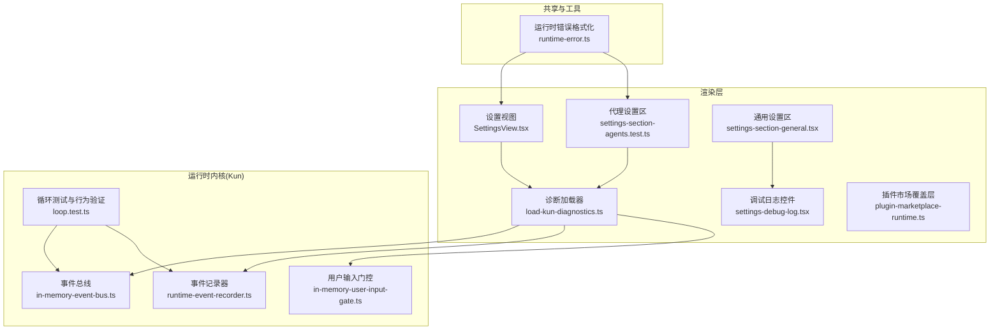
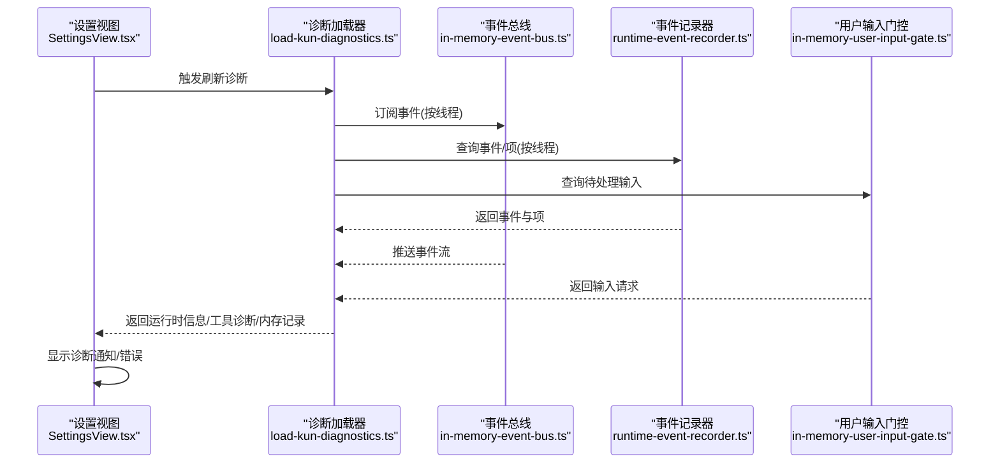
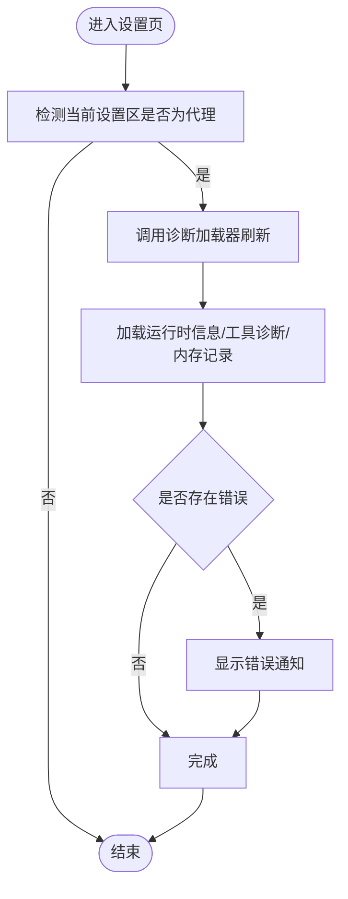
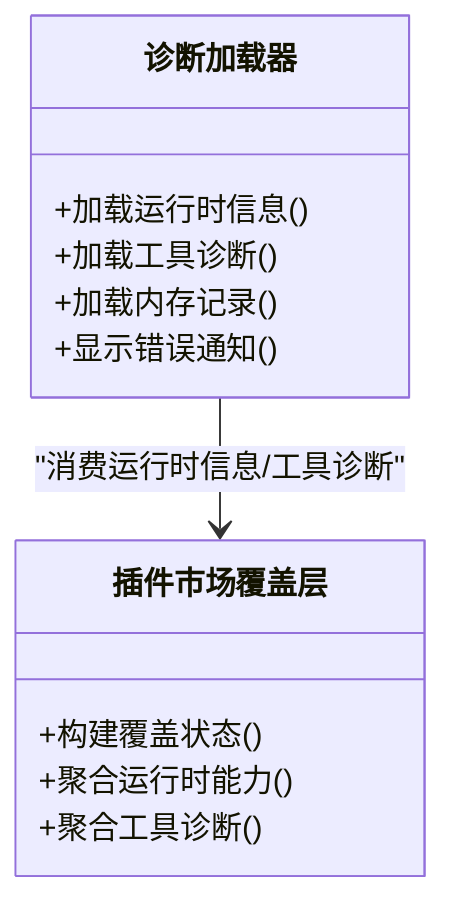
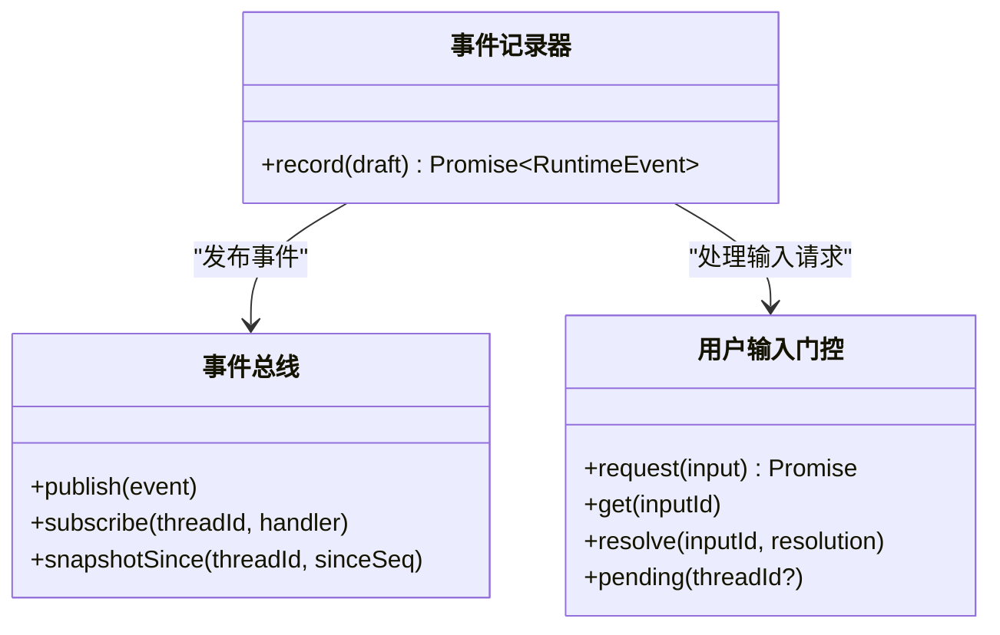
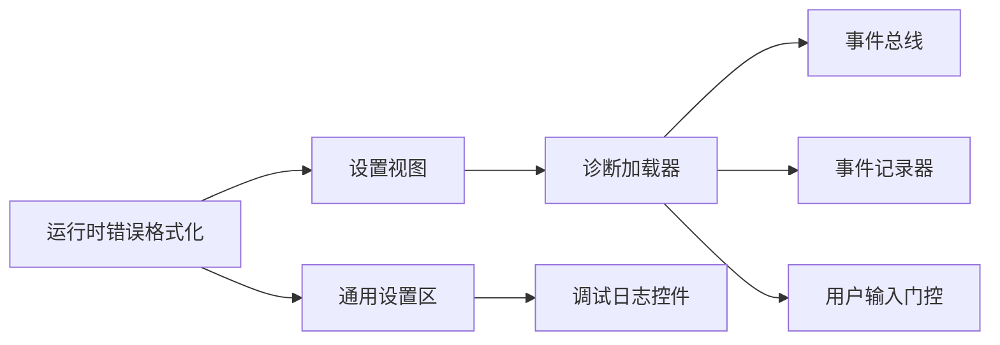

# Agent 调试工具

<cite>
**本文引用的文件**
- [SettingsView.tsx](file://src/renderer/src/components/SettingsView.tsx)
- [settings-section-agents.test.ts](file://src/renderer/src/components/settings-section-agents.test.ts)
- [settings-section-general.tsx](file://src/renderer/src/components/settings-section-general.tsx)
- [settings-debug-log.tsx](file://src/renderer/src/components/settings-debug-log.tsx)
- [plugin-marketplace-runtime.ts](file://src/renderer/src/components/plugin-marketplace-runtime.ts)
- [load-kun-diagnostics.ts](file://src/renderer/src/lib/load-kun-diagnostics.ts)
- [runtime-error.ts](file://src/shared/runtime-error.ts)
- [chat-store-maintenance-actions.ts](file://src/renderer/src/store/chat-store-maintenance-actions.ts)
- [kun-runtime.test.ts](file://src/renderer/src/agent/kun-runtime.test.ts)
- [in-memory-event-bus.ts](file://kun/src/adapters/in-memory-event-bus.ts)
- [runtime-event-recorder.ts](file://kun/src/services/runtime-event-recorder.ts)
- [in-memory-user-input-gate.ts](file://kun/src/adapters/in-memory-user-input-gate.ts)
- [loop.test.ts](file://kun/tests/loop.test.ts)
- [kun-contributing.en.md](file://docs/kun-contributing.en.md)
</cite>

## 目录
1. [简介](#简介)
2. [项目结构](#项目结构)
3. [核心组件](#核心组件)
4. [架构总览](#架构总览)
5. [详细组件分析](#详细组件分析)
6. [依赖关系分析](#依赖关系分析)
7. [性能考量](#性能考量)
8. [故障排查指南](#故障排查指南)
9. [结论](#结论)
10. [附录](#附录)

## 简介
本指南面向使用 DeepSeek-GUI 的开发者，聚焦于 Agent 调试工具的实用开发指南。内容涵盖调试界面使用、日志查看技巧、性能监控与错误诊断方法；深入说明调试模式启用、断点设置、变量检查与执行流程跟踪；并提供常见问题排查步骤与解决方案，帮助快速定位与解决 Agent 相关问题。

## 项目结构
本项目采用前后端分离与多包协作的组织方式：
- 前端渲染层（Electron 渲染进程）：位于 src/renderer，包含调试界面、设置面板、事件流展示等。
- 主进程与运行时适配层：位于 src/main 与 src/preload，负责日志、IPC、系统集成。
- 后端运行时内核（Kun）：位于 kun，包含 Agent 循环、事件总线、工具宿主、内存存储等核心逻辑。
- 文档与贡献规范：位于 docs，包含开发与调试相关的最佳实践。

**图表来源**
- [SettingsView.tsx:376-412](file://src/renderer/src/components/SettingsView.tsx#L376-L412)
- [settings-section-general.tsx:265-351](file://src/renderer/src/components/settings-section-general.tsx#L265-L351)
- [settings-debug-log.tsx](file://src/renderer/src/components/settings-debug-log.tsx)
- [load-kun-diagnostics.ts](file://src/renderer/src/lib/load-kun-diagnostics.ts)
- [plugin-marketplace-runtime.ts:1-44](file://src/renderer/src/components/plugin-marketplace-runtime.ts#L1-L44)
- [in-memory-event-bus.ts:1-38](file://kun/src/adapters/in-memory-event-bus.ts#L1-L38)
- [runtime-event-recorder.ts:1-50](file://kun/src/services/runtime-event-recorder.ts#L1-L50)
- [in-memory-user-input-gate.ts:1-42](file://kun/src/adapters/in-memory-user-input-gate.ts#L1-L42)
- [loop.test.ts:21-646](file://kun/tests/loop.test.ts#L21-L646)

**章节来源**
- [SettingsView.tsx:376-412](file://src/renderer/src/components/SettingsView.tsx#L376-L412)
- [settings-section-general.tsx:265-351](file://src/renderer/src/components/settings-section-general.tsx#L265-L351)
- [settings-debug-log.tsx](file://src/renderer/src/components/settings-debug-log.tsx)
- [load-kun-diagnostics.ts](file://src/renderer/src/lib/load-kun-diagnostics.ts)
- [plugin-marketplace-runtime.ts:1-44](file://src/renderer/src/components/plugin-marketplace-runtime.ts#L1-L44)
- [in-memory-event-bus.ts:1-38](file://kun/src/adapters/in-memory-event-bus.ts#L1-L38)
- [runtime-event-recorder.ts:1-50](file://kun/src/services/runtime-event-recorder.ts#L1-L50)
- [in-memory-user-input-gate.ts:1-42](file://kun/src/adapters/in-memory-user-input-gate.ts#L1-L42)
- [loop.test.ts:21-646](file://kun/tests/loop.test.ts#L21-L646)

## 核心组件
- 设置与诊断
  - 设置视图：提供“刷新运行时诊断”“禁用/删除内存记录”等能力，用于快速定位 Agent 运行状态与工具可用性。
  - 通用设置区：包含日志开关、保留天数、打开日志目录等操作入口。
  - 调试日志控件：封装日志展示与交互。
- 诊断加载器
  - 加载运行时信息、工具诊断、内存记录，并在出现错误时以通知形式提示。
- 插件市场覆盖层
  - 将运行时能力与工具诊断整合为可视化状态（在线/离线/配置/连接/漂移/错误），辅助判断 MCP 服务器健康度。
- 共享错误格式化
  - 统一运行时错误到前端可读格式，便于在 UI 中展示与收集。
- 运行时内核
  - 事件总线：按线程分发事件，支持订阅与快照回放。
  - 事件记录器：为事件分配序号与时间戳，校验契约并持久化。
  - 用户输入门控：管理待处理的用户输入请求，支持重连后继续处理。

**章节来源**
- [SettingsView.tsx:376-412](file://src/renderer/src/components/SettingsView.tsx#L376-L412)
- [settings-section-general.tsx:265-351](file://src/renderer/src/components/settings-section-general.tsx#L265-L351)
- [settings-debug-log.tsx](file://src/renderer/src/components/settings-debug-log.tsx)
- [load-kun-diagnostics.ts](file://src/renderer/src/lib/load-kun-diagnostics.ts)
- [plugin-marketplace-runtime.ts:1-44](file://src/renderer/src/components/plugin-marketplace-runtime.ts#L1-L44)
- [runtime-error.ts:121-148](file://src/shared/runtime-error.ts#L121-L148)
- [in-memory-event-bus.ts:1-38](file://kun/src/adapters/in-memory-event-bus.ts#L1-L38)
- [runtime-event-recorder.ts:1-50](file://kun/src/services/runtime-event-recorder.ts#L1-L50)
- [in-memory-user-input-gate.ts:1-42](file://kun/src/adapters/in-memory-user-input-gate.ts#L1-L42)

## 架构总览
下图展示了调试工具在整体系统中的位置与交互路径：设置面板触发诊断加载，诊断加载器通过运行时客户端查询内核服务，内核通过事件总线与记录器进行事件编排，最终在 UI 中呈现诊断结果与日志。

**图表来源**
- [SettingsView.tsx:376-412](file://src/renderer/src/components/SettingsView.tsx#L376-L412)
- [load-kun-diagnostics.ts](file://src/renderer/src/lib/load-kun-diagnostics.ts)
- [in-memory-event-bus.ts:1-38](file://kun/src/adapters/in-memory-event-bus.ts#L1-L38)
- [runtime-event-recorder.ts:1-50](file://kun/src/services/runtime-event-recorder.ts#L1-L50)
- [in-memory-user-input-gate.ts:1-42](file://kun/src/adapters/in-memory-user-input-gate.ts#L1-L42)

## 详细组件分析

### 组件A：设置视图与诊断刷新
- 功能要点
  - 刷新运行时诊断：调用诊断加载器，填充运行时信息、工具诊断、内存记录；若存在错误则显示通知。
  - 内存记录管理：支持禁用/删除内存记录，便于隔离与复现问题。
  - 与通用设置联动：当处于“代理”设置区时自动刷新诊断。
- 使用建议
  - 在问题复现阶段，先点击“刷新诊断”，确认运行时信息与工具诊断是否异常。
  - 若出现工具缺失或不可用，优先检查工具诊断与插件市场覆盖层状态。

**图表来源**
- [SettingsView.tsx:376-412](file://src/renderer/src/components/SettingsView.tsx#L376-L412)
- [settings-section-agents.test.ts:295-300](file://src/renderer/src/components/settings-section-agents.test.ts#L295-L300)

**章节来源**
- [SettingsView.tsx:376-412](file://src/renderer/src/components/SettingsView.tsx#L376-L412)
- [settings-section-agents.test.ts:295-300](file://src/renderer/src/components/settings-section-agents.test.ts#L295-L300)

### 组件B：通用设置区的日志与诊断
- 功能要点
  - 日志开关与保留策略：控制日志输出与清理周期。
  - 打开日志目录：一键打开日志文件所在目录，便于外部查看与归档。
- 使用建议
  - 复现问题时开启日志并设置合理保留天数，问题解决后及时清理。
  - 使用“打开日志目录”定位具体日志文件，结合运行时诊断结果进行交叉验证。

**章节来源**
- [settings-section-general.tsx:265-351](file://src/renderer/src/components/settings-section-general.tsx#L265-L351)

### 组件C：调试日志控件
- 功能要点
  - 提供日志展示与交互控件，便于在 UI 中查看与筛选日志。
- 使用建议
  - 结合“刷新诊断”与“打开日志目录”，从不同维度确认问题根因。

**章节来源**
- [settings-debug-log.tsx](file://src/renderer/src/components/settings-debug-log.tsx)

### 组件D：诊断加载器与插件市场覆盖层
- 功能要点
  - 诊断加载器：统一加载运行时信息、工具诊断、内存记录，异常时生成通知。
  - 插件市场覆盖层：将运行时能力与工具诊断合并为可视化状态，辅助判断 MCP 服务器健康度。
- 使用建议
  - 当工具缺失或 MCP 服务器异常时，优先查看覆盖层状态（在线/离线/配置/连接/漂移/错误）。

**图表来源**
- [load-kun-diagnostics.ts](file://src/renderer/src/lib/load-kun-diagnostics.ts)
- [plugin-marketplace-runtime.ts:1-44](file://src/renderer/src/components/plugin-marketplace-runtime.ts#L1-L44)

**章节来源**
- [load-kun-diagnostics.ts](file://src/renderer/src/lib/load-kun-diagnostics.ts)
- [plugin-marketplace-runtime.ts:1-44](file://src/renderer/src/components/plugin-marketplace-runtime.ts#L1-L44)

### 组件E：运行时错误格式化
- 功能要点
  - 将运行时错误转换为前端可读格式，支持结构化访问（含 code/message/details）。
- 使用建议
  - 在 UI 中展示错误时，优先使用该模块进行格式化，确保信息一致且可解析。

**章节来源**
- [runtime-error.ts:121-148](file://src/shared/runtime-error.ts#L121-L148)

### 组件F：事件总线、事件记录器与用户输入门控
- 功能要点
  - 事件总线：按线程分发事件，支持订阅与快照回放，是 SSE 回放路径的单源真相。
  - 事件记录器：为事件分配序号与时间戳，校验契约并持久化，作为应用级事件边界。
  - 用户输入门控：管理待处理的用户输入请求，支持重连后继续处理。
- 使用建议
  - 在调试 Agent 执行流程时，关注事件序列与时间戳，结合“刷新诊断”查看工具调用链路。

**图表来源**
- [in-memory-event-bus.ts:1-38](file://kun/src/adapters/in-memory-event-bus.ts#L1-L38)
- [runtime-event-recorder.ts:1-50](file://kun/src/services/runtime-event-recorder.ts#L1-L50)
- [in-memory-user-input-gate.ts:1-42](file://kun/src/adapters/in-memory-user-input-gate.ts#L1-L42)

**章节来源**
- [in-memory-event-bus.ts:1-38](file://kun/src/adapters/in-memory-event-bus.ts#L1-L38)
- [runtime-event-recorder.ts:1-50](file://kun/src/services/runtime-event-recorder.ts#L1-L50)
- [in-memory-user-input-gate.ts:1-42](file://kun/src/adapters/in-memory-user-input-gate.ts#L1-L42)

### 组件G：Agent 循环与断点/变量检查
- 行为特征
  - Agent 循环在测试中被严格验证：能正确处理静默模型、注入本地工具上下文、记录耗时、抑制工具风暴等。
  - 断言覆盖了工具调用失败、事件记录、风暴抑制等关键路径。
- 调试建议
  - 在循环测试中观察事件序列与工具调用链，结合“刷新诊断”定位工具缺失或异常。
  - 使用“打开日志目录”与“调试日志控件”配合查看事件与工具调用细节。

**章节来源**
- [loop.test.ts:21-646](file://kun/tests/loop.test.ts#L21-L646)

## 依赖关系分析
- 组件耦合
  - 设置视图依赖诊断加载器；诊断加载器依赖事件总线、事件记录器与用户输入门控。
  - 通用设置区与调试日志控件共同服务于日志与诊断展示。
- 外部依赖
  - Electron 主进程提供日志目录打开能力；运行时客户端提供 SSE 与事件订阅接口。
- 潜在风险
  - 订阅者抛出异常应被隔离，避免影响事件总线的持续分发。
  - 错误格式化需保持一致性，避免 UI 层重复解析。

**图表来源**
- [SettingsView.tsx:376-412](file://src/renderer/src/components/SettingsView.tsx#L376-L412)
- [settings-section-general.tsx:265-351](file://src/renderer/src/components/settings-section-general.tsx#L265-L351)
- [settings-debug-log.tsx](file://src/renderer/src/components/settings-debug-log.tsx)
- [load-kun-diagnostics.ts](file://src/renderer/src/lib/load-kun-diagnostics.ts)
- [in-memory-event-bus.ts:1-38](file://kun/src/adapters/in-memory-event-bus.ts#L1-L38)
- [runtime-event-recorder.ts:1-50](file://kun/src/services/runtime-event-recorder.ts#L1-L50)
- [in-memory-user-input-gate.ts:1-42](file://kun/src/adapters/in-memory-user-input-gate.ts#L1-L42)
- [runtime-error.ts:121-148](file://src/shared/runtime-error.ts#L121-L148)

**章节来源**
- [SettingsView.tsx:376-412](file://src/renderer/src/components/SettingsView.tsx#L376-L412)
- [settings-section-general.tsx:265-351](file://src/renderer/src/components/settings-section-general.tsx#L265-L351)
- [settings-debug-log.tsx](file://src/renderer/src/components/settings-debug-log.tsx)
- [load-kun-diagnostics.ts](file://src/renderer/src/lib/load-kun-diagnostics.ts)
- [in-memory-event-bus.ts:1-38](file://kun/src/adapters/in-memory-event-bus.ts#L1-L38)
- [runtime-event-recorder.ts:1-50](file://kun/src/services/runtime-event-recorder.ts#L1-L50)
- [in-memory-user-input-gate.ts:1-42](file://kun/src/adapters/in-memory-user-input-gate.ts#L1-L42)
- [runtime-error.ts:121-148](file://src/shared/runtime-error.ts#L121-L148)

## 性能考量
- 事件总线与记录器
  - 事件分发与持久化应尽量轻量，避免阻塞主线程。
  - 对订阅者的异常进行隔离，保证事件总线持续运行。
- 工具风暴抑制
  - 在循环中对工具风暴进行抑制，防止资源耗尽与 UI 卡顿。
- 缓存与回放
  - 利用事件快照进行 SSE 回放，减少重复计算与网络压力。

**章节来源**
- [kun-contributing.en.md:405-431](file://docs/kun-contributing.en.md#L405-L431)
- [loop.test.ts:610-643](file://kun/tests/loop.test.ts#L610-L643)

## 故障排查指南
- 启用调试模式与日志
  - 在通用设置区开启日志开关，设置合理的保留天数。
  - 使用“打开日志目录”定位日志文件，结合诊断结果交叉验证。
- 刷新运行时诊断
  - 在代理设置区点击“刷新诊断”，查看运行时信息、工具诊断与内存记录。
  - 若出现错误通知，优先根据通知内容定位工具缺失或 MCP 服务器异常。
- 断点与变量检查
  - 在循环测试中观察事件序列与工具调用链，结合“刷新诊断”定位工具缺失或异常。
  - 使用“打开日志目录”与“调试日志控件”配合查看事件与工具调用细节。
- 执行流程跟踪
  - 关注事件总线的订阅与快照回放，核对事件顺序与时间戳。
  - 使用用户输入门控的状态，确认待处理输入是否被正确解析。
- 常见问题与解决方案
  - 工具缺失：检查工具诊断与插件市场覆盖层状态，必要时重新配置 MCP 服务器。
  - 日志无法打开：确认主进程提供“打开日志目录”的 IPC 能力，若无则在开发环境手动定位日志路径。
  - 事件丢失：检查事件总线的订阅与异常隔离机制，确保订阅者不会中断事件分发。

**章节来源**
- [settings-section-general.tsx:265-351](file://src/renderer/src/components/settings-section-general.tsx#L265-L351)
- [SettingsView.tsx:376-412](file://src/renderer/src/components/SettingsView.tsx#L376-L412)
- [plugin-marketplace-runtime.ts:1-44](file://src/renderer/src/components/plugin-marketplace-runtime.ts#L1-L44)
- [in-memory-event-bus.ts:1-38](file://kun/src/adapters/in-memory-event-bus.ts#L1-L38)
- [in-memory-user-input-gate.ts:1-42](file://kun/src/adapters/in-memory-user-input-gate.ts#L1-L42)
- [loop.test.ts:21-646](file://kun/tests/loop.test.ts#L21-L646)

## 结论
通过设置视图、诊断加载器、事件总线与记录器、用户输入门控以及日志与错误格式化等组件的协同，本项目提供了完整的 Agent 调试工具链。建议在问题复现阶段遵循“开启日志—刷新诊断—查看事件—定位工具—打开日志目录”的流程，结合循环测试中的断点与变量检查，快速定位并解决问题。

## 附录
- 相关测试参考
  - Agent 循环行为与断点/变量检查：参见循环测试文件。
  - 运行时客户端能力与错误处理：参见运行时客户端测试文件。

**章节来源**
- [loop.test.ts:21-646](file://kun/tests/loop.test.ts#L21-L646)
- [kun-runtime.test.ts:40-85](file://src/renderer/src/agent/kun-runtime.test.ts#L40-L85)