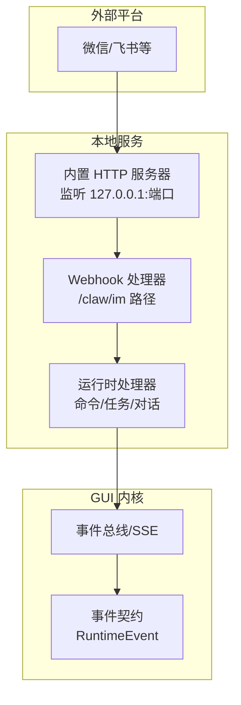
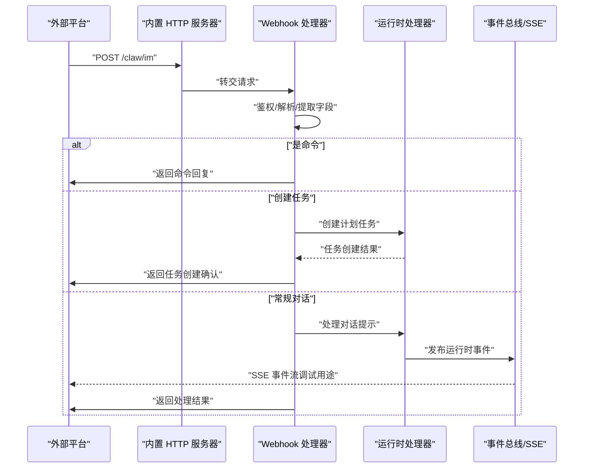
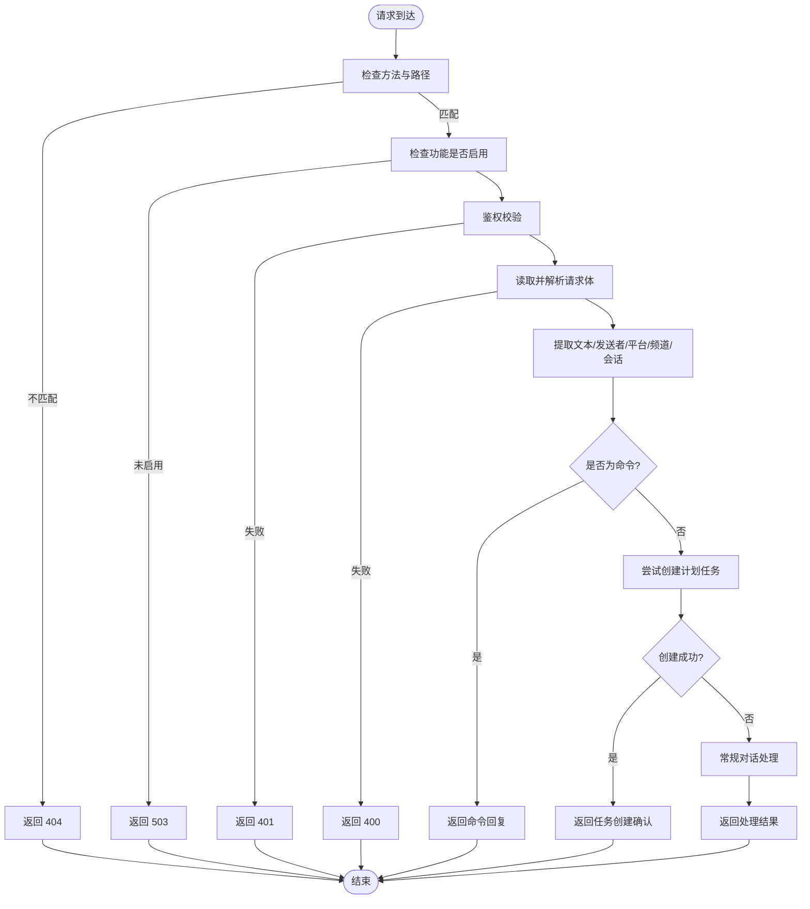
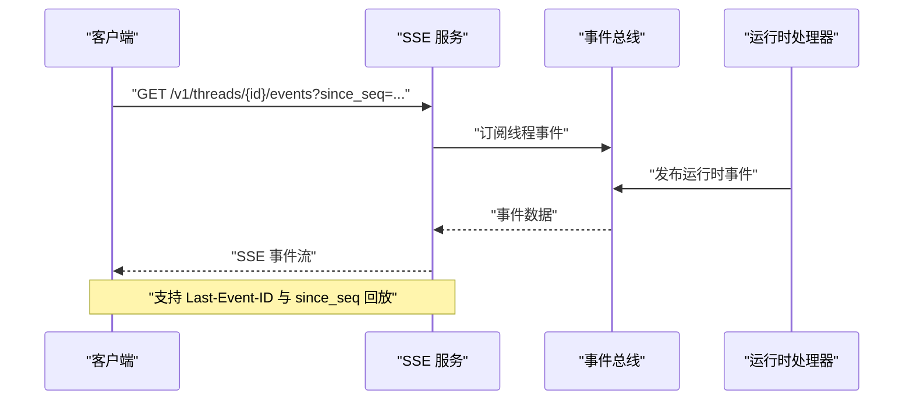
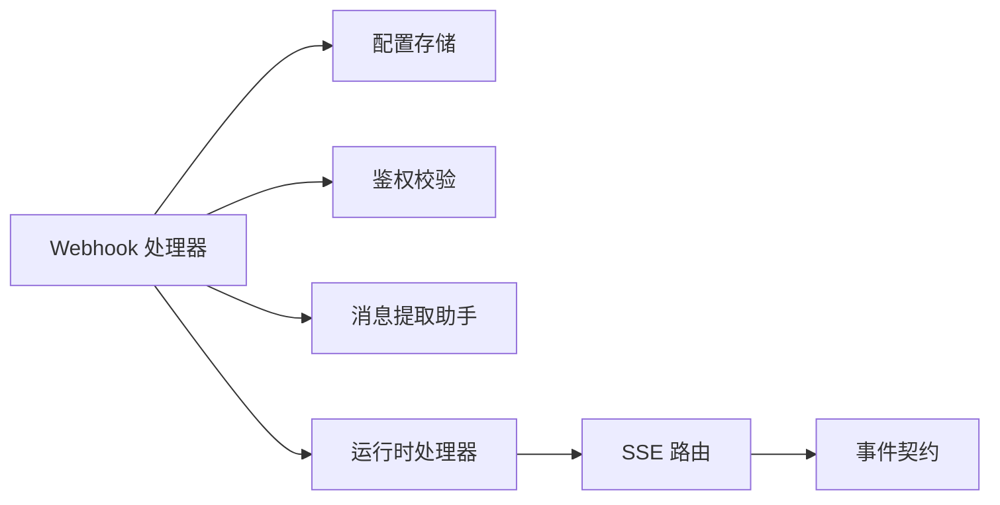

# Webhook 中继机制

<cite>
**本文引用的文件**
- [claw-runtime.ts](file://src/main/claw-runtime.ts)
- [claw-runtime-helpers.ts](file://src/main/claw-runtime-helpers.ts)
- [weixin-bridge-runtime.ts](file://src/main/weixin-bridge-runtime.ts)
- [index.ts](file://src/main/index.ts)
- [events.ts](file://kun/src/server/routes/events.ts)
- [events.ts（契约）](file://kun/src/contracts/events.ts)
</cite>

## 目录
1. [简介](#简介)
2. [项目结构](#项目结构)
3. [核心组件](#核心组件)
4. [架构总览](#架构总览)
5. [详细组件分析](#详细组件分析)
6. [依赖关系分析](#依赖关系分析)
7. [性能考量](#性能考量)
8. [故障排查指南](#故障排查指南)
9. [结论](#结论)
10. [附录](#附录)

## 简介
本文件系统性阐述 DeepSeek GUI 中的 Webhook 中继机制，重点覆盖以下方面：
- 本地 Webhook/中继的实现原理与消息路由
- 事件触发条件与处理流程
- Webhook 配置方法、消息格式规范与安全验证机制
- 常见场景的配置示例与调试技巧
- 与运行时事件流（SSE）的关系与集成点

该机制允许外部即时通讯平台（如微信、飞书）通过 HTTP POST 将消息推送到本地服务端口，由 GUI 进行解析、路由与执行，最终返回统一的响应或触发后续任务。

## 项目结构
Webhook 中继相关的核心代码分布在主进程与运行时模块中，并与运行时事件系统（SSE）协同工作：
- 主进程 Webhook 处理：负责接收外部平台推送的消息，进行鉴权、解析、路由与回复
- 运行时工具链：负责将消息转换为内部任务或命令，驱动线程/回合/工具调用
- 事件系统（SSE）：用于向客户端推送运行时事件，便于调试与状态同步

图表来源
- [claw-runtime.ts:1325-1441](file://src/main/claw-runtime.ts#L1325-L1441)
- [claw-runtime-helpers.ts:298-300](file://src/main/claw-runtime-helpers.ts#L298-L300)
- [events.ts:1-104](file://kun/src/server/routes/events.ts#L1-L104)
- [events.ts（契约）:1-249](file://kun/src/contracts/events.ts#L1-L249)

章节来源
- [claw-runtime.ts:1325-1441](file://src/main/claw-runtime.ts#L1325-L1441)
- [claw-runtime-helpers.ts:298-300](file://src/main/claw-runtime-helpers.ts#L298-L300)
- [events.ts:1-104](file://kun/src/server/routes/events.ts#L1-L104)
- [events.ts（契约）:1-249](file://kun/src/contracts/events.ts#L1-L249)

## 核心组件
- Webhook 接收与路由
  - 路由规则：仅接受 POST 请求且路径匹配配置中的路径；否则返回 404
  - 禁用检测：若全局或 IM Webhook 功能关闭，返回 503
  - 安全校验：支持两种鉴权方式（Authorization Bearer 与自定义头），需与配置中的密钥一致
  - 消息解析：限制请求体大小，解析为 JSON 对象；非对象则返回 400
  - 提取消息文本、发送者标签、平台类型、频道 ID、远端会话信息
- 命令与任务处理
  - 若识别为命令，优先返回命令回复
  - 否则尝试根据提示词创建计划类任务；成功则返回创建确认
  - 最后进入常规对话处理流程，返回结果或错误
- 事件与回放
  - 运行时事件通过 SSE 流式推送，支持断线重连与序列号回放

章节来源
- [claw-runtime.ts:1325-1441](file://src/main/claw-runtime.ts#L1325-L1441)
- [claw-runtime-helpers.ts:316-476](file://src/main/claw-runtime-helpers.ts#L316-L476)
- [events.ts:1-104](file://kun/src/server/routes/events.ts#L1-L104)

## 架构总览
下图展示从外部平台到 GUI 内核的完整链路，包括鉴权、消息提取、路由与回复：

图表来源
- [claw-runtime.ts:1325-1441](file://src/main/claw-runtime.ts#L1325-L1441)
- [claw-runtime-helpers.ts:316-476](file://src/main/claw-runtime-helpers.ts#L316-L476)
- [events.ts:1-104](file://kun/src/server/routes/events.ts#L1-L104)

## 详细组件分析

### Webhook 接收与路由组件
- 路由与入口
  - 仅在指定路径与方法下处理请求，其余返回 404
  - 全局或 IM 功能禁用时返回 503
- 安全验证
  - 支持 Authorization Bearer 与自定义头两种方式
  - 任一匹配即通过；否则返回 401
- 请求体处理
  - 限制最大体积，避免内存压力
  - 解析失败或非对象返回 400
- 消息提取
  - 文本：优先级包含多层嵌套键位
  - 发送者：优先级包含多种标识键位
  - 平台：标准化为 weixin 或 feishu
  - 频道：按 channelId 或平台匹配
  - 远端会话：抽取 chatId/messageId/threadId/senderId/senderName
- 命令与任务优先处理
  - 命令命中：立即返回命令回复
  - 计划任务创建：返回任务 ID 与确认文本
  - 否则进入常规对话处理，返回最终结果

图表来源
- [claw-runtime.ts:1325-1441](file://src/main/claw-runtime.ts#L1325-L1441)
- [claw-runtime-helpers.ts:316-476](file://src/main/claw-runtime-helpers.ts#L316-L476)

章节来源
- [claw-runtime.ts:1325-1441](file://src/main/claw-runtime.ts#L1325-L1441)
- [claw-runtime-helpers.ts:316-476](file://src/main/claw-runtime-helpers.ts#L316-L476)

### Webhook 配置方法
- 绑定地址与端口
  - 默认监听 127.0.0.1:端口，确保仅本地访问
- 路径配置
  - 使用配置项设置 Webhook 路径（例如 /claw/im）
- 密钥配置
  - 可选密钥用于鉴权；为空则跳过鉴权
- 平台与频道
  - 指定默认平台（weixin/feishu）
  - 配置频道列表，包含启用状态、平台、ID、标签等

章节来源
- [claw-runtime-helpers.ts:298-300](file://src/main/claw-runtime-helpers.ts#L298-L300)
- [index.ts:730-731](file://src/main/index.ts#L730-L731)

### 消息格式规范
- 必填字段
  - 文本内容：支持多层级键位，最终提取为提示文本
- 可选字段
  - 发送者标识、平台/来源、频道 ID、远端会话信息（chatId/messageId/threadId/senderId/senderName）
- 结构建议
  - 建议统一使用 JSON 对象，避免非对象或空对象导致解析失败
  - 若携带远端会话信息，有助于维持对话上下文与会话关联

章节来源
- [claw-runtime-helpers.ts:316-446](file://src/main/claw-runtime-helpers.ts#L316-L446)

### 安全验证机制
- 鉴权头支持
  - Authorization: Bearer <密钥>
  - 自定义头: x-deepseek-gui-secret
- 通过条件
  - 任一头与配置密钥一致即通过
- 未通过处理
  - 返回 401 并记录错误日志

章节来源
- [claw-runtime.ts:1351-1360](file://src/main/claw-runtime.ts#L1351-L1360)

### 事件触发与运行时集成
- 命令与任务处理完成后，运行时会发布一系列事件
- SSE 事件流可用于客户端订阅，支持断线重连与序列号回放
- 事件类型涵盖线程/回合生命周期、工具调用、审批、用户输入、用量统计等

图表来源
- [events.ts:1-104](file://kun/src/server/routes/events.ts#L1-L104)
- [events.ts（契约）:1-249](file://kun/src/contracts/events.ts#L1-L249)

章节来源
- [events.ts:1-104](file://kun/src/server/routes/events.ts#L1-L104)
- [events.ts（契约）:1-249](file://kun/src/contracts/events.ts#L1-L249)

### 常见场景与配置示例
- 微信/飞书回调对接
  - 在平台侧配置回调 URL 为 http://127.0.0.1:端口/路径
  - 如启用密钥，需在平台侧设置相同的密钥值
  - 飞书场景可利用远端会话信息保持对话连续性
- 命令优先处理
  - 当提示词符合命令模式时，将直接返回命令回复，无需创建任务
- 计划任务创建
  - 当命令不匹配但提示词具备任务特征时，可创建计划任务并返回确认信息

章节来源
- [weixin-bridge-runtime.ts:816-828](file://src/main/weixin-bridge-runtime.ts#L816-L828)
- [claw-runtime.ts:1398-1429](file://src/main/claw-runtime.ts#L1398-L1429)

### 调试技巧
- 使用 SSE 观察运行时事件
  - 订阅 /v1/threads/{id}/events，结合 since_seq 或 Last-Event-ID 实现断线重连
- 日志定位
  - Webhook 处理异常会记录错误日志，便于定位问题
- 请求体限制
  - 超过限制将被拒绝，注意平台侧消息大小控制

章节来源
- [events.ts:1-104](file://kun/src/server/routes/events.ts#L1-L104)
- [claw-runtime.ts:1430-1435](file://src/main/claw-runtime.ts#L1430-L1435)
- [claw-runtime-helpers.ts:464-476](file://src/main/claw-runtime-helpers.ts#L464-L476)

## 依赖关系分析
- Webhook 处理器依赖
  - 配置存储：加载全局与 IM 设置
  - 鉴权：基于配置密钥与请求头
  - 消息提取：通用辅助函数
  - 运行时：命令处理、任务创建、对话处理
- 事件系统依赖
  - SSE 路由：构建事件流响应
  - 事件契约：统一事件结构与枚举

图表来源
- [claw-runtime.ts:1325-1441](file://src/main/claw-runtime.ts#L1325-L1441)
- [claw-runtime-helpers.ts:298-476](file://src/main/claw-runtime-helpers.ts#L298-L476)
- [events.ts:1-104](file://kun/src/server/routes/events.ts#L1-L104)
- [events.ts（契约）:1-249](file://kun/src/contracts/events.ts#L1-L249)

章节来源
- [claw-runtime.ts:1325-1441](file://src/main/claw-runtime.ts#L1325-L1441)
- [claw-runtime-helpers.ts:298-476](file://src/main/claw-runtime-helpers.ts#L298-L476)
- [events.ts:1-104](file://kun/src/server/routes/events.ts#L1-L104)
- [events.ts（契约）:1-249](file://kun/src/contracts/events.ts#L1-L249)

## 性能考量
- 请求体大小限制：防止过大请求占用内存
- 事件流心跳：定期发送心跳，保证连接活跃与断线检测
- 任务创建与对话处理：尽量复用现有线程/回合，减少重复初始化开销

章节来源
- [claw-runtime-helpers.ts:464-476](file://src/main/claw-runtime-helpers.ts#L464-L476)
- [events.ts:61-77](file://kun/src/server/routes/events.ts#L61-L77)

## 故障排查指南
- 404 Not Found
  - 检查请求方法与路径是否正确
- 503 Service Unavailable
  - 确认全局或 IM Webhook 已启用
- 401 Unauthorized
  - 核对鉴权头与配置密钥是否一致
- 400 Bad Request
  - 确认请求体为合法 JSON 对象
- 5xx 错误
  - 查看错误日志，定位具体异常

章节来源
- [claw-runtime.ts:1343-1360](file://src/main/claw-runtime.ts#L1343-L1360)
- [claw-runtime.ts:1430-1435](file://src/main/claw-runtime.ts#L1430-L1435)

## 结论
本 Webhook 中继机制以“轻量、可扩展、可观测”为目标，通过严格的鉴权与消息提取逻辑，将外部平台消息无缝接入 GUI 内核。配合 SSE 事件流，开发者可以高效地调试与优化消息传递流程，满足微信、飞书等平台的即时消息中继需求。

## 附录
- 关键实现位置参考
  - Webhook 处理入口与流程：[claw-runtime.ts:1325-1441](file://src/main/claw-runtime.ts#L1325-L1441)
  - 消息提取与鉴权辅助：[claw-runtime-helpers.ts:316-476](file://src/main/claw-runtime-helpers.ts#L316-L476)
  - SSE 事件流构建：[events.ts:1-104](file://kun/src/server/routes/events.ts#L1-L104)
  - 事件契约定义：[events.ts（契约）:1-249](file://kun/src/contracts/events.ts#L1-L249)
  - 微信桥接调用 Webhook 示例：[weixin-bridge-runtime.ts:816-828](file://src/main/weixin-bridge-runtime.ts#L816-L828)
  - Webhook URL 生成：[claw-runtime-helpers.ts:298-300](file://src/main/claw-runtime-helpers.ts#L298-L300)
  - Webhook 配置注入：[index.ts:730-731](file://src/main/index.ts#L730-L731)