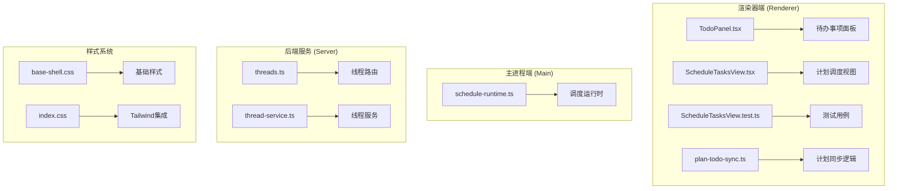
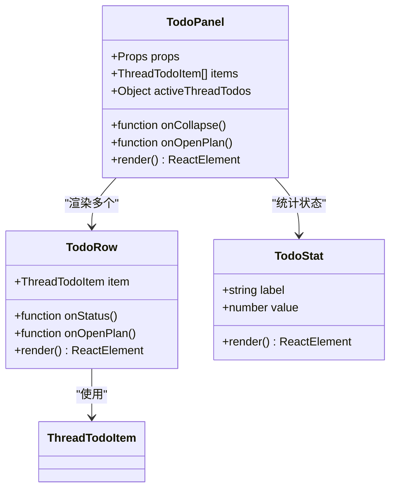
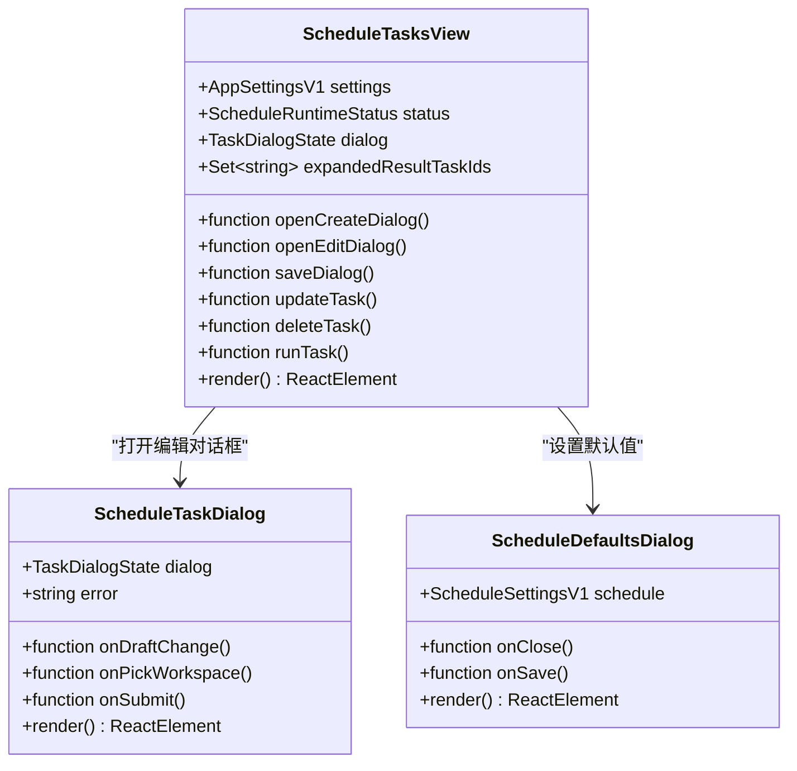
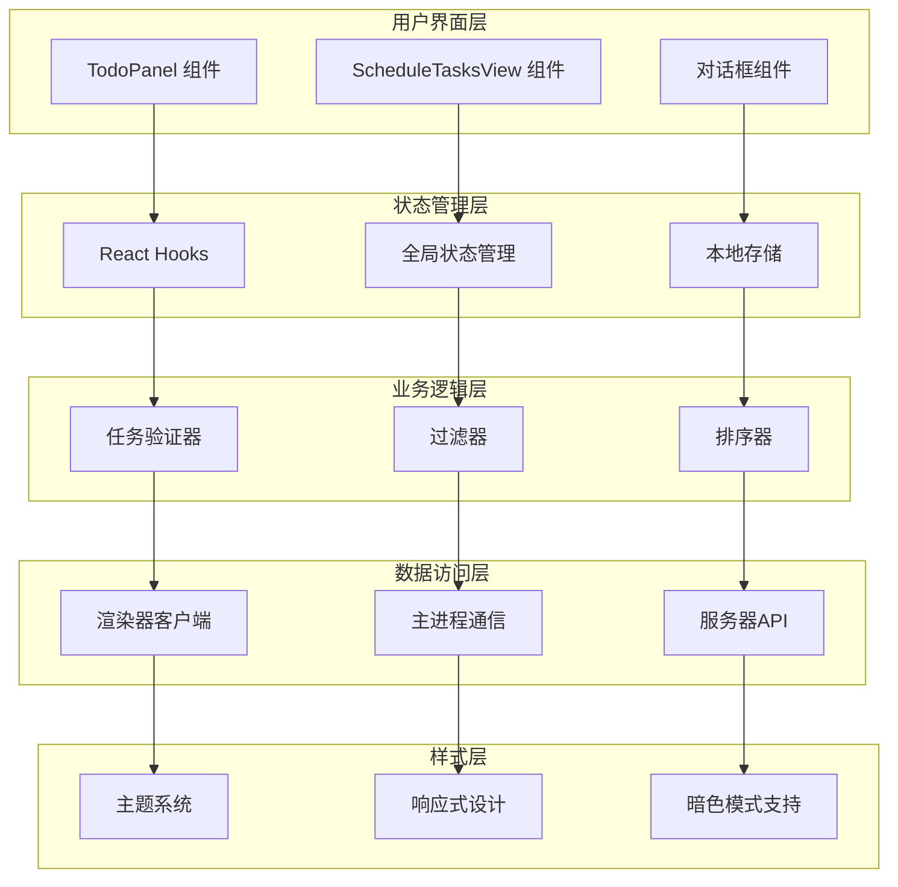
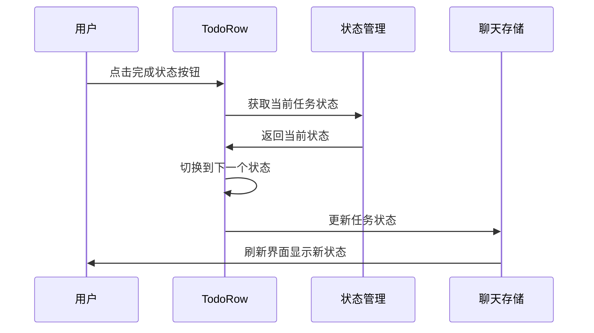
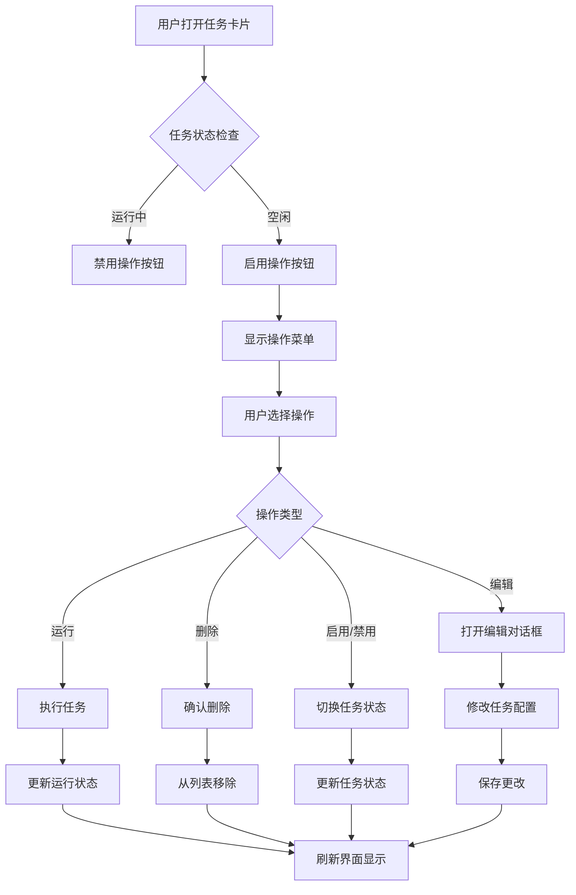
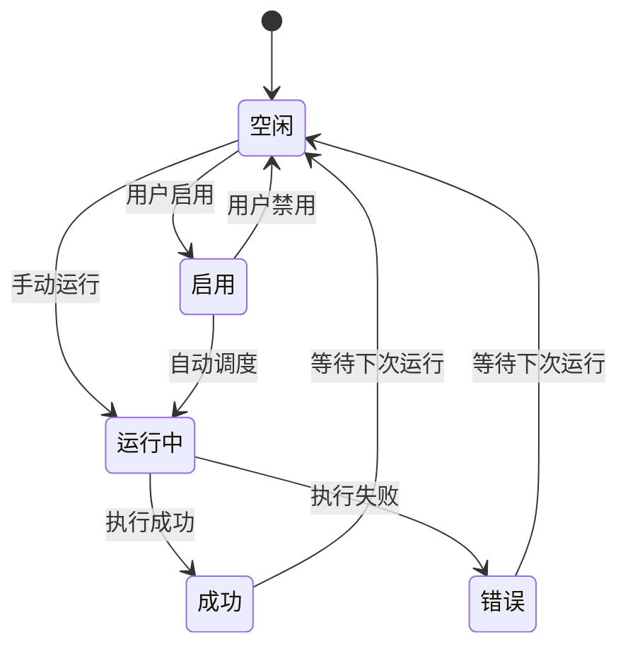
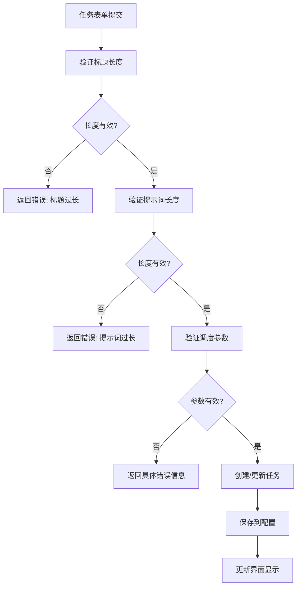
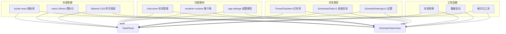

# 任务卡片功能

<cite>
**本文档引用的文件**
- [TodoPanel.tsx](file://src/renderer/src/components/todo/TodoPanel.tsx)
- [ScheduleTasksView.tsx](file://src/renderer/src/components/schedule/ScheduleTasksView.tsx)
- [ScheduleTasksView.test.ts](file://src/renderer/src/components/schedule/ScheduleTasksView.test.ts)
- [plan-todo-sync.ts](file://src/renderer/src/plan/plan-todo-sync.ts)
- [threads.ts](file://kun/src/server/routes/threads.ts)
- [threads.ts（合约）](file://kun/src/contracts/threads.ts)
- [thread-service.ts](file://kun/src/services/thread-service.ts)
- [schedule-runtime.ts](file://src/main/schedule-runtime.ts)
- [base-shell.css](file://src/renderer/src/styles/base-shell.css)
- [index.css](file://src/renderer/src/index.css)
</cite>

## 目录
1. [简介](#简介)
2. [项目结构](#项目结构)
3. [核心组件](#核心组件)
4. [架构概览](#架构概览)
5. [详细组件分析](#详细组件分析)
6. [依赖关系分析](#依赖关系分析)
7. [性能考虑](#性能考虑)
8. [故障排除指南](#故障排除指南)
9. [结论](#结论)

## 简介

任务卡片功能是 DeepSeek-GUI 中用于管理和展示不同类型任务的核心界面组件。该功能涵盖了待办事项管理和计划调度两大核心场景，为用户提供统一的任务管理体验。

任务卡片设计遵循现代化的 UI 原则，采用卡片式布局，支持多种交互模式，包括状态切换、进度显示、操作按钮和详情查看等功能。系统提供了丰富的自定义选项，允许用户根据个人偏好调整界面外观和行为。

## 项目结构

任务卡片功能主要分布在以下目录结构中：

**图表来源**
- [TodoPanel.tsx:1-188](file://src/renderer/src/components/todo/TodoPanel.tsx#L1-L188)
- [ScheduleTasksView.tsx:1-1015](file://src/renderer/src/components/schedule/ScheduleTasksView.tsx#L1-L1015)

**章节来源**
- [TodoPanel.tsx:1-188](file://src/renderer/src/components/todo/TodoPanel.tsx#L1-L188)
- [ScheduleTasksView.tsx:1-1015](file://src/renderer/src/components/schedule/ScheduleTasksView.tsx#L1-L1015)

## 核心组件

### 待办事项面板 (TodoPanel)

待办事项面板是任务卡片功能的重要组成部分，专门用于管理当前会话中的待办事项。该组件提供了直观的状态管理和进度跟踪功能。

**图表来源**
- [TodoPanel.tsx:23-104](file://src/renderer/src/components/todo/TodoPanel.tsx#L23-L104)
- [TodoPanel.tsx:118-187](file://src/renderer/src/components/todo/TodoPanel.tsx#L118-L187)

### 计划调度视图 (ScheduleTasksView)

计划调度视图是任务卡片功能的核心组件，负责管理所有计划的调度任务。该组件提供了完整的任务生命周期管理功能。

**图表来源**
- [ScheduleTasksView.tsx:205-632](file://src/renderer/src/components/schedule/ScheduleTasksView.tsx#L205-L632)
- [ScheduleTasksView.tsx:634-910](file://src/renderer/src/components/schedule/ScheduleTasksView.tsx#L634-L910)

**章节来源**
- [TodoPanel.tsx:1-188](file://src/renderer/src/components/todo/TodoPanel.tsx#L1-L188)
- [ScheduleTasksView.tsx:1-1015](file://src/renderer/src/components/schedule/ScheduleTasksView.tsx#L1-L1015)

## 架构概览

任务卡片功能采用分层架构设计，确保了良好的可维护性和扩展性：

**图表来源**
- [TodoPanel.tsx:23-104](file://src/renderer/src/components/todo/TodoPanel.tsx#L23-L104)
- [ScheduleTasksView.tsx:205-632](file://src/renderer/src/components/schedule/ScheduleTasksView.tsx#L205-L632)

## 详细组件分析

### 待办事项卡片组件

待办事项卡片是任务卡片功能中最简单的形式，主要用于管理当前会话中的任务项。

#### 设计理念

待办事项卡片采用了简洁而高效的设计原则：

- **状态可视化**：通过不同颜色和图标清晰显示任务状态
- **紧凑布局**：在有限的空间内展示尽可能多的信息
- **快速操作**：提供一键切换任务状态的功能
- **进度跟踪**：通过统计面板展示整体进度

#### 交互模式

**图表来源**
- [TodoPanel.tsx:118-187](file://src/renderer/src/components/todo/TodoPanel.tsx#L118-L187)

#### 信息展示方式

待办事项卡片的信息展示遵循"重要信息优先"的原则：

1. **状态指示器**：左侧圆形图标显示当前状态
2. **任务内容**：主要内容区域显示任务描述
3. **来源信息**：当任务来自计划时显示来源路径
4. **状态按钮**：底部提供状态切换按钮组

**章节来源**
- [TodoPanel.tsx:118-187](file://src/renderer/src/components/todo/TodoPanel.tsx#L118-L187)

### 计划调度卡片组件

计划调度卡片是最复杂和功能最丰富的任务卡片类型，支持多种调度模式和高级功能。

#### 设计理念

计划调度卡片的设计目标是提供一个功能完整但易于使用的任务管理界面：

- **多功能集成**：在一个卡片中集成所有必要的管理功能
- **状态丰富**：支持多种任务状态和运行状态
- **时间感知**：提供精确的时间管理和调度功能
- **结果可视化**：清晰展示任务执行结果和日志

#### 交互模式

**图表来源**
- [ScheduleTasksView.tsx:482-601](file://src/renderer/src/components/schedule/ScheduleTasksView.tsx#L482-L601)

#### 信息展示方式

计划调度卡片采用层次化的信息展示结构：

1. **基本信息区**：标题、状态标签、简要描述
2. **元数据区**：调度规则、下次运行时间、最后运行时间
3. **操作区**：运行按钮、编辑按钮、删除按钮、启用开关
4. **结果区**：上次执行结果、错误信息、详细日志

**章节来源**
- [ScheduleTasksView.tsx:482-601](file://src/renderer/src/components/schedule/ScheduleTasksView.tsx#L482-L601)

### 任务状态管理系统

任务状态管理是任务卡片功能的核心机制，负责维护和同步各种任务状态。

#### 状态定义

**图表来源**
- [ScheduleTasksView.tsx:198-203](file://src/renderer/src/components/schedule/ScheduleTasksView.tsx#L198-L203)

#### 状态转换逻辑

任务状态转换遵循严格的业务规则：

1. **手动运行**：用户点击运行按钮时，任务从空闲状态转换为运行中状态
2. **自动调度**：当到达预定时间时，启用的任务自动转换为运行中状态
3. **结果反馈**：任务完成后根据结果转换为成功或错误状态
4. **状态持久化**：所有状态变化都会保存到配置文件中

**章节来源**
- [ScheduleTasksView.tsx:198-203](file://src/renderer/src/components/schedule/ScheduleTasksView.tsx#L198-L203)

### 数据验证和处理

任务卡片功能包含完善的输入验证和数据处理机制：

#### 验证规则

**图表来源**
- [ScheduleTasksView.tsx:140-161](file://src/renderer/src/components/schedule/ScheduleTasksView.tsx#L140-L161)

#### 数据处理流程

任务数据在提交过程中经过多层处理：

1. **格式化**：清理和标准化用户输入
2. **验证**：检查数据的有效性和完整性
3. **转换**：将用户输入转换为内部数据结构
4. **持久化**：保存到应用设置中
5. **同步**：更新所有相关组件的状态

**章节来源**
- [ScheduleTasksView.tsx:140-161](file://src/renderer/src/components/schedule/ScheduleTasksView.tsx#L140-L161)

## 依赖关系分析

任务卡片功能涉及多个层面的依赖关系，形成了一个复杂的生态系统：

**图表来源**
- [TodoPanel.tsx:1-13](file://src/renderer/src/components/todo/TodoPanel.tsx#L1-L13)
- [ScheduleTasksView.tsx:1-38](file://src/renderer/src/components/schedule/ScheduleTasksView.tsx#L1-L38)

### 组件耦合度分析

任务卡片功能在设计时充分考虑了组件间的解耦：

- **低耦合**：各组件间通过明确的接口进行通信
- **高内聚**：每个组件专注于特定的功能领域
- **可测试性**：组件设计便于单元测试和集成测试
- **可维护性**：清晰的职责分离便于长期维护

**章节来源**
- [TodoPanel.tsx:1-188](file://src/renderer/src/components/todo/TodoPanel.tsx#L1-L188)
- [ScheduleTasksView.tsx:1-1015](file://src/renderer/src/components/schedule/ScheduleTasksView.tsx#L1-L1015)

## 性能考虑

任务卡片功能在性能方面采用了多项优化策略：

### 渲染优化

1. **虚拟滚动**：对于大量任务的情况，使用虚拟滚动技术提高渲染性能
2. **懒加载**：对话框和详情面板采用懒加载机制
3. **状态缓存**：频繁访问的数据进行内存缓存
4. **批量更新**：多个状态变更合并为一次更新

### 数据流优化

1. **局部状态**：组件内部状态最小化，减少不必要的重渲染
2. **记忆化**：使用 useMemo 和 useCallback 优化昂贵计算
3. **防抖处理**：输入验证和搜索操作添加防抖机制
4. **增量更新**：只更新发生变化的部分 DOM

### 网络优化

1. **请求合并**：多个相关请求合并为一次网络调用
2. **缓存策略**：合理利用浏览器缓存和应用缓存
3. **连接复用**：HTTP 连接进行复用
4. **压缩传输**：启用 Gzip 压缩减少传输数据量

## 故障排除指南

### 常见问题诊断

#### 任务状态异常

**症状**：任务状态显示不正确或无法更新

**可能原因**：
1. 状态同步失败
2. 数据库连接问题
3. 缓存数据过期
4. 网络请求超时

**解决步骤**：
1. 检查网络连接状态
2. 刷新页面重新加载数据
3. 清除浏览器缓存
4. 查看控制台错误信息

#### 任务执行失败

**症状**：任务运行后显示错误状态

**可能原因**：
1. 模型配置错误
2. 工作空间权限问题
3. 资源限制
4. 代理配置问题

**解决步骤**：
1. 检查模型 ID 是否正确
2. 验证工作空间路径存在且可访问
3. 确认有足够的系统资源
4. 测试代理连接

#### 界面显示问题

**症状**：任务卡片显示异常或布局错乱

**可能原因**：
1. 样式冲突
2. 浏览器兼容性问题
3. 主题配置错误
4. 屏幕分辨率适配问题

**解决步骤**：
1. 切换到默认主题测试
2. 检查浏览器开发者工具中的样式
3. 更新到最新版本
4. 调整屏幕分辨率

**章节来源**
- [ScheduleTasksView.tsx:363-371](file://src/renderer/src/components/schedule/ScheduleTasksView.tsx#L363-L371)

### 调试技巧

1. **启用开发模式**：使用 `npm run dev` 启动开发服务器获取详细错误信息
2. **使用浏览器调试工具**：检查网络请求和 JavaScript 错误
3. **查看应用日志**：在控制台中查看详细的执行日志
4. **单元测试**：运行测试套件验证功能正确性

## 结论

任务卡片功能通过精心设计的组件架构和丰富的交互模式，为用户提供了强大而直观的任务管理体验。该功能不仅满足了基本的任务管理需求，还提供了高级的调度和监控能力。

### 主要优势

1. **设计理念先进**：采用卡片式布局和状态可视化设计
2. **交互体验优秀**：提供流畅的用户交互和即时反馈
3. **功能完整性**：涵盖从简单到复杂的各种任务管理场景
4. **可扩展性强**：模块化设计便于功能扩展和定制

### 技术特色

1. **响应式设计**：适配各种设备和屏幕尺寸
2. **主题系统**：支持明暗主题切换
3. **国际化支持**：完整的多语言界面
4. **性能优化**：采用多种技术手段保证运行效率

### 发展方向

未来可以在以下方面进一步改进：
1. **智能推荐**：基于历史数据提供任务优先级建议
2. **协作功能**：支持多人协作和任务分配
3. **集成扩展**：与其他工具和服务的深度集成
4. **AI 辅助**：利用 AI 技术提升任务管理智能化水平

任务卡片功能作为 DeepSeek-GUI 的核心组件之一，为用户提供了专业而易用的任务管理解决方案，是提升工作效率的重要工具。