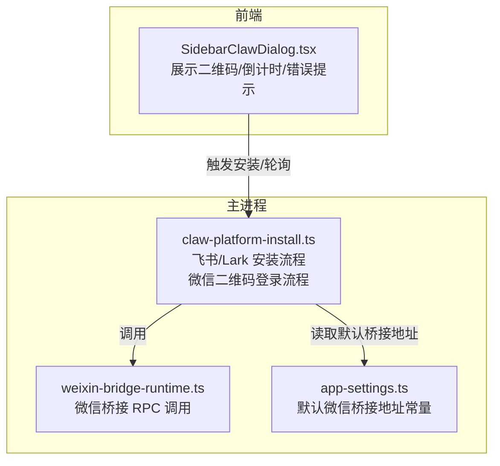
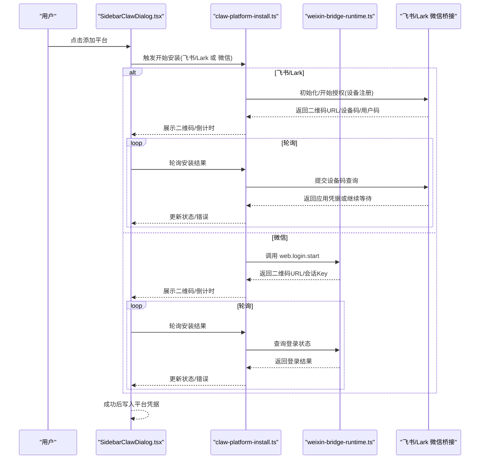
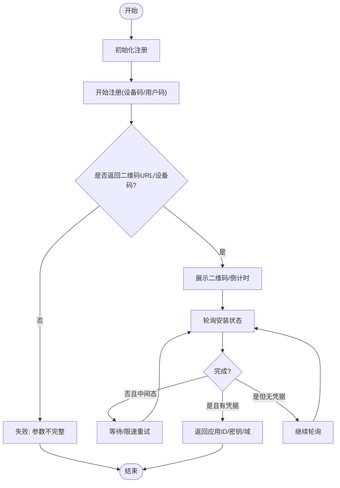
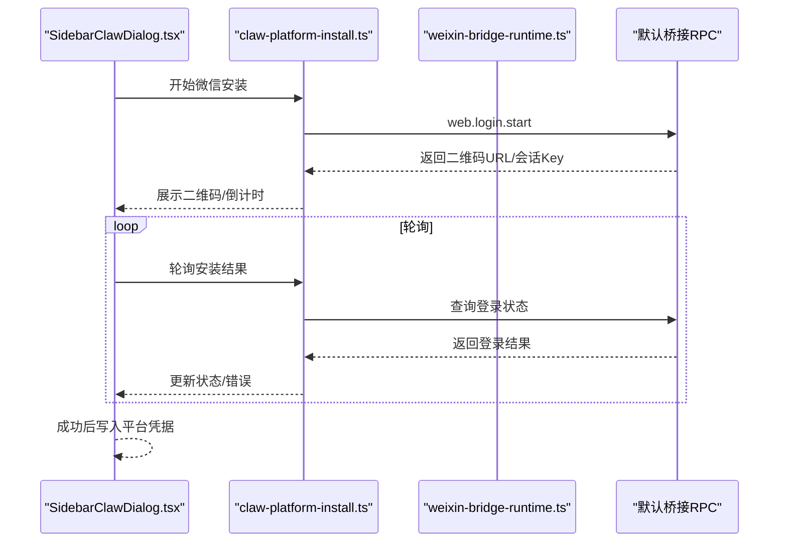
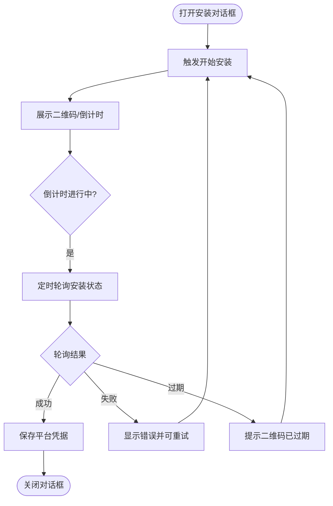
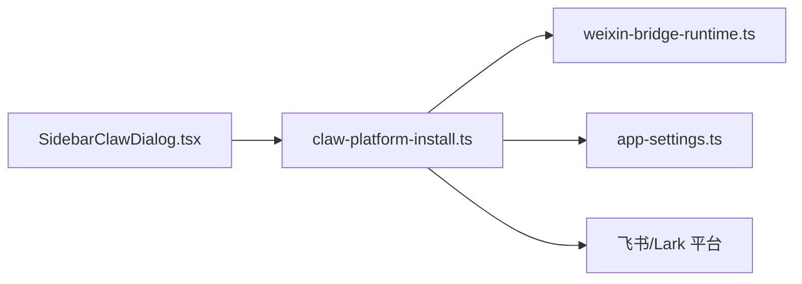

# 即时通讯平台集成

<cite>
**本文引用的文件**
- [claw-platform-install.ts](file://src/main/claw-platform-install.ts)
- [claw-platform-install.test.ts](file://src/main/claw-platform-install.test.ts)
- [weixin-bridge-runtime.ts](file://src/main/weixin-bridge-runtime.ts)
- [weixin-bridge-runtime.test.ts](file://src/main/weixin-bridge-runtime.test.ts)
- [SidebarClawDialog.tsx](file://src/renderer/src/components/chat/SidebarClawDialog.tsx)
- [app-settings.ts](file://src/shared/app-settings.ts)
</cite>

## 目录
1. [引言](#引言)
2. [项目结构](#项目结构)
3. [核心组件](#核心组件)
4. [架构总览](#架构总览)
5. [详细组件分析](#详细组件分析)
6. [依赖关系分析](#依赖关系分析)
7. [性能考量](#性能考量)
8. [故障排除指南](#故障排除指南)
9. [结论](#结论)
10. [附录](#附录)

## 引言
本技术文档聚焦于即时通讯平台集成模块，系统性阐述飞书（含 Lark）与微信两大平台的连接配置流程、认证机制、API 密钥配置与回调地址设置，并深入解析平台适配器的设计模式、连接状态管理与错误处理机制。通过结合前端对话框组件与后端安装流程，帮助开发者快速理解并实现平台集成的最佳实践。

## 项目结构
该模块位于主进程与共享设置之间，前端通过对话框触发安装流程，后端负责发起平台 OAuth 授权码流程或调用微信桥接服务，最终返回应用凭据供后续业务使用。

图表来源
- [SidebarClawDialog.tsx:356-397](file://src/renderer/src/components/chat/SidebarClawDialog.tsx#L356-L397)
- [claw-platform-install.ts:226-321](file://src/main/claw-platform-install.ts#L226-L321)
- [weixin-bridge-runtime.ts](file://src/main/weixin-bridge-runtime.ts)
- [app-settings.ts](file://src/shared/app-settings.ts)

章节来源
- [claw-platform-install.ts:226-321](file://src/main/claw-platform-install.ts#L226-L321)
- [SidebarClawDialog.tsx:356-397](file://src/renderer/src/components/chat/SidebarClawDialog.tsx#L356-L397)
- [app-settings.ts](file://src/shared/app-settings.ts)

## 核心组件
- 飞书/Lark 安装流程：负责初始化设备注册、生成用户授权码与设备码、轮询获取应用凭据。
- 微信安装流程：通过默认桥接 RPC 启动二维码登录，等待用户扫码后返回会话信息。
- 前端安装对话框：负责展示二维码、倒计时与错误提示，驱动轮询并接收返回的平台凭据。
- 微信桥接运行时：封装与微信桥接服务的 RPC 调用，支持通道启动与超时控制。
- 应用设置：提供默认微信桥接 RPC 地址常量，便于统一管理。

章节来源
- [claw-platform-install.ts:226-321](file://src/main/claw-platform-install.ts#L226-L321)
- [weixin-bridge-runtime.ts](file://src/main/weixin-bridge-runtime.ts)
- [SidebarClawDialog.tsx:356-397](file://src/renderer/src/components/chat/SidebarClawDialog.tsx#L356-L397)
- [app-settings.ts](file://src/shared/app-settings.ts)

## 架构总览
下图展示了从用户操作到平台凭据落地的完整链路，涵盖前端交互、后端安装流程与微信桥接调用。

图表来源
- [SidebarClawDialog.tsx:356-397](file://src/renderer/src/components/chat/SidebarClawDialog.tsx#L356-L397)
- [claw-platform-install.ts:226-321](file://src/main/claw-platform-install.ts#L226-L321)
- [weixin-bridge-runtime.ts](file://src/main/weixin-bridge-runtime.ts)

## 详细组件分析

### 飞书/Lark 安装流程
- 设备注册初始化与开始：向对应域名发起注册请求，获取设备码、用户码与完整验证 URL。
- 轮询安装：根据设备码轮询查询，处理“授权待定/限流”等中间态，成功后返回应用 ID、密钥与域信息。
- 错误处理：对网络错误、参数缺失、平台返回错误进行分类处理并清理目标记录。

图表来源
- [claw-platform-install.ts:226-290](file://src/main/claw-platform-install.ts#L226-L290)

章节来源
- [claw-platform-install.ts:226-290](file://src/main/claw-platform-install.ts#L226-L290)

### 微信安装流程
- 启动二维码登录：调用默认桥接 RPC 的登录接口，返回二维码数据与会话 Key。
- 会话记忆：将会话 Key 与设备码关联，用于后续轮询与状态查询。
- 轮询与状态更新：前端定时轮询安装结果，后端通过桥接查询登录状态，最终返回平台凭据。

图表来源
- [claw-platform-install.ts:292-321](file://src/main/claw-platform-install.ts#L292-L321)
- [weixin-bridge-runtime.ts](file://src/main/weixin-bridge-runtime.ts)
- [app-settings.ts](file://src/shared/app-settings.ts)

章节来源
- [claw-platform-install.ts:292-321](file://src/main/claw-platform-install.ts#L292-L321)
- [weixin-bridge-runtime.ts](file://src/main/weixin-bridge-runtime.ts)
- [app-settings.ts](file://src/shared/app-settings.ts)

### 前端安装对话框组件
- 二维码展示与倒计时：根据后端返回的二维码 URL 与过期时间，渲染倒计时并提示用户扫码。
- 错误提示与重试：在二维码过期或轮询异常时，显示错误文案并允许重新发起安装。
- 凭据写入：当轮询返回成功后，将平台类型、应用 ID、密钥与域写入本地状态，供后续使用。

图表来源
- [SidebarClawDialog.tsx:356-397](file://src/renderer/src/components/chat/SidebarClawDialog.tsx#L356-L397)

章节来源
- [SidebarClawDialog.tsx:356-397](file://src/renderer/src/components/chat/SidebarClawDialog.tsx#L356-L397)

### 平台适配器设计模式
- 统一入口：前端通过统一的安装触发函数对接不同平台，后端按平台分支处理。
- 可插拔扩展：新增平台时，可在后端增加对应分支逻辑，前端仅需扩展 UI 与轮询策略。
- 状态机化：安装流程采用“初始化—开始—轮询—完成/失败”的状态机，便于错误恢复与重试。

章节来源
- [claw-platform-install.ts:226-321](file://src/main/claw-platform-install.ts#L226-L321)
- [SidebarClawDialog.tsx:356-397](file://src/renderer/src/components/chat/SidebarClawDialog.tsx#L356-L397)

### 连接状态管理
- 设备码与会话键记忆：后端在初始化阶段记录设备码与平台属性；微信场景记录会话键以便轮询。
- 倒计时与重试：前端以固定间隔轮询，结合过期时间与错误码动态调整重试策略。
- 失败清理：遇到不可恢复错误时，清理目标记录并提示用户重新开始。

章节来源
- [claw-platform-install.ts:226-321](file://src/main/claw-platform-install.ts#L226-L321)
- [SidebarClawDialog.tsx:356-397](file://src/renderer/src/components/chat/SidebarClawDialog.tsx#L356-L397)

### 错误处理机制
- 参数校验：若平台返回的关键字段缺失，立即判定失败并返回具体错误描述。
- 中间态处理：对“授权待定/限流”等中间态进行幂等重试，避免频繁请求。
- 网络与平台错误：区分网络异常与平台返回错误，分别进行日志记录与用户提示。
- 资源清理：在失败或过期时清理临时记录，防止状态污染。

章节来源
- [claw-platform-install.ts:226-321](file://src/main/claw-platform-install.ts#L226-L321)
- [claw-platform-install.test.ts:32-91](file://src/main/claw-platform-install.test.ts#L32-L91)

## 依赖关系分析
- 前端依赖后端安装流程：前端仅负责 UI 与轮询，实际安装由后端发起。
- 后端依赖平台 OAuth/桥接：飞书/Lark 使用平台 OAuth 设备码流程；微信使用桥接 RPC。
- 共享设置依赖：微信桥接 RPC 地址通过共享设置提供默认值，便于集中管理。

图表来源
- [SidebarClawDialog.tsx:356-397](file://src/renderer/src/components/chat/SidebarClawDialog.tsx#L356-L397)
- [claw-platform-install.ts:226-321](file://src/main/claw-platform-install.ts#L226-L321)
- [weixin-bridge-runtime.ts](file://src/main/weixin-bridge-runtime.ts)
- [app-settings.ts](file://src/shared/app-settings.ts)

章节来源
- [claw-platform-install.ts:226-321](file://src/main/claw-platform-install.ts#L226-L321)
- [weixin-bridge-runtime.ts](file://src/main/weixin-bridge-runtime.ts)
- [app-settings.ts](file://src/shared/app-settings.ts)

## 性能考量
- 轮询间隔优化：根据平台返回的建议间隔动态调整，避免过于频繁导致限流。
- 超时与重试：为桥接调用与平台请求设置合理超时，结合指数退避减少无效请求。
- 资源复用：复用网络连接与会话上下文，降低重复握手成本。
- 前端渲染节流：倒计时与轮询频率应与 UI 刷新率匹配，避免过度重绘。

## 故障排除指南
- 二维码无法加载或为空
  - 检查后端初始化与开始注册步骤是否成功返回二维码 URL 与设备码。
  - 确认平台域名与网络连通性。
- 轮询长时间无响应
  - 查看平台返回的中间态错误码，确认是否为“授权待定/限流”，适当延长间隔。
  - 核对设备码是否正确传递至轮询接口。
- 微信二维码过期
  - 前端倒计时结束后提示过期，需重新发起安装流程。
  - 检查默认桥接 RPC 是否可达，以及会话 Key 是否正确记忆。
- 返回凭据为空
  - 确认平台侧授权流程已完成，后端轮询是否返回应用 ID 与密钥。
  - 若平台返回错误，记录并上报错误描述以便定位问题。

章节来源
- [claw-platform-install.ts:226-321](file://src/main/claw-platform-install.ts#L226-L321)
- [claw-platform-install.test.ts:32-91](file://src/main/claw-platform-install.test.ts#L32-L91)
- [SidebarClawDialog.tsx:356-397](file://src/renderer/src/components/chat/SidebarClawDialog.tsx#L356-L397)

## 结论
本模块通过前后端协同，实现了飞书/Lark 与微信平台的标准化安装流程。后端负责平台 OAuth 与桥接调用，前端负责用户体验与状态反馈。通过统一的状态机与错误处理机制，确保了安装过程的稳定性与可维护性。建议在生产环境中进一步完善监控与日志采集，以便快速定位与解决问题。

## 附录
- 配置示例（概念性说明）
  - 飞书/Lark
    - 平台认证：使用设备码授权流程，获取应用 ID 与密钥。
    - 回调地址：通常由平台侧配置，后端仅需完成轮询与凭据落库。
  - 微信
    - 平台认证：通过默认桥接 RPC 启动二维码登录，完成后返回会话信息。
    - 回调地址：由桥接服务统一处理，前端无需额外配置。
- 最佳实践
  - 明确超时与重试策略，避免无效轮询。
  - 将默认桥接地址集中管理，便于灰度与切换。
  - 对关键错误码进行分类处理，提升用户可感知的提示质量。