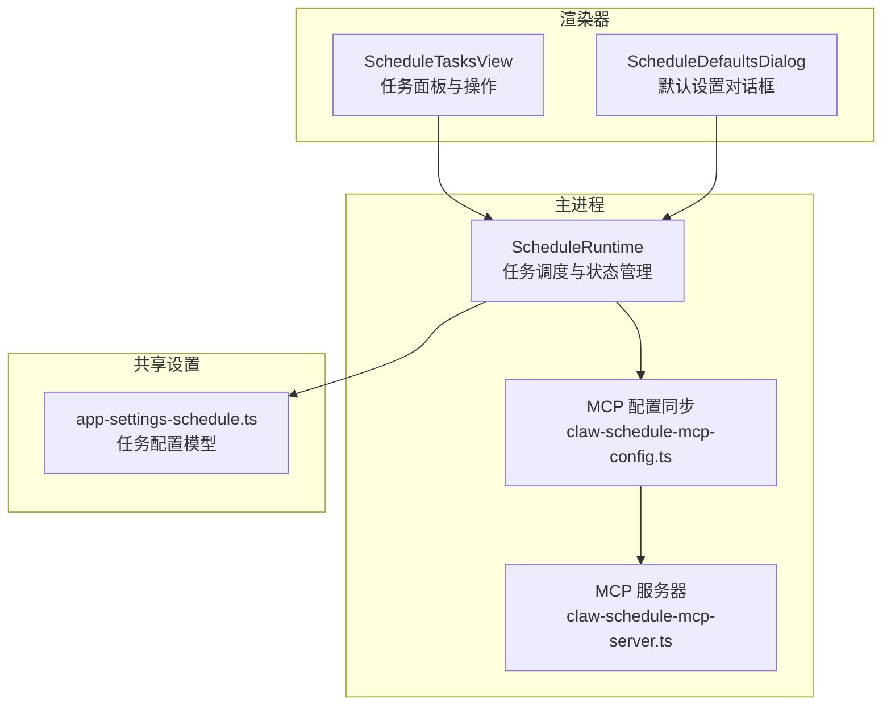
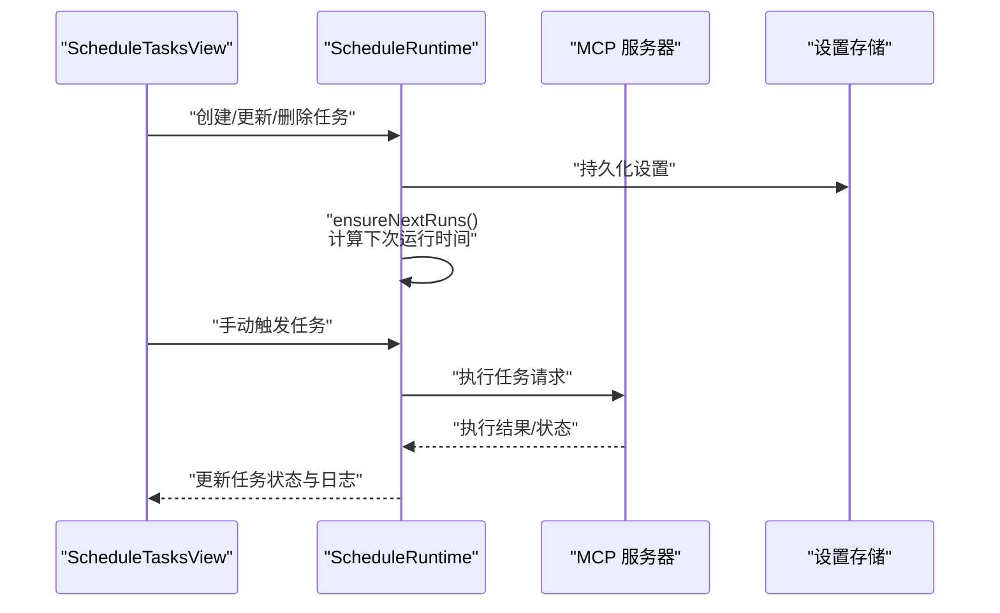
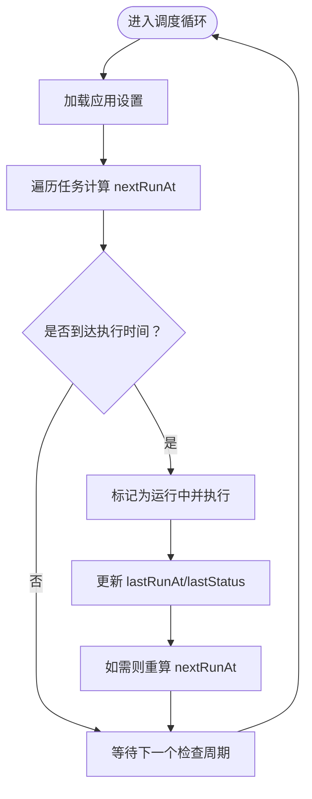
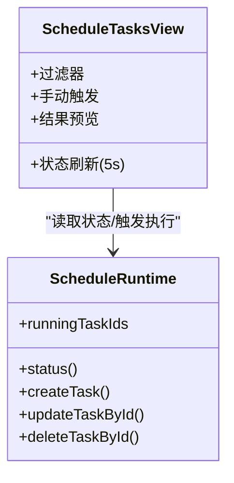
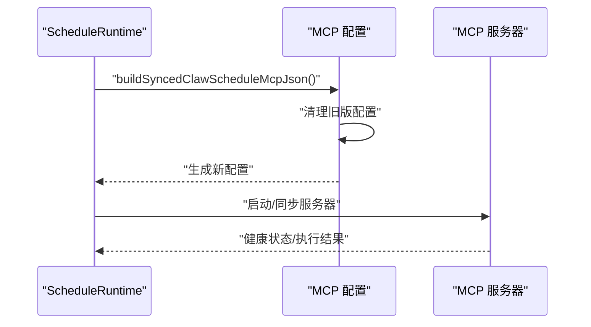
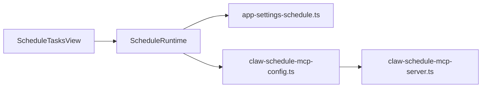

# 定时任务管理

<cite>
**本文引用的文件**
- [schedule-runtime.ts](file://src/main/schedule-runtime.ts)
- [ScheduleTasksView.tsx](file://src/renderer/src/components/schedule/ScheduleTasksView.tsx)
- [app-settings-schedule.ts](file://src/shared/app-settings-schedule.ts)
- [claw-schedule-mcp-server.ts](file://src/main/claw-schedule-mcp-server.ts)
- [claw-schedule-mcp-config.ts](file://src/main/claw-schedule-mcp-config.ts)
- [claw-schedule-mcp-node-entry.ts](file://src/main/claw-schedule-mcp-node-entry.ts)
- [schedule-runtime.test.ts](file://src/main/schedule-runtime.test.ts)
- [schedule-defaults-dialog.tsx](file://src/renderer/src/components/schedule/ScheduleDefaultsDialog.tsx)
- [schedule-tasks-view.test.tsx](file://src/renderer/src/components/schedule/ScheduleTasksView.test.tsx)
</cite>

## 目录
1. [简介](#简介)
2. [项目结构](#项目结构)
3. [核心组件](#核心组件)
4. [架构总览](#架构总览)
5. [详细组件分析](#详细组件分析)
6. [依赖关系分析](#依赖关系分析)
7. [性能考量](#性能考量)
8. [故障排查指南](#故障排查指南)
9. [结论](#结论)
10. [附录](#附录)

## 简介
本文件为“定时任务管理”模块的功能文档，覆盖一次性任务、每日任务、间隔任务与手动触发任务的配置与执行机制；深入说明任务调度算法、执行队列管理、优先级控制、失败重试策略；并提供任务监控面板的使用指南、执行日志查看方法与性能优化建议，帮助用户构建可靠的自动化任务体系。

## 项目结构
定时任务管理由三部分组成：
- 主进程运行时：负责任务调度、状态维护、内部服务同步与电源保护。
- 渲染器视图：提供任务列表、过滤、编辑、手动触发与监控面板。
- MCP 集成：通过内置 MCP 服务器桥接外部工具链，实现任务执行环境隔离与安全调用。

图表来源
- [schedule-runtime.ts:55-120](file://src/main/schedule-runtime.ts#L55-L120)
- [claw-schedule-mcp-config.ts:87-105](file://src/main/claw-schedule-mcp-config.ts#L87-L105)
- [claw-schedule-mcp-server.ts:1-50](file://src/main/claw-schedule-mcp-server.ts#L1-L50)
- [ScheduleTasksView.tsx:205-248](file://src/renderer/src/components/schedule/ScheduleTasksView.tsx#L205-L248)
- [app-settings-schedule.ts:1-120](file://src/shared/app-settings-schedule.ts#L1-L120)

章节来源
- [schedule-runtime.ts:55-120](file://src/main/schedule-runtime.ts#L55-L120)
- [ScheduleTasksView.tsx:205-248](file://src/renderer/src/components/schedule/ScheduleTasksView.tsx#L205-L248)
- [app-settings-schedule.ts:1-120](file://src/shared/app-settings-schedule.ts#L1-L120)
- [claw-schedule-mcp-config.ts:87-105](file://src/main/claw-schedule-mcp-config.ts#L87-L105)

## 核心组件
- ScheduleRuntime（主进程）
  - 负责加载应用设置、启动/停止调度器、同步内部 HTTP 服务、维护运行中任务集合、电源保护开关与下次运行时间计算。
  - 提供创建、更新、删除任务与手动触发任务的能力，并在变更后重新计算下次运行时间。
- ScheduleTasksView（渲染器）
  - 展示任务列表、状态、过滤器、结果预览与手动触发按钮；周期性刷新状态；支持编辑任务与切换全局“保持唤醒”选项。
- MCP 集成
  - 生成并同步 MCP 服务器配置，确保外部工具链与内部调度服务协同工作；支持清理旧版配置与跨平台命令解析。

章节来源
- [schedule-runtime.ts:55-222](file://src/main/schedule-runtime.ts#L55-L222)
- [ScheduleTasksView.tsx:205-498](file://src/renderer/src/components/schedule/ScheduleTasksView.tsx#L205-L498)
- [claw-schedule-mcp-config.ts:107-237](file://src/main/claw-schedule-mcp-config.ts#L107-L237)

## 架构总览
定时任务从渲染器发起配置与触发请求，主进程的 ScheduleRuntime 进行调度与状态管理，并通过 MCP 服务器桥接外部执行环境。内部 HTTP 服务用于本地通信与状态查询。

图表来源
- [schedule-runtime.ts:166-222](file://src/main/schedule-runtime.ts#L166-L222)
- [ScheduleTasksView.tsx:363-371](file://src/renderer/src/components/schedule/ScheduleTasksView.tsx#L363-L371)
- [claw-schedule-mcp-server.ts:1-50](file://src/main/claw-schedule-mcp-server.ts#L1-L50)

## 详细组件分析

### 任务类型与配置
- 一次性任务（at）
  - 在指定绝对时间点仅执行一次。适合里程碑事件或临时提醒。
- 每日任务（daily）
  - 在每天固定时间（timeOfDay）执行。适合每日例行检查或报告。
- 间隔任务（interval）
  - 每隔固定分钟数（everyMinutes）执行。适合周期性轮询或数据同步。
- 手动触发任务
  - 用户点击“立即运行”时触发，不改变其计划时间，适合应急处理或验证。

章节来源
- [schedule-runtime.ts:178-183](file://src/main/schedule-runtime.ts#L178-L183)
- [schedule-runtime.test.ts:105-120](file://src/main/schedule-runtime.test.ts#L105-L120)

### 调度算法与执行队列
- 下次运行时间计算
  - 根据任务类型与当前时间推导下一次执行时刻；当任务被禁用或配置变更时，会重算 nextRunAt。
- 执行队列与并发控制
  - 运行中任务 ID 集合用于标识正在执行的任务，避免重复触发；未发现显式优先级队列实现，当前以串行或单实例为主。
- 电源保护
  - 可启用“保持唤醒”，防止系统休眠影响定时任务执行。

图表来源
- [schedule-runtime.ts:67-72](file://src/main/schedule-runtime.ts#L67-L72)
- [schedule-runtime.ts:197-218](file://src/main/schedule-runtime.ts#L197-L218)

章节来源
- [schedule-runtime.ts:67-72](file://src/main/schedule-runtime.ts#L67-L72)
- [schedule-runtime.ts:197-218](file://src/main/schedule-runtime.ts#L197-L218)

### 失败重试策略
- 当前实现未发现内置的自动重试逻辑；错误状态会在任务记录中标注，便于人工干预与重试。
- 建议：结合外部工具链的超时与重试能力，或在任务脚本层增加幂等与重试机制。

章节来源
- [schedule-runtime.ts:186-191](file://src/main/schedule-runtime.ts#L186-L191)

### 任务监控面板与日志查看
- 任务面板
  - 支持按状态过滤（全部/运行中/成功/失败），显示任务标题、最近一次运行时间、状态与结果预览。
  - 支持手动触发、编辑与删除任务。
- 日志与线程关联
  - 任务标题会生成紧凑的线程标题前缀，便于在会话/线程面板中定位对应执行记录。
- 实时状态刷新
  - 面板每 5 秒自动刷新一次，保证状态与日志的及时性。

图表来源
- [ScheduleTasksView.tsx:205-498](file://src/renderer/src/components/schedule/ScheduleTasksView.tsx#L205-L498)
- [schedule-runtime.ts:83-91](file://src/main/schedule-runtime.ts#L83-L91)

章节来源
- [ScheduleTasksView.tsx:189-248](file://src/renderer/src/components/schedule/ScheduleTasksView.tsx#L189-L248)
- [ScheduleTasksView.tsx:363-371](file://src/renderer/src/components/schedule/ScheduleTasksView.tsx#L363-L371)
- [schedule-runtime.ts:83-91](file://src/main/schedule-runtime.ts#L83-L91)

### MCP 集成与安全边界
- 配置生成与同步
  - 根据应用设置生成 MCP 服务器参数（端口、密钥、超时），并写入 MCP 配置文件；同时清理旧版 TOML 配置。
- 跨平台命令解析
  - 在 macOS 上对可执行路径进行 Helper 解析，确保与应用包结构兼容。
- 内部服务通信
  - 通过内部 HTTP 服务与 MCP 服务器交互，避免暴露到公网。

图表来源
- [claw-schedule-mcp-config.ts:107-237](file://src/main/claw-schedule-mcp-config.ts#L107-L237)
- [claw-schedule-mcp-server.ts:1-50](file://src/main/claw-schedule-mcp-server.ts#L1-L50)
- [claw-schedule-mcp-node-entry.ts:1-12](file://src/main/claw-schedule-mcp-node-entry.ts#L1-L12)

章节来源
- [claw-schedule-mcp-config.ts:46-105](file://src/main/claw-schedule-mcp-config.ts#L46-L105)
- [claw-schedule-mcp-config.ts:198-237](file://src/main/claw-schedule-mcp-config.ts#L198-L237)
- [claw-schedule-mcp-server.ts:1-50](file://src/main/claw-schedule-mcp-server.ts#L1-L50)
- [claw-schedule-mcp-node-entry.ts:1-12](file://src/main/claw-schedule-mcp-node-entry.ts#L1-L12)

### 默认设置与全局行为
- 全局“保持唤醒”
  - 开启后可减少系统休眠对定时任务的影响，适合长时间执行的任务。
- 默认模型与推理强度
  - 任务可继承全局默认值，亦可在任务级别覆盖。

章节来源
- [ScheduleTasksView.tsx:373-375](file://src/renderer/src/components/schedule/ScheduleTasksView.tsx#L373-L375)
- [schedule-runtime.ts:174-177](file://src/main/schedule-runtime.ts#L174-L177)

## 依赖关系分析
- 组件耦合
  - ScheduleRuntime 依赖设置存储与内部 HTTP 服务；与 MCP 配置模块解耦但通过配置文件交互。
  - 渲染器通过 IPC 接口与主进程通信，避免直接访问底层实现细节。
- 外部依赖
  - MCP 服务器作为外部执行环境，提供安全沙箱与工具链集成。
- 潜在环路
  - 未发现直接循环依赖；MCP 配置与服务器通过文件同步，避免运行时循环。

图表来源
- [ScheduleTasksView.tsx:205-248](file://src/renderer/src/components/schedule/ScheduleTasksView.tsx#L205-L248)
- [schedule-runtime.ts:55-91](file://src/main/schedule-runtime.ts#L55-L91)
- [app-settings-schedule.ts:1-120](file://src/shared/app-settings-schedule.ts#L1-L120)
- [claw-schedule-mcp-config.ts:107-105](file://src/main/claw-schedule-mcp-config.ts#L107-L105)
- [claw-schedule-mcp-server.ts:1-50](file://src/main/claw-schedule-mcp-server.ts#L1-L50)

章节来源
- [schedule-runtime.ts:55-91](file://src/main/schedule-runtime.ts#L55-L91)
- [claw-schedule-mcp-config.ts:107-105](file://src/main/claw-schedule-mcp-config.ts#L107-L105)

## 性能考量
- 调度频率
  - 建议根据任务数量与执行时长调整检查周期，避免频繁 IO 与状态刷新带来的开销。
- 并发与资源
  - 单实例运行时避免并发冲突；若需并行，建议拆分任务类型或引入外部队列。
- 电源与网络
  - 启用“保持唤醒”可提升稳定性；在网络受限场景下，合理设置 MCP 超时参数。
- 日志与存储
  - 控制日志量与保留周期，避免磁盘压力；定期清理历史线程与冗余记录。

## 故障排查指南
- 无法看到任务状态
  - 检查内部 HTTP 服务是否正常运行；确认渲染器已正确调用状态接口。
- 任务未按时执行
  - 核对任务 schedule 字段与 nextRunAt 计算；确认系统时间与时区设置。
- 手动触发失败
  - 查看任务 lastStatus 与 lastMessage；检查 MCP 服务器日志与超时配置。
- 旧版配置残留
  - 使用配置同步函数清理 TOML 中的遗留条目；确认 MCP 配置文件已更新。

章节来源
- [schedule-runtime.ts:83-91](file://src/main/schedule-runtime.ts#L83-L91)
- [schedule-runtime.ts:197-218](file://src/main/schedule-runtime.ts#L197-L218)
- [claw-schedule-mcp-config.ts:198-237](file://src/main/claw-schedule-mcp-config.ts#L198-L237)

## 结论
定时任务管理模块通过清晰的职责划分与 MCP 集成，提供了稳定、可扩展的自动化执行框架。建议在生产环境中结合“保持唤醒”、合理的超时配置与日志策略，持续优化任务执行的可靠性与性能。

## 附录
- 快速上手
  - 在任务面板创建任务，选择合适的时间类型与时间点；必要时覆盖默认模型与推理强度。
  - 使用“立即运行”验证任务；在面板中查看状态与结果预览。
- 最佳实践
  - 将耗时任务拆分为多个小任务，降低单次执行风险。
  - 对关键任务开启“保持唤醒”，并设置合理的超时与重试策略。
  - 定期审查任务列表，清理无效或过期任务。