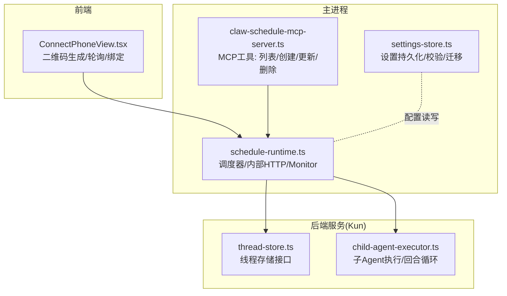
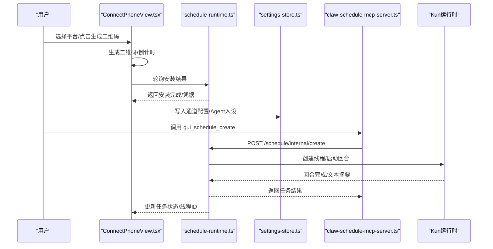
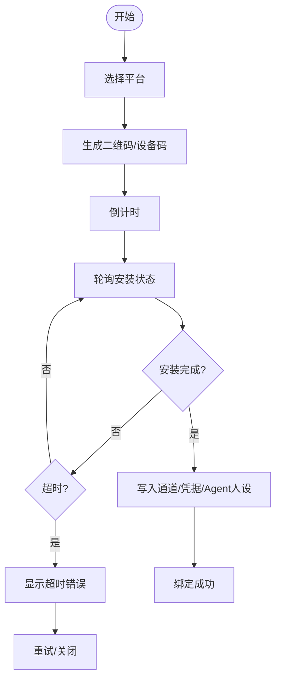
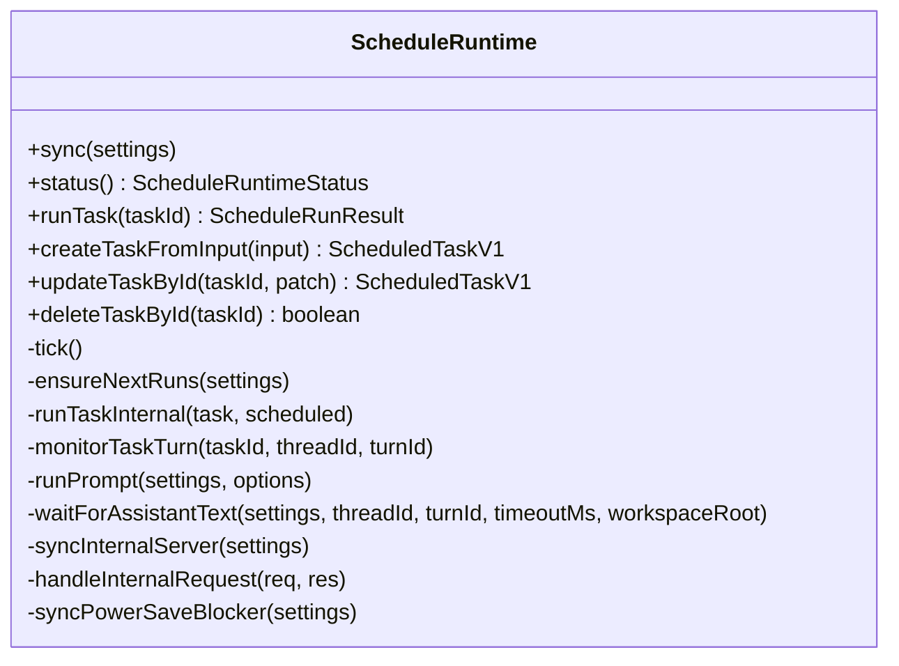
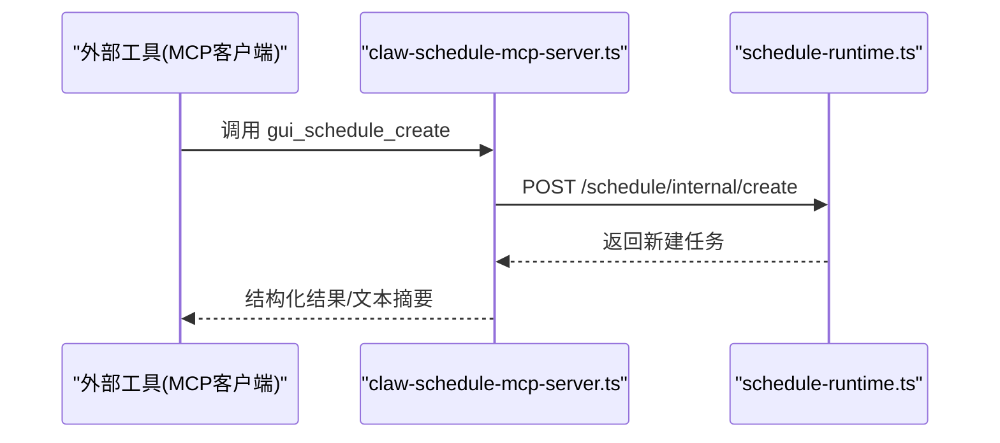
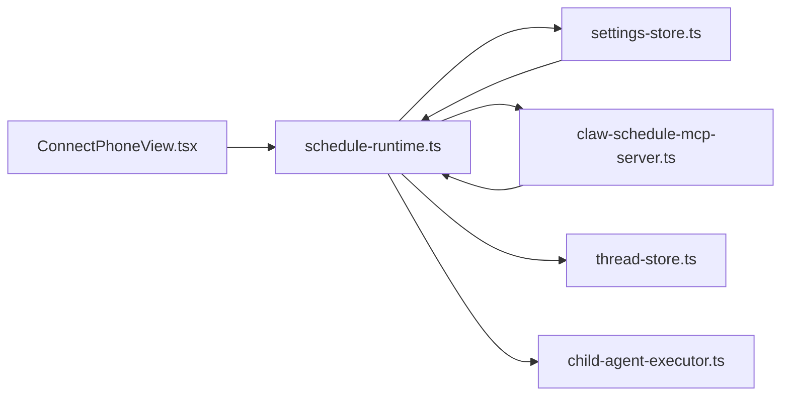

# 连接手机模式（IM 自动化）

<cite>
**本文引用的文件**
- [ConnectPhoneView.tsx](file://src/renderer/src/components/chat/ConnectPhoneView.tsx)
- [claw-schedule-mcp-server.ts](file://src/main/claw-schedule-mcp-server.ts)
- [app-settings-schedule.ts](file://src/shared/app-settings-schedule.ts)
- [schedule-runtime.ts](file://src/main/schedule-runtime.ts)
- [settings-store.ts](file://src/main/settings-store.ts)
- [thread-store.ts](file://kun/src/ports/thread-store.ts)
- [child-agent-executor.ts](file://kun/src/delegation/child-agent-executor.ts)
- [http-server.test.ts](file://kun/tests/http-server.test.ts)
- [schedule-runtime.test.ts](file://src/main/schedule-runtime.test.ts)
</cite>

## 目录
1. [简介](#简介)
2. [项目结构](#项目结构)
3. [核心组件](#核心组件)
4. [架构总览](#架构总览)
5. [详细组件分析](#详细组件分析)
6. [依赖关系分析](#依赖关系分析)
7. [性能考量](#性能考量)
8. [故障排查指南](#故障排查指南)
9. [结论](#结论)
10. [附录：配置与实践指南](#附录配置与实践指南)

## 简介
本文件面向 DeepSeek GUI 的“连接手机模式”（IM 自动化），系统性阐述后台自动化 Agent 的设计理念与实现架构，覆盖以下主题：
- 即时通讯平台接入：飞书/Lark、微信的连接配置与二维码安装流程
- 独立 Agent 人设与运行参数：默认模型、工作目录、执行模式
- 本地 webhook/relay 机制：基于内部 HTTP 服务器与 MCP 工具桥接
- 定时任务管理：一次性、每日、间隔、手动任务的调度、执行与监控
- 任务卡片与调试：任务状态可视化、线程与回合生命周期、错误追踪
- 实际应用场景与配置建议：帮助用户构建稳定可靠的 IM 自动化工作流

## 项目结构
围绕 IM 自动化，涉及前端界面、主进程运行时、共享配置与后端服务层：
- 前端：连接手机视图负责生成二维码、轮询安装结果并自动绑定通道
- 主进程：调度运行时负责任务调度、线程创建与回合执行、内部 HTTP 服务
- 共享层：应用设置的序列化/归一化、定时任务定义与默认值
- 后端服务：Kun 运行时提供线程/回合能力，支持 SSE 事件流与线程快照

**图表来源**
- [ConnectPhoneView.tsx:171-602](file://src/renderer/src/components/chat/ConnectPhoneView.tsx#L171-L602)
- [schedule-runtime.ts:55-684](file://src/main/schedule-runtime.ts#L55-L684)
- [claw-schedule-mcp-server.ts:69-237](file://src/main/claw-schedule-mcp-server.ts#L69-L237)
- [settings-store.ts:286-318](file://src/main/settings-store.ts#L286-L318)
- [thread-store.ts:1-21](file://kun/src/ports/thread-store.ts#L1-L21)
- [child-agent-executor.ts:99-129](file://kun/src/delegation/child-agent-executor.ts#L99-L129)

**章节来源**
- [ConnectPhoneView.tsx:171-602](file://src/renderer/src/components/chat/ConnectPhoneView.tsx#L171-L602)
- [schedule-runtime.ts:55-684](file://src/main/schedule-runtime.ts#L55-L684)
- [claw-schedule-mcp-server.ts:69-237](file://src/main/claw-schedule-mcp-server.ts#L69-L237)
- [settings-store.ts:286-318](file://src/main/settings-store.ts#L286-L318)
- [thread-store.ts:1-21](file://kun/src/ports/thread-store.ts#L1-L21)
- [child-agent-executor.ts:99-129](file://kun/src/delegation/child-agent-executor.ts#L99-L129)

## 核心组件
- 连接手机视图（ConnectPhoneView）
  - 生成官方安装二维码、倒计时与轮询安装状态
  - 绑定成功后自动创建通道配置与 Agent 人设
  - 支持飞书/Lark/微信三种目标，区分二维码与用户码展示
- 调度运行时（ScheduleRuntime）
  - 内部 HTTP 服务：/schedule/internal/* 接口，受密钥保护
  - 任务调度：周期性扫描到期任务并触发执行
  - 任务监控：等待回合完成，汇总结果并更新状态
  - 功耗策略：可启用“保持唤醒”，避免休眠影响定时
- MCP 工具桥（claw-schedule-mcp-server）
  - 提供 gui_schedule_list/gui_schedule_create/gui_schedule_update/gui_schedule_delete 工具
  - 输入参数涵盖一次性(at)、每日(daily)、间隔(interval)等计划类型
- 应用设置（app-settings-schedule）
  - 归一化与合并定时任务配置，含默认模型、工作目录、技能路径、内部端口与密钥
- 设置存储（settings-store）
  - 加载/保存设置，确保工作目录存在，执行必要迁移与备份
- 线程与回合（thread-store、child-agent-executor）
  - 线程持久化接口；子 Agent 执行在独立线程中启动回合并驱动循环

**章节来源**
- [ConnectPhoneView.tsx:105-162](file://src/renderer/src/components/chat/ConnectPhoneView.tsx#L105-L162)
- [schedule-runtime.ts:55-422](file://src/main/schedule-runtime.ts#L55-L422)
- [claw-schedule-mcp-server.ts:101-208](file://src/main/claw-schedule-mcp-server.ts#L101-L208)
- [app-settings-schedule.ts:20-99](file://src/shared/app-settings-schedule.ts#L20-L99)
- [settings-store.ts:286-318](file://src/main/settings-store.ts#L286-L318)
- [thread-store.ts:1-21](file://kun/src/ports/thread-store.ts#L1-L21)
- [child-agent-executor.ts:99-129](file://kun/src/delegation/child-agent-executor.ts#L99-L129)

## 架构总览
下图展示了从 IM 平台到 Kun 运行时的完整链路，以及本地内部 HTTP 服务与 MCP 工具的协作。

**图表来源**
- [ConnectPhoneView.tsx:255-391](file://src/renderer/src/components/chat/ConnectPhoneView.tsx#L255-L391)
- [schedule-runtime.ts:535-638](file://src/main/schedule-runtime.ts#L535-L638)
- [claw-schedule-mcp-server.ts:119-146](file://src/main/claw-schedule-mcp-server.ts#L119-L146)
- [settings-store.ts:312-318](file://src/main/settings-store.ts#L312-L318)

## 详细组件分析

### 连接手机视图（IM 通道绑定）
- 设计要点
  - 三平台目标：飞书、Lark、微信；微信显示用户码，其他平台显示设备码
  - 二维码安装流程：生成 URL/设备码 → 倒计时 → 轮询安装状态 → 成功后写入通道与凭据
  - 自动绑定：安装完成后构造 Agent 人设与通道选项，调用上层回调完成绑定
- 关键行为
  - 重复安装检测：若已存在同提供商通道则提示已连接
  - 错误处理：网络异常、超时、安装失败均以统一格式提示
  - 清理资源：组件卸载或切换目标时清理轮询与倒计时

**图表来源**
- [ConnectPhoneView.tsx:255-391](file://src/renderer/src/components/chat/ConnectPhoneView.tsx#L255-L391)

**章节来源**
- [ConnectPhoneView.tsx:171-602](file://src/renderer/src/components/chat/ConnectPhoneView.tsx#L171-L602)

### 定时任务管理（调度运行时）
- 任务类型与计划
  - at：一次性，指定 atTime
  - daily：每日，指定 timeOfDay
  - interval：间隔分钟数，范围限制
  - manual：仅手动触发
- 核心流程
  - 启动/同步：加载设置，启动内部 HTTP 服务器与调度器
  - 调度：按固定间隔扫描任务，计算 nextRunAt，到期即执行
  - 执行：创建线程、启动回合、等待完成或超时，更新状态与下次运行时间
  - 监控：通过线程详情查询最新助手文本，汇总任务结果
  - 功耗：当启用 keepAwake 且存在启用任务时，阻止系统休眠
- 内部 HTTP 接口
  - /schedule/internal/list：列出任务
  - /schedule/internal/create：创建任务（标题、提示、计划、模型、推理强度、模式、工作目录）
  - /schedule/internal/update：更新任务（支持修改计划）
  - /schedule/internal/delete：删除任务
  - 认证：支持 Authorization Bearer 或 x-deepseek-gui-secret 头

**图表来源**
- [schedule-runtime.ts:55-684](file://src/main/schedule-runtime.ts#L55-L684)

**章节来源**
- [schedule-runtime.ts:55-422](file://src/main/schedule-runtime.ts#L55-L422)
- [schedule-runtime.ts:535-638](file://src/main/schedule-runtime.ts#L535-L638)

### MCP 工具桥（本地 webhook/relay）
- 工具清单
  - gui_schedule_list / claw_schedule_list：列出任务
  - gui_schedule_create / claw_schedule_create：创建任务（支持 at/daily/interval）
  - gui_schedule_update / claw_schedule_update：更新任务
  - gui_schedule_delete / claw_schedule_delete：删除任务
- 参数与约束
  - 计划类型枚举：at/daily/interval/manual
  - at_time：ISO 时间戳（带时区偏移）
  - time_of_day：24 小时制时间字符串
  - every_minutes：正整数，最大 10080（一周）
  - 可选字段：workspace_root、model、reasoning_effort、mode、enabled
- 认证
  - 通过 Bearer Token 或自定义头进行鉴权

**图表来源**
- [claw-schedule-mcp-server.ts:101-149](file://src/main/claw-schedule-mcp-server.ts#L101-L149)
- [schedule-runtime.ts:572-602](file://src/main/schedule-runtime.ts#L572-L602)

**章节来源**
- [claw-schedule-mcp-server.ts:69-237](file://src/main/claw-schedule-mcp-server.ts#L69-L237)
- [schedule-runtime.ts:572-602](file://src/main/schedule-runtime.ts#L572-L602)

### 应用设置与默认值（共享层）
- 默认模型与工作目录
  - 默认模型：来自共享常量
  - 默认工作目录：优先 schedule.defaultWorkspaceRoot，否则回退到全局 workspaceRoot
- 任务默认值
  - enabled：true
  - model：默认模型
  - mode：agent
  - schedule：kind/everyMinutes/timeOfDay/atTime 的规范化
- 归一化与合并
  - 输入补全与类型安全，保证数值边界与字符串修剪
  - 合并策略：保留当前值，允许增量补丁

**章节来源**
- [app-settings-schedule.ts:20-99](file://src/shared/app-settings-schedule.ts#L20-L99)
- [schedule-runtime.ts:501-503](file://src/main/schedule-runtime.ts#L501-L503)

### 设置存储与持久化
- 加载/保存/补丁
  - 加载时执行校验与迁移，确保工作目录存在
  - 保存前进行规范化，写入磁盘
  - 补丁支持部分更新，避免全量覆盖
- 异常处理
  - 解析失败自动备份并回退默认值

**章节来源**
- [settings-store.ts:286-318](file://src/main/settings-store.ts#L286-L318)

### 线程与回合（Kun 运行时）
- 线程存储接口
  - 列表/获取/增删改，支持包含侧边对话与归档过滤
- 子 Agent 执行
  - 在独立线程中创建回合，驱动循环直至完成或出错
  - 支持沙箱模式、审批策略、上下文压缩与工具风暴防护等高级选项

**章节来源**
- [thread-store.ts:1-21](file://kun/src/ports/thread-store.ts#L1-L21)
- [child-agent-executor.ts:99-129](file://kun/src/delegation/child-agent-executor.ts#L99-L129)

## 依赖关系分析
- 前端依赖主进程 IPC 与窗口 dsGui API，用于发起二维码安装与轮询
- 主进程依赖设置存储与 Kun 运行时，通过内部 HTTP 与 MCP 工具桥协同
- 共享层提供类型与默认值，确保前后端一致
- 测试覆盖了内部 HTTP 服务、任务调度与线程事件流

**图表来源**
- [ConnectPhoneView.tsx:275-304](file://src/renderer/src/components/chat/ConnectPhoneView.tsx#L275-L304)
- [schedule-runtime.ts:505-533](file://src/main/schedule-runtime.ts#L505-L533)
- [claw-schedule-mcp-server.ts:23-53](file://src/main/claw-schedule-mcp-server.ts#L23-L53)
- [settings-store.ts:312-318](file://src/main/settings-store.ts#L312-L318)

**章节来源**
- [http-server.test.ts:497-535](file://kun/tests/http-server.test.ts#L497-L535)
- [schedule-runtime.test.ts:100-133](file://src/main/schedule-runtime.test.ts#L100-L133)

## 性能考量
- 调度频率与并发
  - 固定调度间隔扫描到期任务，避免高频轮询造成 CPU 压力
  - 正在运行的任务 ID 集合去重，防止重复执行
- I/O 与网络
  - 内部 HTTP 服务仅监听 127.0.0.1，减少暴露面；请求超时控制在合理范围
  - 轮询等待助手文本采用分段等待与截止时间，避免长时间阻塞
- 功耗控制
  - 启用 keepAwake 时使用系统电源阻止器，保障定时任务稳定性
- 线程与回合
  - 子 Agent 执行在独立线程中进行，避免阻塞主线程
  - 支持上下文压缩与工具风暴防护，降低长回合开销

[本节为通用指导，无需特定文件引用]

## 故障排查指南
- 二维码安装失败
  - 检查 dsGui API 是否可用（前端检查 window.dsGui）
  - 查看轮询返回的错误信息，确认平台是否已连接
- 内部 HTTP 服务不可用
  - 确认 schedule.internal.secret 是否正确传递 Authorization 或自定义头
  - 检查端口占用与防火墙设置
- 任务未执行
  - 确认任务 enabled 且计划类型非 manual
  - 检查 nextRunAt 是否已过期；查看 lastStatus 与 lastMessage
- 任务超时
  - 增加 responseTimeoutMs 或优化模型响应速度
  - 检查线程详情与回合状态，定位阻塞环节
- 设置加载异常
  - 检查设置文件格式，必要时查看备份文件

**章节来源**
- [ConnectPhoneView.tsx:294-304](file://src/renderer/src/components/chat/ConnectPhoneView.tsx#L294-L304)
- [schedule-runtime.ts:535-638](file://src/main/schedule-runtime.ts#L535-L638)
- [settings-store.ts:286-292](file://src/main/settings-store.ts#L286-L292)

## 结论
“连接手机模式”的 IM 自动化通过前端二维码安装、主进程调度运行时与 MCP 工具桥的协同，实现了对飞书/Lark/微信等平台的稳定接入，并提供了完善的定时任务管理与监控能力。结合默认模型、工作目录与功耗策略，用户可以快速构建可靠的自动化工作流。

[本节为总结性内容，无需特定文件引用]

## 附录：配置与实践指南

### IM 通道配置步骤
- 在连接手机视图选择目标平台（飞书/Lark/微信）
- 点击生成二维码，扫码完成安装
- 安装完成后自动写入通道配置与 Agent 人设
- 如需切换平台，先断开旧通道再重新绑定

**章节来源**
- [ConnectPhoneView.tsx:171-253](file://src/renderer/src/components/chat/ConnectPhoneView.tsx#L171-L253)

### 定时任务创建与管理
- 使用 MCP 工具创建任务
  - 工具名：gui_schedule_create
  - 参数：title、prompt、schedule_kind（at/daily/interval）、at_time/time_of_day/every_minutes、workspace_root、model、reasoning_effort、mode、enabled
- 列表/更新/删除
  - gui_schedule_list / gui_schedule_update / gui_schedule_delete
- 内部 HTTP 接口
  - /schedule/internal/create：创建任务
  - /schedule/internal/update：更新任务
  - /schedule/internal/delete：删除任务
  - /schedule/internal/list：列出任务

**章节来源**
- [claw-schedule-mcp-server.ts:101-208](file://src/main/claw-schedule-mcp-server.ts#L101-L208)
- [schedule-runtime.ts:572-638](file://src/main/schedule-runtime.ts#L572-L638)

### 默认模型与工作目录
- 默认模型：来自共享常量
- 默认工作目录：优先 schedule.defaultWorkspaceRoot，否则回退到全局 workspaceRoot
- 可在任务级别覆盖 workspace_root 与 model

**章节来源**
- [app-settings-schedule.ts:51-68](file://src/shared/app-settings-schedule.ts#L51-L68)
- [schedule-runtime.ts:501-503](file://src/main/schedule-runtime.ts#L501-L503)

### 功耗与稳定性建议
- 启用 keepAwake 以避免系统休眠导致任务中断
- 合理设置 every_minutes，避免过于频繁的任务抢占资源
- 对长任务开启沙箱模式与上下文压缩，提升稳定性

**章节来源**
- [schedule-runtime.ts:640-678](file://src/main/schedule-runtime.ts#L640-L678)