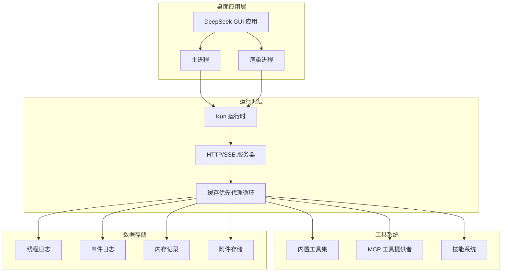
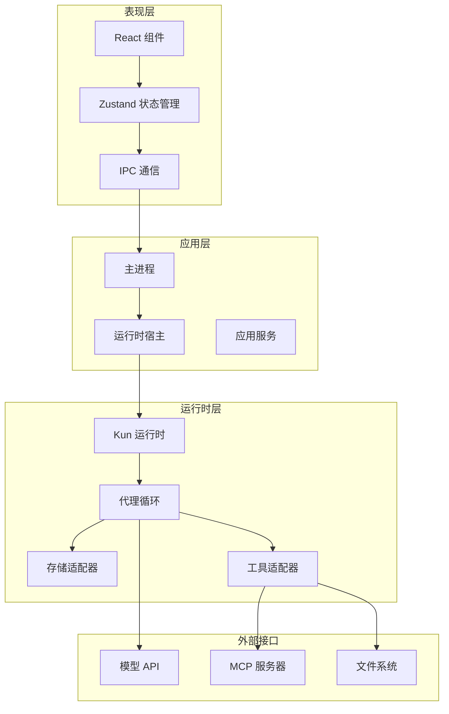
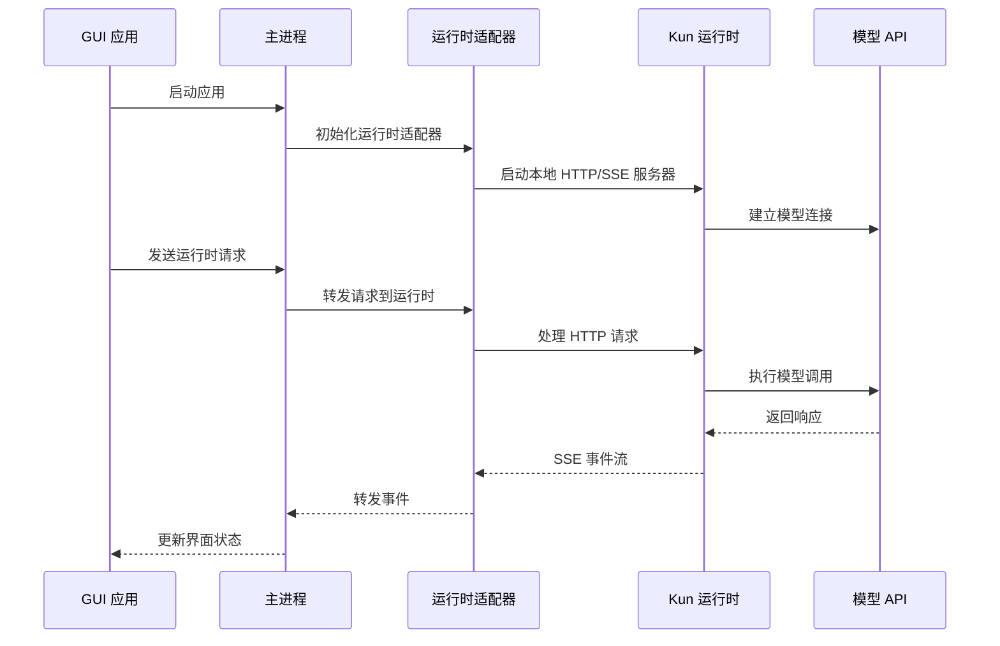
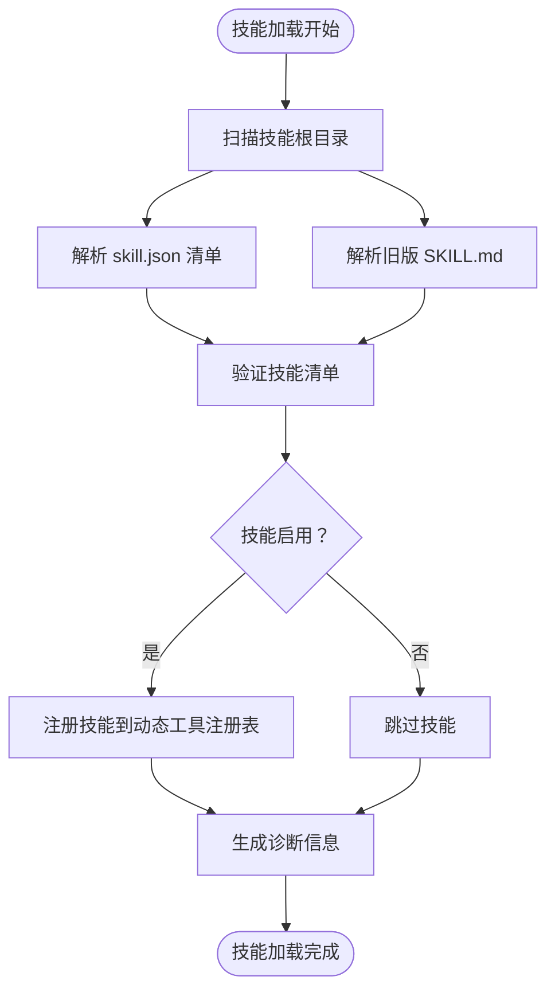
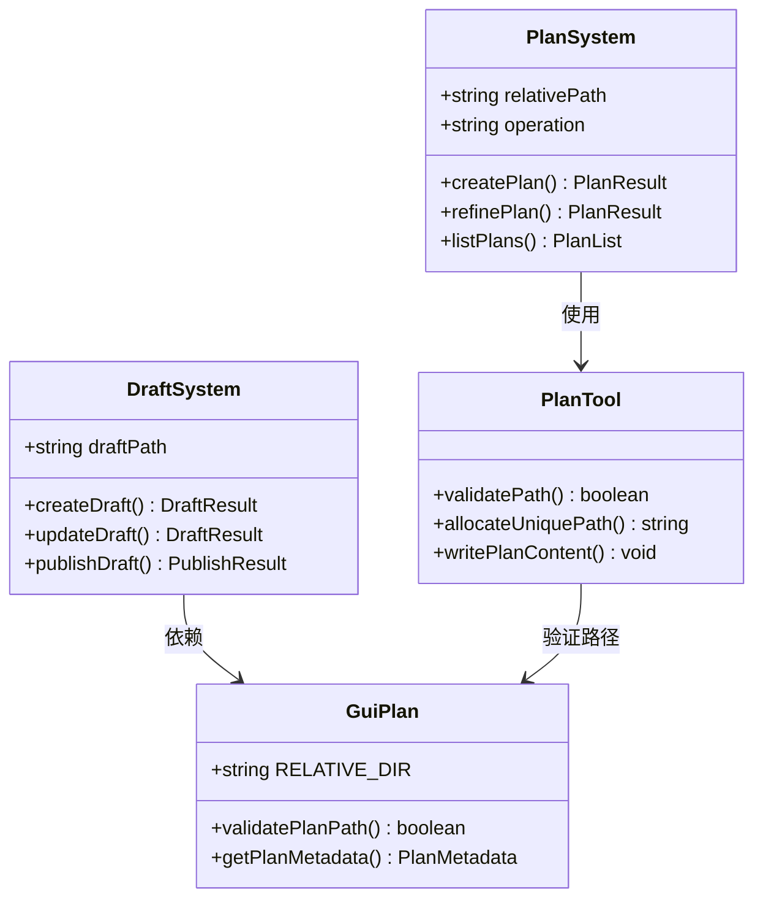
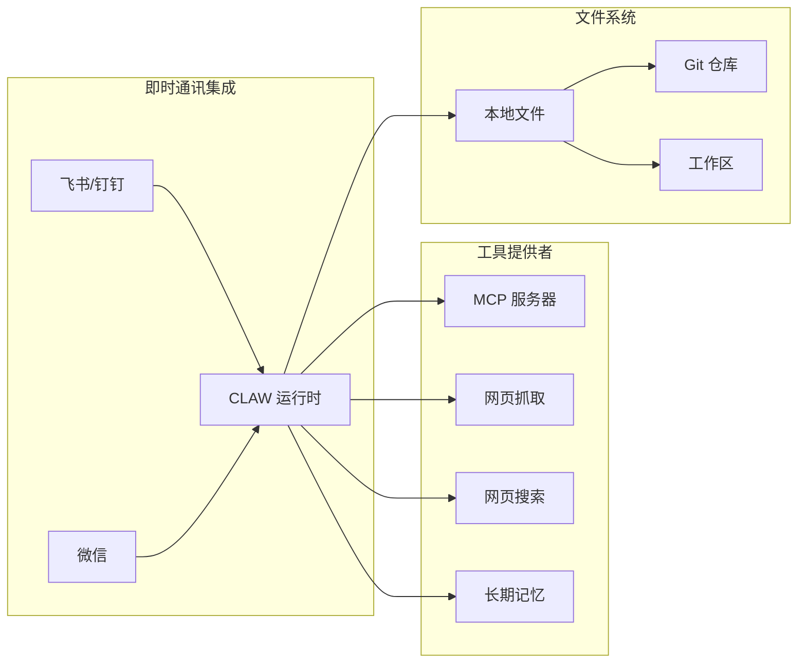

# 生态系统概览

<cite>
**本文档引用的文件**
- [README.en.md](file://README.en.md)
- [DESIGN.md](file://DESIGN.md)
- [kun/README.md](file://kun/README.md)
- [package.json](file://package.json)
- [.kunsdd/plan](file://.kunsdd/plan)
- [.kunsdd/draft](file://.kunsdd/draft)
- [.claude/skills](file://.claude/skills)
- [.codex/skills](file://.codex/skills)
- [src/main/runtime/kun-adapter.ts](file://src/main/runtime/kun-adapter.ts)
- [src/renderer/src/agent/kun-runtime.ts](file://src/renderer/src/agent/kun-runtime.ts)
- [src/main/services/skill-service.ts](file://src/main/services/skill-service.ts)
- [kun/src/adapters/tool/create-plan-tool.ts](file://kun/src/adapters/tool/create-plan-tool.ts)
- [kun/src/shared/gui-plan.ts](file://kun/src/shared/gui-plan.ts)
- [docs/kun-architecture.md](file://docs/kun-architecture.md)
- [docs/kun-cache-optimization.md](file://docs/kun-cache-optimization.md)
- [docs/CONTRIBUTING.md](file://docs/CONTRIBUTING.md)
- [docs/DEVELOPMENT.md](file://docs/DEVELOPMENT.md)
- [docs/kun-contributing.md](file://docs/kun-contributing.md)
</cite>

## 目录
1. [简介](#简介)
2. [项目结构](#项目结构)
3. [核心组件](#核心组件)
4. [架构总览](#架构总览)
5. [详细组件分析](#详细组件分析)
6. [依赖关系分析](#依赖关系分析)
7. [性能考量](#性能考量)
8. [故障排除指南](#故障排除指南)
9. [结论](#结论)
10. [附录](#附录)

## 简介

DeepSeek GUI 是一个基于本地桌面工作台的应用程序，围绕 Kun 运行时构建，旨在将终端代理体验转化为更易用、更持久的桌面应用。项目的核心目标是让 DeepSeek 成为开发者和频繁 AI 用户的可靠本地伙伴，专注于真实项目工作中的高令牌投资回报率（ROI）。

DeepSeek GUI 提供三大主要工作台：**代码模式**用于项目开发与文件编辑，**写作模式**用于长文写作与文档处理，以及**连接手机**用于即时消息自动化与计划任务。所有这些工作台共享同一个 Kun 运行时边界，确保一致的用户体验和强大的扩展能力。

## 项目结构

项目采用模块化设计，主要分为以下几个核心部分：



**图表来源**
- [DESIGN.md:661-705](file://DESIGN.md#L661-L705)
- [README.en.md:103-176](file://README.en.md#L103-L176)

项目采用分层架构设计，每个层级都有明确的职责分工：

- **桌面应用层**：Electron 桌面壳，包含主进程和渲染进程
- **运行时层**：Kun 本地 HTTP/SSE 代理运行时
- **工具系统**：内置工具、MCP 工具提供者和技能系统
- **数据存储**：线程、事件、内存和附件的持久化存储

**章节来源**
- [DESIGN.md:354-410](file://DESIGN.md#L354-L410)
- [README.en.md:103-176](file://README.en.md#L103-L176)

## 核心组件

### 主应用（DeepSeek GUI）

主应用是基于 Electron 构建的桌面应用程序，采用 React 19 + Zustand 5 的现代前端技术栈。应用提供三个主要工作台：

- **代码模式（Code）**：绑定本地仓库，驱动代理通过工具调用、文件变更和命令执行
- **写作模式（Write）**：长文写作空间，支持 Markdown 文件、FIM 补全和选择范围内的内联代理
- **连接手机（Connect phone）**：后台自动化，支持飞书/钉钉/微信渠道、Webhook/中继和计划任务

应用采用单一运行时原则，所有产品表面共享同一个 Kun HTTP/SSE 边界和相同的设置。

**章节来源**
- [DESIGN.md:366-376](file://DESIGN.md#L366-L376)
- [README.en.md:186-234](file://README.en.md#L186-L234)

### Kun 运行时

Kun 是 DeepSeek GUI 的本地 HTTP/SSE 代理运行时，提供类型安全的代理循环和稳定的 GUI 友好契约。其核心特性包括：

- **缓存优先代理循环**：不可变提示前缀、有界 TTL/LRU 缓存、飞行中跟踪和显式上下文压缩
- **稳定的数据目录布局**：线程、事件、使用情况的追加只读日志
- **多模型支持**：支持 DeepSeek V4 系列和其他兼容模型

运行时采用端口适配器架构（Ports & Adapters），确保清晰的边界和可测试性。

**章节来源**
- [kun/README.md:1-439](file://kun/README.md#L1-L439)
- [DESIGN.md:708-800](file://DESIGN.md#L708-L800)

### 工具系统

工具系统提供丰富的本地和远程工具能力：

- **内置工具**：文件操作、搜索、编辑、命令执行等
- **MCP 工具提供者**：支持第三方 MCP 服务器，实现工具目录的动态发现
- **Web 工具**：网页抓取和搜索功能
- **技能系统**：用户可创建和管理自定义技能

工具系统采用能力标志控制，支持按需启用各种功能。

**章节来源**
- [kun/README.md:258-270](file://kun/README.md#L258-L270)
- [DESIGN.md:736-762](file://DESIGN.md#L736-L762)

### 技能系统

技能系统允许用户创建和管理自定义技能，提供以下能力：

- **技能发现**：扫描配置的根目录查找 `skill.json` 清单和旧版 `SKILL.md` 目录
- **确定性激活**：新的技能格式提供明确的 ID、描述、触发元数据和允许的工具列表
- **诊断支持**：提供红化的动态工具/提供者诊断信息

技能系统支持平滑迁移，允许同时保留旧版和新版技能格式。

**章节来源**
- [kun/README.md:266-270](file://kun/README.md#L266-L270)
- [kun/README.md:365-385](file://kun/README.md#L365-L385)

## 架构总览

DeepSeek GUI 采用三层架构设计，确保清晰的职责分离和良好的扩展性：



**图表来源**
- [DESIGN.md:661-705](file://DESIGN.md#L661-L705)
- [README.en.md:103-176](file://README.en.md#L103-L176)

该架构遵循以下设计原则：

1. **单一运行时，单一边界**：代码、写作和连接手机都通过 `kun serve` 在 `127.0.0.1:port` 调用
2. **本地优先，可观测，可控**：设置、会话和运行时状态保存在磁盘上
3. **渲染器映射 HTTP，不实现代理逻辑**：审批、引导、压缩、分叉、恢复、使用情况都来自 Kun 端点
4. **稳定视觉标识，不追求视觉新颖**：新屏幕应该看起来像现有屏幕的兄弟节点

**章节来源**
- [DESIGN.md:384-409](file://DESIGN.md#L384-L409)
- [DESIGN.md:661-705](file://DESIGN.md#L661-L705)

## 详细组件分析

### 主进程与运行时适配器

主进程负责管理 Kun 运行时的生命周期和与渲染进程的通信：



**图表来源**
- [src/main/runtime/kun-adapter.ts](file://src/main/runtime/kun-adapter.ts)
- [src/renderer/src/agent/kun-runtime.ts](file://src/renderer/src/agent/kun-runtime.ts)

主进程适配器负责：
- 启动和管理 Kun 运行时进程
- 处理 IPC 通信和请求转发
- 管理运行时配置和状态
- 提供应用级服务（设置、更新、文件系统访问等）

**章节来源**
- [src/main/runtime/kun-adapter.ts](file://src/main/runtime/kun-adapter.ts)
- [src/renderer/src/agent/kun-runtime.ts](file://src/renderer/src/agent/kun-runtime.ts)

### 技能管理系统

技能系统提供灵活的扩展机制：



**图表来源**
- [kun/src/adapters/tool/create-plan-tool.ts](file://kun/src/adapters/tool/create-plan-tool.ts)
- [kun/src/shared/gui-plan.ts](file://kun/src/shared/gui-plan.ts)

技能管理的关键特性：
- **多格式支持**：同时支持 `skill.json` 和旧版 `SKILL.md`
- **确定性激活**：新的清单格式提供明确的元数据和工具限制
- **平滑迁移**：允许同时保留新旧格式以支持渐进迁移
- **诊断支持**：提供详细的工具注册和错误诊断信息

**章节来源**
- [kun/README.md:266-270](file://kun/README.md#L266-L270)
- [kun/README.md:365-385](file://kun/README.md#L365-L385)

### 计划与草稿系统

DeepSeek GUI 提供专门的计划和草稿管理功能：



**图表来源**
- [kun/src/adapters/tool/create-plan-tool.ts](file://kun/src/adapters/tool/create-plan-tool.ts)
- [.kunsdd/plan](file://.kunsdd/plan)
- [.kunsdd/draft](file://.kunsdd/draft)

计划和草稿系统的特点：
- **结构化存储**：使用 `.kunsdd/plan` 和 `.kunsdd/draft` 目录结构
- **路径验证**：确保计划文件位于指定的相对路径下
- **唯一性保证**：自动分配非冲突的文件名
- **元数据管理**：支持计划的创建、修订和发布流程

**章节来源**
- [kun/src/adapters/tool/create-plan-tool.ts](file://kun/src/adapters/tool/create-plan-tool.ts)
- [kun/src/shared/gui-plan.ts](file://kun/src/shared/gui-plan.ts)

### 第三方集成能力

DeepSeek GUI 支持多种第三方集成：



**图表来源**
- [README.en.md:221-233](file://README.en.md#L221-L233)
- [kun/README.md:258-270](file://kun/README.md#L258-L270)

第三方集成的主要能力：
- **即时通讯自动化**：支持飞书、钉钉、微信等平台的消息处理
- **MCP 工具生态**：通过 MCP 协议集成第三方工具提供者
- **Web 工具**：网页内容抓取和搜索功能
- **长期记忆**：跨会话的记忆存储和检索
- **文件系统访问**：安全的本地文件读写和 Git 集成

**章节来源**
- [README.en.md:221-233](file://README.en.md#L221-L233)
- [kun/README.md:258-270](file://kun/README.md#L258-L270)

## 依赖关系分析

项目采用模块化依赖管理，主要依赖关系如下：

```mermaid
graph TB
subgraph "核心依赖"
Electron[electron@^34.2.0]
React[react@^19.0.0]
Zustand[zustand@^5.0.3]
ElectronVite[electron-vite@^3.1.0]
end
subgraph "工具库"
CodeMirror[@codemirror/*]
Shiki[shiki@^3.23.0]
ReactMarkdown[react-markdown@^10.1.0]
Lucide[lucide-react@^0.544.0]
end
subgraph "第三方服务"
LarkSuite[@larksuiteoapi/node-sdk]
Weixin[@tencent-weixin/openclaw-weixin]
AWS[@aws-sdk/client-s3]
BetterSqlite[better-sqlite3@^12.10.0]
end
subgraph "开发工具"
TypeScript[typescript@^5.8.2]
ESLint[eslint@^10.4.0]
Vitest[vitest@^4.1.7]
TailwindCSS[tailwindcss@^3.4.17]
end
Electron --> React
React --> Zustand
ElectronVite --> TypeScript
CodeMirror --> React
Shiki --> CodeMirror
LarkSuite --> Electron
Weixin --> Electron
AWS --> Electron
```

**图表来源**
- [package.json:36-85](file://package.json#L36-L85)

依赖管理特点：
- **生产环境依赖**：核心框架和工具库，如 Electron、React、CodeMirror 等
- **第三方服务集成**：即时通讯 SDK、云存储服务等
- **开发环境依赖**：TypeScript、ESLint、Vitest 等开发工具
- **版本锁定**：使用精确版本号确保构建一致性

**章节来源**
- [package.json:1-93](file://package.json#L1-L93)

## 性能考量

DeepSeek GUI 在性能方面采用了多项优化策略：

### 缓存优化

Kun 运行时实现了深度的缓存优化机制：

- **不可变提示前缀**：使用 SHA256 指纹确保缓存命中率
- **有界 TTL/LRU 缓存**：工具、模型响应和计算指纹的缓存
- **飞行中跟踪**：确保清理的强制性，即使在中断情况下
- **上下文压缩**：在保持关键约束的同时折叠长历史

### 令牌经济

系统通过以下方式优化令牌使用：

- **工具上下文按需**：当 MCP 目录很大时，先搜索相关工具，然后描述和调用目标工具
- **上下文卫生**：限制长工具结果、长参数、base64 负载、重复工具循环和低价值历史
- **可见的使用回报**：运行时遥测跟踪缓存命中/未命中、令牌使用和估计节省

### 扩展性设计

系统具有良好的扩展性：

- **端口适配器架构**：新的功能应作为新端口+适配器落地，而不是直接修改循环
- **能力标志控制**：通过配置启用或禁用特定功能
- **插件系统**：支持用户创建和管理自定义技能
- **工具扩展**：通过 MCP 协议集成第三方工具提供者

**章节来源**
- [DESIGN.md:763-800](file://DESIGN.md#L763-L800)
- [README.en.md:54-66](file://README.en.md#L54-L66)

## 故障排除指南

### 常见问题及解决方案

#### 运行时启动问题

**症状**：应用无法启动或运行时无法连接
**解决步骤**：
1. 检查运行时配置文件是否正确
2. 验证 API 密钥和基础 URL 设置
3. 确认端口未被其他程序占用
4. 查看运行时日志获取详细错误信息

#### 工具调用失败

**症状**：工具调用返回错误或无响应
**解决步骤**：
1. 检查工具权限和沙箱模式设置
2. 验证工具依赖是否正确安装
3. 查看工具诊断信息
4. 确认网络连接正常（对于需要网络的工具）

#### 技能加载问题

**症状**：自定义技能无法加载或显示错误
**解决步骤**：
1. 检查技能清单文件格式
2. 验证技能根目录配置
3. 查看技能诊断输出
4. 确认技能文件权限正确

#### 性能问题

**症状**：应用响应缓慢或内存使用过高
**解决步骤**：
1. 检查缓存配置和大小限制
2. 优化工具调用频率
3. 清理不必要的线程和会话
4. 调整上下文压缩阈值

**章节来源**
- [kun/README.md:386-413](file://kun/README.md#L386-L413)

## 结论

DeepSeek GUI 通过精心设计的生态系统架构，成功地将 Kun 运行时的强大能力与直观的桌面界面相结合。项目的核心优势包括：

1. **统一的运行时边界**：单一的 Kun 运行时确保了系统的一致性和可维护性
2. **模块化设计**：清晰的层次结构和职责分离便于扩展和维护
3. **强大的工具系统**：内置工具、MCP 集成和技能系统提供了丰富的扩展能力
4. **性能优化**：缓存优先的设计和令牌经济策略确保了高效的资源利用
5. **可观测性**：完整的事件流和诊断信息便于调试和监控

对于潜在贡献者和扩展开发者，DeepSeek GUI 提供了良好的开发环境和清晰的扩展路径。通过理解项目的设计原则和架构模式，可以有效地进行功能扩展和定制开发。

## 附录

### 开源协议

DeepSeek GUI 采用 MIT 许可证，允许自由使用、修改和分发，但需保留版权声明和许可声明。

### 社区贡献

项目欢迎各类贡献，包括但不限于：
- Bug 修复和功能改进
- UI/UX 改进和文档完善
- 本地化和国际化支持
- 构建/发布工作流优化
- 运行时集成和工具开发

贡献流程遵循标准的 GitHub 工作流，建议在提交 PR 前运行类型检查、构建和测试。

### 扩展开发指南

对于希望开发扩展的开发者，建议重点关注：

1. **理解端口适配器架构**：新的功能应作为新端口和适配器实现
2. **遵循设计原则**：保持单一运行时、本地优先、可观测和可控的原则
3. **利用现有工具**：充分利用现有的工具系统和技能框架
4. **关注性能**：在实现新功能时考虑缓存和资源使用效率