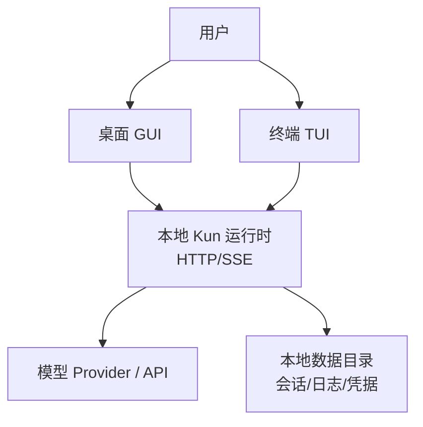
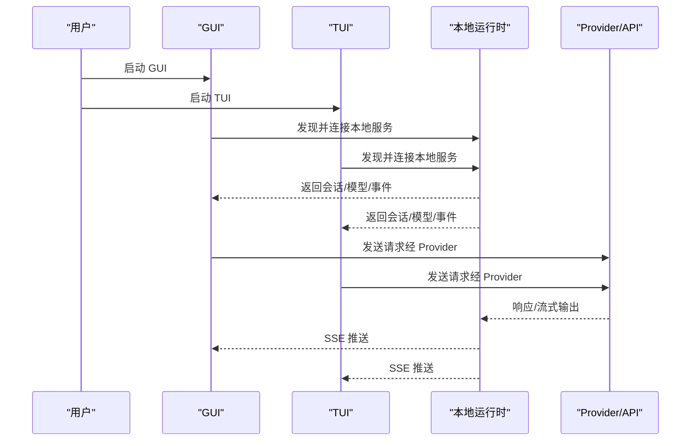
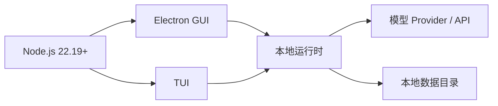

# 系统要求与环境配置

<cite>
**本文引用的文件**
- [README.md](file://README.md)
- [package.json](file://package.json)
- [docs/kun-tui.md](file://docs/kun-tui.md)
- [kun/config.example.json](file://kun/config.example.json)
- [src/main/kun-data-dir-paths.ts](file://src/main/kun-data-dir-paths.ts)
- [src/shared/app-settings.ts](file://src/shared/app-settings.ts)
</cite>

## 目录
1. [简介](#简介)
2. [项目结构](#项目结构)
3. [核心组件](#核心组件)
4. [架构总览](#架构总览)
5. [详细组件分析](#详细组件分析)
6. [依赖关系分析](#依赖关系分析)
7. [性能考虑](#性能考虑)
8. [故障排除指南](#故障排除指南)
9. [结论](#结论)
10. [附录](#附录)

## 简介
本文件面向首次安装与部署 DeepSeek-GUI（Kun）的用户与运维人员，聚焦“系统要求与环境配置”。内容覆盖：
- 支持的操作系统版本与安装包形态
- 开发环境与运行环境要求（Node.js、npm、模型连接）
- 硬件与性能建议
- 网络与镜像配置（中国大陆 npm 镜像）
- 环境变量与自定义 Provider 设置
- 数据存储位置与本地文件结构
- 常见环境问题排查
- 不同部署场景的配置建议（桌面应用、服务器、无桌面环境）

## 项目结构
Kun 提供桌面 GUI 与终端 TUI 两种客户端形态，二者共享同一个本地运行时。GUI 安装包内置 TUI；独立 TUI 压缩包用于无图形界面的服务器或开发机。

图表来源
- [docs/kun-tui.md:35-37](file://docs/kun-tui.md#L35-L37)
- [docs/kun-tui.md:41-60](file://docs/kun-tui.md#L41-L60)

章节来源
- [README.md:48-75](file://README.md#L48-L75)
- [docs/kun-tui.md:7-37](file://docs/kun-tui.md#L7-L37)

## 核心组件
- 操作系统支持：macOS（Apple Silicon / Intel）、Windows x64、Linux x64
- 开发环境：Node.js 22.19+，npm 随 Node.js 安装
- 模型连接：至少配置一个受支持的订阅、API 或自定义 Provider
- 运行时：本地 HTTP/SSE 服务，GUI/TUI 通过 discovery 发现并连接同一实例
- 数据存储：默认位于用户主目录下的 ~/.kun/data（可被 GUI 设置或环境变量覆盖）

章节来源
- [README.md:48-49](file://README.md#L48-L49)
- [README.md:201-228](file://README.md#L201-L228)
- [docs/kun-tui.md:41-60](file://docs/kun-tui.md#L41-L60)
- [src/main/kun-data-dir-paths.ts:4-5](file://src/main/kun-data-dir-paths.ts#L4-L5)

## 架构总览
Kun 的运行时以“本地优先”的方式工作：
- GUI 与 TUI 是轻量客户端，通过本机 loopback 访问持久化运行时
- 运行时负责会话、线程、审批、用量、模型连接与任务记录
- 凭据保存在运行时受保护的凭据库中，普通设置不写入密钥
- 多进程并发时通过 data-dir 级锁选主，避免重复启动

图表来源
- [docs/kun-tui.md:35-37](file://docs/kun-tui.md#L35-L37)
- [docs/kun-tui.md:41-60](file://docs/kun-tui.md#L41-L60)

## 详细组件分析

### 系统与安装包
- 支持平台与包类型
  - macOS：.dmg / .zip（Apple Silicon / Intel）
  - Windows：.exe（x64）
  - Linux：.AppImage / .deb（x64）
- 独立 TUI 压缩包
  - macOS：.tar.gz（arm64 / x64）
  - Windows：.zip（x64）
  - Linux：.tar.gz（x64）

章节来源
- [README.md:57-61](file://README.md#L57-L61)
- [docs/kun-tui.md:18-28](file://docs/kun-tui.md#L18-L28)

### 开发与运行环境
- Node.js：>= 22.19.0（由工程引擎约束）
- npm：随 Node.js 安装
- 模型连接：至少配置一个受支持的订阅、API 或自定义 Provider
- 开发命令
  - npm run dev：构建并启动 Electron GUI
  - npm run dev:tui：构建并启动 TUI
  - npm run build：生产构建
  - npm run dist:*：打包各平台安装包

章节来源
- [package.json:6-8](file://package.json#L6-L8)
- [README.md:201-228](file://README.md#L201-L228)

### 网络与镜像配置（中国大陆）
- 使用 npm 镜像加速依赖安装
  - 示例：npm ci --registry=https://registry.npmmirror.com
- 若需代理，请确保代理能访问 npm 仓库及模型服务域名
- 独立 TUI 自包含 Node.js，无需系统 Node.js；但下载更新仍依赖网络可达

章节来源
- [README.md:224-228](file://README.md#L224-L228)
- [docs/kun-tui.md:30-33](file://docs/kun-tui.md#L30-L33)

### 环境变量与配置项
- KUN_DATA_DIR：显式指定运行时数据目录；未设置时回退到 GUI 设置中的 dataDir
- serve.dataDir：默认 ~/.kun/data，可通过配置文件或 GUI 设置调整
- serve.host/port/runtimeToken/apiKey/baseUrl/model：示例配置见 kun/config.example.json
- 其他能力开关：contextCompaction、models.profiles、capabilities.*、hooks 等

注意：API Key、OAuth token 与订阅凭据不会进入普通设置或日志，而是保存在运行时受保护的凭据库中。

章节来源
- [docs/kun-tui.md:41-60](file://docs/kun-tui.md#L41-L60)
- [kun/config.example.json:1-31](file://kun/config.example.json#L1-L31)
- [kun/config.example.json:32-123](file://kun/config.example.json#L32-L123)

### 自定义 Provider 设置
- 在 GUI Settings 或 TUI 的 /connect 向导中添加 Provider
- 支持预设与 Custom provider；可编辑 ID、显示名称、Base URL、Endpoint format、遮罩凭据与模型 ID
- 凭据仅写入运行时受保护存储；registry 与 HTTP 响应不包含明文密钥
- 切换默认模型后，新线程将使用新的默认值；已固定 provider/model 的线程保持原选择

章节来源
- [docs/kun-tui.md:123-168](file://docs/kun-tui.md#L123-L168)

### 数据存储位置与本地文件结构
- 默认数据目录：~/.kun/data
- 旧版兼容路径：~/.deepseekgui/kun（升级时会迁移）
- 运行时实例信息：{dataDir}/runtime.json（包含实例 ID、PID、版本、启动时间、loopback URL、日志路径）
- TUI 状态：{dataDir}/tui/state.json（权限 0600，不含凭据）
- 权限策略：data-dir 权限 0700；discovery/token 文件 POSIX 上 0600

章节来源
- [src/main/kun-data-dir-paths.ts:4-5](file://src/main/kun-data-dir-paths.ts#L4-L5)
- [docs/kun-tui.md:41-60](file://docs/kun-tui.md#L41-L60)
- [docs/kun-tui.md:304-320](file://docs/kun-tui.md#L304-L320)

### 不同部署场景的配置建议
- 桌面应用（GUI + TUI）
  - 直接下载安装包，首次启动选择语言、登录或配置模型
  - 在项目中打开终端运行 kun，即可进入 TUI 并与 GUI 共享运行时
- 服务器环境（无桌面）
  - 下载独立 TUI 压缩包；自带固定版本 Node.js，不依赖系统 Node.js
  - 通过 /connect 配置模型；使用 /sessions、/model、/status 等命令管理会话与连接
- 无桌面环境的持续任务
  - 使用非交互命令如 kun run、kun chat、kun exec 进行脚本化调用
  - 避免在非 TTY 下误启动后台服务；必要时用 kun runtime status/restart/stop 管理

章节来源
- [README.md:51-75](file://README.md#L51-L75)
- [docs/kun-tui.md:7-37](file://docs/kun-tui.md#L7-L37)
- [docs/kun-tui.md:61-76](file://docs/kun-tui.md#L61-L76)

## 依赖关系分析
- 运行时依赖
  - Node.js >= 22.19.0（由 engines 字段约束）
  - npm（随 Node.js 安装）
- 外部服务
  - 模型 Provider（订阅、API、兼容服务或自托管）
- 本地依赖
  - 数据目录权限与文件锁定（POSIX 0700/0600）
  - 可选：OpenClaw Gateway（部分 IM 集成需要）

图表来源
- [package.json:6-8](file://package.json#L6-L8)
- [docs/kun-tui.md:35-37](file://docs/kun-tui.md#L35-L37)

章节来源
- [package.json:6-8](file://package.json#L6-L8)
- [docs/kun-tui.md:304-320](file://docs/kun-tui.md#L304-L320)

## 性能考虑
- 上下文压缩：可通过 contextCompaction 阈值控制软/硬压缩点，减少长对话的内存与 Token 消耗
- 工具结果限制：tokenEconomy 可压缩工具描述与结果、精简响应、限制历史行/字节/Token
- 附件与媒体：attachments 可限制图片大小与维度，避免大媒体影响性能
- 子代理与 MCP：subagents 与 capabilities.mcp 可按需启用，控制并行度与搜索范围
- 存储后端：storage.backend 可切换为 hybrid，平衡速度与可靠性

章节来源
- [kun/config.example.json:13-39](file://kun/config.example.json#L13-L39)
- [kun/config.example.json:101-120](file://kun/config.example.json#L101-L120)

## 故障排除指南
- 无法连接模型或 Provider
  - 检查 /connect 向导是否成功保存配置；确认凭据未泄露至普通设置或日志
  - 若出现 OpenClaw Gateway 相关错误，检查网关是否可用并已配置
- 端口冲突或服务异常
  - 使用 kun runtime status 查看当前实例；必要时 restart 或 stop
  - 避免在同一 data-dir 重复启动多个实例
- 数据目录权限问题
  - 确保 data-dir 权限为 0700；discovery/token 文件为 0600
  - 若检测到旧版数据目录，按提示完成迁移后再继续
- 网络与镜像
  - 中国大陆建议使用 npm 镜像；若使用代理，确保能访问 npm 与模型服务域名
- TUI 更新失败
  - 独立 TUI 会提示更新；执行 /update 或 kun update --check/--yes 手动处理

章节来源
- [docs/kun-tui.md:61-76](file://docs/kun-tui.md#L61-L76)
- [docs/kun-tui.md:123-168](file://docs/kun-tui.md#L123-L168)
- [docs/kun-tui.md:304-320](file://docs/kun-tui.md#L304-L320)
- [src/main/kun-data-dir-paths.ts:77-86](file://src/main/kun-data-dir-paths.ts#L77-L86)

## 结论
Kun 提供跨平台的桌面与终端体验，并通过本地运行时统一管理会话、模型连接与任务。正确配置 Node.js、npm、模型连接与数据目录，是稳定运行的关键。对于中国大陆用户，合理配置 npm 镜像与网络代理可显著提升安装与更新效率。在生产或服务器环境中，建议优先使用独立 TUI 并配合最小化权限与必要的能力开关，以获得更可控的运行环境。

## 附录
- 快速开始
  - 从 Releases 下载对应平台安装包
  - 首次启动选择语言并配置模型
  - 在项目目录运行 kun 进入 TUI
- 常用命令
  - npm run dev / npm run dev:tui / npm run build / npm run dist:*
  - kun runtime status / restart / stop
  - /connect / /model / /sessions / /status

章节来源
- [README.md:51-75](file://README.md#L51-L75)
- [README.md:230-242](file://README.md#L230-L242)
- [docs/kun-tui.md:61-76](file://docs/kun-tui.md#L61-L76)