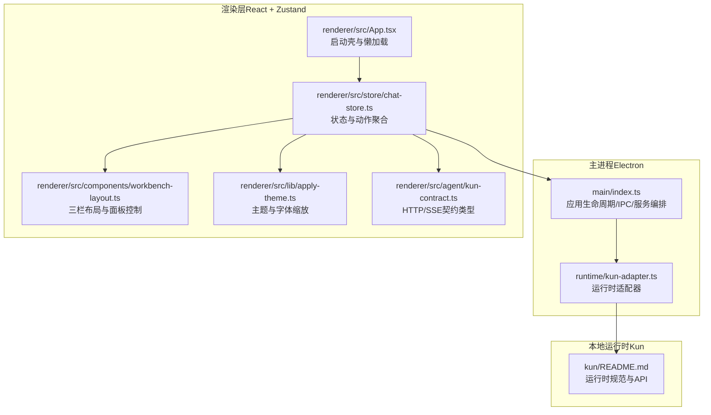
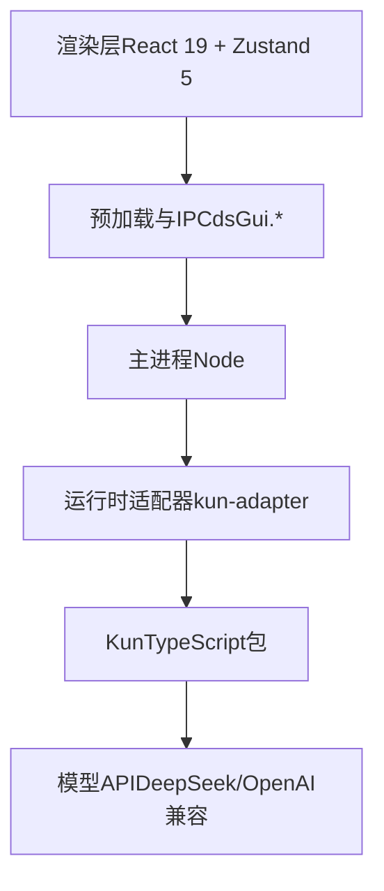
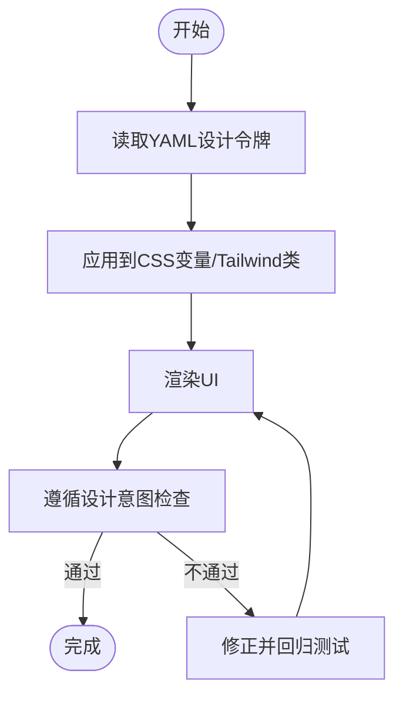
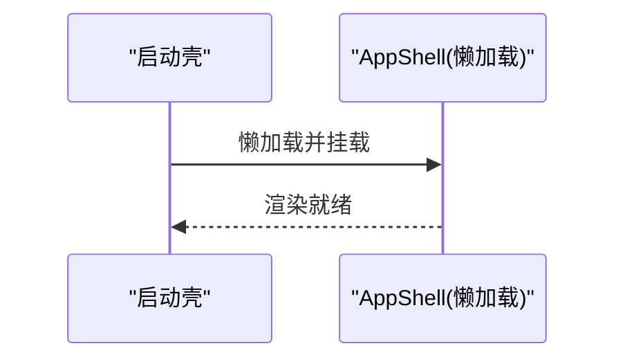
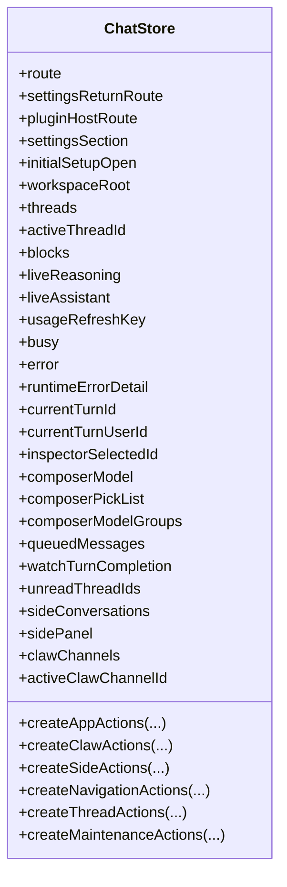
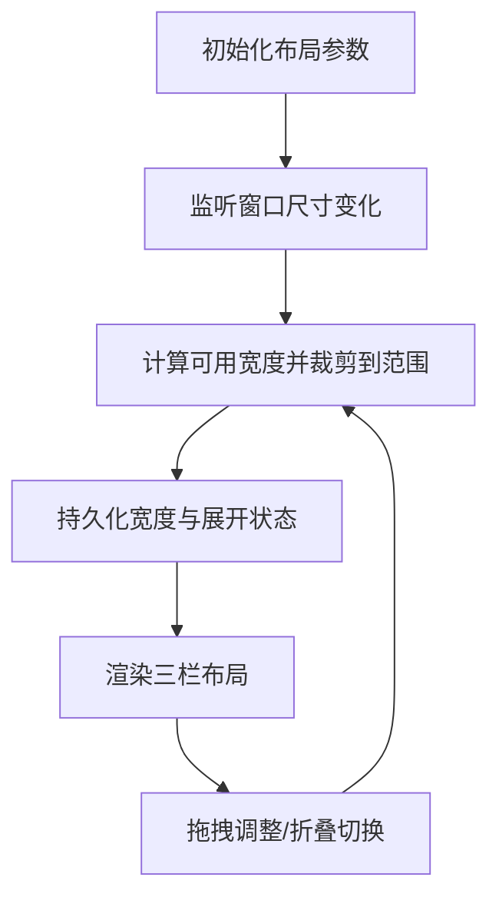
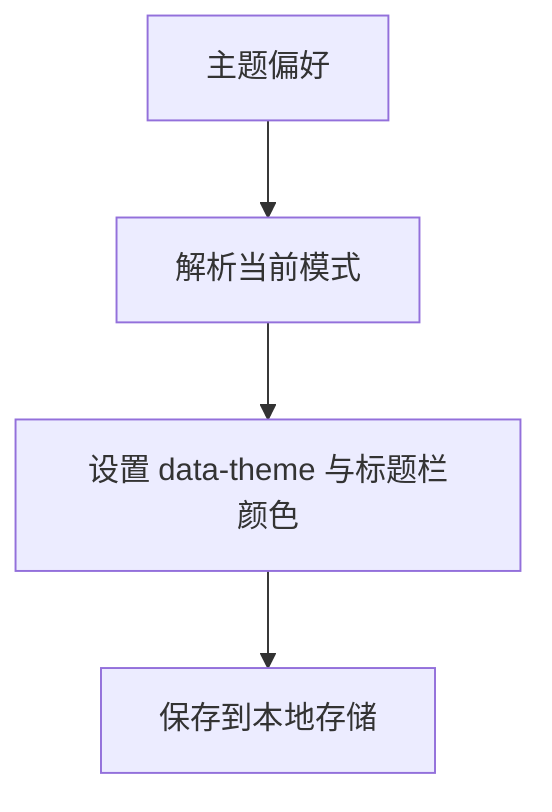
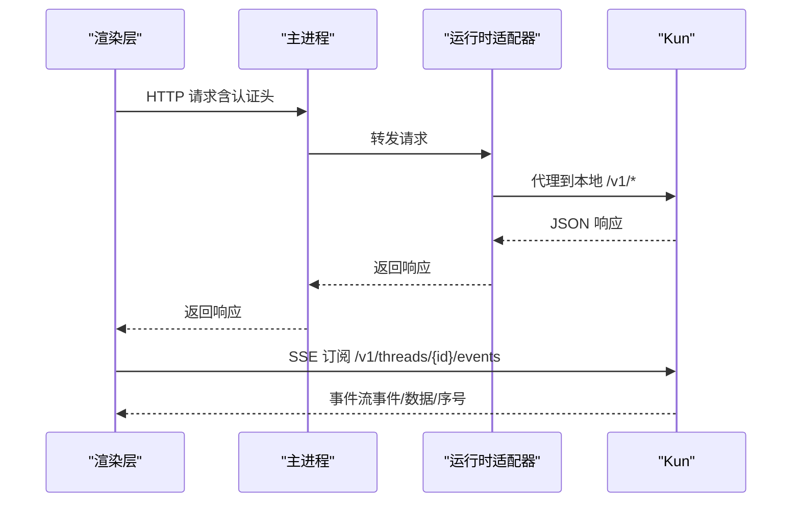
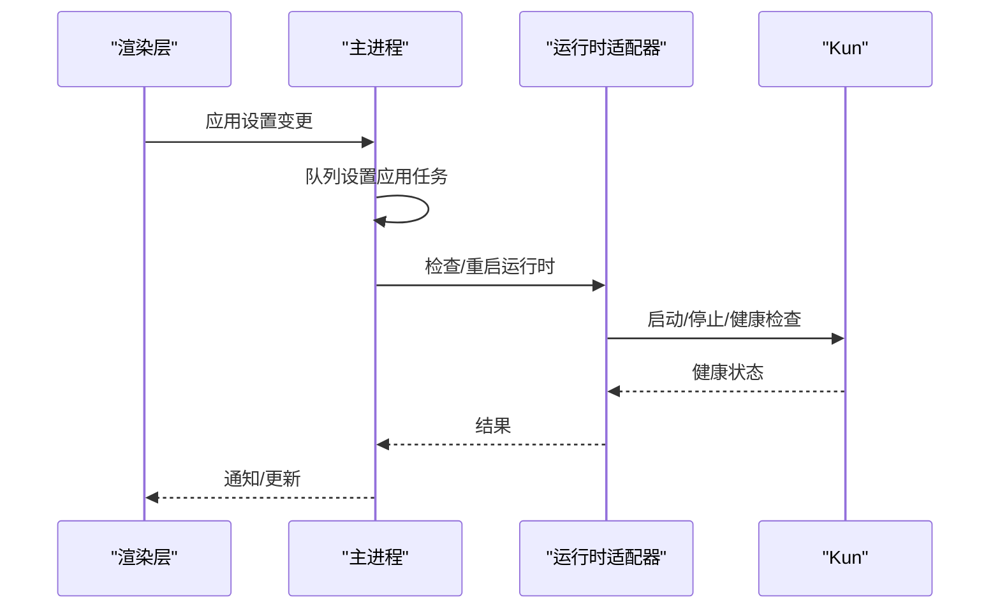
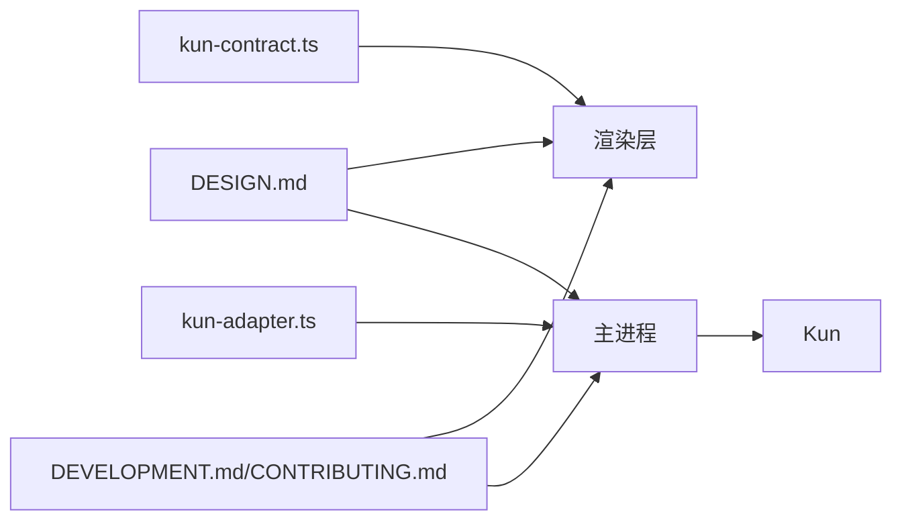

# 设计理念

<cite>
**本文引用的文件**
- [DESIGN.md](file://DESIGN.md)
- [DESIGN.zh-CN.md](file://DESIGN.zh-CN.md)
- [README.en.md](file://README.en.md)
- [docs/DEVELOPMENT.md](file://docs/DEVELOPMENT.md)
- [docs/CONTRIBUTING.md](file://docs/CONTRIBUTING.md)
- [src/main/index.ts](file://src/main/index.ts)
- [src/main/runtime/kun-adapter.ts](file://src/main/runtime/kun-adapter.ts)
- [src/renderer/src/App.tsx](file://src/renderer/src/App.tsx)
- [src/renderer/src/store/chat-store.ts](file://src/renderer/src/store/chat-store.ts)
- [src/renderer/src/components/workbench-layout.ts](file://src/renderer/src/components/workbench-layout.ts)
- [src/renderer/src/lib/apply-theme.ts](file://src/renderer/src/lib/apply-theme.ts)
- [src/renderer/src/agent/kun-contract.ts](file://src/renderer/src/agent/kun-contract.ts)
- [kun/README.md](file://kun/README.md)
</cite>

## 目录
1. [引言](#引言)
2. [项目结构](#项目结构)
3. [核心组件](#核心组件)
4. [架构总览](#架构总览)
5. [详细组件分析](#详细组件分析)
6. [依赖关系分析](#依赖关系分析)
7. [性能考量](#性能考量)
8. [故障排查指南](#故障排查指南)
9. [结论](#结论)
10. [附录](#附录)

## 引言
本设计理念文档面向开发者与用户，系统阐述 DeepSeek GUI 的设计哲学与核心价值观：以用户体验优先、开发者友好、可扩展性为核心原则；在复杂技术架构下保持简洁直观的用户界面；通过模块化与可插拔架构实现开放性；并在性能、安全与可维护性方面提供明确的工程约束与实践路径。本文同时给出可视化图示，帮助读者快速把握产品设计意图与实现边界。

## 项目结构
DeepSeek GUI 采用“单运行时、多工作台”的统一架构：Electron 主进程负责托管本地运行时（Kun）、系统服务与平台集成；渲染层基于 React/Zustand 提供三屏布局与多工作台体验；Kun 作为单一 Agent 运行时，通过 HTTP/SSE 对外暴露稳定契约，确保升级与调试的确定性。

图表来源
- [src/main/index.ts:688-800](file://src/main/index.ts#L688-L800)
- [src/main/runtime/kun-adapter.ts:29-64](file://src/main/runtime/kun-adapter.ts#L29-L64)
- [src/renderer/src/App.tsx:1-23](file://src/renderer/src/App.tsx#L1-L23)
- [src/renderer/src/store/chat-store.ts:120-211](file://src/renderer/src/store/chat-store.ts#L120-L211)
- [src/renderer/src/components/workbench-layout.ts:146-361](file://src/renderer/src/components/workbench-layout.ts#L146-L361)
- [src/renderer/src/lib/apply-theme.ts:15-55](file://src/renderer/src/lib/apply-theme.ts#L15-L55)
- [src/renderer/src/agent/kun-contract.ts:1-535](file://src/renderer/src/agent/kun-contract.ts#L1-L535)
- [kun/README.md:1-439](file://kun/README.md#L1-L439)

章节来源
- [DESIGN.md:661-705](file://DESIGN.md#L661-L705)
- [README.en.md:103-176](file://README.en.md#L103-L176)
- [src/main/index.ts:688-800](file://src/main/index.ts#L688-L800)
- [src/main/runtime/kun-adapter.ts:29-64](file://src/main/runtime/kun-adapter.ts#L29-L64)
- [src/renderer/src/App.tsx:1-23](file://src/renderer/src/App.tsx#L1-L23)
- [src/renderer/src/store/chat-store.ts:120-211](file://src/renderer/src/store/chat-store.ts#L120-L211)
- [src/renderer/src/components/workbench-layout.ts:146-361](file://src/renderer/src/components/workbench-layout.ts#L146-L361)
- [src/renderer/src/lib/apply-theme.ts:15-55](file://src/renderer/src/lib/apply-theme.ts#L15-L55)
- [src/renderer/src/agent/kun-contract.ts:1-535](file://src/renderer/src/agent/kun-contract.ts#L1-L535)
- [kun/README.md:1-439](file://kun/README.md#L1-L439)

## 核心组件
- 设计原则（六项不可妥协）
  - 单一运行时、单一边界：Code/Write/Connect phone 共享同一 Kun 边界，避免协议膨胀与调试复杂度上升。
  - 本地优先、可观测、可控：设置、会话、日志均落盘；工具调用、文件变更、推理步骤在 UI 可见；支持中断、审批、撤销。
  - 无运行时切换器、无运行时控制台：不暴露运行时诊断、提供商选择或模型控制面板，重要细节放入设置而非画布。
  - 渲染层仅映射 HTTP：审批、引导、压缩、分叉、恢复、用量均由 Kun 端点提供，不在前端重实现。
  - 视觉身份稳定、非炫技：新界面应与既有界面同属一个语义家族，替换多个既有组件才可引入新风格。
  - 默认宁静：近白/近黑画布、克制表面、无色 Chrome、单强调色用于可操作元素；状态、危险、技能为其余可用色彩。

- 视觉系统与交互约定
  - 调色板、字形、间距、圆角、阴影、动效、Z轴、窗口样式、图标库、组件模板、渐变背景、国际化与文案语调、品牌与声音、无障碍焦点环与命中目标、键盘快捷键等，均以 DESIGN.md 前言 YAML 为权威契约，Markdown 部分为“为什么”与“何时”。

章节来源
- [DESIGN.md:379-409](file://DESIGN.md#L379-L409)
- [DESIGN.md:412-658](file://DESIGN.md#L412-L658)
- [DESIGN.zh-CN.md:379-409](file://DESIGN.zh-CN.md#L379-L409)
- [DESIGN.zh-CN.md:412-658](file://DESIGN.zh-CN.md#L412-L658)

## 架构总览
DeepSeek GUI 的顶层架构强调“单一运行时、稳定边界、职责分离”。主进程负责运行时生命周期管理、IPC 与 GUI 专属服务；渲染层通过 HTTP/SSE 与运行时通信；Kun 以缓存优先的 Agent Loop 为核心，结合端口与适配器模式对外提供一致契约。

图表来源
- [DESIGN.md:661-705](file://DESIGN.md#L661-L705)
- [README.en.md:103-176](file://README.en.md#L103-L176)
- [src/main/index.ts:688-800](file://src/main/index.ts#L688-L800)
- [src/main/runtime/kun-adapter.ts:29-64](file://src/main/runtime/kun-adapter.ts#L29-L64)

章节来源
- [DESIGN.md:661-705](file://DESIGN.md#L661-L705)
- [README.en.md:103-176](file://README.en.md#L103-L176)

## 详细组件分析

### 设计原则与视觉契约（Designer Token）
- 设计令牌（YAML 前言）定义了调色板、字形、间距、圆角、阴影、动效、Z轴、窗口样式、图标库、组件模板、渐变背景、国际化与文案语调、品牌与声音、无障碍焦点环与命中目标、键盘快捷键等。
- 设计意图（Markdown）解释了“为何”与“何时”，并与前言形成“契约优先、解释补充”的关系。

图表来源
- [DESIGN.md:1-325](file://DESIGN.md#L1-L325)
- [DESIGN.md:326-658](file://DESIGN.md#L326-L658)

章节来源
- [DESIGN.md:1-325](file://DESIGN.md#L1-L325)
- [DESIGN.md:326-658](file://DESIGN.md#L326-L658)

### 渲染层：启动壳与懒加载
- 启动壳在首次渲染时显示轻量提示，随后懒加载 AppShell，降低首屏阻塞，提升感知速度。
- AppShell 是工作台容器，承载 Code/Write/Connect phone 等视图。

图表来源
- [src/renderer/src/App.tsx:1-23](file://src/renderer/src/App.tsx#L1-L23)

章节来源
- [src/renderer/src/App.tsx:1-23](file://src/renderer/src/App.tsx#L1-L23)

### 状态与动作：Zustand 聚合
- chat-store 将运行时动作、导航、侧边动作、线程动作、维护动作聚合在一个 Zustand Store 中，便于跨组件共享与协作。
- 通过 create*Actions 工厂函数拆分职责，保证可测试性与可演进性。

图表来源
- [src/renderer/src/store/chat-store.ts:120-211](file://src/renderer/src/store/chat-store.ts#L120-L211)

章节来源
- [src/renderer/src/store/chat-store.ts:120-211](file://src/renderer/src/store/chat-store.ts#L120-L211)

### 布局与交互：三栏工作台
- 使用自适应三栏布局（左/中/右），支持拖拽调整宽度、折叠侧栏、自动适配最小宽度与硬性阈值。
- 右侧面板根据路由与场景动态切换（Todo/Changes/Browser/File/Write Assistant）。

图表来源
- [src/renderer/src/components/workbench-layout.ts:68-144](file://src/renderer/src/components/workbench-layout.ts#L68-L144)
- [src/renderer/src/components/workbench-layout.ts:232-361](file://src/renderer/src/components/workbench-layout.ts#L232-L361)

章节来源
- [src/renderer/src/components/workbench-layout.ts:146-361](file://src/renderer/src/components/workbench-layout.ts#L146-L361)

### 主题与字体缩放
- 支持 system/light/dark 三种主题偏好，自动响应系统深浅模式；Windows 标题栏主题同步；字体缩放因子写入 CSS 变量。

图表来源
- [src/renderer/src/lib/apply-theme.ts:15-55](file://src/renderer/src/lib/apply-theme.ts#L15-L55)

章节来源
- [src/renderer/src/lib/apply-theme.ts:15-55](file://src/renderer/src/lib/apply-theme.ts#L15-L55)

### 运行时契约：HTTP/SSE 类型与事件
- 通过 kun-contract.ts 定义线程、回合、条目、附件、内存、运行时能力清单、事件流等类型，确保渲染层与运行时的契约稳定。
- 事件流使用 SSE，支持断线重连与回放。

图表来源
- [src/renderer/src/agent/kun-contract.ts:1-535](file://src/renderer/src/agent/kun-contract.ts#L1-L535)
- [src/main/runtime/kun-adapter.ts:86-114](file://src/main/runtime/kun-adapter.ts#L86-L114)
- [kun/README.md:300-344](file://kun/README.md#L300-L344)

章节来源
- [src/renderer/src/agent/kun-contract.ts:1-535](file://src/renderer/src/agent/kun-contract.ts#L1-L535)
- [src/main/runtime/kun-adapter.ts:86-114](file://src/main/runtime/kun-adapter.ts#L86-L114)
- [kun/README.md:300-344](file://kun/README.md#L300-L344)

### 主进程：运行时生命周期与 IPC
- 主进程负责运行时健康探测、自动启动、端口回收、错误归一化与日志记录；注册 IPC 处理器，向渲染层提供运行时请求、模型查询、通知等能力。
- 通过适配器抽象运行时实现，便于未来扩展其他运行时（当前仅支持 Kun）。

图表来源
- [src/main/index.ts:442-484](file://src/main/index.ts#L442-L484)
- [src/main/index.ts:637-662](file://src/main/index.ts#L637-L662)
- [src/main/runtime/kun-adapter.ts:44-64](file://src/main/runtime/kun-adapter.ts#L44-L64)

章节来源
- [src/main/index.ts:442-484](file://src/main/index.ts#L442-L484)
- [src/main/index.ts:637-662](file://src/main/index.ts#L637-L662)
- [src/main/runtime/kun-adapter.ts:44-64](file://src/main/runtime/kun-adapter.ts#L44-L64)

## 依赖关系分析
- 渲染层依赖运行时契约（kun-contract）与主进程 IPC；主进程依赖运行时适配器；运行时适配器依赖 Kun 的可执行与配置。
- 设计令牌（DESIGN.md）是视觉与交互的权威契约，渲染层严格遵循；贡献流程与开发规范保障质量与一致性。

图表来源
- [src/renderer/src/agent/kun-contract.ts:1-535](file://src/renderer/src/agent/kun-contract.ts#L1-L535)
- [src/main/runtime/kun-adapter.ts:29-64](file://src/main/runtime/kun-adapter.ts#L29-L64)
- [src/main/index.ts:688-800](file://src/main/index.ts#L688-L800)
- [DESIGN.md:1-325](file://DESIGN.md#L1-L325)
- [docs/DEVELOPMENT.md:1-152](file://docs/DEVELOPMENT.md#L1-L152)
- [docs/CONTRIBUTING.md:1-206](file://docs/CONTRIBUTING.md#L1-L206)

章节来源
- [src/renderer/src/agent/kun-contract.ts:1-535](file://src/renderer/src/agent/kun-contract.ts#L1-L535)
- [src/main/runtime/kun-adapter.ts:29-64](file://src/main/runtime/kun-adapter.ts#L29-L64)
- [src/main/index.ts:688-800](file://src/main/index.ts#L688-L800)
- [DESIGN.md:1-325](file://DESIGN.md#L1-L325)
- [docs/DEVELOPMENT.md:1-152](file://docs/DEVELOPMENT.md#L1-L152)
- [docs/CONTRIBUTING.md:1-206](file://docs/CONTRIBUTING.md#L1-L206)

## 性能考量
- 缓存优先的 Agent Loop：通过不可变提示前缀、追加式会话日志、有界 TTL/LRU 缓存、飞行中跟踪与中途引导队列，最大化缓存命中率，降低重复上下文成本。
- 上下文净化：限制长工具结果、长参数、Base64 负载与重复循环，保留高价值信号（代码、路径、错误、决策、未决任务）。
- 可观测的用量回报：运行时遥测追踪缓存命中/未命中、Token 使用与估算节省，GUI 展示 Token 经济节省，使成本回报可见。
- 前端性能：懒加载、Zustand 聚合状态、三栏布局自适应与最小宽度约束，减少重排与无效渲染。

章节来源
- [README.en.md:54-66](file://README.en.md#L54-L66)
- [kun/README.md:1-439](file://kun/README.md#L1-L439)

## 故障排查指南
- 运行时未就绪：检查 API Key、自动启动开关与端口占用；确认健康探针与线程 API 可访问。
- 设置变更导致运行时重启：主进程会根据设置指纹判断是否需要重启；若失败，查看日志与错误码。
- 附件/内存/子代理等能力不可用：检查对应能力开关与诊断输出；确认模型模态与大小限制。
- 通知与日志：启用日志后，可在应用数据目录查看；通知需系统支持且已授权。

章节来源
- [src/main/index.ts:331-368](file://src/main/index.ts#L331-L368)
- [src/main/index.ts:486-538](file://src/main/index.ts#L486-L538)
- [kun/README.md:386-439](file://kun/README.md#L386-L439)

## 结论
DeepSeek GUI 的设计理念以“单一运行时、稳定边界、简洁界面、可观测可控”为核心，通过模块化与可插拔架构实现开放性与可扩展性；在性能上以缓存优先与上下文净化为纲，在安全与可维护性上以最小权限、清晰契约与严格贡献流程为纲。该理念既服务于开发者，也服务于终端用户，确保产品在复杂技术背景下仍保持一致、可靠与易用的体验。

## 附录
- 开发工作流与贡献标准：分支策略、PR 规范、验证清单与文档更新要求。
- 本地构建与发布：脚本命令、打包配置与平台差异注意事项。

章节来源
- [docs/DEVELOPMENT.md:1-152](file://docs/DEVELOPMENT.md#L1-L152)
- [docs/CONTRIBUTING.md:1-206](file://docs/CONTRIBUTING.md#L1-L206)
- [README.en.md:388-400](file://README.en.md#L388-L400)