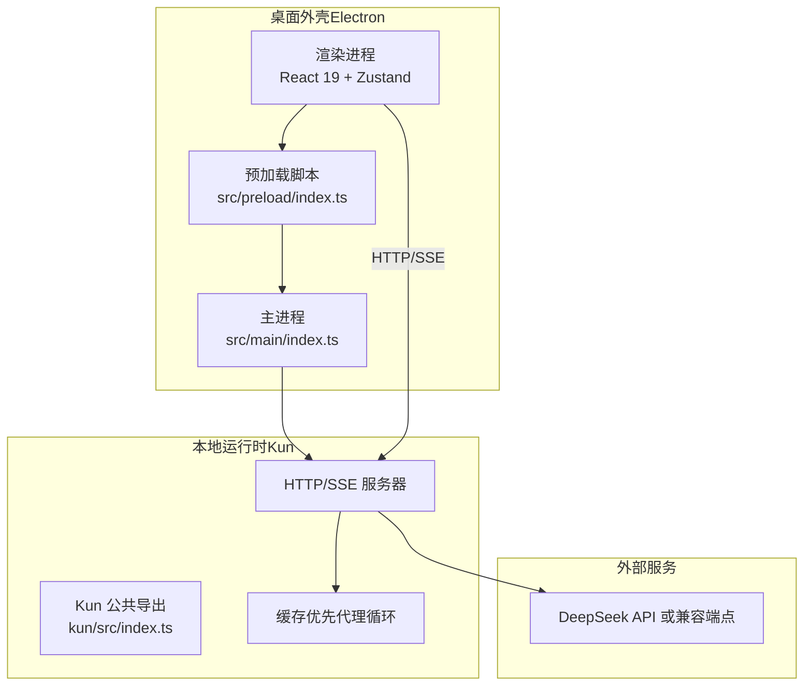
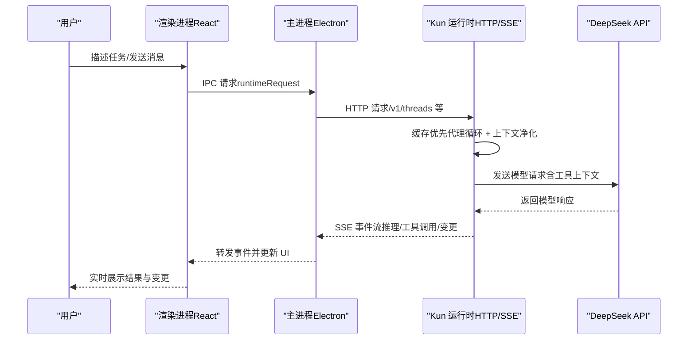
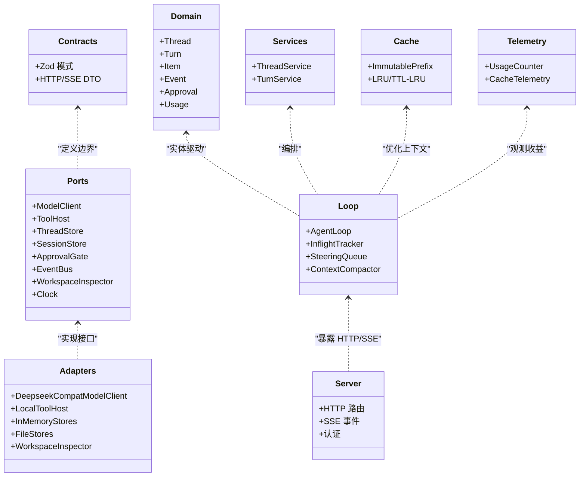
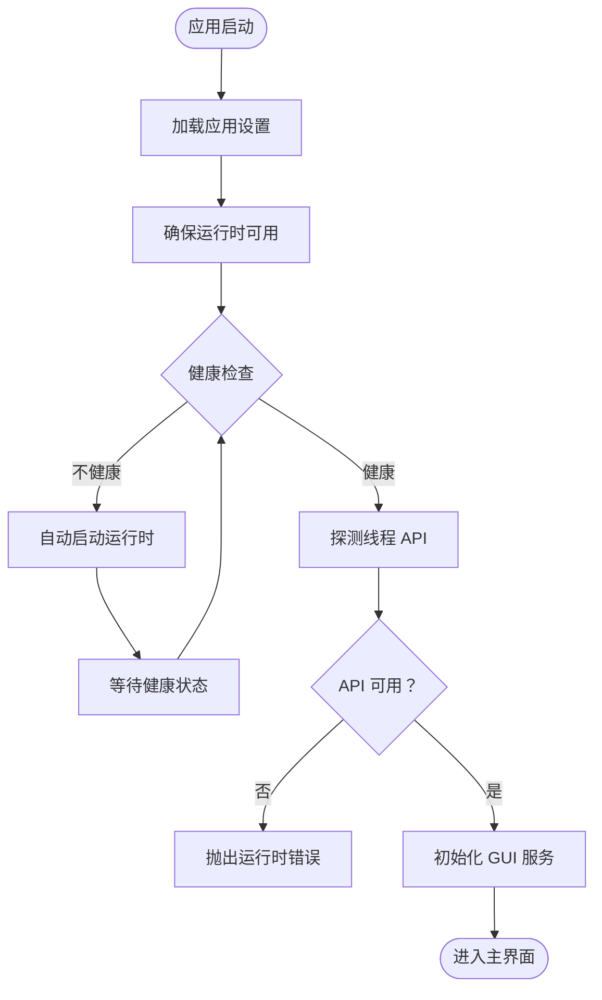
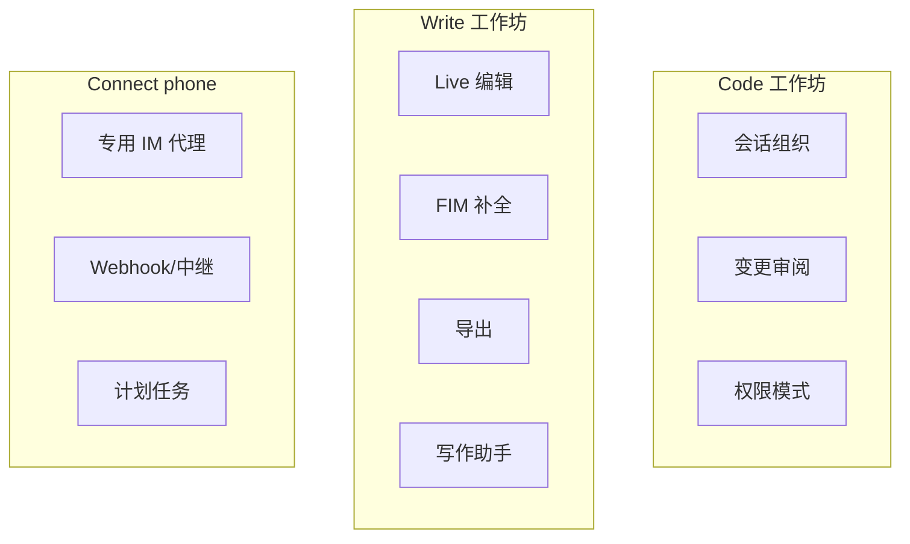
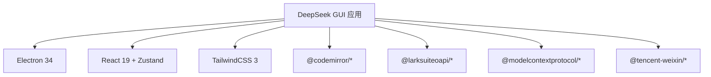

# 项目介绍

<cite>
**本文档引用的文件**
- [README.en.md](file://README.en.md)
- [DESIGN.md](file://DESIGN.md)
- [package.json](file://package.json)
- [src/main/index.ts](file://src/main/index.ts)
- [kun/src/index.ts](file://kun/src/index.ts)
</cite>

## 目录
1. [引言](#引言)
2. [项目结构](#项目结构)
3. [核心组件](#核心组件)
4. [架构总览](#架构总览)
5. [详细组件分析](#详细组件分析)
6. [依赖关系分析](#依赖关系分析)
7. [性能考量](#性能考量)
8. [故障排除指南](#故障排除指南)
9. [结论](#结论)
10. [附录](#附录)

## 引言
DeepSeek GUI 是一个面向开发者的本地桌面工作台，其核心是将 Kun 智能体运行时引入桌面环境，提供“代码”“写作”“连接手机”三大工作场景，强调“高 Token ROI（投入产出比）”。项目的目标不是简单地包装聊天界面，而是让 DeepSeek 成为真实项目工作的可靠桌面伙伴：选择工作区、启动任务、实时观看推理与工具调用、审阅文件变更，并在需要时对敏感操作进行审批。

与传统 AI 工具相比，DeepSeek GUI 的独特价值在于：
- 将 Kun 的高 ROI 能力带到桌面：通过缓存优先的代理循环、按需工具上下文、上下文净化等机制，确保同样的上下文预算更聚焦于需求、代码、决策与结果。
- 可观察、可控、可恢复：每个工具调用、文件变更、推理步骤都在界面中可见；用户可中断、审批、拒绝或回滚。
- 本地优先：设置、会话、日志均保存在本地磁盘，模型调用使用用户自己的 DeepSeek API 密钥。

## 项目结构
项目采用 Electron + React 前端 + TypeScript 运行时的分层架构：
- 主进程（Electron）负责应用生命周期、系统集成、运行时托管与 GUI 服务（设置、更新、连接手机后台、计划任务等）。
- 预加载脚本（Preload）提供受限的 IPC 接口，隔离渲染进程与 Node 环境。
- 渲染进程（React 19 + Zustand）承载三大工作台（Code/Write/Connect phone）与设置界面。
- 运行时（Kun）是一个自包含的 TypeScript 包，内置 HTTP/SSE 服务器，作为 GUI 与代理循环之间的唯一边界。

**图表来源**
- [src/main/index.ts:661-705](file://src/main/index.ts#L661-L705)
- [kun/src/index.ts:1-23](file://kun/src/index.ts#L1-L23)

**章节来源**
- [README.en.md:103-176](file://README.en.md#L103-L176)
- [DESIGN.md:661-705](file://DESIGN.md#L661-L705)

## 核心组件
- 运行时（Kun）
  - 作为单一本地代理运行时，提供 HTTP/SSE 边界，暴露线程、事件、使用统计等接口。
  - 内置缓存优先的代理循环、上下文净化、工具发现与调用优化，确保高 ROI。
- 主进程（Electron）
  - 托管运行时生命周期、自动启动与健康检查、错误探测与日志管理。
  - 提供设置、更新、连接手机后台、计划任务等 GUI 专属服务。
- 渲染进程（React）
  - 三大工作台：Code（项目工作区）、Write（长文本写作）、Connect phone（IM 自动化与计划任务）。
  - 设置面板、权限模式、技能与 MCP 管理、变更审阅与对话历史等。

**章节来源**
- [README.en.md:103-176](file://README.en.md#L103-L176)
- [DESIGN.md:354-409](file://DESIGN.md#L354-L409)
- [src/main/index.ts:486-538](file://src/main/index.ts#L486-L538)

## 架构总览
DeepSeek GUI 的整体架构围绕“单一运行时、单一边界”的原则构建：渲染进程只通过 HTTP/SSE 与 Kun 通信，不内嵌代理逻辑；主进程负责运行时托管与 GUI 服务；Kun 内部实现代理循环、工具宿主、存储与遥测。

**图表来源**
- [DESIGN.md:661-705](file://DESIGN.md#L661-L705)
- [src/main/index.ts:664-680](file://src/main/index.ts#L664-L680)

## 详细组件分析

### 组件 A：运行时（Kun）与 GUI 的交互契约
- 公共导出：Kun 通过统一入口导出合约、领域、端口、适配器、服务、循环、内存、缓存、遥测与服务器模块，保证 GUI 仅通过类型安全的契约与运行时交互。
- 运行时能力：支持 MCP、网络抓取/搜索、技能、附件、跨会话记忆、子代理委托等特性，具体能力由配置与模型能力决定。
- 高 ROI 设计：缓存命中率、工具上下文按需描述、上下文净化与工具对修复，使长会话与复杂任务的 Token 使用更高效。

**图表来源**
- [kun/src/index.ts:1-23](file://kun/src/index.ts#L1-L23)
- [DESIGN.md:708-762](file://DESIGN.md#L708-L762)

**章节来源**
- [kun/src/index.ts:1-23](file://kun/src/index.ts#L1-L23)
- [DESIGN.md:708-800](file://DESIGN.md#L708-L800)

### 组件 B：主进程（Electron）的运行时托管与 GUI 服务
- 运行时健康检查与自动启动：在首次请求前检查健康状态，必要时自动启动并等待就绪；若未配置 API Key 或未启用自动启动，则抛出明确错误。
- 设置变更与重启策略：对影响运行时启动的设置项进行稳定指纹比较，避免重复重启；在设置变更后排队执行重启。
- GUI 专属服务：设置、更新、连接手机后台、计划任务、日志管理、通知等，均由主进程提供。

**图表来源**
- [src/main/index.ts:486-538](file://src/main/index.ts#L486-L538)
- [src/main/index.ts:637-662](file://src/main/index.ts#L637-L662)

**章节来源**
- [src/main/index.ts:486-538](file://src/main/index.ts#L486-L538)
- [src/main/index.ts:637-662](file://src/main/index.ts#L637-L662)

### 组件 C：GUI 工作台与用户工作流
- Code 工作坊：绑定本地项目目录，组织多会话，实时展示推理、工具调用与文件变更，支持变更审阅与权限模式。
- Write 工作坊：长文本写作空间，支持 Live/Source/Split/Preview 模式、导出 HTML/PDF/DOC/DOCX、深度 FIM 补全与侧边写作助手。
- Connect phone：后台自动化与 IM 集成，支持飞书/钉钉/微信通道、本地 webhook/中继、计划任务。

**图表来源**
- [README.en.md:186-234](file://README.en.md#L186-L234)

**章节来源**
- [README.en.md:186-234](file://README.en.md#L186-L234)

## 依赖关系分析
- 应用依赖
  - Electron 34、React 19、Zustand 5、TailwindCSS 3、@codemirror/*、@larksuiteoapi/*、@modelcontextprotocol/*、@tencent-weixin/* 等。
- 运行时依赖
  - 通过构建流程将 Kun 包装为独立运行时，GUI 通过 HTTP/SSE 与其交互。
- 外部服务
  - DeepSeek API 或兼容端点，用于模型调用。

**图表来源**
- [package.json:36-64](file://package.json#L36-L64)

**章节来源**
- [package.json:36-64](file://package.json#L36-L64)

## 性能考量
- 高 ROI 的 Token 使用
  - 缓存优先：稳定的系统提示词、工具模式与不可变前缀，提升缓存命中率，长会话无需重复支付背景成本。
  - 工具上下文按需：当 MCP 工具目录庞大时，先搜索相关工具再描述与调用，避免每次轮次发送全部工具模式。
  - 上下文净化：限制长工具结果、长参数、base64 负载与低价值历史，保留代码、路径、错误、决策与开放任务。
  - 可见收益：运行时遥测追踪缓存命中/未命中、Token 使用与估算节省，GUI 展示 Token 经济节省，长期可观测。
- 长任务与长会话优化
  - 不同于一次性问答，Kun 更适合持续协作的项目工作，减少重复前缀与无效输出，提高同一预算下的有用进展。

**章节来源**
- [README.en.md:54-66](file://README.en.md#L54-L66)
- [DESIGN.md:763-800](file://DESIGN.md#L763-L800)

## 故障排除指南
- 运行时未就绪
  - 症状：提示需要 API Key、运行时离线或未健康。
  - 处理：在设置中添加 DeepSeek API Key，启用自动启动；若手动启动，请确认端口未被占用且运行时健康。
- 权限与审批
  - 症状：工具调用被阻断或需要审批。
  - 处理：根据权限模式（只读/工作区写/全权限/外部沙箱）与审批策略调整；在审阅面板中允许或拒绝敏感操作。
- 日志与诊断
  - 症状：运行异常但无明显错误。
  - 处理：开启本地日志，查看主进程与运行时日志；检查 GUI 更新通道与运行时能力报告。

**章节来源**
- [src/main/index.ts:486-538](file://src/main/index.ts#L486-L538)
- [README.en.md:296-306](file://README.en.md#L296-L306)

## 结论
DeepSeek GUI 通过将 Kun 的高 ROI 能力引入桌面，为开发者与频繁使用 AI 的用户提供了真实项目协作的可靠桌面伙伴。它强调可观察、可控与本地优先，结合缓存优先的代理循环、工具上下文优化与上下文净化，使 Token 预算更聚焦于实际价值。三大工作台覆盖代码、写作与 IM 自动化，满足从需求澄清到执行与审阅的完整闭环。对于希望在桌面环境中获得一致、可控与高效的 AI 协作体验的用户，DeepSeek GUI 提供了清晰的价值主张与实践路径。

## 附录
- 安装与首次运行
  - 下载预构建包或从源码运行；首次启动输入 API Key 并选择默认工作区；典型流程为：选择工作区 → 描述任务 → 观察推理/工具调用/文件变更 → 审批敏感操作 → 在审阅面板中确认下一步。
- 版本与贡献
  - 当前版本号与发布渠道见应用内更新入口；贡献者可通过 develop 分支提交 PR，并遵循类型检查、构建与测试流程。

**章节来源**
- [README.en.md:236-295](file://README.en.md#L236-L295)
- [README.en.md:371-386](file://README.en.md#L371-L386)