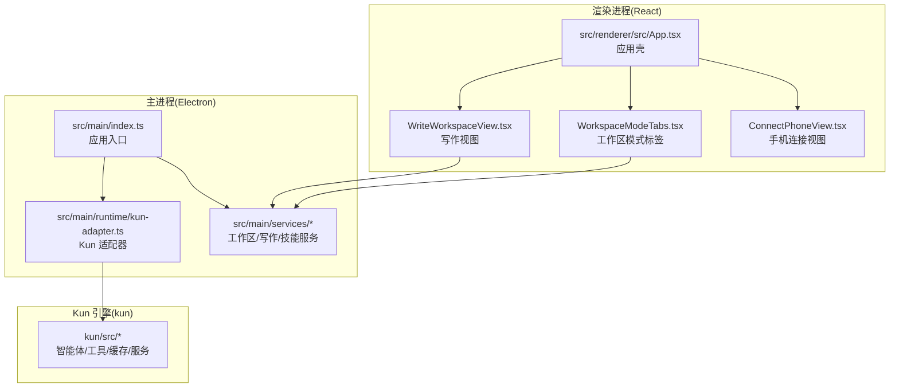
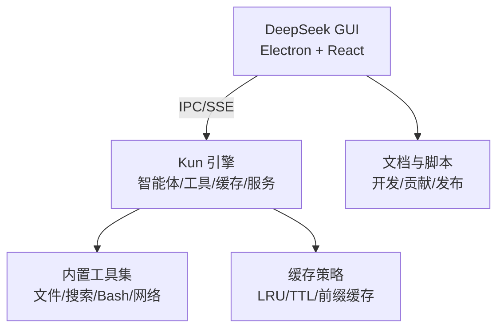
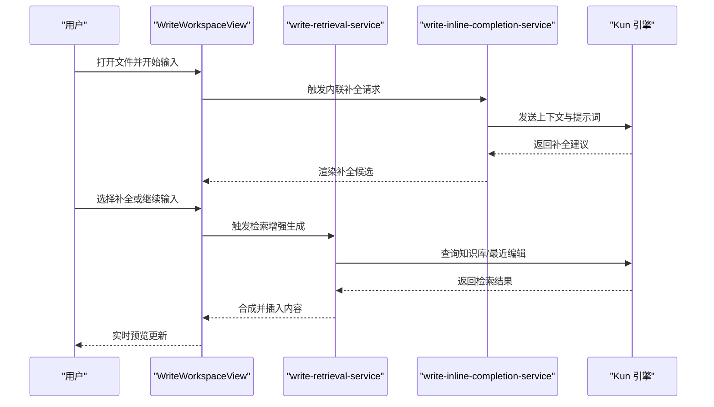
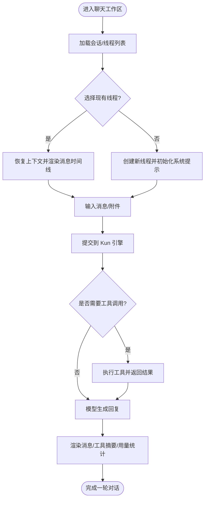
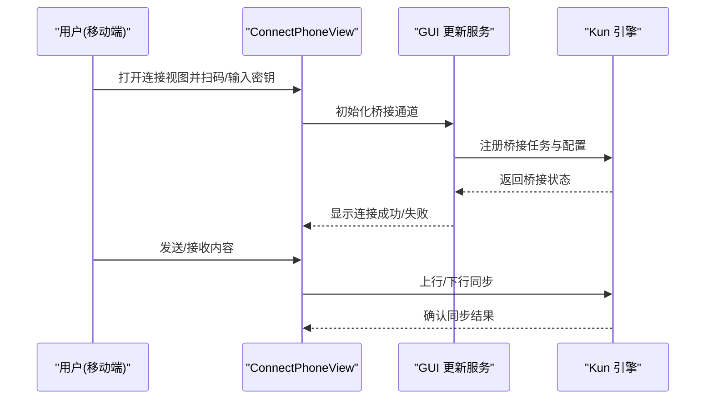
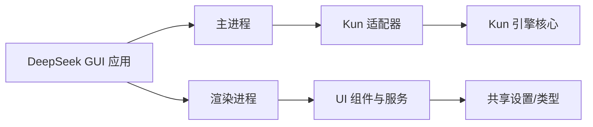

# 项目概述

<cite>
**本文引用的文件**
- [README.md](file://README.md)
- [README.en.md](file://README.en.md)
- [DESIGN.md](file://DESIGN.md)
- [DESIGN.zh-CN.md](file://DESIGN.zh-CN.md)
- [package.json](file://package.json)
- [kun/README.md](file://kun/README.md)
- [src/main/index.ts](file://src/main/index.ts)
- [src/renderer/src/App.tsx](file://src/renderer/src/App.tsx)
- [src/main/runtime/kun-adapter.ts](file://src/main/runtime/kun-adapter.ts)
- [src/main/services/workspace-service.ts](file://src/main/services/workspace-service.ts)
- [src/main/services/write-inline-completion-service.ts](file://src/main/services/write-inline-completion-service.ts)
- [src/main/services/write-retrieval-service.ts](file://src/main/services/write-retrieval-service.ts)
- [src/main/services/skill-service.ts](file://src/main/services/skill-service.ts)
- [src/renderer/src/components/chat/WorkspaceModeTabs.tsx](file://src/renderer/src/components/chat/WorkspaceModeTabs.tsx)
- [src/renderer/src/components/write/WriteWorkspaceView.tsx](file://src/renderer/src/components/write/WriteWorkspaceView.tsx)
- [src/renderer/src/components/chat/ConnectPhoneView.tsx](file://src/renderer/src/components/chat/ConnectPhoneView.tsx)
- [src/shared/app-settings.ts](file://src/shared/app-settings.ts)
- [src/shared/gui-update.ts](file://src/shared/gui-update.ts)
- [docs/kun-architecture.md](file://docs/kun-architecture.md)
- [docs/CONTRIBUTING.md](file://docs/CONTRIBUTING.md)
- [docs/DEVELOPMENT.md](file://docs/DEVELOPMENT.md)
- [docs/AGENTS.md](file://docs/AGENTS.md)
- [docs/WRITE_INLINE_COMPLETION_MODES.zh-CN.md](file://docs/WRITE_INLINE_COMPLETION_MODES.zh-CN.md)
- [docs/WRITE_INLINE_EDIT_RAG.en.md](file://docs/WRITE_INLINE_EDIT_RAG.en.md)
- [docs/WRITE_RETRIEVAL_RAG.en.md](file://docs/WRITE_RETRIEVAL_RAG.en.md)
</cite>

## 目录
1. [引言](#引言)
2. [项目结构](#项目结构)
3. [核心组件](#核心组件)
4. [架构总览](#架构总览)
5. [详细组件分析](#详细组件分析)
6. [依赖关系分析](#依赖关系分析)
7. [性能考量](#性能考量)
8. [故障排查指南](#故障排查指南)
9. [结论](#结论)
10. [附录](#附录)

## 引言
DeepSeek GUI 是一个将 Kun 智能体的高 Token ROI 能力引入桌面端的应用，通过 Electron + React 技术栈构建，提供三大核心工作模式：Code（代码）、Write（写作）与 Connect Phone（手机连接）。其设计理念是“让强大的 AI 在本地可用、可控且高效”，通过本地运行的 Kun 引擎与桌面 GUI 的结合，实现更贴近开发者的生产力体验。

项目的核心价值主张包括：
- 高效的 Token 使用策略与上下文压缩机制，确保在有限上下文内获得更高产出
- 多样化的智能体能力与工具链集成，覆盖检索、编辑、计划、评审等场景
- 本地化运行与隐私保护，避免敏感数据上传云端
- 可扩展的技能系统与插件市场，支持按需扩展能力边界

与其他类似工具相比，DeepSeek GUI 的独特之处在于：
- 将 Kun 的“高 ROI”模型路由与上下文优化能力直接带到桌面，减少远程调用延迟与成本
- 提供面向写作者的内联补全、检索增强写作、Markdown 实时预览等专业能力
- 支持与手机端的桥接，实现跨设备协同与内容同步

发展历程与社区贡献：
- 项目持续迭代，文档与开发指南完善，涵盖安装、构建、调试与发布流程
- 社区贡献者可通过规范的 PR 流程参与功能改进与文档完善
- 许可证信息见根目录与各子模块说明

**章节来源**
- [README.md](file://README.md)
- [README.en.md](file://README.en.md)
- [DESIGN.md](file://DESIGN.md)
- [DESIGN.zh-CN.md](file://DESIGN.zh-CN.md)

## 项目结构
项目采用前后端分离与模块化设计：
- 主进程（Electron 主线程）负责应用生命周期、IPC 通信、Kun 进程管理与系统集成
- 渲染进程（React 前端）负责用户界面、工作区管理、写作与聊天交互
- Kun 子项目（独立仓库）提供智能体引擎、工具集、缓存与服务层
- 文档与脚本目录支撑开发、测试与发布流程

**图表来源**
- [src/main/index.ts](file://src/main/index.ts)
- [src/main/runtime/kun-adapter.ts](file://src/main/runtime/kun-adapter.ts)
- [src/renderer/src/App.tsx](file://src/renderer/src/App.tsx)
- [src/renderer/src/components/write/WriteWorkspaceView.tsx](file://src/renderer/src/components/write/WriteWorkspaceView.tsx)
- [src/renderer/src/components/chat/WorkspaceModeTabs.tsx](file://src/renderer/src/components/chat/WorkspaceModeTabs.tsx)
- [src/renderer/src/components/chat/ConnectPhoneView.tsx](file://src/renderer/src/components/chat/ConnectPhoneView.tsx)

**章节来源**
- [package.json](file://package.json)
- [kun/README.md](file://kun/README.md)

## 核心组件
- 应用入口与生命周期
  - 主进程入口负责窗口创建、菜单、热重载与 IPC 注册
  - 渲染进程入口负责挂载 React 应用与主题初始化
- Kun 适配器
  - 管理 Kun 引擎的启动、健康检查、事件订阅与 SSE 通信
  - 提供与桌面 GUI 的运行时桥接，承载智能体能力
- 工作区与服务层
  - 工作区服务：路径解析、文件浏览、Git 分支选择、编辑器集成
  - 写作服务：内联补全、检索增强写作、导出与预览
  - 技能服务：技能注册、执行与市场接入
- 用户界面
  - 写作工作区：Markdown 编辑器、实时预览、侧边栏与工具面板
  - 聊天工作区：消息时间线、工具调用可视化、会话与线程管理
  - 手机连接：桥接视图与状态提示，支持跨设备协作

**章节来源**
- [src/main/index.ts](file://src/main/index.ts)
- [src/renderer/src/App.tsx](file://src/renderer/src/App.tsx)
- [src/main/runtime/kun-adapter.ts](file://src/main/runtime/kun-adapter.ts)
- [src/main/services/workspace-service.ts](file://src/main/services/workspace-service.ts)
- [src/main/services/write-inline-completion-service.ts](file://src/main/services/write-inline-completion-service.ts)
- [src/main/services/write-retrieval-service.ts](file://src/main/services/write-retrieval-service.ts)
- [src/main/services/skill-service.ts](file://src/main/services/skill-service.ts)

## 架构总览
DeepSeek GUI 的整体架构由“桌面 GUI + Kun 引擎 + 工具与缓存层 + 文档与脚本”构成。主进程负责系统级能力与 IPC，渲染进程负责业务交互；Kun 引擎提供智能体、工具与缓存能力，并通过 SSE 与 GUI 实时通信。

**图表来源**
- [src/main/runtime/kun-adapter.ts](file://src/main/runtime/kun-adapter.ts)
- [docs/kun-architecture.md](file://docs/kun-architecture.md)

**章节来源**
- [docs/kun-architecture.md](file://docs/kun-architecture.md)

## 详细组件分析

### 写作工作区（Write）
写作工作区提供 Markdown 编辑、实时预览、内联补全与检索增强写作能力，支持多文件协作与导出。

**图表来源**
- [src/renderer/src/components/write/WriteWorkspaceView.tsx](file://src/renderer/src/components/write/WriteWorkspaceView.tsx)
- [src/main/services/write-retrieval-service.ts](file://src/main/services/write-retrieval-service.ts)
- [src/main/services/write-inline-completion-service.ts](file://src/main/services/write-inline-completion-service.ts)
- [src/main/runtime/kun-adapter.ts](file://src/main/runtime/kun-adapter.ts)

**章节来源**
- [src/renderer/src/components/write/WriteWorkspaceView.tsx](file://src/renderer/src/components/write/WriteWorkspaceView.tsx)
- [src/main/services/write-retrieval-service.ts](file://src/main/services/write-retrieval-service.ts)
- [src/main/services/write-inline-completion-service.ts](file://src/main/services/write-inline-completion-service.ts)
- [docs/WRITE_INLINE_COMPLETION_MODES.zh-CN.md](file://docs/WRITE_INLINE_COMPLETION_MODES.zh-CN.md)
- [docs/WRITE_INLINE_EDIT_RAG.en.md](file://docs/WRITE_INLINE_EDIT_RAG.en.md)
- [docs/WRITE_RETRIEVAL_RAG.en.md](file://docs/WRITE_RETRIEVAL_RAG.en.md)

### 聊天工作区（Chat）
聊天工作区支持多线程对话、工具调用可视化与会话管理，配合 Kun 的上下文压缩与模型路由，提升长对话效率。

**图表来源**
- [src/renderer/src/components/chat/WorkspaceModeTabs.tsx](file://src/renderer/src/components/chat/WorkspaceModeTabs.tsx)
- [src/main/runtime/kun-adapter.ts](file://src/main/runtime/kun-adapter.ts)

**章节来源**
- [src/renderer/src/components/chat/WorkspaceModeTabs.tsx](file://src/renderer/src/components/chat/WorkspaceModeTabs.tsx)

### 手机连接（Connect Phone）
手机连接视图提供桥接能力，支持跨设备协作与内容同步，便于在移动设备上进行快速编辑与审阅。

**图表来源**
- [src/renderer/src/components/chat/ConnectPhoneView.tsx](file://src/renderer/src/components/chat/ConnectPhoneView.tsx)
- [src/shared/gui-update.ts](file://src/shared/gui-update.ts)
- [src/main/runtime/kun-adapter.ts](file://src/main/runtime/kun-adapter.ts)

**章节来源**
- [src/renderer/src/components/chat/ConnectPhoneView.tsx](file://src/renderer/src/components/chat/ConnectPhoneView.tsx)
- [src/shared/gui-update.ts](file://src/shared/gui-update.ts)

### 设计理念与核心价值
- 高 ROI 模型路由与上下文压缩：通过自动模型选择与历史清洗，最大化每次调用的产出
- 工具即能力：内置文件、搜索、Bash、网络等工具，满足日常开发与写作需求
- 本地优先：所有处理在本地完成，保障隐私与稳定性
- 可扩展性：技能系统与插件市场允许按需扩展能力边界

**章节来源**
- [DESIGN.md](file://DESIGN.md)
- [DESIGN.zh-CN.md](file://DESIGN.zh-CN.md)
- [docs/kun-architecture.md](file://docs/kun-architecture.md)

## 依赖关系分析
- 应用层依赖
  - 主进程依赖 Electron、IPC 与 Kun 适配器
  - 渲染进程依赖 React、UI 组件库与共享设置
- Kun 引擎依赖
  - 智能体引擎、工具集、缓存与服务层相互解耦，通过接口契约交互
- 开发与发布
  - 包管理与构建脚本、发布脚本与签名流程

**图表来源**
- [package.json](file://package.json)
- [src/main/runtime/kun-adapter.ts](file://src/main/runtime/kun-adapter.ts)
- [src/shared/app-settings.ts](file://src/shared/app-settings.ts)

**章节来源**
- [package.json](file://package.json)

## 性能考量
- Token 经济与上下文压缩：通过自动模型路由与历史清洗，降低无效上下文，提高生成质量与速度
- 缓存优化：LRU、TTL 与前缀缓存策略，减少重复计算与网络请求
- 内联补全与检索增强：在本地进行上下文匹配与补全，减少远程往返
- 图形与渲染：按需渲染、滚动同步与预览节流，保证流畅体验

**章节来源**
- [docs/kun-architecture.md](file://docs/kun-architecture.md)
- [docs/kun-cache-optimization.md](file://docs/kun-cache-optimization.md)

## 故障排查指南
- 健康检查与日志
  - 通过健康检查接口确认 Kun 引擎状态
  - 查看主进程与渲染进程日志，定位 IPC 与 SSE 问题
- 常见问题
  - Kun 未启动：检查二进制路径与权限，确认环境变量
  - 写作补全无响应：检查工具可用性与网络代理设置
  - 手机连接失败：确认桥接配置与防火墙设置
- 调试与开发
  - 使用开发模式与热重载，结合单元测试与集成测试定位问题

**章节来源**
- [src/main/kun-health.ts](file://src/main/kun-health.ts)
- [src/main/logger.ts](file://src/main/logger.ts)
- [docs/DEVELOPMENT.md](file://docs/DEVELOPMENT.md)
- [docs/CONTRIBUTING.md](file://docs/CONTRIBUTING.md)

## 结论
DeepSeek GUI 将 Kun 的高 Token ROI 能力与桌面环境深度融合，围绕 Code、Write、Connect Phone 三大模式构建了高效、可控且可扩展的智能工作台。通过本地化运行、工具即能力与缓存优化，它在隐私、性能与易用性之间取得平衡，适合从初学者到资深开发者在内的广泛用户群体。

## 附录
- 许可证与合规：请参考项目根目录与各子模块的许可证声明
- 社区贡献：欢迎通过 Issue 与 Pull Request 参与改进
- 开发与发布：遵循开发指南与发布脚本，确保一致性与可追溯性

**章节来源**
- [README.md](file://README.md)
- [docs/CONTRIBUTING.md](file://docs/CONTRIBUTING.md)
- [docs/DEVELOPMENT.md](file://docs/DEVELOPMENT.md)