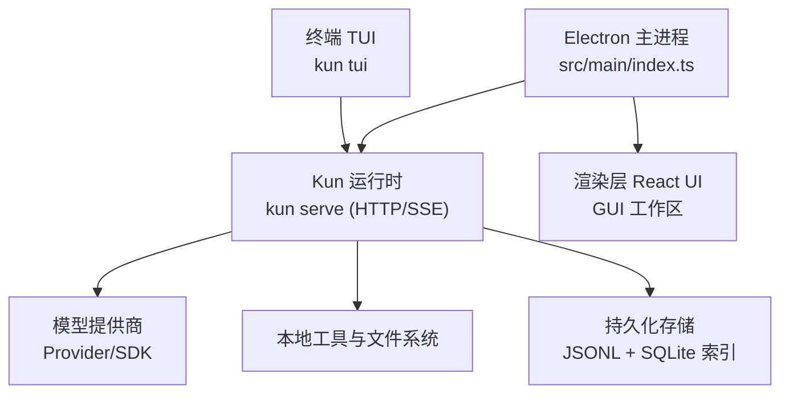
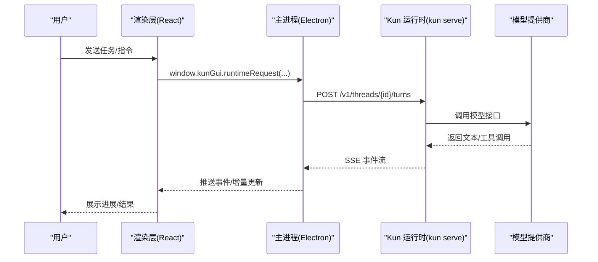
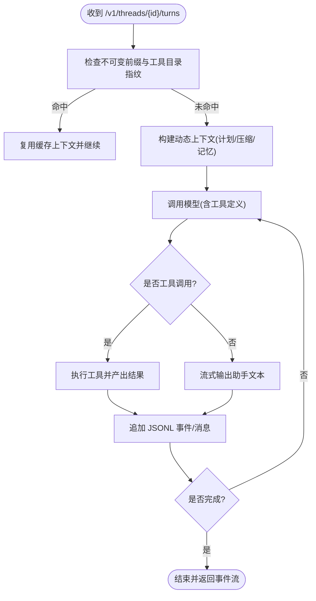
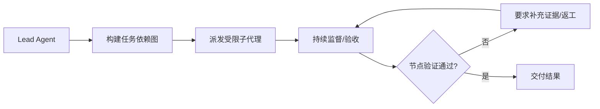
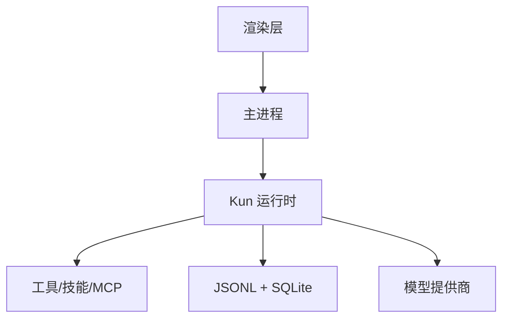

# 项目概述

<cite>
**本文引用的文件**
- [README.md](file://README.md)
- [package.json](file://package.json)
- [kun/README.md](file://kun/README.md)
- [docs/kun-architecture.en.md](file://docs/kun-architecture.en.md)
- [src/main/index.ts](file://src/main/index.ts)
- [kun/src/index.ts](file://kun/src/index.ts)
</cite>

## 目录
1. [简介](#简介)
2. [项目结构](#项目结构)
3. [核心组件](#核心组件)
4. [架构总览](#架构总览)
5. [详细组件分析](#详细组件分析)
6. [依赖关系分析](#依赖关系分析)
7. [性能考量](#性能考量)
8. [故障排查指南](#故障排查指南)
9. [结论](#结论)
10. [附录：快速开始](#附录快速开始)

## 简介
Kun（DeepSeek-GUI）是一款本地优先的 AI Agent 工作台，提供桌面 GUI 与终端 TUI 两种界面形式，将代码、写作、设计、研究与自动化整合到同一工作流中。其独特价值主张在于把“需求澄清—计划执行—审查验收”串联为连续、可回溯的工作流，并通过共享运行时让 GUI 与 TUI 同时连接同一任务上下文、线程、审批与模型连接。

- 目标用户：开发者、写作者、设计师、研究人员以及需要自动化重复工作的个人与小团队。
- 核心价值：从想法推进到可交付结果；在任务旁保留计划、Diff、工具结果、测试与审查证据；用 Direct 模式处理轻量任务，用实验性 Agent Graph 管理复杂分工与验收。
- 数据策略：会话、偏好、日志和运行时数据默认保存在本机；选择云端 Provider 时，提示、附件与任务上下文会发送给所选服务，使用前需确认对应 Provider 的数据政策。

**章节来源**
- [README.md:33-50](file://README.md#L33-L50)
- [README.md:107-136](file://README.md#L107-L136)
- [README.md:185-199](file://README.md#L185-L199)

## 项目结构
仓库采用多包与分层组织方式：
- 顶层 Electron GUI 应用负责窗口、托盘、扩展、设置与生命周期管理，并通过单一 HTTP/SSE 边界与 Kun 运行时通信。
- kun 子包是本地 HTTP/SSE Agent 运行时，暴露稳定 API，实现缓存优先的 Agent Loop、工具宿主、存储、事件总线、审批门等。
- docs 包含架构、TUI、Graph Mode、开发流程等文档。
- examples 与 packages 提供扩展、示例与公共 API。

```mermaid
graph TB
A["Electron 主进程<br/>src/main/index.ts"] --> B["Kun 运行时<br/>kun serve (HTTP/SSE)"]
A --> C["渲染层 React UI<br/>GUI 工作区"]
D["终端 TUI<br/>kun tui"] --> B
B --> E["模型提供商<br/>Provider/SDK"]
B --> F["本地工具与文件系统"]
B --> G["持久化存储<br/>JSONL + SQLite 索引"]
```

**图示来源**
- [docs/kun-architecture.en.md:16-48](file://docs/kun-architecture.en.md#L16-L48)
- [kun/README.md:1-17](file://kun/README.md#L1-L17)

**章节来源**
- [package.json:1-23](file://package.json#L1-L23)
- [docs/kun-architecture.en.md:16-48](file://docs/kun-architecture.en.md#L16-L48)
- [kun/README.md:24-42](file://kun/README.md#L24-L42)

## 核心组件
- 共享运行时（Kun）：以 `kun serve` 启动，提供 `/v1/*` 路由与 SSE 事件流，承载线程、回合、事件、审批与用量统计。
- GUI 主进程：负责应用生命周期、设置、扩展、托盘、SSE 转发与运行时管理，统一通过 `kunRuntimeAdapter` 调用后端。
- 渲染层：React + Zustand 构建 Code/Design/Write/Connect 等工作区，仅做状态映射与请求转发，不实现 Agent 业务逻辑。
- 工具与技能：内置与可扩展工具集，支持 MCP、Skills、Web 抓取、图片/PDF 输入、媒体生成等能力。
- 存储与审计：append-only JSONL 日志与原子写入的索引/会话文件，支持回放、恢复与诊断。
- 审批与安全：工具调用前后可钩入 Hook，支持沙箱模式、权限确认与敏感操作拦截。

**章节来源**
- [kun/README.md:1-17](file://kun/README.md#L1-L17)
- [kun/README.md:426-449](file://kun/README.md#L426-L449)
- [docs/kun-architecture.en.md:246-261](file://docs/kun-architecture.en.md#L246-L261)

## 架构总览
Kun 采用“单运行时”架构：GUI 与 TUI 共用一个 `kun serve` 实例，所有工作区（Code、Design、Write、Connect phone）都通过稳定的 HTTP/SSE 边界访问 Agent Loop。主进程只负责进程管理、配置同步与鉴权头注入，渲染层只做 UI 状态映射。

```mermaid
sequenceDiagram
participant U as "用户"
participant R as "渲染层(React)"
participant M as "主进程(Electron)"
participant S as "Kun 运行时(kun serve)"
participant P as "模型提供商"
U->>R : 发送任务/指令
R->>M : window.kunGui.runtimeRequest(...)
M->>S : POST /v1/threads/{id}/turns
S->>P : 调用模型接口
P-->>S : 返回文本/工具调用
S-->>M : SSE 事件流
M-->>R : 推送事件/增量更新
R-->>U : 展示进展/结果
```

**图示来源**
- [docs/kun-architecture.en.md:16-48](file://docs/kun-architecture.en.md#L16-L48)
- [kun/README.md:451-487](file://kun/README.md#L451-L487)

**章节来源**
- [docs/kun-architecture.en.md:16-48](file://docs/kun-architecture.en.md#L16-L48)
- [src/main/index.ts:115-125](file://src/main/index.ts#L115-L125)

## 详细组件分析

### 共享运行时（Kun）
- 职责：提供稳定的 HTTP/SSE 契约；实现缓存优先的 Agent Loop；维护线程、回合、事件、审批、用量与上下文压缩；暴露工具注册表与工作区状态。
- 关键路径：
  - 线程与回合：创建、读取、分叉、中断、历史折叠。
  - 事件流：SSE 支持断线续传（since_seq）。
  - 审批与用户输入：允许/拒绝、交互式问答。
  - 附件与记忆：图片/文档上传、长期记忆记录检索与注入。
- 数据布局：data-dir 下按 threads/{id} 组织 JSONL 日志与原子写入的 thread/session/usage 文件，index.sqlite3 用于快速列表与搜索。

```mermaid
flowchart TD
Start(["收到 /v1/threads/{id}/turns"]) --> CacheCheck["检查不可变前缀与工具目录指纹"]
CacheCheck --> |命中| Reuse["复用缓存上下文并继续"]
CacheCheck --> |未命中| BuildCtx["构建动态上下文(计划/压缩/记忆)"]
BuildCtx --> ModelCall["调用模型(含工具定义)"]
ModelCall --> ToolExec{"是否工具调用?"}
ToolExec --> |否| StreamText["流式输出助手文本"]
ToolExec --> |是| ExecuteTool["执行工具并产出结果"]
ExecuteTool --> AppendLog["追加 JSONL 事件/消息"]
StreamText --> AppendLog
AppendLog --> NextStep{"是否完成?"}
NextStep --> |否| ModelCall
NextStep --> |是| End(["结束并返回事件流"])
```

**图示来源**
- [kun/README.md:451-487](file://kun/README.md#L451-L487)
- [kun/README.md:306-334](file://kun/README.md#L306-L334)

**章节来源**
- [kun/README.md:1-17](file://kun/README.md#L1-L17)
- [kun/README.md:426-449](file://kun/README.md#L426-L449)
- [kun/README.md:451-487](file://kun/README.md#L451-L487)

### GUI 主进程与渲染层
- 主进程职责：
  - 启动/停止 Kun 运行时，同步配置与端口，计算 Base URL 并附加鉴权头。
  - 转发 `/v1/*` 请求与 SSE 流（按 threadId + sinceSeq 键控）。
  - 管理托盘、通知、扩展、终端、工作流与后台服务生命周期。
- 渲染层职责：
  - 仅暴露 Kun 作为唯一 Agent 入口；维护 Code/Design/Write/Connect 工作区状态。
  - 消费 `/v1/runtime/info`、`/v1/runtime/tools`、`/v1/attachments/*`、`/v1/memory/*` 等扩展路由。
  - 不实现 Agent 业务逻辑，只做 HTTP 客户端与 SSE 状态映射。

```mermaid
classDiagram
class MainProcess {
+startStopKun()
+runtimeRequestViaHost()
+startSse()
+stopSse()
+manageExtensions()
}
class Renderer {
+createThread()
+sendTurn()
+steer()
+interrupt()
+consumeEvents()
}
class KunServe {
+/v1/threads
+/v1/threads/{id}/turns
+/v1/threads/{id}/events
+/v1/approvals
+/v1/usage
}
MainProcess --> KunServe : "HTTP/SSE"
Renderer --> MainProcess : "IPC"
Renderer --> KunServe : "间接通过主进程"
```

**图示来源**
- [docs/kun-architecture.en.md:119-152](file://docs/kun-architecture.en.md#L119-L152)
- [docs/kun-architecture.en.md:205-227](file://docs/kun-architecture.en.md#L205-L227)

**章节来源**
- [docs/kun-architecture.en.md:119-152](file://docs/kun-architecture.en.md#L119-L152)
- [docs/kun-architecture.en.md:205-227](file://docs/kun-architecture.en.md#L205-L227)
- [src/main/index.ts:115-125](file://src/main/index.ts#L115-L125)

### 工作流引擎与 Agent Graph
- 工作流：可视化 Loop、Schedule、Hook、MCP、Skills 与受限子代理，用于持续执行与自动化。
- Agent Graph：适合跨文件、跨阶段且可明确验收的复杂任务。Lead Agent 建立依赖图，派发受限子代理，持续监督、要求补充证据、触发返工并在节点验证通过后交付。
- 约束：Graph 不是第二套运行时，不会扩大权限；子代理只能使用父任务授权范围内的文件、工具、网络、Skills 与 MCP；历史执行记录不会被伪装成成功。

```mermaid
flowchart LR
Lead["Lead Agent"] --> Plan["构建任务依赖图"]
Plan --> Dispatch["派发受限子代理"]
Dispatch --> Monitor["持续监督/验收"]
Monitor --> Verify{"节点验证通过?"}
Verify --> |否| Rework["要求补充证据/返工"]
Rework --> Monitor
Verify --> |是| Deliver["交付结果"]
```

**图示来源**
- [README.md:125-136](file://README.md#L125-L136)

**章节来源**
- [README.md:125-136](file://README.md#L125-L136)

### 多模态处理与工具生态
- 多模态：支持图片与 PDF 输入、视觉理解、媒体生成；附件内容独立于线程日志存储，文本模型使用有界压缩 base64 回退。
- 工具生态：内置与可扩展工具，支持 MCP 服务器发现与工具目录压缩（mcp_search/describe/call/refresh），Skills 扫描与激活，Web 抓取与搜索（可选）。
- 安全：沙箱模式（read-only/workspace-write/danger-full-access/external-sandbox）、工具审批、Computer Use 权限与敏感操作确认。

**章节来源**
- [kun/README.md:322-334](file://kun/README.md#L322-L334)
- [kun/README.md:559-587](file://kun/README.md#L559-L587)

### 模型提供商集成与数据本地化
- 模型接入：不绑定单一模型，支持订阅登录、Coding Plan、Token Plan、API、OpenAI/Anthropic 兼容服务与自托管模型；预设覆盖 ChatGPT/Codex、Claude、Gemini、Cursor、Ollama、DeepSeek、Kimi、GLM、Qwen、MiniMax、Xiaomi MiMo 等。
- 数据本地化：会话、偏好、日志与运行时数据默认本地保存；选择云端 Provider 时，提示、附件与任务上下文会发送给该服务。

**章节来源**
- [README.md:159-166](file://README.md#L159-L166)
- [README.md:185-187](file://README.md#L185-L187)

## 依赖关系分析
- 运行时对外暴露稳定 HTTP/SSE 契约，GUI 与 TUI 均依赖该契约进行交互。
- 主进程对运行时进行进程管理与配置同步，渲染层仅消费主进程提供的 IPC 或间接 HTTP 通道。
- 工具与技能通过运行时动态注册，受沙箱与审批策略约束。
- 存储层使用 append-only JSONL 与原子写入的索引/会话文件，保证回放与恢复一致性。

```mermaid
graph TB
GUI["渲染层"] --> MP["主进程"]
MP --> RUNTIME["Kun 运行时"]
RUNTIME --> TOOLS["工具/技能/MCP"]
RUNTIME --> STORE["JSONL + SQLite"]
RUNTIME --> PROVIDER["模型提供商"]
```

**图示来源**
- [docs/kun-architecture.en.md:16-48](file://docs/kun-architecture.en.md#L16-L48)
- [kun/README.md:426-449](file://kun/README.md#L426-L449)

**章节来源**
- [docs/kun-architecture.en.md:16-48](file://docs/kun-architecture.en.md#L16-L48)
- [kun/README.md:426-449](file://kun/README.md#L426-L449)

## 性能考量
- 缓存优先：不可变系统提示前缀、工具目录指纹、TTL/LRU 缓存与 inflight 跟踪，冷启动后热命中率应稳定提升。
- 上下文压缩：长线程自动压缩，保留目标、约束、决策、已改文件、工具结果与未决步骤。
- 工具风暴抑制：同一回合内重复相同工具调用会被抑制，避免无意义循环消耗 token。
- 流式传输：SSE 支持断线续传，减少重连开销。
- 资源限制：附件大小、维度与 MIME 类型限制，文本模型使用压缩回退以避免超限。

**章节来源**
- [docs/kun-architecture.en.md:53-117](file://docs/kun-architecture.en.md#L53-L117)
- [kun/README.md:322-334](file://kun/README.md#L322-L334)

## 故障排查指南
- MCP 未出现：检查 `capabilities.mcp.enabled`、服务器 enabled 标志、传输字段（stdio 命令或 HTTP/SSE url）、可信工作区根目录，查看 `/v1/runtime/tools` 的诊断 lastError。
- Web 工具缺失：确保 `capabilities.web.enabled` 为真，至少启用 fetchEnabled 或 searchEnabled；内置 fetch 可获取 HTTP(S) 页面，搜索可能因未配置 provider 而不可用。
- 图片上传成功但回合失败：检查 maxImageBytes、maxImageDimension、allowedMimeTypes 与文本回退限制；文本模型需足够小的压缩 base64。
- 记忆未注入：启用 capabilities.memory，确认 `/v1/memory/diagnostics.enabled`，记录需在选定工作区范围且未被禁用/删除，查看 lastInjectedIds。
- CLI 无法认证或加载配置：确保与 `kun serve` 使用相同的 --config、--data-dir、--api-key、--base-url、--runtime-token；可用 `kun exec --list-tools --json` 验证有效工具注册表。
- 能力 disabled/unavailable：disabled 通常表示配置开关关闭；unavailable 表示开关开启但底层 provider/store/model 缺失或初始化失败。

**章节来源**
- [kun/README.md:559-587](file://kun/README.md#L559-L587)

## 结论
Kun 通过“单运行时 + 稳定 HTTP/SSE 契约”的统一架构，将 GUI 与 TUI、多种工作区与自动化能力整合到同一本地优先平台。它强调从需求澄清到验收交付的连续性，借助缓存优先、上下文压缩、工具生态与审批安全机制，在保证可控与可回溯的前提下提升 AI 任务的 ROI。对于初学者，可从 Direct 模式入手体验；对于复杂任务，可使用 Agent Graph 进行分工与验收。

[本节为总结性内容，无需引用具体文件]

## 附录：快速开始
- 下载桌面版：从 GitHub Releases 获取 macOS、Windows、Linux 安装包。
- 首次启动三步：选择语言、登录模型订阅或配置 API Key/Token Plan/自定义 Provider、打开本地项目或新建工作区并发送清晰可验证的任务。
- 运行 TUI：在项目目录中打开终端并运行 `kun`，GUI 与 TUI 会自动连接同一本地运行时。
- 源码运行：安装 Node.js 22.19+ 与 npm，克隆仓库后执行 `npm ci` 与 `npm run dev`；单独启动开发版 TUI 使用 `npm run dev:tui`。

**章节来源**
- [README.md:51-75](file://README.md#L51-L75)
- [README.md:201-228](file://README.md#L201-L228)