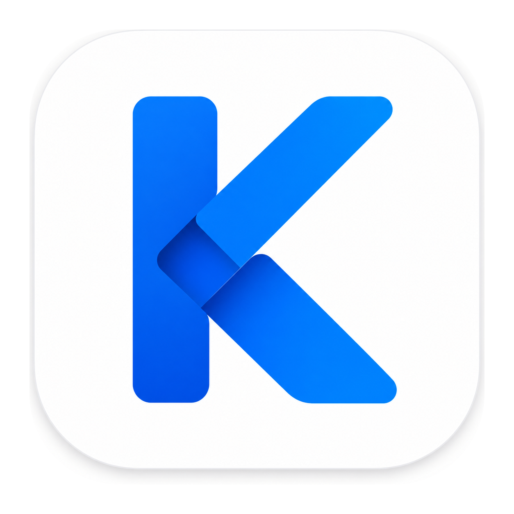
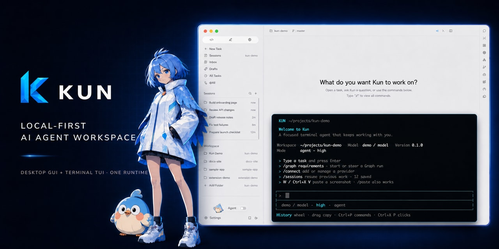
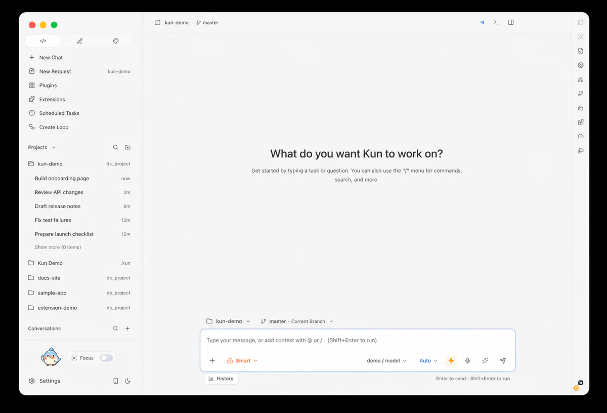
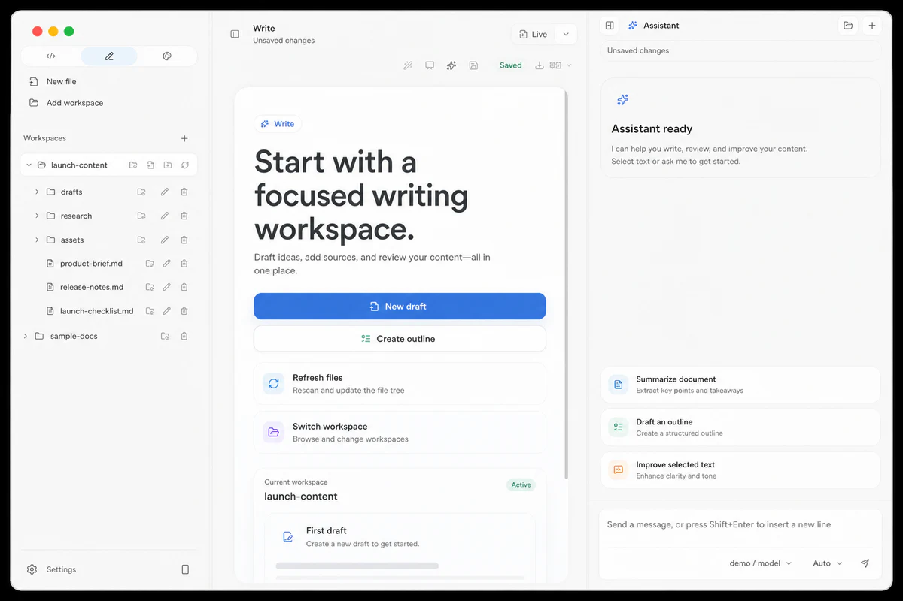
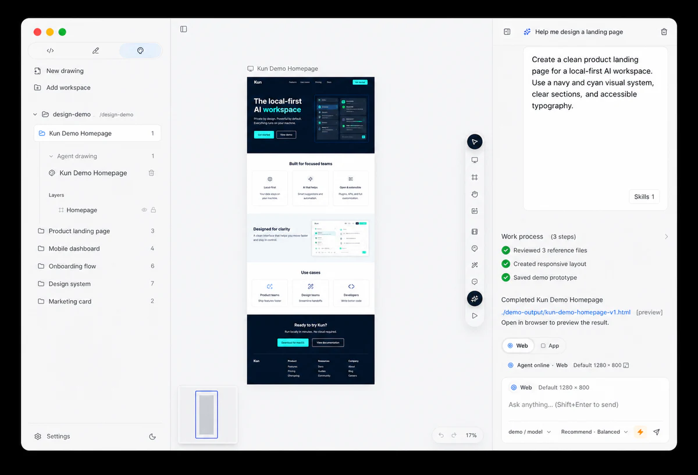
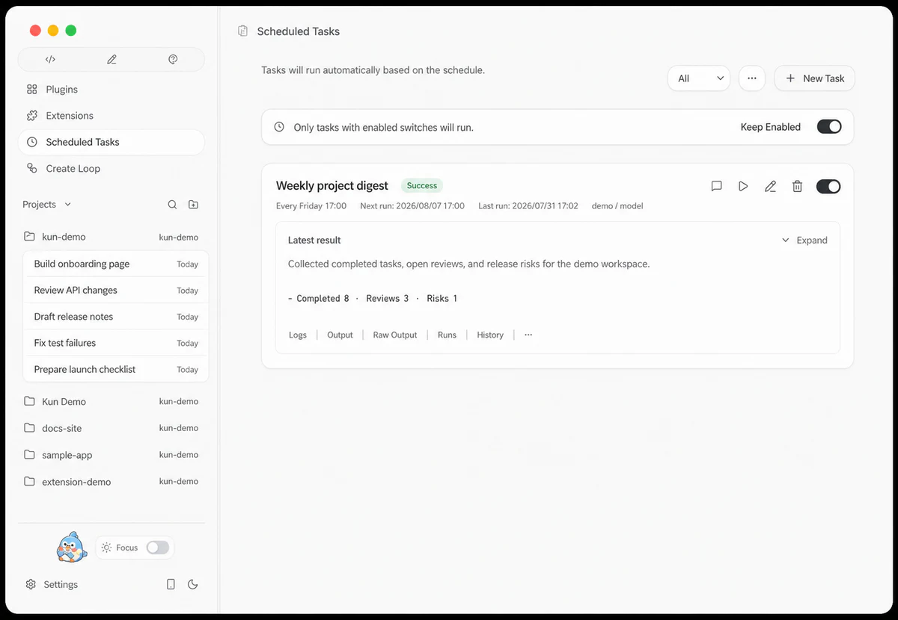

<p align="center">
  
</p>

<h1 align="center">Kun — A local-first AI agent workspace for coding, writing, design, research, and automation</h1>

<p align="center">
  Bring coding, writing, design, research, and automation into one workspace.<br>
  One shared runtime connects the desktop GUI and terminal TUI, so work stays visible, controllable, and traceable from clarification through delivery.
</p>

<p align="center">
  <a href="https://github.com/KunAgent/Kun/releases">Download Kun</a>
  &nbsp;·&nbsp;
  <a href="https://www.kun-agent.com/docs">Read the docs</a>
  &nbsp;·&nbsp;
  <a href="https://github.com/KunAgent/Kun">Star on GitHub</a>
  &nbsp;·&nbsp;
  <a href="./README.md">简体中文</a>
</p>

<p align="center">
  <a href="https://github.com/KunAgent/Kun/releases"></a>
  <a href="./LICENSE"></a>
  
  
</p>

<p align="center">
  
</p>

## What is Kun?

Kun is a local-first AI agent workspace for people who need to turn ideas into verifiable results. It brings Code, Write, Design, research, and automation into one product. The desktop GUI, terminal TUI, background work, and connected phone clients use the same `kun serve` runtime to share threads, plans, approvals, model connections, and task history.

Kun is not another chat box that only produces an answer. It keeps requirements, context, plans, file changes, tests, reviews, and delivery in one continuous workflow.

## Kun at a glance

| What you need to know | How Kun works |
| --- | --- |
| **Who it is for** | Developers, writers, designers, researchers, and individuals or teams who want AI to move recurring work forward. |
| **What it does** | AI coding and code review, AI writing and document delivery, AI design and prototypes, PDF/image research, and multi-agent automation. |
| **How to use it** | Use the desktop GUI to see the whole task, or keep your hands on the keyboard with the terminal TUI. Both share the same runtime and work. |
| **Complex work** | Use Direct mode for focused tasks. Use the experimental Agent Graph for cross-file, multi-stage work that benefits from delegation, supervision, and acceptance checks. |
| **Model choice** | Kun is not tied to one model. It supports subscription sign-ins, Coding Plans, Token Plans, APIs, OpenAI/Anthropic-compatible services, and self-hosted models. |
| **Platforms** | macOS on Apple Silicon or Intel, Windows x64, and Linux x64. |
| **Where data lives** | Sessions, preferences, logs, and runtime data stay local by default. When you choose a cloud model, prompts, attachments, and task context are sent to that provider. |

## Get started in 5 minutes

### Download the desktop app

Get the latest release from [GitHub Releases](https://github.com/KunAgent/Kun/releases):

| Platform | Packages | Architecture |
| --- | --- | --- |
| macOS | `.dmg` / `.zip` | Apple Silicon / Intel |
| Windows | `.exe` | x64 |
| Linux | `.AppImage` / `.deb` | x64 |

Your first launch takes three steps:

1. Choose the interface language.
2. Sign in to a model subscription or configure an API key, Token Plan, or custom provider.
3. Open a local project or create a workspace, then send a task with a clear goal, limited scope, and a way to verify success.

The desktop package includes the TUI. Open a terminal in a project directory and run:

```bash
kun
```

The GUI and TUI automatically connect to the same local runtime. For servers or environments without a desktop, download the standalone TUI archive from the same release. See the [Kun TUI guide](docs/kun-tui.en.md) for complete instructions.

## Choose the right workspace

| Workspace or scenario | What you bring | How Kun helps | What you deliver |
| --- | --- | --- | --- |
| **Code: AI coding and review** | A real codebase, bug, feature goal, or review task | Search code, edit files, run commands, manage Plans/Todos, inspect diffs and tests | Code changes, test results, implementation plans, review findings |
| **Write: AI writing and documents** | An outline, source material, draft, or selected text | Draft, refine, organize sources, complete inline text, and edit in context | Markdown, HTML, PDF, DOCX, and editable PPTX |
| **Design: AI design and prototypes** | Requirements, visual references, or an existing interface | Explore visual directions, create interactive prototypes, capture a design system, and hand off to Code | HTML prototypes, design canvas artifacts, flows, and `DESIGN_SYSTEM.md` |
| **Research: multimodal work** | PDFs, images, web leads, or questions | Read material, collect evidence, organize conclusions, and preserve a reusable work context | Research notes, structured conclusions, proposals, and next tasks |
| **Automate: tasks and Agent Graph** | A repeated process, schedule, or complex objective | Use Schedules, Loops, Hooks, MCP, Skills, and constrained subagents | Automation records, task state, evidence, and resumable execution history |

### Current interface previews

These interfaces are based on the current release and use fictional demo workspaces, tasks, and file names; no real user data is shown.

<p align="center">
  
</p>

<p align="center">
  
</p>

<p align="center">
  
</p>

<p align="center">
  
</p>

## From requirement to acceptance

Kun turns a conversation with AI into work you can check against the original goal:

```text
Clarify → design / write / code → plan and execute → review and test → accept and deliver
```

| Stage | How Kun participates |
| --- | --- |
| **1. Clarify the requirement** | Create a requirement draft, use project context to surface questions, and define scope and acceptance criteria. |
| **2. Explore the approach** | Build visual directions, prototypes, source material, and proposals in Design, Write, or Research. |
| **3. Make a plan** | Use `/plan` to turn the goal into executable steps aligned with the requirement and Todos. |
| **4. Execute the work** | Agents search, edit, call tools, and run commands. Long work can continue, resume, or be delegated to subagents. |
| **5. Return to acceptance** | Inspect diffs, tests, browser results, and `/review` findings against the original acceptance criteria. |

Requirements and plans live in the project by default, making them versionable, reviewable, and easy to resume. When a requirement changes, Kun encourages you to revisit the plan and completed work instead of silently following an outdated plan.

## Agent Graph: delegation for complex work

The experimental Agent Graph is for cross-file, multi-stage work with clear acceptance criteria. A Lead Agent creates a dependency graph, delegates constrained subagents, watches progress, requests evidence, triggers rework, and delivers the result after required checks pass.

Graph is not a second runtime and does not expand permissions:

- The GUI and TUI read Graph state through the same Kun runtime.
- Subagents can use only the files, tools, network access, Skills, and MCP granted by the parent task.
- A node hands work downstream only after real checks and explicit Lead acceptance.
- You can pause, resume, retry, change, or stop a graph; historical activity is never presented as a success it did not achieve.

Direct mode is faster for questions and focused edits. Read the [Graph Mode guide](docs/graph-mode.en.md) for the model, limits, and operating details.

## Key capabilities

| Capability | What it means |
| --- | --- |
| **A real project workbench** | Local workspaces, file search and editing, terminal, browser, Git/Worktree, inline diffs, and a Changes panel. |
| **Long-running work and context** | Plans, Todos, persistent goals, compaction, forks, archives, side questions, background shell work, and subagents. |
| **Models and quota** | Manage subscriptions, plans, and APIs in one place; select models for the default agent, a thread, Design, Write, schedules, or subagents. |
| **Agents and knowledge** | Agent Profiles, long-term memory, project `AGENTS.md`, Skills, MCP, and Extensions. |
| **Automation and extensibility** | One-off or recurring Schedules, visual Loops, Hooks, a local runtime API, and installable or side-loadable `.kunx` extensions. |
| **Multimodality and safety** | Image and PDF input, vision, media generation, sandboxes, tool approvals, Computer Use permissions, and sensitive-action confirmation. |

## Why choose Kun?

| Real work problem | A regular chat box or disconnected tools | Kun's approach |
| --- | --- | --- |
| Move from an idea to a deliverable | Manually transfer context between chat, editors, documents, and terminals | Connect Code, Write, Design, Research, and automation in one workbench with resumable task history. |
| Know whether an agent actually finished | Usually see only a final response | Keep the plan, file diff, tool output, tests, browser activity, and review evidence beside the task. |
| Handle multi-stage work | Split and follow up manually | Use Direct for focused work and Agent Graph for dependencies, delegation, supervision, and acceptance. |
| Choose a model and access method | Be limited to one product or configure each service separately | Use one provider entry for subscriptions, Coding Plans, Token Plans, APIs, compatible services, and self-hosted models. |
| Switch between desktop and terminal | Threads and task state can be disconnected | The GUI and TUI share one `kun serve` runtime and can stay open at the same time. |

## Subscriptions, providers, and models

Kun is not tied to a single AI model provider. Use supported subscription sign-ins and Agent SDKs, Coding Plans, Token Plans, pay-as-you-go APIs, OpenAI Chat Completions / Responses, Anthropic Messages-compatible services, or self-hosted models.

Presets and connections cover ecosystems including ChatGPT / Codex, Claude, Gemini, Cursor, Ollama, DeepSeek, Kimi, GLM, Qwen, MiniMax, and Xiaomi MiMo. Sign-in methods, available models, regions, and quotas depend on the current release and provider rules. See [model provider presets](docs/model-provider-presets.md) for the current catalog.

Model, media, and high-permission features depend on your release, operating system, provider, model capability, and authorization. A preset is a starting point, not a guarantee that an account has access to a model or quota.

## Frequently asked questions

### What is Kun?

Kun is a local-first AI agent workspace that uses one runtime for a desktop GUI, terminal TUI, coding, writing, design, research, and automation.

### Who is Kun for?

Anyone who needs to move work from an idea to a real deliverable: developers, writers, designers, researchers, and small teams automating repeated tasks.

### Is Kun only for AI coding?

No. Code is one workspace. Kun also includes Write, Design, PDF/image research, Schedules, Loops, MCP, Skills, and Extensions.

### Do I have to use DeepSeek?

No. Kun supports multiple subscriptions, plans, APIs, compatible protocols, and self-hosted models. DeepSeek is one optional provider.

### Does local-first mean data never leaves my computer?

Sessions, preferences, logs, and runtime data are stored locally by default. When you select a cloud provider, prompts, attachments, and task context are sent to that model service. Review the selected provider's data policy before use.

### How do the GUI and TUI share work?

They connect to the same local `kun serve` runtime, so they can be open together and share threads, plans, approvals, usage, and background tasks.

### When should I use Direct mode or Agent Graph?

Use Direct for questions, focused edits, and short tasks. Use the experimental Agent Graph for work that needs parallel delegation, dependencies, ongoing supervision, and explicit acceptance.

### Which operating systems are supported?

The desktop app supports macOS, Windows x64, and Linux x64. A standalone TUI is also available for servers and environments without a desktop.

## Run from source

Requirements:

| Dependency | Version |
| --- | --- |
| Node.js | 22.19+ |
| npm | Ships with Node.js |
| Model connection | At least one supported subscription, API, or custom provider |

```bash
git clone https://github.com/KunAgent/Kun.git
cd Kun
npm ci
npm run dev
```

Start the development TUI by itself:

```bash
npm run dev:tui
```

For slower npm access in mainland China:

```bash
npm ci --registry=https://registry.npmmirror.com
```

### Common development commands

| Command | Purpose |
| --- | --- |
| `npm run dev` | Build the Kun runtime and start Electron development |
| `npm run dev:tui` | Build the runtime and start the terminal TUI |
| `npm run typecheck` | Run TypeScript type checks |
| `npm run lint` | Run ESLint |
| `npm run test` | Run tests |
| `npm run build` | Create a production build |
| `npm run dist:mac` | Build macOS installers |
| `npm run dist:win` | Build Windows installers |
| `npm run dist:linux` | Build Linux installers |

## Documentation

Full user documentation is available at [kun-agent.com/docs](https://www.kun-agent.com/docs). The repository also contains technical guides for specific capabilities:

| Document | Covers |
| --- | --- |
| [docs/kun-tui.en.md](docs/kun-tui.en.md) | TUI install, launch, commands, shortcuts, configuration, and runtime |
| [docs/graph-mode.en.md](docs/graph-mode.en.md) | Agent Graph architecture, scheduling, supervision, permissions, and recovery |
| [docs/kun-architecture.en.md](docs/kun-architecture.en.md) | Shared GUI, TUI, and single-runtime architecture |
| [docs/DESIGN_MODE.md](docs/DESIGN_MODE.md) | Design canvas, prototypes, design systems, and Design → Code |
| [docs/workflow-loop.en.md](docs/workflow-loop.en.md) | Visual Loop workflows and automation |
| [docs/project-mcp-skills.md](docs/project-mcp-skills.md) | Project configuration, MCP, and Skill discovery |
| [docs/extensions/README.en.md](docs/extensions/README.en.md) | Kun Extension platform |
| [kun/README.md](kun/README.md) | Kun runtime, CLI, environment variables, and HTTP API |
| [docs/DEVELOPMENT.en.md](docs/DEVELOPMENT.en.md) | Local development and release workflow |
| [docs/CONTRIBUTING.en.md](docs/CONTRIBUTING.en.md) | Contribution guide |
| [SECURITY.md](SECURITY.md) | Security vulnerability reporting |

## Contributing

Bug fixes, UI/UX work, runtime improvements, providers, extensions, and documentation improvements are welcome. `develop` is the day-to-day integration branch, and pull requests should target `develop`. Read the [contribution guide](docs/CONTRIBUTING.en.md) first; external contributors must accept the [Contributor License Agreement](./CLA.md).

After **five reviewed and merged pull requests**, you can email [zhongxingyuemail@gmail.com](mailto:zhongxingyuemail@gmail.com) to apply to become a Kun Builder. Include your GitHub username and PR links.

## License

Kun uses the [PolyForm Noncommercial License 1.0.0](./LICENSE) for learning, research, and noncommercial use. Commercial use, commercial distribution, SaaS/hosting, resale, or integration into commercial products requires separate written permission from the author.

Organizations using Kun only to improve their own employees' productivity can email [zhongxingyuemail@gmail.com](mailto:zhongxingyuemail@gmail.com) to request a free written internal-use authorization. This does not cover customer-facing SaaS, hosting, resale, or commercial distribution.

## Acknowledgements

Thanks to [LobsterAI](https://github.com/netease-youdao/LobsterAI), DeepSeek, Xiaomi MiMo, MiniMax, and everyone who contributes issues, ideas, code, and documentation.

<a href="https://github.com/KunAgent/Kun/graphs/contributors">
  
</a>

## Star history

[Follow Kun stars and the latest releases on GitHub](https://github.com/KunAgent/Kun)
